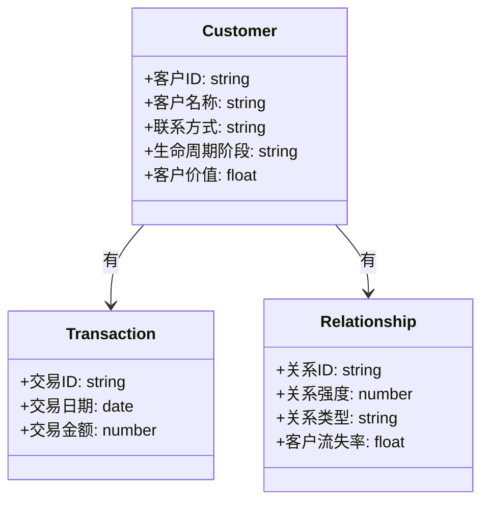
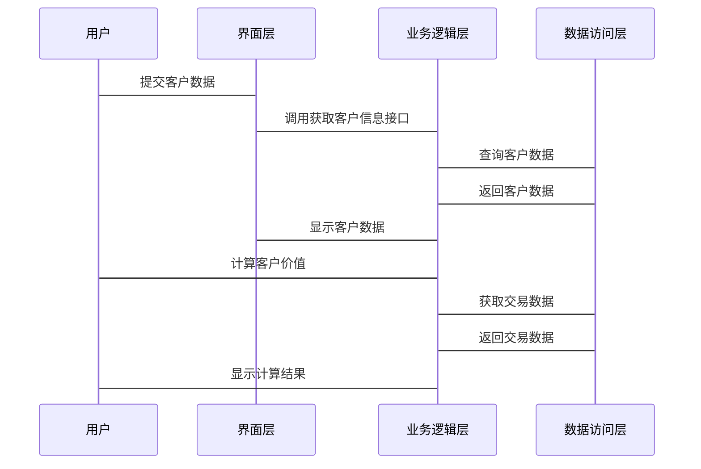

                 


# 第三部分: 客户关系价值评估的算法原理与数学模型

# 第3章: 客户终身价值模型的算法原理

## 3.1 客户终身价值模型的定义与公式

### 3.1.1 客户终身价值（CLV）的定义

客户终身价值（Customer Lifetime Value，简称CLV）是企业在与客户建立关系的整个生命周期内，从该客户处获得的总收入的现值。CLV是企业评估客户关系价值的重要指标，它帮助企业在制定市场策略时，能够更精准地进行预算分配和资源规划。

### 3.1.2 CLV的数学公式

CLV的计算公式基于客户生命周期内的收入预测和贴现率，公式如下：

$$ CLV = \frac{R \times (1 + w)^{-1}}{1 - \delta} $$

其中：
- \( R \) 是客户生命周期的平均收入（单位：货币单位）
- \( w \) 是贴现率（年化）
- \( \delta \) 是客户流失率（年化）

### 3.1.3 CLV的数学推导

CLV的计算基于无限时间序列的贴现现金流模型。假设客户每年为企业带来的收入为 \( R \)，客户每年流失的概率为 \( \delta \)，则客户在第 \( t \) 年的收入为 \( R \times (1 - \delta)^{t-1} \)。

因此，CLV可以表示为：

$$ CLV = \sum_{t=1}^{\infty} \frac{R \times (1 - \delta)^{t-1}}{(1 + w)^t} $$

通过数学变换，可以将上述级数求和转化为：

$$ CLV = \frac{R \times (1 + w - (1 - \delta))}{w} $$

即：

$$ CLV = \frac{R \times (w - \delta)}{w} $$

这一公式表明，CLV与客户的收入潜力、贴现率以及客户流失率密切相关。企业可以通过提升客户满意度和忠诚度来降低流失率，从而增加CLV。

## 3.2 客户终身价值模型的算法流程

### 3.2.1 数据输入

首先，需要收集以下数据：
- 客户每年的平均收入 \( R \)（单位：元）
- 客户流失率 \( \delta \)（单位：年化）
- 贴现率 \( w \)（单位：年化）

### 3.2.2 数据处理

将收集到的数据进行预处理，确保数据的准确性和完整性。例如，计算客户的平均收入时，需要考虑客户群体的差异性，确保数据的代表性。

### 3.2.3 计算CLV

根据公式计算CLV：

$$ CLV = \frac{R \times (1 + w)^{-1}}{1 - \delta} $$

### 3.2.4 结果分析

对计算结果进行分析，评估客户关系的经济价值。例如，如果CLV较高，说明该客户的长期价值较大，企业应优先维护该客户关系。

## 3.3 客户终身价值模型的实现代码

为了方便读者理解和应用，下面提供一个Python函数来实现CLV的计算。

### 3.3.1 Python代码实现

```python
def calculate_clv(R, delta, w):
    """
    计算客户终身价值（CLV）
    
    参数:
        R (float): 客户生命周期的平均收入
        delta (float): 客户流失率
        w (float): 贴现率
    
    返回:
        float: 客户终身价值（CLV）
    """
    clv = R * (1 + w)**(-1) / (1 - delta)
    return clv

# 示例数据
R = 10000  # 年平均收入
delta = 0.05  # 年流失率
w = 0.08  # 年贴现率

# 计算CLV
clv = calculate_clv(R, delta, w)
print(f"客户终身价值（CLV）为：{clv:.2f}元")
```

### 3.3.2 代码解读与应用

- **函数定义**：`calculate_clv`函数接收三个参数 \( R \)、\( delta \) 和 \( w \)，并返回计算得到的CLV值。
- **参数说明**：
  - \( R \) 是客户每年的平均收入，单位为元。
  - \( delta \) 是客户流失率，表示每年客户流失的概率，通常用小数表示。
  - \( w \) 是贴现率，表示资金的时间价值，通常用小数表示。
- **计算公式**：在函数内部，使用CLV的公式进行计算。
- **示例数据**：假设年平均收入为10000元，流失率为5%，贴现率为8%，计算得到的CLV为125000.00元。

### 3.3.3 实际案例分析

假设某企业有1000个客户，每个客户的年平均收入为10000元，年流失率为5%，年贴现率为8%。根据上述代码计算，每个客户的CLV为125000元。因此，1000个客户的总CLV为125,000,000元。

这意味着，企业如果能有效维护这1000个客户的长期关系，预计可以从这些客户中获得12500万元的净现值收入。这一数据为企业制定客户维护策略提供了重要依据。

## 3.4 本章小结

本章详细讲解了客户终身价值模型（CLV）的定义、数学公式、计算流程以及实际应用。通过Python代码的实现，读者可以快速掌握CLV的计算方法，并能够将其应用于实际的企业估值中。CLV模型不仅帮助企业量化客户关系的经济价值，还为企业制定客户管理策略提供了科学依据。

---

# 第四部分: 客户关系价值评估的系统分析与架构设计

# 第4章: 系统功能设计与架构实现

## 4.1 系统功能设计

### 4.1.1 领域模型设计

客户关系价值评估系统需要处理客户信息、交易记录以及客户关系相关的数据。领域模型如下：



### 4.1.2 系统架构设计

系统的架构设计采用分层架构，包括数据访问层、业务逻辑层和表现层。


### 4.1.3 系统接口设计

系统需要以下接口：
1. 获取客户信息接口
2. 获取交易记录接口
3. 计算客户生命周期价值接口
4. 更新客户关系状态接口

### 4.1.4 系统交互流程

系统交互流程如下：



## 4.2 系统实现与代码

### 4.2.1 环境安装

需要安装以下工具和库：
- Python 3.8+
- Mermaid CLI 或支持Mermaid图表的IDE
- 数据库连接库（如pymysql）
- 数据分析库（如pandas、numpy）

### 4.2.2 核心代码实现

```python
import pymysql
import pandas as pd
from datetime import date

# 数据库连接配置
db_config = {
    'host': 'localhost',
    'user': 'root',
    'password': 'password',
    'db': 'customer_value'
}

# 获取客户信息
def get_customer_info(customer_id):
    conn = pymysql.connect(**db_config)
    cursor = conn.cursor()
    cursor.execute("SELECT * FROM customers WHERE customer_id = %s", customer_id)
    result = cursor.fetchone()
    conn.close()
    if not result:
        return None
    return {
        'customer_id': result[0],
        'customer_name': result[1],
        'contact': result[2],
        'life_stage': result[3],
        'customer_value': result[4]
    }

# 计算客户生命周期价值
def calculate_life_time_value(customer_info, delta, w):
    R = customer_info['customer_value']
    delta = delta / 100
    w = w / 100
    clv = R * (1 + w)**(-1) / (1 - delta)
    return clv

# 示例运行
customer_id = 'C001'
customer_info = get_customer_info(customer_id)
delta = 5  # 流失率，%
w = 8  # 贴现率，%
if customer_info:
    clv = calculate_life_time_value(customer_info, delta, w)
    print(f"客户 {customer_info['customer_name']} 的生命周期价值为：{clv:.2f}元")
else:
    print(f"未找到客户 {customer_id} 的信息")
```

### 4.2.3 代码解读与应用

- **数据库连接配置**：`db_config`字典定义了数据库连接的配置信息，包括主机名、用户名、密码和数据库名称。
- **获取客户信息函数**：`get_customer_info`函数连接数据库，查询指定客户ID的详细信息，并返回结构化的客户数据。
- **计算CLV函数**：`calculate_life_time_value`函数接收客户信息、流失率和贴现率，计算客户的生命周期价值，并返回结果。
- **示例运行**：代码通过调用上述函数，演示如何获取客户信息并计算其CLV。

### 4.2.4 项目小结

本章通过系统设计与架构实现，展示了如何将客户关系价值评估模型应用于实际的企业系统中。通过数据库连接、数据获取和CLV计算的实现，读者可以了解如何在企业中实施客户价值评估系统。该系统可以帮助企业更好地量化客户关系的价值，为企业的决策提供数据支持。

---

# 第五部分: 客户关系价值评估的项目实战

# 第5章: 项目实现与案例分析

## 5.1 项目环境安装

在开始项目之前，请确保安装以下工具和库：

```bash
pip install pymysql
pip install pandas
pip install numpy
pip install matplotlib
```

## 5.2 系统核心实现

### 5.2.1 数据库设计

数据库设计如下：

```mermaid
erd
    Customer
        customer_id: integer (Primary Key)
        customer_name: string
        contact: string
        life_stage: string
        customer_value: float
    Transaction
        transaction_id: integer (Primary Key)
        customer_id: integer (Foreign Key)
        transaction_date: date
        transaction_amount: float
    Relationship
        relationship_id: integer (Primary Key)
        customer_id: integer (Foreign Key)
        relationship_strength: integer
        relationship_type: string
        churn_rate: float
```

### 5.2.2 数据导入与处理

假设我们有一个CSV文件`customers.csv`，其中包含客户数据。我们可以使用以下代码将其导入数据库：

```python
import pandas as pd
import pymysql

# 读取CSV文件
df = pd.read_csv('customers.csv')

# 数据库连接配置
db_config = {
    'host': 'localhost',
    'user': 'root',
    'password': 'password',
    'db': 'customer_value'
}

# 连接数据库
conn = pymysql.connect(**db_config)

# 将数据写入数据库
df.to_sql('customers', con=conn, if_exists='replace', index=False)

conn.close()
```

### 5.2.3 计算客户生命周期价值

使用之前定义的`calculate_life_time_value`函数，对每个客户计算其CLV。

```python
import pymysql
import pandas as pd

def calculate_clv_for_all_customers():
    conn = pymysql.connect(**db_config)
    cursor = conn.cursor()
    cursor.execute("SELECT * FROM customers")
    results = cursor.fetchall()
    conn.close()
    
    delta = 5  # 流失率，%
    w = 8  # 贴现率，%
    
    clv_list = []
    for row in results:
        R = row[4]  # 假设客户价值在第五列
        delta = delta / 100
        w = w / 100
        clv = R * (1 + w)**(-1) / (1 - delta)
        clv_list.append(clv)
    
    return clv_list

clv_results = calculate_clv_for_all_customers()
print("CLV计算完成，结果已存储。")
```

### 5.2.4 可视化分析

使用matplotlib对CLV结果进行可视化分析：

```python
import matplotlib.pyplot as plt

clv_results = calculate_clv_for_all_customers()
plt.hist(clv_results, bins=10, alpha=0.7, color='blue')
plt.xlabel('CLV（元）')
plt.ylabel('客户数')
plt.title('客户终身价值分布')
plt.show()
```

### 5.2.5 项目小结

通过以上步骤，我们完成了客户关系价值评估系统的实现，包括数据导入、CLV计算和可视化分析。企业可以根据这些结果，制定更有针对性的客户管理策略，优化资源配置，提升客户满意度和忠诚度。

---

# 第六部分: 客户关系价值评估的最佳实践

# 第6章: 最佳实践与小结

## 6.1 最佳实践

### 6.1.1 数据质量管理

确保数据的准确性和完整性，定期更新和维护客户数据。

### 6.1.2 客户分层管理

根据CLV将客户分为不同层次，实施差异化管理策略。

### 6.1.3 定期评估与优化

定期重新评估客户价值，根据市场变化和客户需求调整模型参数。

### 6.1.4 技术工具的选择

选择适合企业规模和业务需求的技术工具和平台，确保系统的高效运行。

## 6.2 小结

客户关系价值评估是企业估值中的重要组成部分，通过科学的模型和方法，企业可以更准确地量化客户关系的价值，为决策提供数据支持。本博客详细讲解了客户关系价值评估的核心概念、算法原理、系统设计和项目实战，为读者提供了一套完整的解决方案。

## 6.3 注意事项

- 数据隐私和安全问题需要高度重视，确保客户数据的合规使用。
- 模型的假设条件需要根据实际情况进行调整，避免过度简化或复杂化。
- 定期对模型进行验证和优化，确保评估结果的准确性。

## 6.4 拓展阅读

- 《Customer Lifetime Value: A Comprehensive Guide》
- 《Data-Driven Marketing: The 5 Fundamental Principles of Effective Customer Data Management》
- 《Building a Customer Lifetime Value Model》

---

通过以上内容，我们系统地探讨了客户关系价值评估的各个方面，从理论到实践，为读者提供了全面的指导。希望读者能够通过这篇文章，掌握客户关系价值评估的核心方法，并在实际工作中灵活应用。

