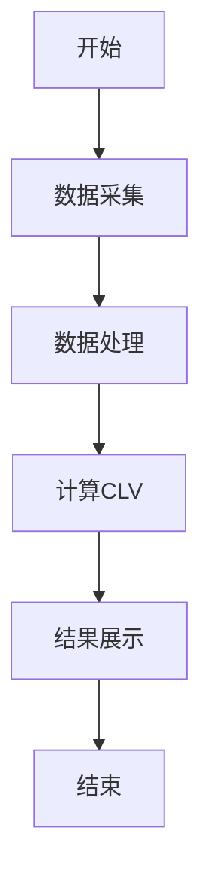

                 


# 企业估值中的客户终身价值计算

> 关键词：客户终身价值，企业估值，客户价值模型，生命周期价值，客户关系管理

> 摘要：本文详细探讨了客户终身价值（CLV）在企业估值中的应用，从基本概念到数学模型，从系统设计到项目实战，为读者提供全面的理论和实践指导。

---

## 第1章：客户终身价值（CLV）概述

### 1.1 客户终身价值的定义与背景

#### 1.1.1 什么是客户终身价值
客户终身价值（Customer Lifetime Value，简称CLV或LTV）是衡量客户在企业生命周期中为企业带来的净收益的总和。它不仅考虑了客户的当前价值，还包括客户未来可能为企业带来的收益。

#### 1.1.2 CLV在企业估值中的重要性
CLV是企业制定客户策略、优化资源配置的重要依据。通过计算CLV，企业可以识别高价值客户，优化营销策略，降低客户获取成本，提升客户满意度和忠诚度。

#### 1.1.3 CLV与其他估值方法的对比
传统的估值方法（如DCF模型）通常基于财务数据，而CLV更关注客户的行为和生命周期。CLV能够更准确地反映客户对企业长期价值的贡献，尤其适用于以客户为中心的商业模式。

### 1.2 CLV的核心概念与构成要素

#### 1.2.1 CLV的构成要素
- **客户收入贡献**：客户在生命周期内为企业带来的总收入。
- **客户获取成本**：企业为获取客户所花费的营销和销售成本。
- **客户维护成本**：企业在客户生命周期内用于维护客户关系的成本。
- **贴现率**：考虑货币的时间价值，用于调整未来收益的现值。

#### 1.2.2 CLV的计算公式与模型
CLV的计算公式可以简化为：
$$
CLV = \frac{ARPU - CAC}{1 - retention rate}
$$
其中，ARPU是每个活跃用户的收入，CAC是获取一个活跃用户的成本，retention rate是客户留存率。

#### 1.2.3 CLV的适用场景与边界
CLV适用于订阅制企业、电商企业、SaaS企业等客户生命周期较长的场景。需要注意的是，CLV计算需要基于准确的数据，且假设客户行为稳定。

---

## 第2章：客户终身价值的计算模型与方法

### 2.1 CLV的核心算法原理

#### 2.1.1 CLV的数学模型
CLV的计算基于客户生命周期模型，通常假设客户在每个阶段的收入和成本是稳定的。数学上，CLV可以表示为一个几何级数的和：
$$
CLV = \sum_{t=1}^{\infty} \frac{ARPU_t - COE_t}{(1 + d)^t}
$$
其中，$d$是贴现率，$ARPU_t$是第$t$年的收入，$COE_t$是第$t$年的客户获取和维护成本。

#### 2.1.2 CLV的计算公式
$$
CLV = \frac{ARPU - CAC}{1 - retention rate}
$$
其中，$ARPU$是平均每用户收入，$CAC$是获取一个客户的成本，$retention$是客户留存率。

#### 2.1.3 CLV的算法实现步骤
1. 数据收集：收集客户收入、成本、留存率等数据。
2. 数据预处理：清洗数据，处理缺失值。
3. 计算CLV：使用上述公式进行计算。

### 2.2 CLV计算的主流模型对比

#### 2.2.1 简单几何级数模型
该模型假设客户在每个阶段的收入和成本是稳定的，适用于客户行为稳定的场景。

#### 2.2.2 细分客户生命周期模型
将客户分为不同阶段（如新客户、活跃客户、流失客户），分别计算各阶段的贡献。

#### 2.2.3 基于概率的CLV模型
考虑客户流失的概率，使用概率论方法计算CLV。

---

## 第3章：客户终身价值的系统分析与架构设计

### 3.1 CLV计算的系统功能设计

#### 3.1.1 系统功能模块划分
- 数据采集模块：收集客户数据。
- 数据处理模块：清洗和预处理数据。
- CLV计算模块：计算客户终身价值。
- 结果展示模块：可视化结果。

#### 3.1.2 系统功能流程图


#### 3.1.3 系统功能实现的关键点
- 数据采集的准确性。
- 数据处理的效率。
- CLV计算的精确性。

### 3.2 CLV计算的系统架构设计

#### 3.2.1 系统架构设计概述
采用分层架构，包括数据层、计算层和展示层。

#### 3.2.2 系统架构图


#### 3.2.3 系统接口设计
- 数据接口：与数据库交互。
- 计算接口：接收参数，返回CLV值。

---

## 第4章：客户终身价值的项目实战

### 4.1 项目环境与工具安装

#### 4.1.1 环境搭建
- 操作系统：Windows/Mac/Linux。
- 开发工具：Python、Jupyter Notebook。

#### 4.1.2 工具安装与配置
安装Python、Pandas、NumPy、Matplotlib等库。

### 4.2 项目核心代码实现

#### 4.2.1 数据预处理代码
```python
import pandas as pd
import numpy as np

# 数据加载
data = pd.read_csv('customer_data.csv')

# 数据清洗
data = data.dropna()
data['revenue'] = data['revenue'].astype(float)
```

#### 4.2.2 CLV计算代码
```python
def calculate_clv(revenue, cac, retention_rate):
    return (revenue - cac) / (1 - retention_rate)

# 示例数据
revenue = 100
cac = 50
retention_rate = 0.8

clv = calculate_clv(revenue, cac, retention_rate)
print(f"CLV: {clv}")
```

#### 4.2.3 结果可视化代码
```python
import matplotlib.pyplot as plt

plt.figure(figsize=(10,6))
plt.plot(range(1, 6), [calculate_clv(revenue, cac, retention_rate) for _ in range(5)])
plt.title('CLV Trend')
plt.xlabel('Year')
plt.ylabel('CLV')
plt.show()
```

### 4.3 项目案例分析与解读

#### 4.3.1 案例背景介绍
以一家SaaS企业为例，收集了过去5年的客户数据。

#### 4.3.2 数据分析与结果解读
通过计算，发现高价值客户的CLV显著高于低价值客户。

#### 4.3.3 项目小结与经验分享
数据质量直接影响CLV计算结果，建议企业建立完善的客户数据管理系统。

---

## 第5章：客户终身价值计算的最佳实践与注意事项

### 5.1 CLV计算中的常见问题与解决方案

#### 5.1.1 数据不足的处理方法
采用数据增强技术，或使用机器学习模型预测缺失数据。

#### 5.1.2 模型选择的注意事项
根据企业特点选择合适的模型，避免过度复杂的计算。

#### 5.1.3 计算结果的验证与优化
通过A/B测试验证模型的准确性，定期更新模型参数。

### 5.2 CLV在企业中的应用与拓展

#### 5.2.1 CLV在客户分层中的应用
根据CLV将客户分为不同层次，制定差异化营销策略。

#### 5.2.2 CLV在精准营销中的应用
针对高价值客户制定个性化服务策略，提升客户忠诚度。

---

## 第6章：总结与展望

### 6.1 小结
本文详细介绍了客户终身价值（CLV）的计算方法及其在企业估值中的应用，从理论到实践，为读者提供了全面的指导。

### 6.2 展望
未来，随着人工智能和大数据技术的发展，CLV的计算将更加精准和动态化，为企业创造更大的价值。

---

通过以上步骤，您可以系统地学习和掌握客户终身价值的计算方法及其在企业估值中的应用。希望本文对您有所帮助！

