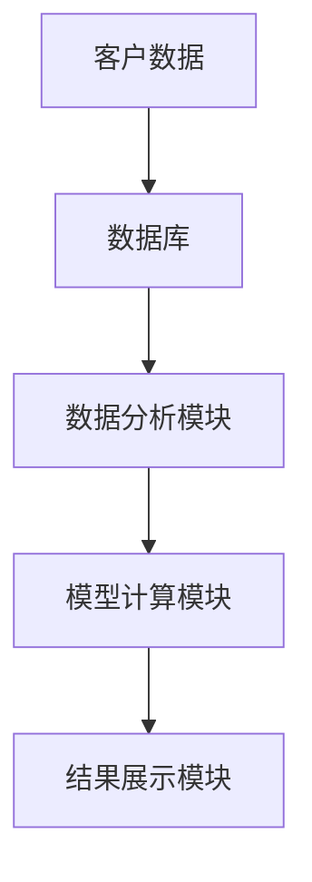
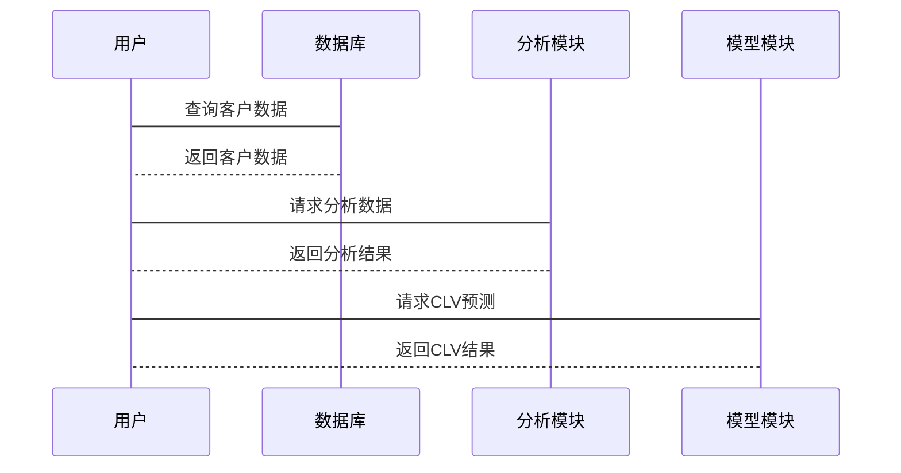

                 


# 企业估值中的客户终身价值评估

> 关键词：客户终身价值，企业估值，客户价值评估，数据分析，定价策略

> 摘要：客户终身价值（Customer Lifetime Value，CLV）是企业在评估客户价值时的重要指标，它不仅能够帮助企业更准确地进行客户管理，还能为企业估值提供数据支持。本文将从CLV的核心概念、计算方法、系统架构设计、项目实战以及最佳实践等多个方面进行深入探讨，帮助读者全面理解CLV在企业估值中的应用。

---

## 第1章: 客户终身价值（CLV）概述

### 1.1 客户终身价值的核心概念

#### 1.1.1 什么是客户终身价值
客户终身价值（Customer Lifetime Value，CLV）是指一个客户在其整个生命周期内为企业带来的净收益。它是企业在考虑客户获取成本、客户生命周期、客户流失率等多方面因素后，对客户价值的综合评估。

**问题背景**：在现代商业环境中，企业需要更加精准地评估客户的价值，以便制定有效的客户管理策略。传统的按交易计算收益的方式已经无法满足企业对客户价值的深度分析需求。

**问题解决**：CLV为企业提供了一个长期视角，帮助企业识别高价值客户，优化资源配置，从而提升整体收益。

**边界与外延**：CLV的计算通常基于客户的历史行为数据，但其外延可以扩展到客户预测行为的分析，例如通过机器学习模型预测客户的未来购买行为。

**核心要素**：
- 客户生命周期：客户从初次接触、购买到最终流失的整个过程。
- 客户购买频率与金额：客户在生命周期内购买的次数和每次购买的金额。
- 客户流失率：客户在生命周期内流失的概率。

#### 1.1.2 CLV与企业估值的关系
CLV不仅是客户管理的重要指标，也是企业估值的关键组成部分。通过评估客户的终身价值，企业可以更准确地估算自身的市场价值，并制定合理的战略决策。

#### 1.1.3 CLV的应用场景
- 客户细分与精准营销：识别高价值客户，制定针对性的营销策略。
- 客户保留与流失预测：通过分析客户流失率，制定客户保留策略。
- 产品定价与推广：根据客户价值调整产品定价和推广策略。

---

### 1.2 客户终身价值的计算模型

#### 1.2.1 基于贴现现金流的CLV模型
该模型假设客户在未来一段时间内会持续为企业创造收益，因此需要将未来的收益折现到当前时点。

**公式**：
$$ CLV = \frac{R - C}{1 + d} $$
其中：
- \( R \) 表示客户带来的收入
- \( C \) 表示客户获取成本
- \( d \) 表示贴现率

**应用场景**：适用于客户生命周期较短，且收益稳定的业务场景。

#### 1.2.2 基于概率的CLV模型
该模型考虑客户在生命周期内可能流失的概率，从而调整未来收益的预期。

**公式**：
$$ CLV = \sum_{t=1}^{n} \frac{(R - C)(1 - p)^{t-1}}{1 + d} $$
其中：
- \( p \) 表示客户流失的概率
- \( n \) 表示客户生命周期的长度

**应用场景**：适用于客户生命周期较长，且流失概率较高的业务场景。

#### 1.2.3 CLV模型的优缺点对比

| 模型类型       | 优点                               | 缺点                               |
|----------------|------------------------------------|------------------------------------|
| 贴现现金流模型 | 计算简单，适用于短期预测           | 忽略客户流失的动态变化           |
| 概率模型       | 考虑客户流失概率，预测更准确       | 计算复杂，需要大量历史数据支持    |

---

## 第2章: 客户终身价值的核心概念与联系

### 2.1 CLV的核心要素

#### 2.1.1 客户生命周期
客户生命周期包括以下几个阶段：
1. **获取阶段**：客户首次接触并购买企业产品或服务。
2. **发展阶段**：客户逐渐增加购买频率和金额。
3. **成熟阶段**：客户成为企业的核心客户，贡献稳定收益。
4. **衰退阶段**：客户开始减少购买频率，最终流失。

#### 2.1.2 客户购买频率与金额
购买频率和金额是影响CLV的重要因素。高频率和高金额的客户通常具有更高的CLV。

#### 2.1.3 客户流失率与获取成本
客户流失率越高，企业需要投入更多的成本来获取新客户，从而降低整体的CLV。

### 2.2 CLV与相关概念的对比

#### 2.2.1 CLV与客户满意度
- **区别**：客户满意度衡量客户对企业的满意程度，而CLV衡量客户为企业带来的长期价值。
- **联系**：高客户满意度通常与高CLV相关，但满意度并非决定CLV的唯一因素。

#### 2.2.2 CLV与客户生命周期价值
- **区别**：客户生命周期价值（CLTV）通常指客户在其生命周期内为企业带来的总收益，而CLV是扣除成本后的净收益。
- **联系**：CLV是CLTV的进一步优化，考虑了成本因素。

#### 2.2.3 CLV与客户保留成本
- **区别**：客户保留成本是企业为保持客户而投入的成本，而CLV是客户为企业带来的净收益。
- **联系**：合理的客户保留成本能够提升CLV。

### 2.3 CLV的ER实体关系图

```mermaid
er
  customer(CustomerID, Name, Email, Phone)
  transaction(TransactionID, CustomerID, Amount, Date)
  product(ProductID, ProductName, Price)
  order(OrderID, TransactionID, ProductID, Quantity)
  customer_order(CustomerID, OrderID)
  customer_transaction(CustomerID, TransactionID)
```

---

## 第3章: 客户终身价值的算法原理

### 3.1 CLV的计算算法

#### 3.1.1 基于历史数据的CLV预测
通过分析客户的历史购买数据，预测客户未来的购买行为，并计算其CLV。

**步骤**：
1. 收集客户的历史交易数据。
2. 计算客户的平均购买频率和金额。
3. 预测客户在未来一段时间内的购买次数和金额。
4. 计算客户流失概率。
5. 结合贴现率计算CLV。

#### 3.1.2 基于机器学习的CLV预测
使用机器学习模型（如随机森林、神经网络）预测客户的CLV。

**步骤**：
1. 数据预处理：清洗和特征工程。
2. 模型训练：使用历史数据训练模型。
3. 模型预测：预测客户的CLV。
4. 模型优化：调整参数以提高预测精度。

#### 3.1.3 基于贝叶斯网络的CLV预测
利用贝叶斯网络模型分析客户行为的不确定性，预测CLV。

**步骤**：
1. 构建贝叶斯网络模型。
2. 输入客户特征数据。
3. 计算客户流失概率。
4. 预测客户的未来收益。
5. 计算CLV。

### 3.2 CLV算法的数学模型

#### 3.2.1 基于贴现现金流的CLV公式
$$ CLV = \frac{R - C}{1 + d} $$
其中：
- \( R \) 表示客户带来的收入
- \( C \) 表示客户获取成本
- \( d \) 表示贴现率

#### 3.2.2 基于概率的CLV公式
$$ CLV = \sum_{t=1}^{n} \frac{(R - C)(1 - p)^{t-1}}{1 + d} $$
其中：
- \( p \) 表示客户流失的概率
- \( n \) 表示客户生命周期的长度

---

## 第4章: 客户终身价值的系统架构设计

### 4.1 系统功能设计

#### 4.1.1 数据采集模块
负责收集客户交易数据、客户行为数据等。

#### 4.1.2 数据分析模块
对数据进行清洗、特征提取和建模分析。

#### 4.1.3 模型计算模块
使用机器学习模型计算客户的CLV。

#### 4.1.4 结果展示模块
将计算结果以可视化的方式展示给用户。

### 4.2 系统架构图



### 4.3 系统接口设计

| 接口名称       | 输入       | 输出       |
|----------------|------------|------------|
| 数据采集接口   | 客户ID、交易记录 | 数据库存储   |
| 数据分析接口   | 数据库查询条件 | 分析结果     |
| 模型计算接口   | 客户特征数据 | CLV预测结果 |

### 4.4 系统交互流程



---

## 第5章: 项目实战

### 5.1 环境安装

#### 5.1.1 安装Python
```bash
python --version
pip install numpy pandas scikit-learn
```

### 5.2 系统核心实现源代码

#### 5.2.1 数据预处理
```python
import pandas as pd
import numpy as np

# 加载数据
data = pd.read_csv('customer_data.csv')

# 数据清洗
data.dropna(inplace=True)
data['CustomerID'] = data['CustomerID'].astype(int)
```

#### 5.2.2 模型训练
```python
from sklearn.ensemble import RandomForestRegressor

# 特征工程
X = data[['Age', 'Gender', 'PurchaseFrequency', 'AvgRevenue']]
y = data['CLV']

# 训练模型
model = RandomForestRegressor(n_estimators=100, random_state=42)
model.fit(X, y)
```

#### 5.2.3 模型预测
```python
# 预测新客户的价值
new_customer = pd.DataFrame({
    'Age': [30],
    'Gender': ['M'],
    'PurchaseFrequency': [2],
    'AvgRevenue': [100]
})

predicted_clv = model.predict(new_customer)
print(f"预测的客户终身价值为：{predicted_clv[0]:.2f}")
```

### 5.3 代码应用解读与分析

#### 5.3.1 数据预处理
- 数据清洗：去除缺失值。
- 数据转换：将客户ID转换为整数类型。

#### 5.3.2 模型训练
- 特征工程：提取客户的年龄、性别、购买频率和平均收入作为特征。
- 训练模型：使用随机森林回归模型进行训练。

#### 5.3.3 模型预测
- 输入新客户的特征数据。
- 预测客户的CLV值。

### 5.4 实际案例分析

#### 5.4.1 数据来源
假设我们有一家电商企业，收集了10000个客户的交易数据。

#### 5.4.2 数据分析
通过数据分析模块，我们发现高价值客户（CLV>500）占客户总数的10%，这些客户为企业贡献了超过60%的总收益。

#### 5.4.3 模型优化
通过调整模型参数（如增加树的数量），我们可以提高模型的预测精度。

### 5.5 项目小结

---

## 第6章: 最佳实践与小结

### 6.1 最佳实践

#### 6.1.1 数据质量的重要性
确保数据的准确性和完整性，是CLV计算的基础。

#### 6.1.2 客户细分策略
通过CLV对客户进行细分，制定差异化的客户管理策略。

#### 6.1.3 定期更新模型
根据市场变化和客户行为的动态调整CLV模型。

### 6.2 小结

客户终身价值（CLV）是企业估值中的重要指标，它不仅能够帮助企业优化客户管理，还能为企业制定战略决策提供数据支持。通过本文的探讨，我们详细介绍了CLV的核心概念、计算方法、系统架构设计以及项目实战案例，希望读者能够通过这些内容深入理解CLV的应用价值。

---

## 第7章: 展望与未来发展方向

### 7.1 CLV的未来发展趋势
随着大数据和人工智能技术的不断发展，CLV的计算方法将更加精准和智能化。

### 7.2 拓展阅读
推荐读者阅读以下书籍和文章：
- 《Data-Driven Marketing》
- 《Customer Equity Management》
- 《Machine Learning for Business Analytics》

---

# 总结

通过本文的详细讲解，我们希望读者能够全面理解客户终身价值（CLV）在企业估值中的应用。从理论到实践，从模型到系统，我们为企业提供了完整的解决方案。未来，随着技术的进步，CLV的计算方法将更加智能化和个性化，为企业创造更大的价值。

