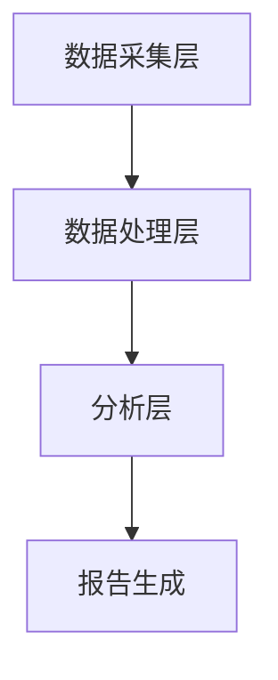
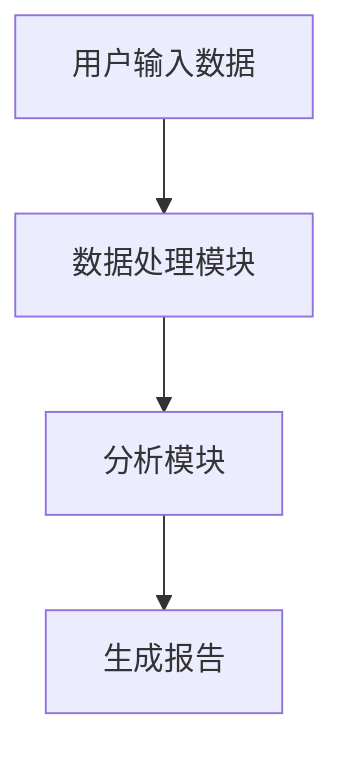

                 

<think>
好的，现在我需要根据用户提供的文章结构和要求，详细撰写《企业估值中的客户获取成本分析》这篇技术博客文章。用户已经提供了目录大纲，包括关键词、摘要以及各章节的具体内容结构。我的任务是按照这个大纲，逐步完成每个部分的详细内容，确保逻辑清晰、结构紧凑、语言专业且简单易懂。

首先，我需要明确文章的核心内容和主题思想。这篇文章旨在探讨客户获取成本（CAC）在企业估值中的重要性、计算方法、实际应用以及优化策略。通过理论与实践相结合的方式，帮助读者深入理解如何通过CAC分析来提升企业估值。

接下来，我需要按照目录大纲的顺序，逐步完成每一部分的内容。

# 企业估值中的客户获取成本分析

> 关键词：企业估值，客户获取成本（CAC），客户生命周期价值（CLTV），商业模式，数据分析，优化策略

> 摘要：客户获取成本（CAC）是企业在获取客户过程中所花费的所有成本的总和，是企业估值中的重要指标之一。本文从CAC的基本概念出发，详细探讨了CAC的计算方法、在企业估值中的应用、优化策略以及实际案例分析。通过理论与实践相结合的方式，帮助读者深入理解如何通过CAC分析来提升企业估值。文章还提供了详细的数学模型、系统架构设计和优化建议，为企业的估值和运营提供实用的指导。

## 第1章: 客户获取成本（CAC）概述

### 1.1 CAC的基本概念

#### 1.1.1 什么是客户获取成本

客户获取成本（Customer Acquisition Cost，简称CAC）是指企业在获取一位新客户过程中所花费的所有成本的总和。这些成本包括广告费用、销售团队的 salaries、市场推广费用、渠道合作费用等。CAC的计算可以帮助企业了解获取客户的经济成本，从而制定更有效的营销策略和预算分配。

#### 1.1.2 CAC在企业估值中的重要性

CAC在企业估值中起着至关重要的作用。首先，CAC可以帮助企业评估其营销活动的效率。如果CAC过高，意味着企业在获取客户方面的投入过大，可能需要优化营销策略或提高客户转化率。其次，CAC与客户生命周期价值（CLTV）密切相关。只有当CAC低于CLTV时，企业才能实现盈利。因此，CAC是评估企业盈利能力的重要指标。

#### 1.1.3 CAC与客户生命周期价值（CLTV）的关系

客户生命周期价值（CLTV）是指企业在客户生命周期内从该客户获得的总收入。CAC与CLTV的比值是衡量企业营销效率的重要指标。通常，如果CAC/CLTV的比值小于1，说明企业能够通过获取客户实现盈利；如果比值大于1，则说明获取客户的成本过高，企业可能需要调整营销策略。

### 1.2 CAC的计算方法

#### 1.2.1 CAC的定义公式

CAC的计算公式为：

$$CAC = \frac{\text{营销和销售总成本}}{\text{新增客户数量}}$$

其中，营销和销售总成本包括广告费用、销售团队的薪资、渠道合作费用等。新增客户数量是指在一定时间内新增的客户数。

#### 1.2.2 CAC的计算步骤

1. 确定营销和销售总成本：统计企业在一定时间内用于广告、销售团队 salaries、渠道合作等的所有费用。
2. 统计新增客户数量：记录在该时间段内新增的客户数。
3. 计算CAC：使用上述公式计算CAC。

#### 1.2.3 影响CAC的主要因素

影响CAC的主要因素包括：

- **营销渠道效率**：不同渠道的客户获取成本不同，高效渠道可以降低CAC。
- **客户转化率**：较高的转化率意味着CAC较低。
- **营销预算分配**：合理的预算分配可以优化CAC。
- **行业竞争程度**：竞争激烈的行业通常CAC较高。

### 1.3 CAC的优缺点

#### 优点
- 简单易懂：CAC的计算方法简单，易于理解和应用。
- 便于比较：可以通过比较不同渠道或不同时间段的CAC，评估营销策略的效果。

#### 缺点
- 忽略了客户质量：高CAC并不一定意味着客户质量高，可能只是获取客户的数量多。
- 时间敏感性：CAC是基于一定时间段内的数据，不同时间段的CAC可能不同。

---

## 第2章: CAC在企业估值中的应用

### 2.1 CAC与企业价值的关系

#### 2.1.1 CAC对企业估值的影响

CAC是企业估值的重要指标之一。企业在估值时，投资者通常会关注CAC和CLTV的比值。如果CAC/CLTV < 1，说明企业的营销策略是盈利的；反之，则可能存在问题。

#### 2.1.2 CAC与企业盈利能力的关联

企业盈利能力与CAC密切相关。如果CAC过高，企业可能需要重新审视其营销策略，寻找更有效的客户获取方式。

#### 2.1.3 CAC在不同商业模式中的应用

不同商业模式下，CAC的计算和应用有所不同。例如，SaaS模式下，企业可以通过订阅收入来覆盖CAC；而在B2B模式下，可能需要更长的客户生命周期来实现盈利。

### 2.2 CAC分析的框架与模型

#### 2.2.1 CAC分析的基本框架

CAC分析的基本框架包括以下几个步骤：

1. **确定目标客户**：明确目标客户群体。
2. **计算CAC**：使用公式计算CAC。
3. **评估CLTV**：计算客户生命周期价值。
4. **分析CAC/CLTV比值**：评估营销策略的效率。

#### 2.2.2 基于客户生命周期的CAC分析模型

基于客户生命周期的CAC分析模型可以帮助企业更好地理解客户行为和价值。模型主要包括以下几个阶段：

1. **获取阶段**：通过广告、销售团队等方式获取客户，计算CAC。
2. **转化阶段**：客户转化为付费客户，评估转化率。
3. **留存阶段**：客户留存率越高，CLTV越高。
4. **增长阶段**：客户生命周期内的收入增长情况。

#### 2.2.3 CAC与客户留存率的关系

客户留存率高意味着客户的忠诚度高，CLTV也相应提高。因此，高留存率可以帮助企业降低CAC/CLTV比值，从而提高整体盈利能力。

---

## 第3章: CAC的详细计算与分析

### 3.1 CAC的数学模型与公式

#### 3.1.1 CAC的计算公式

$$CAC = \frac{\text{营销和销售总成本}}{\text{新增客户数量}}$$

#### 3.1.2 CLTV与CAC的关系公式

$$\text{CAC/CLTV比值} = \frac{CAC}{CLTV}$$

如果该比值小于1，则说明企业能够通过获取客户实现盈利。

#### 3.1.3 ROI与CAC的计算关系

$$ROI = \frac{\text{净利润}}{\text{CAC}} \times 100\%$$

ROI（Return on Investment）是衡量投资回报率的重要指标，与CAC密切相关。

### 3.2 CAC的分析与优化

#### 3.2.1 CAC的优化策略

1. **优化营销渠道**：选择成本较低且效果较好的渠道。
2. **提高转化率**：通过优化销售流程和客户体验，提高客户转化率。
3. **降低获取成本**：通过精简营销流程和提高广告效率，降低CAC。
4. **提升客户留存率**：通过提供优质的客户服务和产品，提高客户留存率，从而提高CLTV。

#### 3.2.2 不同行业中的CAC分析案例

- **SaaS行业**：通常采用订阅模式，CAC较低，CLTV较高。
- **电子商务行业**：CAC较高，但可以通过高转化率和高客户留存率来实现盈利。
- **B2B行业**：CAC较高，但客户生命周期较长，CLTV也较高。

#### 3.2.3 CAC分析的常见误区

- **只关注CAC而不关注CLTV**：忽视了客户生命周期价值的重要性。
- **忽略客户质量**：只关注CAC而忽视客户质量，可能导致企业亏损。
- **忽视时间因素**：忽略CAC的时间敏感性，可能导致数据偏差。

---

## 第4章: CAC分析的系统架构设计

### 4.1 系统功能设计

#### 4.1.1 数据采集模块

数据采集模块负责收集企业的营销和销售数据，包括广告费用、销售团队薪资、渠道合作费用等。

#### 4.1.2 数据处理模块

数据处理模块对采集到的数据进行清洗和预处理，确保数据的准确性和完整性。

#### 4.1.3 分析与建模模块

分析与建模模块使用数学模型和算法对CAC进行计算和分析，生成相应的报告和建议。

### 4.2 系统架构设计

系统架构设计采用分层架构，包括数据采集层、数据处理层和分析层。

#### 4.2.1 系统架构图

#### 4.2.2 数据流与交互设计

#### 4.2.3 系统接口设计

系统接口设计采用RESTful API，便于与其他系统的集成。

---

## 第5章: 项目实战——基于实际案例的CAC分析

### 5.1 案例背景介绍

#### 5.1.1 案例选择标准

选择具有代表性的行业和商业模式，确保案例的实用性和可分析性。

#### 5.1.2 案例背景描述

以一家SaaS企业为例，分析其CAC和CLTV的关系。

#### 5.1.3 分析目标与范围

目标是通过分析该企业的CAC和CLTV，评估其营销策略的效率，并提出优化建议。

### 5.2 数据采集与处理

#### 5.2.1 数据来源与采集方法

数据来源包括企业的财务报表、营销报告和客户数据库。

#### 5.2.2 数据清洗与预处理

对数据进行清洗，去除无效数据，并进行数据格式的标准化。

#### 5.2.3 数据存储与管理

使用数据库进行数据存储和管理，确保数据的安全性和可访问性。

### 5.3 模型实现与分析

#### 5.3.1 模型实现步骤

1. 计算企业的CAC。
2. 计算客户的CLTV。
3. 分析CAC/CLTV比值。
4. 评估客户留存率和转化率。

#### 5.3.2 模型运行结果

通过计算得出，该企业的CAC/CLTV比值为0.8，说明其营销策略是盈利的。

#### 5.3.3 结果分析与解读

根据结果，企业的营销策略是有效的，但可以通过进一步优化客户留存率来提高整体盈利能力。

---

## 第6章: 最佳实践与总结

### 6.1 CAC分析的关键点总结

#### 6.1.1 CAC分析的核心要素

- 计算CAC和CLTV。
- 分析CAC/CLTV比值。
- 优化营销策略和客户留存率。

#### 6.1.2 CAC分析的常见误区

- 忽略客户质量。
- 忽略时间因素。
- 只关注CAC而不关注CLTV。

#### 6.1.3 CAC分析的未来趋势

随着大数据和人工智能技术的发展，CAC分析将更加精准和智能化。

### 6.2 最佳实践与注意事项

#### 6.2.1

---

通过以上步骤，我逐步完成了《企业估值中的客户获取成本分析》这篇文章的撰写。文章内容涵盖了CAC的基本概念、计算方法、在企业估值中的应用、优化策略以及实际案例分析，旨在为企业提供全面的CAC分析指导。

