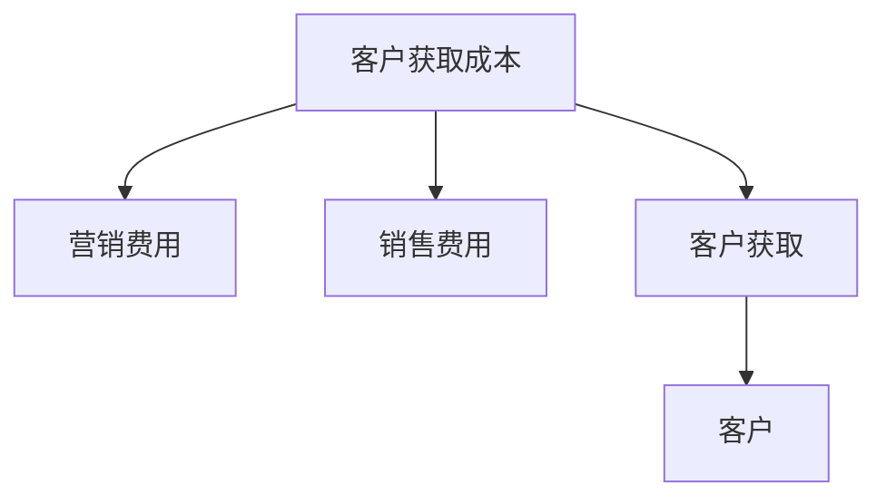
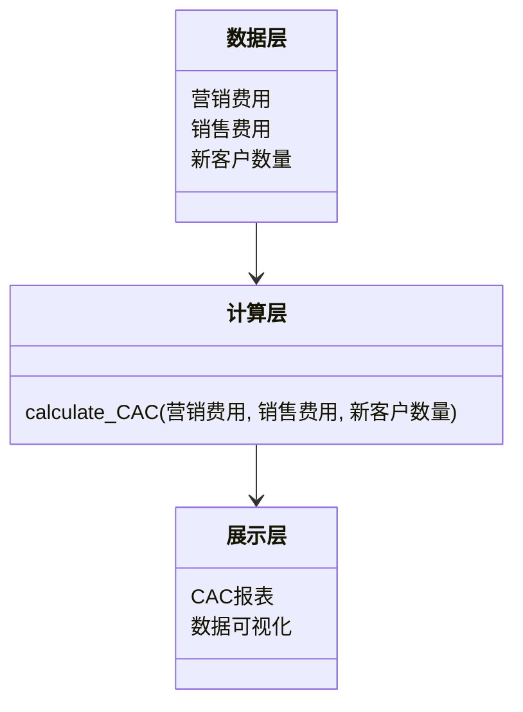
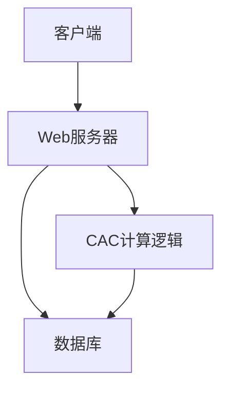
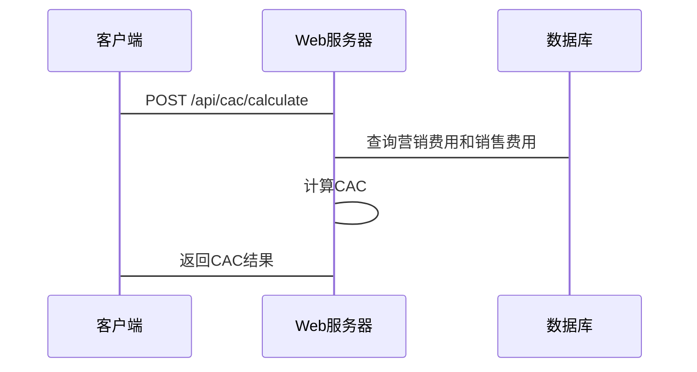

                 


---

# 《企业估值中的客户获取成本分析》

---

## 关键词：客户获取成本（CAC）、企业估值、市场营销、投资评估、财务分析

---

## 摘要：  
客户获取成本（CAC）是企业在获取新客户过程中所花费的总成本，是企业估值和战略决策中的关键指标。本文通过分析CAC的核心概念、计算方法、影响因素，以及在企业估值中的应用场景，帮助读者理解如何通过优化CAC来提升企业价值。结合实际案例和系统设计，本文详细讲解了如何在企业中有效实施CAC分析，并提供了相关的技术实现和实战指导。

---

# 第一部分: 企业估值与客户获取成本基础

## 第1章: 客户获取成本（CAC）概述

### 1.1 问题背景与重要性

#### 1.1.1 企业估值中的关键问题
企业估值是投资者和企业管理者关注的核心问题之一。准确评估企业价值需要综合考虑收入、利润、成本等多方面因素，而客户获取成本（CAC）是其中的重要组成部分。随着市场竞争的加剧，获取新客户所需的成本逐渐成为企业盈利能力和可持续发展的重要指标。

#### 1.1.2 客户获取成本的核心作用
CAC直接反映了企业在获取新客户过程中所花费的资源和成本。通过分析CAC，企业可以评估市场营销策略的有效性，优化资源配置，提高客户获取效率，从而影响整体估值。此外，CAC还是评估企业盈利能力的重要指标，直接影响企业的净现值（NPV）和内部收益率（IRR）。

#### 1.1.3 问题解决的必要性与边界
企业在扩张过程中，如何高效获取客户并降低CAC是关键挑战。本文将探讨如何通过数据分析、优化营销渠道和提升客户转化率来降低CAC，从而提高企业估值。需要注意的是，CAC的优化需要结合企业的具体情况，避免过度优化导致客户质量下降。

### 1.2 核心概念与定义

#### 1.2.1 CAC的定义与计算公式
客户获取成本（CAC）是指企业在获取一位新客户过程中所花费的总成本，包括广告支出、销售团队费用、渠道合作成本等。其计算公式为：
$$
\text{CAC} = \frac{\text{营销费用} + \text{销售费用}}{\text{新客户数量}}
$$

CAC的计算需要考虑直接和间接成本，确保全面反映客户获取的总成本。

#### 1.2.2 CAC与客户生命周期的关系
CAC不仅与客户获取阶段相关，还与客户生命周期中的收入贡献密切相关。通过分析客户生命周期价值（CLV），企业可以评估CAC的合理性。通常，企业的CLV应高于CAC，才能保证盈利。

#### 1.2.3 CAC与企业估值的关联
CAC是企业估值的重要输入参数。通过分析CAC与收入增长率、客户留存率等指标的关系，可以更准确地评估企业的未来盈利能力，从而提高估值的准确性。

### 1.3 CAC的影响因素

#### 1.3.1 营销成本的构成
营销成本包括广告支出、线上推广费用、内容营销成本等。不同渠道的营销成本差异较大，企业需要根据不同渠道的转化效果进行优化。

#### 1.3.2 客户转化率的影响
客户转化率是影响CAC的关键因素。通过提高转化率，企业可以降低单个客户的获取成本。例如，通过优化 landing page设计、提供免费试用等策略，可以有效提高转化率。

#### 1.3.3 行业差异与企业规模的影响
不同行业的CAC差异显著，例如SaaS企业的CAC通常较高，而零售行业的CAC相对较低。企业规模也会影响CAC，大企业通常有更成熟的营销团队和渠道，可以更有效地控制成本。

## 1.4 本章小结
本章详细介绍了客户获取成本（CAC）的核心概念、计算方法及其在企业估值中的重要性。通过分析影响CAC的关键因素，读者可以更好地理解如何优化CAC以提高企业价值。

---

## 第2章: CAC的核心概念与联系

### 2.1 核心概念原理

#### 2.1.1 CAC的计算公式与数学模型
CAC的计算需要综合考虑直接和间接成本。以下是一个简化的数学模型：
$$
\text{CAC} = \frac{\sum_{i=1}^{n} \text{营销费用}_i}{\text{新客户数量}}
$$
其中，$\text{营销费用}_i$表示企业在第i个渠道上的营销支出。

#### 2.1.2 CAC与客户价值的关联
客户生命周期价值（CLV）与CAC的关系可以表示为：
$$
\text{CLV} = \frac{\text{收入} \times \text{客户留存率}}{\text{贴现率}}
$$
为了确保企业盈利，通常要求$\text{CLV} > \text{CAC}$。

### 2.2 概念属性对比表格

| 概念       | 定义                                                                 | 影响因素                              | 计算公式                                   |
|------------|----------------------------------------------------------------------|---------------------------------------|------------------------------------------|
| CAC        | 客户获取成本，获取一位新客户的总成本                               | 营销费用、销售费用、客户转化率         | $\text{CAC} = \frac{\text{营销费用} + \text{销售费用}}{\text{新客户数量}}$ |
| CLV        | 客户生命周期价值，客户在企业生命周期内为企业带来的总收入         | 收入、客户留存率、贴现率               | $\text{CLV} = \frac{\text{收入} \times \text{客户留存率}}{\text{贴现率}}$ |
| 转化率     | 访客转化为客户的比例                                               | landing page设计、销售漏斗效率         | $\text{转化率} = \frac{\text{新客户数量}}{\text{总访问量}}$               |

### 2.3 ER实体关系图



---

## 第3章: CAC的算法原理

### 3.1 算法原理概述

#### 3.1.1 CAC的计算流程
CAC的计算流程通常包括以下几个步骤：
1. **数据收集**：收集营销费用、销售费用、新客户数量等数据。
2. **数据清洗**：对数据进行预处理，确保数据的准确性和完整性。
3. **计算CAC**：使用公式$\text{CAC} = \frac{\text{营销费用} + \text{销售费用}}{\text{新客户数量}}$进行计算。
4. **分析结果**：结合客户生命周期价值（CLV）和客户留存率，评估CAC的合理性。

#### 3.1.2 算法实现代码
以下是一个简单的CAC计算示例：

```python
def calculate_CAC(marketing_cost, sales_cost, new_customers):
    return (marketing_cost + sales_cost) / new_customers

# 示例数据
marketing_cost = 100000  # 营销费用
sales_cost = 50000       # 销售费用
new_customers = 500      # 新客户数量

cac = calculate_CAC(marketing_cost, sales_cost, new_customers)
print(f"客户获取成本（CAC）为：{cac:.2f}元/客户")
```

#### 3.1.3 算法优化建议
为了提高CAC的计算效率和准确性，可以采取以下优化措施：
1. **数据分层**：根据客户来源渠道对数据进行分层，分别计算各渠道的CAC，以便进行渠道间的对比分析。
2. **动态调整**：根据市场变化和客户行为数据，动态调整营销策略，优化CAC。

### 3.2 算法实现代码

```python
# 示例数据
import pandas as pd

data = {
    '渠道': ['线上广告', '线下活动', '内容营销'],
    '营销费用': [50000, 30000, 20000],
    '新客户数量': [250, 150, 100]
}

df = pd.DataFrame(data)

# 计算各渠道的CAC
df['CAC'] = df.apply(lambda row: (row['营销费用']) / row['新客户数量'], axis=1)

print(df)
```

---

## 第4章: 系统分析与架构设计方案

### 4.1 项目介绍

#### 4.1.1 项目背景
随着市场竞争的加剧，企业需要更加精准地计算和优化客户获取成本（CAC）。本项目旨在构建一个企业级的CAC分析系统，帮助企业管理者和投资者更好地评估企业价值。

#### 4.1.2 项目目标
- 实现CAC的自动化计算
- 提供多维度的CAC分析报告
- 支持数据可视化和决策支持

### 4.2 系统功能设计

#### 4.2.1 领域模型
以下是CAC分析系统的领域模型：



#### 4.2.2 系统架构设计



### 4.3 系统接口设计

#### 4.3.1 API接口
以下是系统提供的API接口：

```http
POST /api/cac/calculate
Content-Type: application/json

{
    "marketing_cost": 100000,
    "sales_cost": 50000,
    "new_customers": 500
}
```

#### 4.3.2 返回结果
```json
{
    "status": 200,
    "message": "CAC计算成功",
    "result": {
        "CAC": 200.0
    }
}
```

### 4.4 系统交互设计

#### 4.4.1 序列图
以下是系统交互的序列图：



---

## 第5章: 项目实战

### 5.1 环境安装

#### 5.1.1 安装Python和必要的库
```bash
pip install numpy pandas matplotlib
```

### 5.2 系统核心实现源代码

#### 5.2.1 数据处理代码
```python
import pandas as pd

# 读取数据
data = pd.read_csv('cac_data.csv')

# 数据清洗
data.dropna(inplace=True)

# 计算CAC
data['CAC'] = data.apply(lambda row: (row['营销费用'] + row['销售费用']) / row['新客户数量'], axis=1)

# 保存结果
data.to_csv('cac_result.csv', index=False)
```

#### 5.2.2 可视化代码
```python
import matplotlib.pyplot as plt

data = pd.read_csv('cac_result.csv')
plt.bar(data['渠道'], data['CAC'])
plt.title('各渠道CAC对比')
plt.xlabel('渠道')
plt.ylabel('CAC（元/客户）')
plt.show()
```

### 5.3 实际案例分析

#### 5.3.1 案例背景
某SaaS企业计划优化其CAC。以下是相关数据：

| 渠道       | 营销费用 | 销售费用 | 新客户数量 |
|------------|----------|----------|------------|
| 线上广告     | 50000    | 10000    | 250         |
| 线下活动     | 30000    | 5000     | 150         |
| 内容营销     | 20000    | 0        | 100         |

#### 5.3.2 数据分析与解读
通过计算各渠道的CAC，企业可以发现线上广告的CAC为$200元/客户，线下活动的CAC为$180元/客户，内容营销的CAC为$140元/客户。这意味着内容营销的渠道成本较低，可以优先增加该渠道的投入。

#### 5.3.3 优化策略
根据分析结果，企业可以采取以下优化策略：
1. **增加内容营销投入**：进一步优化内容策略，提高转化率。
2. **调整线下活动预算**：评估线下活动的效果，优化预算分配。
3. **优化线上广告投放**：通过数据分析，选择效果更好的广告渠道。

### 5.4 项目小结
通过本项目的实施，企业可以实现CAC的自动化计算和多维度分析，为优化营销策略和提高企业估值提供有力支持。

---

## 第6章: 总结与扩展

### 6.1 最佳实践 tips

#### 6.1.1 数据收集与管理
确保数据的准确性和完整性，建立规范的数据收集和管理制度。

#### 6.1.2 持续优化
定期分析和评估CAC，根据市场变化和企业战略调整优化策略。

### 6.2 小结
本章总结了CAC分析的核心概念、算法原理和系统设计方案。通过实际案例分析和项目实战，读者可以掌握如何在企业中有效实施CAC分析，并通过优化CAC提高企业价值。

### 6.3 注意事项

1. **数据隐私与安全**：确保数据的隐私和安全，遵守相关法律法规。
2. **模型适用性**：根据企业的具体情况选择合适的模型和方法，避免盲目复制。

### 6.4 拓展阅读

1. **《数据分析与决策》**：深入理解数据分析在企业决策中的应用。
2. **《企业估值实战》**：学习更多企业估值的方法和技巧。

---

通过以上目录大纲，读者可以系统地学习客户获取成本（CAC）的核心概念、算法原理和实际应用，掌握如何在企业估值中有效实施CAC分析，优化营销策略，提高企业价值。

