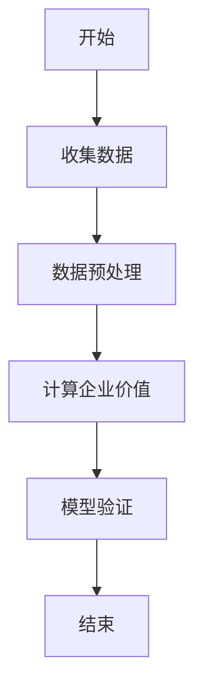
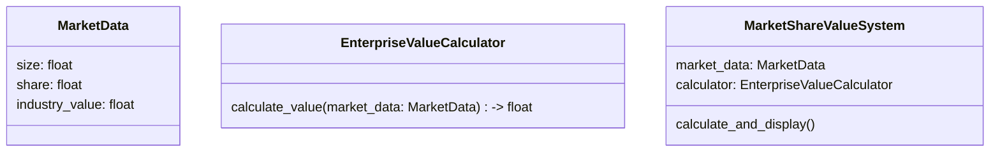

                 


# 企业估值中的市场份额价值法

> **关键词**：企业估值、市场份额、价值评估、投资分析、市场分析、经济模型

> **摘要**：  
本文深入探讨了企业估值中的市场份额价值法，从理论基础到实际应用进行全面解析。通过分析市场份额的核心作用，结合数学模型和算法，详细阐述了如何利用市场份额数据进行企业价值评估。文章还提供了系统架构设计和实际案例分析，帮助读者掌握这一创新的估值方法。

---

## 第一章：企业估值概述

### 1.1 企业估值的基本概念

企业估值是通过对企业的财务状况、市场地位、竞争优势等多方面因素的综合分析，确定其市场价值的过程。传统的企业估值方法主要包括市盈率法、市净率法和现金流折现法，但这些方法在实际应用中存在一定的局限性。

**市盈率法的局限性**：  
市盈率法依赖于企业当前的盈利情况，但忽略了市场的竞争格局和企业的潜在增长能力。例如，一家企业当前盈利很高，但如果其市场份额正在被竞争对手侵蚀，市盈率法可能无法准确反映其长期价值。

**市净率法的局限性**：  
市净率法侧重于企业的资产价值，但忽视了企业的盈利能力和发展潜力。这种方法更适合评估资产密集型企业，而非成长型企业。

**现金流折现法的局限性**：  
现金流折现法虽然考虑了未来现金流的贴现值，但其准确性高度依赖于对未来现金流的预测，而实际市场环境的复杂性往往导致预测偏差。

### 1.2 市场份额价值法的优势

市场份额价值法是一种基于市场占有率的企业估值方法，它通过分析企业在特定市场中的份额占比，结合行业市场规模和竞争格局，评估企业的市场地位和未来盈利能力。与传统方法相比，市场份额价值法具有以下优势：

1. **全面考虑市场竞争**：  
   市场份额价值法不仅关注企业的财务表现，还考虑了市场竞争格局，能够更准确地反映企业在市场中的实际地位。

2. **动态评估企业价值**：  
   通过分析市场份额的变化趋势，企业价值的评估可以更加动态化，能够及时捕捉市场波动对企业的影响。

3. **适用于不同行业**：  
   市场份额价值法不受行业特性的限制，适用于科技、制造、金融等多个领域的企业估值。

---

## 第二章：市场份额价值法的核心原理

### 2.1 市场份额价值法的定义与特点

市场份额价值法是基于企业在目标市场中的份额占比，结合行业市场规模和竞争格局，评估企业市场价值的一种方法。其核心在于通过市场份额的变化趋势，预测企业的未来盈利能力。

**特点**：  
- 数据驱动：依赖于市场占有率、行业市场规模等数据。
- 竞争导向：强调企业在市场中的竞争地位。
- 动态调整：能够根据市场变化实时更新企业估值。

### 2.2 市场份额价值法的数学模型

市场份额价值法的核心公式如下：

$$
\text{企业价值} = \frac{\text{市场份额}}{\text{行业市场规模}} \times \text{行业总价值}
$$

其中，行业总价值可以通过市场规模乘以行业平均市销率或市盈率计算得出。

**公式推导**：  
假设行业总市场规模为 $M$，行业平均市盈率为 $P/E$，企业当前市场份额为 $S$，则企业的估值为：

$$
\text{企业价值} = \frac{S}{M} \times (P/E \times \text{行业平均净利润})
$$

### 2.3 市场份额价值法的实施步骤

1. **确定目标市场**：明确企业的目标市场范围和竞争领域。
2. **收集市场份额数据**：通过市场调研、行业报告等方式获取企业的市场份额数据。
3. **计算市场份额价值**：利用上述公式计算企业的市场价值。
4. **调整与优化**：根据市场变化和企业战略调整市场份额目标。

---

## 第三章：市场份额价值法的算法与模型

### 3.1 市场份额价值法的算法原理

市场份额价值法的算法流程如下：

1. 数据收集：收集目标市场的市场规模、企业市场份额、行业平均市盈率等数据。
2. 数据预处理：对收集的数据进行清洗和标准化处理。
3. 计算企业价值：利用市场份额价值法公式计算企业的市场价值。
4. 模型验证：通过历史数据验证模型的准确性。

**流程图**：



### 3.2 市场份额价值法的Python实现

以下是一个简单的Python代码示例，用于计算企业价值：

```python
def calculate_market_share_value(market_size, share_percentage, industry_value):
    return (share_percentage / 100) * market_size * industry_value

# 示例数据
market_size = 1000000  # 行业市场规模（单位：万元）
share_percentage = 30   # 企业市场份额（%）
industry_value = 20     # 行业平均市盈率

# 计算企业价值
enterprise_value = calculate_market_share_value(market_size, share_percentage, industry_value)
print(f"企业价值为：{enterprise_value} 万元")
```

---

## 第四章：系统分析与架构设计

### 4.1 系统功能设计

为了实现市场份额价值法的系统化应用，可以构建一个基于市场数据的企业估值系统。系统功能模块包括：

1. **数据采集模块**：从数据库或外部API获取市场数据。
2. **数据处理模块**：清洗和标准化数据。
3. **估值计算模块**：利用市场份额价值法公式计算企业价值。
4. **结果展示模块**：以可视化形式展示估值结果。

**类图**：



### 4.2 系统架构设计

系统架构采用分层设计，包括数据层、业务逻辑层和表现层。

**架构图**：

```mermaid
horizontalLayout
    "数据层" --> "业务逻辑层"
    "业务逻辑层" --> "表现层"
```

---

## 第五章：项目实战

### 5.1 环境配置

安装必要的Python库，例如Pandas、NumPy和Matplotlib。

### 5.2 核心代码实现

```python
import pandas as pd
import numpy as np

# 数据加载
data = pd.read_csv("market_data.csv")

# 数据预处理
data.dropna(inplace=True)
data['share_percentage'] = data['share_percentage'].astype(float)

# 估值计算
def calculate_enterprise_value(share_percentage, market_size, industry_value):
    return (share_percentage / 100) * market_size * industry_value

# 应用计算
enterprise_values = data.apply(lambda x: calculate_enterprise_value(x['share_percentage'], x['market_size'], x['industry_value']), axis=1)

# 结果分析
print(enterprise_values.describe())
```

### 5.3 案例分析

以某科技公司为例，假设其市场份额为30%，行业市场规模为1000万元，行业平均市盈率为20，则其企业价值为：

$$
\text{企业价值} = \frac{30}{100} \times 1000 \times 20 = 600 \text{万元}
$$

---

## 第六章：总结与展望

### 6.1 最佳实践 tips

- 在实际应用中，应结合其他估值方法进行综合评估。
- 数据的准确性和及时性对估值结果有重要影响，需加强数据质量管理。

### 6.2 小结

本文详细探讨了市场份额价值法在企业估值中的应用，从理论到实践进行了全面解析。通过数学模型、算法实现和系统设计，展示了该方法的实际操作步骤和应用价值。

### 6.3 注意事项

- 企业估值应结合多维度分析，避免单一方法的局限性。
- 数据分析时需考虑市场波动和政策变化的影响。

### 6.4 拓展阅读

- 《企业价值评估的多维度分析》
- 《市场份额分析与企业战略》

---

**全文完。**

