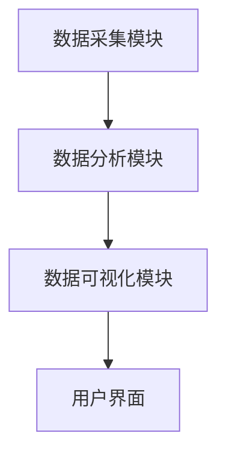

                 


# 企业估值中的市场渗透率分析

> 关键词：市场渗透率、企业估值、市场分析、数据分析、行业竞争、市场预测

> 摘要：市场渗透率是企业在特定市场中所占的份额，是企业估值的重要指标之一。本文将深入分析市场渗透率的计算方法、影响因素，以及其在企业估值中的应用。通过数学模型、系统架构设计和项目实战，帮助读者掌握如何通过市场渗透率分析来评估企业价值。

---

## 第一部分：企业估值中的市场渗透率分析基础

### 第1章：市场渗透率的基本概念

#### 1.1 市场渗透率的定义与背景

市场渗透率（Market Penetration Rate）是企业在特定市场中销售的产品或服务占整个市场总量的比例。它是衡量企业市场地位的重要指标，广泛应用于企业战略制定、投资决策和估值分析中。

**为什么市场渗透率对企业估值重要？**

1. **反映企业的市场地位**：市场渗透率越高，表明企业在市场中占据的份额越大，竞争力越强。
2. **影响企业收入与利润**：高市场渗透率意味着企业能够占据更大的市场份额，从而获得更高的收入和利润。
3. **评估企业成长潜力**：通过分析市场渗透率的变化趋势，可以判断企业未来的增长潜力。

**市场渗透率与其他相关概念的对比**

| 概念               | 定义                                                                 | 与市场渗透率的关系 |
|--------------------|----------------------------------------------------------------------|--------------------|
| 市场占有率         | 企业销售额占整个市场的比例                                           | 与市场渗透率相同，但侧重点不同（市场占有率更强调绝对数值）。 |
| 市场增长潜力       | 市场未来发展的可能性                                                 | 市场渗透率高可能意味着市场增长潜力较低，反之则可能较高。     |
| 行业集中度         | 行业中主要企业的市场份额总和                                         | 高行业集中度通常意味着高市场渗透率。                       |

---

#### 1.2 市场渗透率的计算方法

**市场渗透率的公式与应用**

$$ \text{市场渗透率} = \frac{\text{企业销售额}}{\text{行业市场规模}} \times 100\% $$

- 企业销售额：企业在一定时期内实现的销售额。
- 行业市场规模：整个行业中所有企业的销售额总和。

**市场渗透率的计算步骤**

1. 收集企业销售额和行业市场规模数据。
2. 使用上述公式计算市场渗透率。
3. 对比不同时间段的市场渗透率，分析变化趋势。

**市场渗透率的行业差异性**

不同行业的市场渗透率差异较大。例如：
- 高 tech 行业（如半导体）通常具有较高的市场渗透率。
- 传统行业（如服装制造）市场渗透率相对较低。

---

#### 1.3 市场渗透率的影响因素

**产品生命周期与市场渗透率**

- **导入期**：市场渗透率较低，企业需要加大市场推广。
- **成长期**：市场渗透率逐步上升，企业增长迅速。
- **成熟期**：市场渗透率较高，竞争激烈。
- **衰退期**：市场渗透率可能下降，企业需要转型。

**竞争环境对市场渗透率的影响**

- **高竞争行业**：市场渗透率可能较低，企业需要通过创新提高竞争力。
- **低竞争行业**：市场渗透率可能较高，企业占据主导地位。

**企业战略对市场渗透率的作用**

- **市场扩展战略**：通过并购、合作等方式扩大市场份额。
- **产品创新战略**：通过技术创新吸引更多的消费者。
- **价格竞争战略**：通过降价吸引价格敏感型消费者。

---

### 第2章：市场渗透率分析的核心概念

#### 2.1 市场渗透率的原理与机制

**市场渗透率的基本原理**

市场渗透率反映了企业在市场中的相对地位。通过分析市场渗透率，可以评估企业的市场竞争力和潜在增长空间。

**市场渗透率的驱动因素**

| 因素               | 影响市场渗透率的方式 |
|--------------------|----------------------|
| 产品性能           | 高性能产品可能提高市场渗透率。 |
| 价格               | 合理定价策略有助于提高市场渗透率。 |
| 市场推广力度       | 强大的市场推广可以提升市场渗透率。 |
| 行业竞争格局       | 低竞争环境有助于提高市场渗透率。 |

---

#### 2.2 市场渗透率与企业估值的关系

**市场渗透率对企业价值的影响**

- 高市场渗透率意味着企业具有更强的市场地位，通常会带来更高的估值。
- 低市场渗透率意味着企业具有更大的增长潜力，可能在未来实现更高的估值。

**市场渗透率在企业估值中的应用**

1. **评估企业竞争力**：高市场渗透率表明企业具有较强的竞争力。
2. **预测企业未来收入**：通过分析市场渗透率的变化趋势，预测企业未来的收入增长。
3. **评估投资价值**：高市场渗透率的企业通常具有较高的投资价值。

**市场渗透率与企业成长性评估**

市场渗透率高但增长潜力低的企业可能面临天花板，而市场渗透率低但增长潜力高的企业可能具有更大的投资价值。

---

#### 2.3 市场渗透率的行业特征分析

**不同行业的市场渗透率差异**

- **高科技行业**：市场渗透率较高，技术壁垒高，竞争激烈。
- **传统制造行业**：市场渗透率较低，竞争相对分散。
- **新兴行业**：市场渗透率较低，但增长潜力大。

**行业生命周期与市场渗透率的关系**

- **导入期**：市场渗透率低，企业需要加大市场推广。
- **成长期**：市场渗透率逐步上升，企业增长迅速。
- **成熟期**：市场渗透率高，竞争激烈。
- **衰退期**：市场渗透率下降，企业需要转型。

---

### 第3章：市场渗透率分析的数学模型与公式

#### 3.1 市场渗透率的基本公式

$$ \text{市场渗透率} = \frac{\text{企业销售额}}{\text{行业市场规模}} \times 100\% $$

**企业销售额**：企业在一定时期内实现的销售额。

**行业市场规模**：整个行业中所有企业的销售额总和。

---

#### 3.2 市场渗透率的动态预测模型

**线性回归模型**

$$ y = a + bx + \epsilon $$

- $y$：预测的市场渗透率。
- $x$：自变量（如时间）。
- $a$：截距。
- $b$：回归系数。
- $\epsilon$：误差项。

**市场渗透率预测步骤**

1. 收集历史市场渗透率数据。
2. 确定自变量（如时间）。
3. 使用线性回归模型拟合数据。
4. 预测未来的市场渗透率。

---

#### 3.3 市场渗透率的行业对比分析

**相对市场渗透率公式**

$$ \text{相对市场渗透率} = \frac{\text{企业市场渗透率}}{\text{行业平均市场渗透率}} $$

- 企业市场渗透率：企业在行业中的市场渗透率。
- 行业平均市场渗透率：整个行业所有企业的平均市场渗透率。

---

### 第4章：市场渗透率分析的系统架构与设计

#### 4.1 系统功能设计

**数据采集模块**

- 收集企业销售额和行业市场规模数据。
- 数据来源：企业财务报表、行业报告等。

**数据分析模块**

- 计算市场渗透率。
- 分析市场渗透率的变化趋势。
- 预测未来的市场渗透率。

**数据可视化模块**

- 展示市场渗透率的图表。
- 对比不同企业的市场渗透率。
- 可视化市场渗透率的变化趋势。

---

#### 4.2 系统架构设计



**数据采集模块**：负责收集企业销售额和行业市场规模数据。

**数据分析模块**：负责计算市场渗透率、分析趋势、预测未来市场渗透率。

**数据可视化模块**：负责将分析结果以图表形式展示给用户。

---

#### 4.3 系统接口设计

**数据输入接口**

- 输入企业销售额和行业市场规模数据。
- 数据格式：JSON、CSV等。

**数据处理接口**

- 调用数据分析模块的API进行数据处理。
- 返回市场渗透率计算结果。

**数据输出接口**

- 将分析结果输出为图表或报告。
- 输出格式：HTML、PDF等。

---

## 第5章：市场渗透率分析的项目实战

### 5.1 项目背景与目标

**项目背景**

某高科技企业希望评估其市场渗透率，进而优化企业估值。

**项目目标**

1. 计算企业的市场渗透率。
2. 分析市场渗透率的变化趋势。
3. 预测未来的市场渗透率。

---

### 5.2 项目实施步骤

#### 5.2.1 数据采集

- 收集企业的销售额数据。
- 收集行业市场规模数据。

#### 5.2.2 数据分析

1. 计算市场渗透率：
   $$ \text{市场渗透率} = \frac{\text{企业销售额}}{\text{行业市场规模}} \times 100\% $$
2. 分析市场渗透率的变化趋势。
3. 预测未来的市场渗透率。

---

### 5.3 项目实战代码

```python
import pandas as pd
import numpy as np
import matplotlib.pyplot as plt
from sklearn.linear_model import LinearRegression

# 数据加载
data = pd.DataFrame({
    'year': [2018, 2019, 2020, 2021, 2022],
    'revenue': [100, 150, 200, 250, 300],
    'industry_revenue': [1000, 1200, 1400, 1600, 1800]
})

# 计算市场渗透率
data['market_penetration'] = (data['revenue'] / data['industry_revenue']) * 100

# 绘制市场渗透率变化趋势图
plt.figure(figsize=(10, 6))
plt.plot(data['year'], data['market_penetration'], 'b-')
plt.xlabel('Year')
plt.ylabel('Market Penetration Rate (%)')
plt.title('Market Penetration Rate Trend')
plt.show()

# 使用线性回归预测未来的市场渗透率
X = np.array(data['year']).reshape(-1, 1)
y = np.array(data['market_penetration']).reshape(-1, 1)

model = LinearRegression()
model.fit(X, y)

# 预测未来一年的市场渗透率
future_year = 2023
future_year_np = np.array(future_year).reshape(-1, 1)
predicted_penetration = model.predict(future_year_np)

print(f"预测的{future_year}年的市场渗透率为：{predicted_penetration[0][0]:.2f}%")
```

---

### 5.4 项目总结与优化建议

**项目总结**

通过本项目，我们计算了企业的市场渗透率，分析了其变化趋势，并预测了未来的市场渗透率。结果表明，企业的市场渗透率呈逐年上升趋势，具有较高的投资价值。

**优化建议**

1. **引入更多数据**：如竞争对手的市场渗透率、行业趋势等。
2. **优化预测模型**：如使用更复杂的回归模型或机器学习算法。
3. **定期更新数据**：保持数据的实时性，以更准确地预测市场渗透率。

---

## 第6章：市场渗透率分析的拓展与未来展望

### 6.1 市场渗透率分析的局限性

1. **数据依赖性**：市场渗透率分析依赖于准确的数据，数据缺失或不准确会影响分析结果。
2. **行业差异性**：不同行业的市场渗透率分析方法可能不同。
3. **动态变化**：市场渗透率受多种因素影响，具有动态变化的特点。

---

### 6.2 未来展望

随着大数据和人工智能技术的发展，市场渗透率分析将更加精准和动态。未来，企业可以通过实时数据分析和智能预测模型，更准确地评估市场渗透率，优化企业估值。

---

## 总结

市场渗透率是企业估值的重要指标之一，通过分析市场渗透率，可以评估企业的市场地位、成长潜力和投资价值。本文从市场渗透率的基本概念、计算方法、影响因素、数学模型、系统架构设计和项目实战等多个方面进行了详细分析。未来，随着技术的进步，市场渗透率分析将更加精准和动态，为企业估值提供更有力的支持。

---

**注意事项：**

- 数据分析时需确保数据的准确性和完整性。
- 市场渗透率分析需结合行业特点和企业实际情况。
- 预测模型需定期更新，以适应市场变化。

**拓展阅读：**

- 《企业估值方法与模型》
- 《市场分析与预测》
- 《数据分析与可视化》

