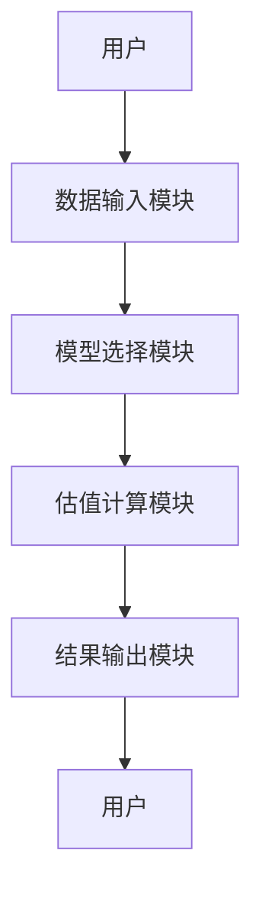
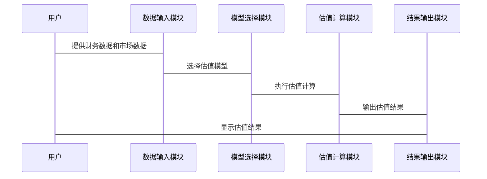

                 


# 企业估值中的常见误区及解决方案

> 关键词：企业估值、误区、解决方案、DCF模型、相对估值法、风险管理

> 摘要：本文从企业估值的基本概念出发，分析常见误区及其对决策的影响，详细探讨了财务指标、市场分析和管理团队等核心要素，通过DCF模型和相对估值法等算法原理，结合系统架构设计和项目实战，提出了系统的解决方案，并总结了最佳实践。

---

# 第一部分: 企业估值的基本概念与背景

## 第1章: 企业估值的基本概念与背景

### 1.1 企业估值的定义与核心要素

#### 1.1.1 企业估值的定义
企业估值是指对企业的整体价值进行评估的过程。企业的价值通常包括其资产、负债、未来现金流以及市场地位等多个方面的综合考量。企业估值是企业决策、投资评估和资本运作的重要基础。

#### 1.1.2 企业估值的核心要素
企业估值的核心要素可以分为以下几类：
- **财务指标**：包括收入、利润、现金流等。
- **市场分析**：包括行业地位、竞争对手分析、市场增长率等。
- **管理团队**：包括团队的经验、能力、稳定性等。

#### 1.1.3 企业估值的常见方法
企业估值的常见方法包括：
1. **现金流贴现模型（DCF模型）**：通过预测企业未来现金流，按照适当的贴现率计算其现值。
2. **相对估值法**：通过与可比企业的比较，利用市盈率、市净率等指标进行估值。
3. **资产基础法**：基于企业资产负债表中的资产和负债进行估值。

---

### 1.2 企业估值的误区背景

#### 1.2.1 估值误区的普遍性
在企业估值过程中，由于信息不完全、市场波动以及人为判断的影响，许多人在估值时容易陷入误区。这些误区可能包括高估、低估或忽视风险。

#### 1.2.2 误区对企业决策的影响
企业估值的误区可能会影响企业的并购决策、融资计划以及投资策略。错误的估值可能导致企业付出过高的并购成本或错失潜在的投资机会。

#### 1.2.3 误区对投资价值的影响
错误的估值可能导致投资者高估或低估企业的实际价值，从而影响投资决策，造成不必要的损失。

---

### 1.3 本章小结

本章从企业估值的基本概念出发，分析了其核心要素和常见方法，并探讨了估值误区的普遍性及其对企业决策和投资价值的影响。

---

# 第二部分: 企业估值的核心概念与联系

## 第2章: 企业估值的核心概念与联系

### 2.1 企业估值的核心概念

#### 2.1.1 财务指标
财务指标是企业估值的重要组成部分，主要包括：
- **收入**：企业的营业收入。
- **利润**：企业的净利润。
- **现金流**：企业的自由现金流。

#### 2.1.2 市场分析
市场分析包括：
- **行业地位**：企业在行业中的地位。
- **竞争对手分析**：竞争对手的优劣势。
- **市场增长率**：行业的增长潜力。

#### 2.1.3 管理团队
管理团队的能力和稳定性对企业的未来表现至关重要。一个优秀的管理团队能够有效应对市场变化，提升企业价值。

---

### 2.2 核心概念的对比分析

#### 2.2.1 财务指标与市场分析的对比
| 财务指标 | 市场分析 |
|----------|----------|
| 收入、利润、现金流 | 行业地位、竞争对手、市场增长率 |
| 客观性高 | 主观性较高 |

#### 2.2.2 管理团队与财务指标的联系
管理团队的能力直接影响企业的财务表现。一个高效的管理团队能够优化企业的财务指标，提升企业价值。

---

### 2.3 实体关系图

#### 2.3.1 企业估值的ER实体关系图

```mermaid
erDiagram
    customer[客户] {
        name : string
        id : integer
    }
    employee[员工] {
        name : string
        id : integer
    }
    valuation[估值] {
        id : integer
        value : integer
        date : date
    }
    customer -|> valuation : 进行估值
    employee -|> valuation : 进行估值
```

---

# 第三部分: 企业估值的算法原理

## 第3章: 企业估值的算法原理

### 3.1 现金流贴现模型（DCF模型）

#### 3.1.1 DCF模型的定义
现金流贴现模型（DCF模型）是一种通过预测企业未来现金流，并将其贴现为现值的方法。DCF模型适用于企业未来现金流能够被合理预测的情况。

#### 3.1.2 DCF模型的计算步骤

1. **预测未来现金流**：根据企业的历史表现和市场环境，预测未来几年的现金流。
2. **选择适当的贴现率**：贴现率通常基于企业的资本成本或市场利率。
3. **计算终值（TV）**：假设企业在第n年后以某个合理的倍数出售，计算终值。
4. **计算现值**：将未来现金流和终值按照贴现率贴现，得到现值。
5. **调整和验证**：根据实际情况调整预测，并验证结果的合理性。

#### 3.1.3 DCF模型的数学公式

$$DCF = \sum_{t=1}^{n} \frac{CF_t}{(1+r)^t} + \frac{TV}{(1+r)^n}$$

其中：
- \(CF_t\)：第t年的现金流
- \(r\)：贴现率
- \(TV\)：终值
- \(n\)：预测年数

---

### 3.2 相对估值法

#### 3.2.1 相对估值法的定义
相对估值法是通过与可比企业的比较，利用市场指标（如市盈率、市净率等）来估算企业价值的方法。

#### 3.2.2 相对估值法的计算步骤

1. **选择可比企业**：选择与目标企业处于同一行业、规模相近的可比企业。
2. **计算可比企业的平均市盈率或市净率**：例如，计算可比企业的平均EV/EBITDA。
3. **应用到目标企业**：将目标企业的EBITDA乘以可比企业的平均EV/EBITDA，得到目标企业的估值。

#### 3.2.3 相对估值法的数学公式

$$EV/EBITDA = \frac{EV}{EBITDA}$$

其中：
- \(EV\)：企业价值
- \(EBITDA\)：息税折旧及摊销前利润

---

## 第4章: 企业估值系统分析与架构设计

### 4.1 系统分析

#### 4.1.1 问题场景介绍
假设我们需要对企业A进行估值，已知企业A的财务数据、行业地位和管理团队信息。

#### 4.1.2 系统功能设计

1. **数据输入**：输入企业的财务数据和市场数据。
2. **模型选择**：选择DCF模型或相对估值法。
3. **计算估值**：根据选择的模型计算企业价值。
4. **结果输出**：输出估值结果。

#### 4.1.3 系统架构设计



#### 4.1.4 系统接口设计

1. **输入接口**：财务数据和市场数据的输入接口。
2. **输出接口**：估值结果的输出接口。

#### 4.1.5 系统交互设计



---

## 第5章: 企业估值项目实战

### 5.1 项目环境安装

#### 5.1.1 环境要求
- 操作系统：Windows、Linux或MacOS
- Python版本：3.6以上
- 开发工具：PyCharm或Jupyter Notebook

#### 5.1.2 工具安装
- 安装Python
- 安装必要的库：numpy、pandas、scipy

---

### 5.2 系统核心实现

#### 5.2.1 数据收集与处理
假设我们正在对一家互联网公司进行估值，首先需要收集其财务数据和市场数据。

#### 5.2.2 估值模型实现

```python
import numpy as np
import pandas as pd

def calculate_dcf(cash_flows, discount_rate, terminal_value):
    # 计算DCF现值
    dcf = 0
    for t in range(len(cash_flows)):
        dcf += cash_flows[t] / (1 + discount_rate) ** t
    dcf += terminal_value / (1 + discount_rate) ** len(cash_flows)
    return dcf

# 示例数据
cash_flows = [100, 150, 200]
discount_rate = 0.1
terminal_value = 500

# 计算DCF
dcf_value = calculate_dcf(cash_flows, discount_rate, terminal_value)
print(f"DCF估值为：{dcf_value}")
```

#### 5.2.3 结果分析
通过上述代码计算DCF估值，可以得出企业的内在价值，并与市场价进行对比，判断是否低估或高估。

---

## 第6章: 最佳实践与总结

### 6.1 误区总结

#### 6.1.1 高估误区
高估误区通常是由于对未来的现金流过于乐观或忽视了潜在风险。

#### 6.1.2 低估误区
低估误区通常是由于对企业的未来增长潜力估计不足或忽视了管理团队的能力。

#### 6.1.3 忽视风险误区
忽视风险误区通常是由于没有充分考虑市场波动、政策变化等外部因素对企业的潜在影响。

---

### 6.2 解决策略

#### 6.2.1 数据驱动决策
通过收集和分析大量的数据，减少人为判断的影响。

#### 6.2.2 多维度分析
综合考虑财务指标、市场分析和管理团队等多方面因素。

#### 6.2.3 风险评估与管理
通过情景分析和压力测试，评估潜在风险并制定应对策略。

---

### 6.3 注意事项

1. **数据的准确性**：确保输入数据的准确性和完整性。
2. **模型的适用性**：根据实际情况选择合适的估值模型。
3. **持续监控**：定期更新数据和模型，以应对市场变化。

---

### 6.4 拓展阅读

1. 《企业价值评估：基于DCF模型的实战指南》
2. 《投资学：从入门到精通》
3. 《风险管理：理论与实践》

---

# 结语

企业估值是一个复杂但重要的过程。通过识别和避免常见误区，结合数据驱动的分析和多维度的评估，我们可以更准确地评估企业价值，做出更明智的决策。希望本文能够为读者在企业估值过程中提供有价值的指导和启示。

