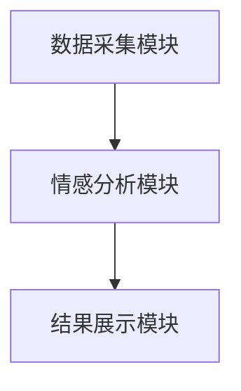

                 


# 企业估值中的情感AI客户服务平台评估

---

## 关键词：
企业估值、情感AI、客户服务平台、情感分析、自然语言处理、机器学习

---

## 摘要：
在企业估值过程中，客户服务平台的价值评估至关重要。本文深入探讨情感AI在客户服务平台中的应用，分析其如何通过情感分析和自然语言处理技术，帮助企业提升客户满意度、优化服务质量，并最终影响企业估值。文章结合实际案例，详细讲解情感AI的算法原理、系统架构和实现方案，为企业提供实用的技术指导和优化建议。

---

## 第1章 情感AI与客户服务平台概述

### 1.1 情感AI的定义与背景
情感AI（Emotion AI）是一种能够识别、理解和分析人类情感的技术，主要通过自然语言处理（NLP）、语音分析和面部识别等手段实现。随着企业对客户体验的重视程度不断提高，情感AI在企业估值中的应用日益广泛。

#### 关键点：
- 情感AI的核心目标是通过技术手段捕捉和分析客户的情感状态。
- 情感AI的应用场景包括客户满意度分析、情感趋势预测和竞争优势分析。

### 1.2 客户服务平台的类型与特点
客户服务平台分为在线客服、呼叫中心和社交媒体客服等多种类型。每种类型都有其独特的特点和挑战。

#### 关键点：
- 在线客服：实时性高，支持多渠道接入。
- 呼叫中心：专业性强，但成本较高。
- 社交媒体客服：传播速度快，但信息复杂性高。

### 1.3 情感AI与客户服务平台的结合
情感AI通过分析客户与客服的互动数据，帮助企业优化服务流程、提高客户满意度，并最终提升企业估值。

#### 关键点：
- 情感AI能够量化客户情感，为企业提供数据支持。
- 情感AI的应用可以显著降低客户流失率，提升客户忠诚度。

---

## 第2章 情感AI的核心原理与技术

### 2.1 情感分析的基本原理
情感分析是情感AI的核心技术之一，主要通过分析文本中的情感倾向来判断客户的情感状态。

#### 关键点：
- 情感分析的流程包括数据预处理、特征提取和情感分类。
- 常见的情感分类算法包括贝叶斯、SVM和随机森林。

### 2.2 自然语言处理（NLP）技术
NLP技术是情感AI的基础，包括分词、词性标注和句法分析等步骤。

#### 关键点：
- NLP技术能够提取文本中的关键信息，为情感分析提供支持。
- 常见的NLP工具包括spaCy和NLTK。

### 2.3 情感AI与客户服务平台的关系
情感AI通过分析客户与客服的互动数据，优化服务流程并提升客户满意度。

#### 关键点：
- 情感AI的应用可以显著降低客户流失率，提升客户忠诚度。
- 情感AI的数据分析结果能够为企业估值提供重要参考。

---

## 第3章 情感AI客户服务平台评估的算法原理与实现

### 3.1 情感分析算法的实现
情感分析算法的实现包括数据预处理、特征提取和情感分类三个步骤。

#### 关键点：
- 数据预处理：包括去除停用词和分词处理。
- 特征提取：包括TF-IDF和Word2Vec。
- 情感分类：包括贝叶斯和SVM。

#### 代码示例：
```python
from sklearn.feature_extraction.text import TfidfVectorizer
from sklearn.svm import SVC

# 数据预处理
corpus = ["I love this product!", "I hate this service!"]

# 特征提取
vectorizer = TfidfVectorizer()
X = vectorizer.fit_transform(corpus)

# 情感分类
model = SVC()
model.fit(X, ["positive", "negative"])

# 预测
test_corpus = ["This is great!"]
test_X = vectorizer.transform(test_corpus)
print(model.predict(test_X))
```

### 3.2 基于机器学习的情感分析模型
基于机器学习的情感分析模型包括训练、测试和优化三个步骤。

#### 关键点：
- 常见的机器学习算法包括SVM和随机森林。
- 模型的优化包括参数调优和交叉验证。

### 3.3 情感分析的深度学习模型
深度学习模型包括卷积神经网络（CNN）和Transformer架构。

#### 关键点：
- CNN模型适用于短文本分类。
- Transformer模型适用于长文本分类。

#### 代码示例：
```python
import tensorflow as tf
from tensorflow.keras import layers

# 定义模型
model = tf.keras.Sequential()
model.add(layers.Embedding(input_dim=10000, output_dim=16))
model.add(layers.Conv1D(filters=16, kernel_size=5, padding="valid", activation="relu"))
model.add(layers.MaxPooling1D(pool_size=4))
model.add(layers.Dense(1, activation="sigmoid"))

# 编译模型
model.compile(optimizer="adam", loss="binary_crossentropy", metrics=["accuracy"])
```

---

## 第4章 情感AI客户服务平台评估的系统架构与实现

### 4.1 系统架构设计
系统架构包括数据采集、情感分析和结果展示三个模块。

#### 关键点：
- 数据采集模块：负责收集客户与客服的互动数据。
- 情感分析模块：负责分析数据并生成情感评分。
- 结果展示模块：负责展示分析结果并提供优化建议。

#### 系统架构图：


### 4.2 系统接口设计
系统接口包括数据接口、分析接口和展示接口。

#### 关键点：
- 数据接口：负责数据的输入和输出。
- 分析接口：负责情感分析的调用和返回。
- 展示接口：负责结果的展示和交互。

### 4.3 系统交互流程
系统交互流程包括数据采集、分析和展示三个步骤。

#### 关键点：
- 数据采集：通过API获取客户与客服的互动数据。
- 情感分析：调用情感分析模型生成情感评分。
- 结果展示：通过可视化工具展示分析结果。

---

## 第5章 情感AI客户服务平台评估的案例分析

### 5.1 案例背景
以某电商平台为例，分析其客户服务平台的情感AI评估过程。

#### 关键点：
- 数据来源：客户评价和客服对话。
- 数据处理：清洗和标注。
- 情感分析：生成情感评分并优化服务流程。

### 5.2 数据分析与结果解读
通过数据分析，发现客户满意度与情感评分的关系。

#### 关键点：
- 情感评分高于阈值的客户满意度较高。
- 情感评分低于阈值的客户满意度较低。

### 5.3 优化建议
根据分析结果，提出优化客户服务平台的具体建议。

#### 关键点：
- 提升客服响应速度。
- 改进服务流程。
- 加强客户情感管理。

---

## 第6章 结论与展望

### 6.1 结论
情感AI在客户服务平台评估中的应用价值显著，能够帮助企业提升客户满意度和优化服务流程。

#### 关键点：
- 情感AI的应用能够显著提升企业估值。
- 情感AI的技术还在不断发展和优化。

### 6.2 展望
未来，情感AI将在企业估值中的应用更加广泛和深入。

#### 关键点：
- 情感AI将与更多技术结合，如区块链和物联网。
- 情感AI的应用将更加智能化和个性化。

---

## 总结

情感AI客户服务平台评估是企业估值中的重要组成部分，通过情感分析和自然语言处理技术，帮助企业优化服务流程、提升客户满意度，并最终提升企业估值。本文详细讲解了情感AI的核心原理、算法实现和系统架构，并通过实际案例分析，为企业提供实用的技术指导和优化建议。未来，随着技术的不断发展，情感AI将在企业估值中的应用更加广泛和深入。

