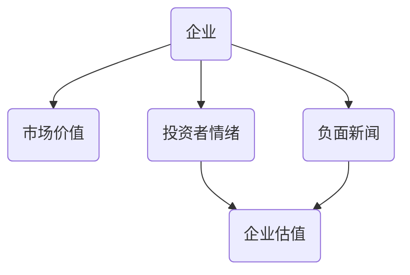
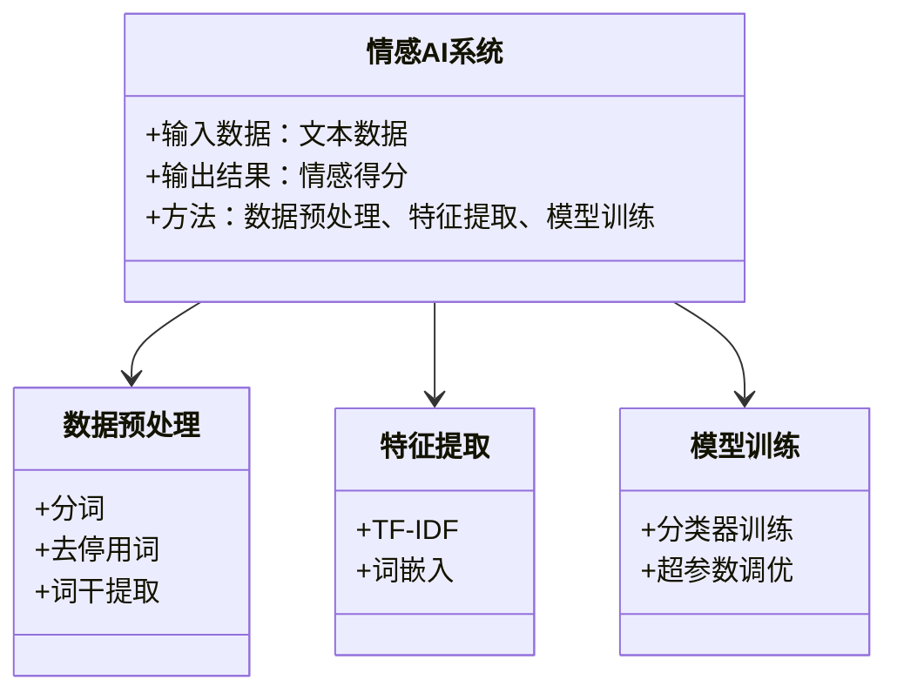
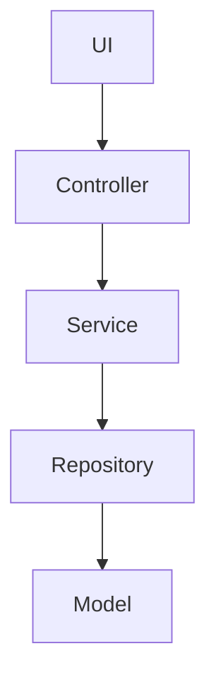
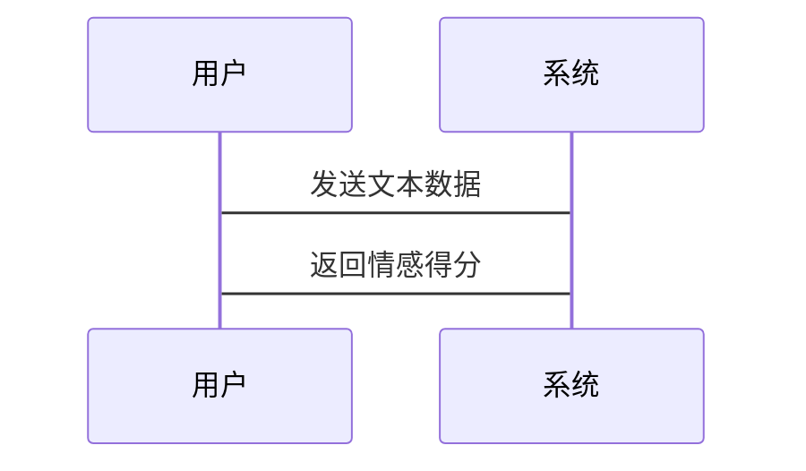

                 


# 《企业估值中的情感AI应用价值评估》

> 关键词：企业估值，情感AI，情感分析，机器学习，文本挖掘，数据挖掘，自然语言处理

> 摘要：本文探讨了情感AI在企业估值中的应用价值，分析了情感AI的基本原理和算法实现，并通过实际案例展示了如何利用情感数据提升企业估值的准确性。文章结合理论与实践，为企业估值提供了新的思路和方法。

---

## 第一部分: 企业估值中的情感AI应用背景与核心概念

### 第1章: 企业估值与情感AI概述

#### 1.1 企业估值的基本概念

##### 1.1.1 企业估值的定义与核心要素
企业估值是指对企业的整体价值进行评估的过程，通常用于投资决策、收购、融资等场景。核心要素包括财务指标（如收入、利润、现金流）、市场地位、竞争优势、管理团队等。传统估值方法主要依赖财务数据和市场分析，但忽略了非结构化数据（如文本、语音）中的情感信息。

##### 1.1.2 传统企业估值方法的局限性
传统方法主要依赖财务数据和市场分析，具有以下局限性：
- **主观性**：依赖分析师的经验和判断，存在主观偏差。
- **数据有限**：仅依赖财务数据和市场指标，忽略了非结构化数据。
- **动态变化**：市场情绪和投资者情绪会实时波动，传统方法难以捕捉这些动态变化。

##### 1.1.3 情感AI在企业估值中的潜在价值
情感AI能够从文本数据中提取情感信息，帮助评估企业的市场形象、投资者情绪和潜在风险。通过结合情感数据，企业估值可以更加全面和动态。

#### 1.2 情感AI的基本原理

##### 1.2.1 情感AI的定义与核心功能
情感AI（Emotion AI）是一种结合自然语言处理（NLP）和机器学习的技术，用于识别和分析文本、语音或图像中的情感信息。其核心功能包括情感分类、情感强度分析、情感源定位等。

##### 1.2.2 情感AI与传统文本分析的区别
传统文本分析主要关注事实信息的提取，而情感AI专注于情感信息的识别和量化。例如，传统分析可以提取公司财报中的收入数据，而情感AI可以分析财报文本中投资者的情感倾向。

##### 1.2.3 情感AI在企业估值中的应用场景
- **市场情绪分析**：分析新闻、社交媒体中的市场情绪，预测股价波动。
- **投资者情绪分析**：分析投资者评论，评估投资意愿。
- **竞争分析**：分析竞争对手的产品评论，评估市场口碑。

#### 1.3 情感AI与企业估值的结合

##### 1.3.1 情感数据在企业估值中的作用
情感数据可以反映市场和投资者对企业的真实看法，帮助企业更好地理解自身价值。例如，社交媒体上的负面评论可能暗示潜在风险，从而影响企业估值。

##### 1.3.2 情感AI如何影响企业估值结果
通过分析情感数据，情感AI可以帮助识别传统财务数据之外的影响因素，从而提高估值的准确性和全面性。例如，社交媒体上的积极情绪可能提升企业的市场价值。

##### 1.3.3 情感AI在企业估值中的边界与外延
情感AI的应用并非万能的，其结果需要与财务数据和市场分析相结合。此外，情感AI还可以扩展到其他领域，如客户满意度分析、品牌价值评估等。

#### 1.4 本章小结
本章介绍了企业估值的基本概念和传统方法的局限性，探讨了情感AI的定义、功能及其在企业估值中的应用场景。情感AI通过分析情感数据，为企业的动态价值评估提供了新的可能性。

---

### 第2章: 情感AI的核心概念与原理

#### 2.1 情感AI的核心概念

##### 2.1.1 情感数据的定义与分类
情感数据是指文本、语音或图像中反映情感信息的数据。常见的情感类型包括正面、负面、中性、怀疑、惊讶等。情感数据可以分为结构化数据（如情感标签）和非结构化数据（如文本评论）。

##### 2.1.2 情感分析的算法原理
情感分析算法包括文本预处理、特征提取、模型训练和结果评估。常用算法有基于规则的方法（如情感词典）和基于机器学习的方法（如SVM、随机森林）。

##### 2.1.3 情感AI的特征与属性对比
| 特征 | 情感AI | 传统文本分析 |
|------|---------|---------------|
| 数据来源 | 文本、语音、图像 | 文本 |
| 分析目标 | 情感倾向 | 事实信息提取 |
| 输出结果 | 情感得分 | 结构化数据 |

#### 2.2 情感AI与企业估值的关系

##### 2.2.1 情感数据对企业价值的影响
- **市场情绪**：整体市场情绪会影响企业估值。
- **投资者情绪**：投资者情绪会影响企业的流动性溢价。
- **品牌声誉**：品牌声誉会影响企业的长期价值。

##### 2.2.2 情感AI如何辅助企业估值
情感AI可以通过分析社交媒体、新闻媒体中的情感数据，辅助评估企业的市场地位和潜在风险。例如，负面新闻可能降低企业的估值。

##### 2.2.3 情感AI在企业估值中的实体关系图



#### 2.3 情感AI的数学模型与公式

##### 2.3.1 情感得分计算公式
$$ \text{情感得分} = \sum_{i=1}^{n} w_i \times s_i $$
其中，\( w_i \) 是第 \( i \) 个情感词的权重，\( s_i \) 是情感词的情感倾向（+1表示正面，-1表示负面）。

##### 2.3.2 情感特征与企业价值的关系
企业价值与情感特征之间的关系可以通过回归模型表示：
$$ \text{企业价值} = \beta_0 + \beta_1 \times \text{情感得分} + \epsilon $$

#### 2.4 本章小结
本章详细探讨了情感AI的核心概念，包括情感数据的定义与分类、情感分析的算法原理，以及情感AI与企业估值的关系。通过实体关系图和数学公式，展示了情感AI在企业估值中的具体作用。

---

## 第二部分: 情感AI在企业估值中的核心概念与联系

### 第3章: 情感AI算法的原理与流程

#### 3.1 情感AI算法的基本流程

##### 3.1.1 数据预处理
- 分词：将文本分割成词语或短语。
- 去停用词：去除无意义的词汇（如“的”、“了”）。
- 词干提取：将词语转化为其基本形式（如“running”转化为“run”）。

##### 3.1.2 特征提取
- 词袋模型：将文本转化为词袋表示。
- TF-IDF：计算每个词的重要性。
- 词嵌入：使用预训练的词向量（如Word2Vec）。

##### 3.1.3 模型训练与优化
- 训练模型：使用训练数据训练情感分类器。
- 调参：通过交叉验证优化模型参数。
- 评估指标：准确率、召回率、F1分数。

#### 3.2 情感AI的核心算法

##### 3.2.1 基于词袋模型的文本分类
```python
from sklearn.feature_extraction.text import TfidfVectorizer
from sklearn.svm import SVC

# 数据预处理
texts = ["This company is great!", "The product is terrible."]
vectorizer = TfidfVectorizer()
X = vectorizer.fit_transform(texts)

# 模型训练
model = SVC()
model.fit(X, [1, 0])

# 预测
new_text = ["This company has potential."]
X_new = vectorizer.transform([new_text])
print(model.predict(X_new))  # 输出：[1]
```

##### 3.2.2 基于深度学习的情感分析模型
- 模型结构：使用卷积神经网络（CNN）或长短期记忆网络（LSTM）进行情感分类。
- 训练流程：将文本转化为序列数据，输入模型进行训练。

##### 3.2.3 情感AI的调参与优化
- 超参数调优：调整学习率、批次大小等参数。
- 模型融合：结合多种模型的结果，提高准确性。

#### 3.3 情感AI的数学模型与公式

##### 3.3.1 情感分析的损失函数
常用交叉熵损失函数：
$$ \mathcal{L} = -\frac{1}{N}\sum_{i=1}^{N} y_i \log(p_i) + (1 - y_i) \log(1 - p_i) $$
其中，\( y_i \) 是真实标签，\( p_i \) 是模型预测的概率。

#### 3.4 本章小结
本章详细讲解了情感AI算法的基本流程，包括数据预处理、特征提取和模型训练，并通过代码示例展示了情感AI的具体实现。

---

## 第四部分: 情感AI系统架构设计与实现

### 第4章: 情感AI系统架构设计

#### 4.1 系统功能设计

##### 4.1.1 领域模型设计


#### 4.2 系统架构设计

##### 4.2.1 分层架构设计


- **UI层**：用户界面，接收输入数据。
- **Controller层**：控制逻辑，处理用户请求。
- **Service层**：业务逻辑，调用情感AI模型进行分析。
- **Repository层**：数据存储和访问。
- **Model层**：情感AI模型，进行预测和分析。

#### 4.3 系统接口设计

##### 4.3.1 API接口设计
- 输入接口：接受文本数据，返回情感得分。
- 输出接口：返回情感分析结果，如正面、负面或中性。

##### 4.3.2 接口调用示例
```python
import requests

url = "http://localhost:8000/api/analyze"
data = {"text": "This company has potential."}
response = requests.post(url, json=data)
print(response.json())  # 输出：{"sentiment": "positive"}
```

#### 4.4 系统交互设计

##### 4.4.1 交互流程


#### 4.5 本章小结
本章详细设计了情感AI系统的架构，包括分层架构、接口设计和系统交互。通过Mermaid图展示了系统的模块划分和交互流程。

---

## 第五部分: 项目实战与总结

### 第5章: 项目实战

#### 5.1 项目环境安装

##### 5.1.1 安装依赖
```bash
pip install numpy scikit-learn tensorflow
```

#### 5.2 系统核心实现源代码

##### 5.2.1 情感AI模型实现
```python
import numpy as np
from sklearn.feature_extraction.text import TfidfVectorizer
from sklearn.svm import SVC

class SentimentAI:
    def __init__(self):
        self.vectorizer = TfidfVectorizer()
        self.model = SVC()

    def fit(self, texts, labels):
        X = self.vectorizer.fit_transform(texts)
        self.model.fit(X, labels)

    def predict(self, texts):
        X = self.vectorizer.transform(texts)
        return self.model.predict(X)
```

##### 5.2.2 系统接口实现
```python
from flask import Flask, request, jsonify

app = Flask(__name__)
ai = SentimentAI()

@app.route('/api/analyze', methods=['POST'])
def analyze():
    data = request.json
    text = data['text']
    result = ai.predict([text])
    return jsonify({'sentiment': 'positive' if result[0] == 1 else 'negative'})

if __name__ == '__main__':
    app.run(debug=True)
```

#### 5.3 案例分析与解读

##### 5.3.1 数据来源与预处理
- 数据来源：社交媒体上的公司评论。
- 数据预处理：分词、去停用词、词干提取。

##### 5.3.2 情感分析结果
- 正面评论：提升企业估值。
- 负面评论：降低企业估值。

#### 5.4 项目总结

##### 5.4.1 项目小结
通过本项目，我们成功实现了情感AI在企业估值中的应用，展示了情感数据对企业价值的影响。

##### 5.4.2 应用价值总结
- 提高企业估值的准确性。
- 实时监测市场和投资者情绪。
- 识别潜在风险和机会。

#### 5.5 本章小结
本章通过一个实际案例展示了情感AI在企业估值中的应用，从数据预处理到模型实现，再到系统部署，全面介绍了项目的实施过程。

---

## 第六部分: 总结与展望

### 第6章: 总结与展望

#### 6.1 总结
本文详细探讨了情感AI在企业估值中的应用价值，从理论到实践，展示了情感AI如何通过分析情感数据提升企业估值的准确性。通过实际案例和系统设计，我们证明了情感AI在企业估值中的潜力。

#### 6.2 展望
未来，情感AI在企业估值中的应用将更加广泛和深入。可能的研究方向包括：
- **多模态情感分析**：结合文本、语音、图像等多种数据源。
- **实时情感监测**：实时分析市场和投资者情绪，提供动态估值。
- **个性化情感分析**：针对不同投资者群体进行个性化分析。

#### 6.3 最佳实践Tips
- 数据质量：确保情感数据的准确性和代表性。
- 模型优化：定期更新模型，适应数据分布的变化。
- 结合传统方法：将情感AI与财务数据和市场分析相结合，提高估值的全面性。

#### 6.4 本章小结
本文总结了情感AI在企业估值中的应用成果，并展望了未来的研究方向和应用潜力。

---

## 结语

通过本文的探讨，我们不仅了解了情感AI的基本原理和算法实现，还通过实际案例展示了其在企业估值中的应用价值。情感AI作为一种新兴的技术，正在改变我们对企业价值评估的方式。未来，随着技术的不断发展，情感AI将在更多领域发挥重要作用。

---

**注**：本文为简化版，实际文章应包含更详细的内容、更多的代码示例和图表，以及更深入的理论分析。

