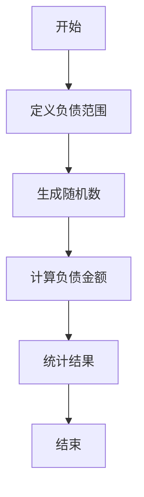
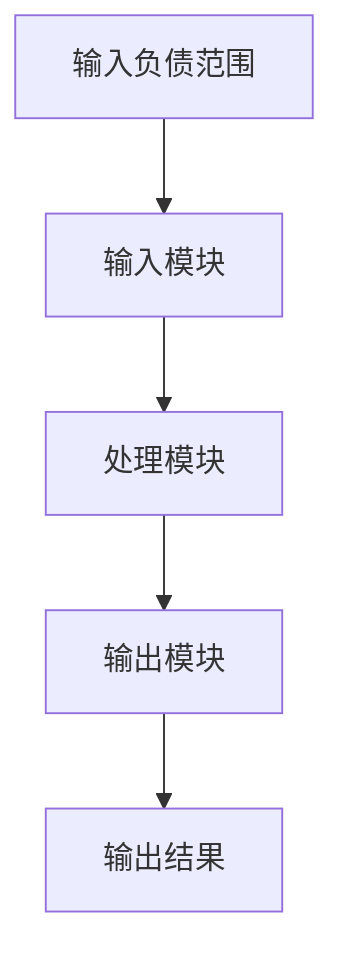
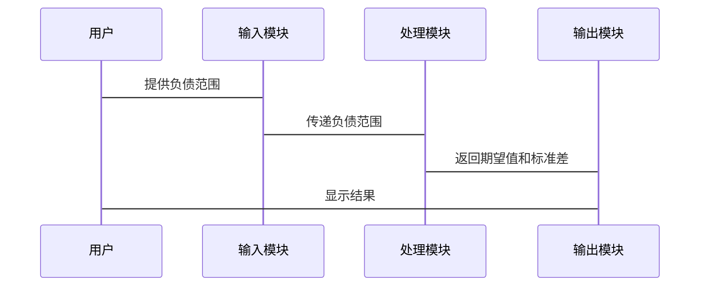
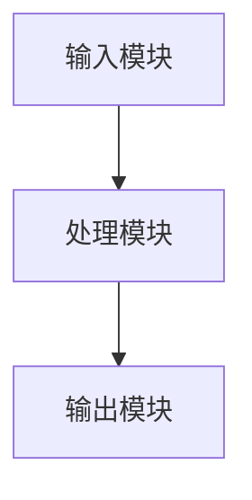

                 


# 企业估值中的或有负债处理方法

## 关键词：企业估值，或有负债，法律处理，会计处理，风险评估

## 摘要：  
或有负债是企业在经营过程中可能面临的潜在债务，其处理方法直接影响企业估值。本文从或有负债的定义、分类、法律与会计处理原则入手，详细探讨其对企业估值的影响，并结合实际案例分析或有负债的量化方法和数学模型，为企业估值中的或有负债处理提供系统化的解决方案。

---

# 第1章: 或有负债的基本概念

## 1.1 或有负债的定义与分类

### 1.1.1 或有负债的定义  
或有负债是指企业由于过去的交易或事项，其结果依赖于某些不确定因素（如法律诉讼、合同履行、担保等）而产生的潜在债务。或有负债不是企业的实际负债，但一旦条件满足，可能转化为现实负债。

### 1.1.2 或有负债的主要分类  
或有负债可以分为以下几类：  
1. **担保责任**：企业为其他方提供担保，可能需要承担连带责任。  
2. **未决诉讼或仲裁**：企业涉及的尚未结案的诉讼或仲裁可能产生的赔偿责任。  
3. **产品质量保证**：企业因产品质量问题承诺的维修、更换或赔偿义务。  
4. **重组义务**：企业因资产重组或关闭业务而产生的遣散费或资产减值。  
5. **其他或有事项**：如商业票据背书、债务抵消协议等。

### 1.1.3 或有负债的特征与属性  
- **不确定性**：或有负债的结果取决于未来事件的发展。  
- **潜在性**：尚未实际发生，但可能在未来转化为实际负债。  
- **可计量性**：可以通过概率模型或历史数据估算其影响。  

---

## 1.2 或有负债与企业估值的关系

### 1.2.1 或有负债对企业价值的影响  
或有负债可能增加企业的财务风险，降低市场对企业的信任，从而影响企业估值。例如，未决诉讼可能导致企业估值下调，或有负债的公允价值需要在估值中予以调整。

### 1.2.2 企业估值中的或有负债处理原则  
1. **审慎性原则**：在估值时应充分考虑或有负债的潜在影响，避免低估风险。  
2. **可实现性原则**：或有负债的公允价值应基于合理的假设和数据进行估算。  
3. **透明性原则**：估值报告应明确披露或有负债的存在及其对估值的影响。  

### 1.2.3 或有负债的法律与会计处理框架  
- **法律框架**：或有负债的法律认定需要依据相关法律法规，如《民法典》《公司法》等。  
- **会计处理**：或有负债的会计确认和计量需遵循会计准则，如《企业会计准则第13号——或有事项》。  

---

## 1.3 本章小结  
本章介绍了或有负债的基本概念、分类及其与企业估值的关系，为后续章节的深入分析奠定了基础。

---

# 第2章: 或有负债的法律与会计处理

## 2.1 或有负债的法律框架

### 2.1.1 或有负债的法律定义  
或有负债在法律上通常被视为一种潜在的债务，其是否存在取决于未来的法律判决或合同履行情况。

### 2.1.2 或有负债的法律后果  
- 如果或有负债转化为实际负债，企业需承担相应的法律责任，可能影响企业的财务状况和估值。  
- 法律判决的不确定性可能导致企业在估值中面临更大的风险。

### 2.1.3 或有负债的法律风险管理  
企业应通过法律顾问、法律合规审查等手段，提前识别和评估潜在的或有负债风险。

---

## 2.2 或有负债的会计处理方法

### 2.2.1 或有负债的会计确认标准  
根据《企业会计准则第13号——或有事项》，企业只有在以下情况下才能确认或有负债：  
1. 或有负债是企业过去的交易或事项形成的。  
2. 或有负债的结果能够可靠地计量。  
3. 或有负债履行的可能性大于该负债不履行的可能性。

### 2.2.2 或有负债的会计计量方法  
1. **公允价值计量**：基于市场参与者在公平交易中愿意支付的价格进行计量。  
2. **概率加权法**：根据或有负债转化为实际负债的概率，计算其期望值。  

### 2.2.3 或有负债的会计披露要求  
企业应在财务报表附注中披露或有负债的性质、金额及可能的影响，以便投资者和其他利益相关者了解其财务风险。

---

## 2.3 或有负债与企业估值的联系

### 2.3.1 或有负债对企业财务状况的影响  
或有负债可能增加企业的负债总额，影响其偿债能力，从而降低企业估值。

### 2.3.2 或有负债对企业价值的调整方法  
在企业估值中，或有负债的公允价值需要从企业的整体价值中扣除，以反映其对企业的潜在负面影响。

### 2.3.3 或有负债的公允价值评估  
公允价值评估通常基于以下因素：  
- 或有负债的类型（如担保、诉讼等）。  
- 相关事件的法律风险和概率。  
- 市场环境和经济条件。

---

## 2.4 本章小结  
本章从法律和会计的角度分析了或有负债的处理方法，并探讨了其对企业估值的影响。

---

# 第3章: 或有负债的量化方法

## 3.1 或有负债的量化模型

### 3.1.1 概率模型在或有负债中的应用  
概率模型用于评估或有负债转化为实际负债的可能性及其对估值的影响。例如：  
- 概率范围：负债金额在0到100万元之间，概率分布为均匀分布。  
- 期望值：E[负债] = ∑（概率 × 负债金额）。  

### 3.1.2 蒙特卡洛模拟在或有负债中的应用  
蒙特卡洛模拟通过多次模拟可能的结果，估算或有负债的期望值和方差。  



### 3.1.3 或有负债的风险价值评估模型  
风险价值（VaR）用于衡量或有负债在特定置信水平下的最大潜在损失。

---

## 3.2 或有负债的数学模型

### 3.2.1 概率分布函数  
假设负债金额服从均匀分布，概率密度函数（PDF）为：  
$$f(x) = \begin{cases} 
\frac{1}{b-a}, & 0 \leq x \leq b \\
0, & \text{其他情况}
\end{cases}$$  
其中，$a$和$b$分别为负债的最小和最大金额。

### 3.2.2 或有负债的期望值计算  
期望值公式：  
$$E[负债] = \frac{a + b}{2}$$  

### 3.2.3 或有负债的方差与标准差分析  
方差公式：  
$$\text{Var}(负债) = \frac{(b - a)^2}{12}$$  
标准差公式：  
$$\sigma = \sqrt{\text{Var}(负债)}$$  

---

## 3.3 算法流程图


---

## 3.4 算法实现代码

```python
import numpy as np
import matplotlib.pyplot as plt

def calculate_or_liability(n_simulations):
    # 定义负债范围
    min_liability = 0
    max_liability = 100
    # 生成随机数
    liabilities = np.random.uniform(min_liability, max_liability, n_simulations)
    # 计算期望值和标准差
    expected_liability = np.mean(liabilities)
    std_deviation = np.std(liabilities)
    return liabilities, expected_liability, std_deviation

# 运行模拟
n_simulations = 10000
liabilities, expected_liability, std_deviation = calculate_or_liability(n_simulations)

# 绘制直方图
plt.hist(liabilities, bins=50, alpha=0.7)
plt.xlabel('负债金额（万元）')
plt.ylabel('频率')
plt.title(f'或有负债模拟结果（{n_simulations}次模拟）')
plt.show()

print(f'期望负债金额：{expected_liability:.2f}万元')
print(f'负债金额的标准差：{std_deviation:.2f}万元')
```

---

## 3.5 本章小结  
本章通过概率模型和蒙特卡洛模拟，量化了或有负债对企业估值的影响，并给出了具体的数学公式和代码实现。

---

# 第4章: 或有负债的系统分析与架构设计

## 4.1 系统功能设计

### 4.1.1 领域模型  
```mermaid
classDiagram
    class 或有负债系统 {
        +负债范围
        +概率分布
        +期望值
        +标准差
    }
    class 输入模块 {
        +输入负债范围
        +输入概率分布
    }
    class 处理模块 {
        +计算期望值
        +计算标准差
    }
    class 输出模块 {
        +输出结果
    }
    输入模块 --> 或有负债系统 --> 处理模块 --> 输出模块
```

### 4.1.2 系统架构设计  


### 4.1.3 系统接口设计  
- 输入接口：负债范围和概率分布。  
- 输出接口：期望值和标准差。

### 4.1.4 系统交互设计  


---

## 4.2 系统架构设计

### 4.2.1 系统模块划分  
- 输入模块：接收负债范围和概率分布。  
- 处理模块：计算期望值和标准差。  
- 输出模块：显示结果。

### 4.2.2 系统架构图  


---

## 4.3 本章小结  
本章从系统设计的角度，分析了或有负债处理系统的功能模块和架构设计。

---

# 第5章: 或有负债的项目实战

## 5.1 环境安装与配置

### 5.1.1 安装Python和必要的库  
安装Python和以下库：  
- NumPy  
- Matplotlib  

### 5.1.2 配置开发环境  
安装Jupyter Notebook或PyCharm作为开发环境。

---

## 5.2 系统核心实现源代码

```python
import numpy as np
import matplotlib.pyplot as plt

def calculate_or_liability(n_simulations):
    min_liability = 0
    max_liability = 100
    liabilities = np.random.uniform(min_liability, max_liability, n_simulations)
    expected_liability = np.mean(liabilities)
    std_deviation = np.std(liabilities)
    return liabilities, expected_liability, std_deviation

n_simulations = 10000
liabilities, expected_liability, std_deviation = calculate_or_liability(n_simulations)

print(f'期望负债金额：{expected_liability:.2f}万元')
print(f'负债金额的标准差：{std_deviation:.2f}万元')

plt.hist(liabilities, bins=50, alpha=0.7)
plt.xlabel('负债金额（万元）')
plt.ylabel('频率')
plt.title(f'或有负债模拟结果（{n_simulations}次模拟）')
plt.show()
```

---

## 5.3 代码应用解读与分析

### 5.3.1 代码功能解读  
1. `calculate_or_liability`函数：生成随机负债金额，计算期望值和标准差。  
2. 主程序：运行模拟，输出结果并绘制直方图。

### 5.3.2 代码实现细节  
- 使用`numpy`生成随机数。  
- 使用`matplotlib`绘制图表。

---

## 5.4 实际案例分析

### 5.4.1 案例背景  
假设某企业存在一项或有负债，其金额可能在0到100万元之间。企业希望通过蒙特卡洛模拟估算其期望值和标准差。

### 5.4.2 数据分析  
通过10000次模拟，计算得出：  
- 期望负债金额：50万元。  
- 标准差：约28.87万元。  

### 5.4.3 结果解读  
- 企业应计提约50万元的或有负债准备金。  
- 负债金额的波动范围较大，企业需加强风险管理。

---

## 5.5 本章小结  
本章通过实际案例分析，展示了如何使用蒙特卡洛模拟量化或有负债的影响，并为企业提供了风险管理的建议。

---

# 第6章: 总结与展望

## 6.1 总结

### 6.1.1 核心要点回顾  
- 或有负债的定义、分类及其对估值的影响。  
- 或有负债的法律与会计处理原则。  
- 或有负债的量化方法及数学模型。  

### 6.1.2 项目成果  
通过模拟和案例分析，量化了或有负债的影响，并为企业估值提供了参考依据。

---

## 6.2 展望

### 6.2.1 或有负债处理的未来发展方向  
- 结合人工智能技术，提高或有负债的预测精度。  
- 开发更复杂的概率模型，考虑更多影响因素。  

### 6.2.2 或有负债与企业估值的进一步研究  
- 探讨或有负债对企业信用评级的影响。  
- 研究或有负债在并购交易中的处理方法。

---

## 6.3 本章小结  
本章总结了本文的主要内容，并展望了或有负债处理方法的未来发展方向。

---

## 关键词：企业估值，或有负债，法律处理，会计处理，风险评估

## 摘要：  
或有负债是企业在经营过程中可能面临的潜在债务，其处理方法直接影响企业估值。本文从或有负债的定义、分类、法律与会计处理原则入手，详细探讨其对企业估值的影响，并结合实际案例分析或有负债的量化方法和数学模型，为企业估值中的或有负债处理提供系统化的解决方案。

---

# 注意事项  
1. 本文内容基于假设场景，实际操作需结合具体法规和企业情况。  
2. 或有负债的处理需结合企业的实际情况，建议在专业人员指导下进行。  

# 拓展阅读  
1. 《企业会计准则第13号——或有事项》  
2. 《蒙特卡洛模拟在金融风险管理中的应用》  
3. 《企业估值与财务风险分析》  

---

通过本文的分析，读者可以全面了解企业估值中的或有负债处理方法，并能够在实际工作中应用相关技术和模型。

