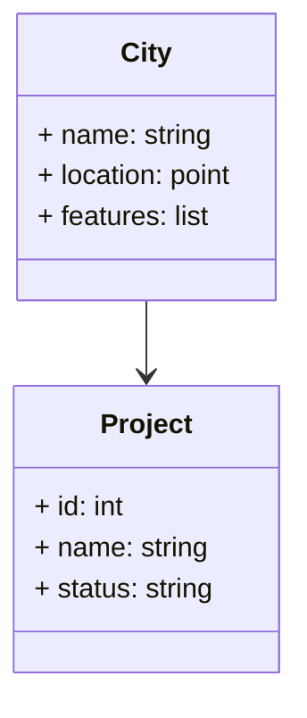
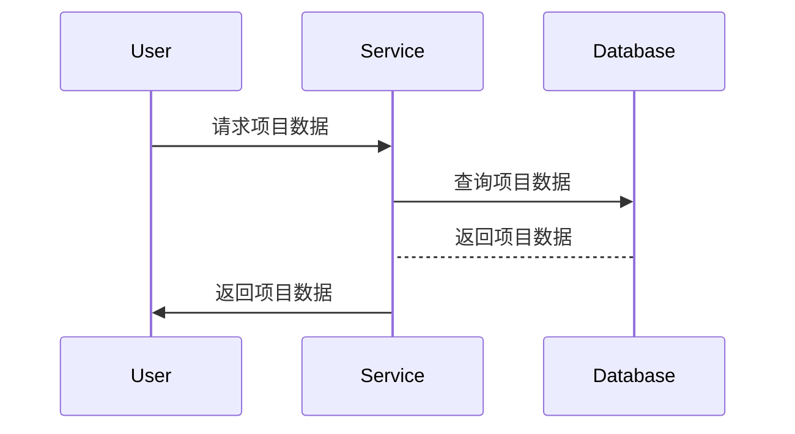

                 


```markdown
# 企业估值中的数字孪生城市项目评估

> 关键词：数字孪生城市，企业估值，项目评估，城市规划，大数据分析

> 摘要：数字孪生城市作为现代城市规划和管理的重要工具，正在改变城市估值的传统方法。本文将详细探讨数字孪生城市项目评估的核心概念、方法和应用，结合实际案例和系统设计，为读者提供深入的分析和见解。

---

# 第1章: 数字孪生城市项目评估的背景与概念

## 1.1 数字孪生城市的定义与特点
### 1.1.1 数字孪生的定义
数字孪生是一种通过数字化技术在虚拟空间中创建物理对象或系统的映射，以实现对其实时监控、分析和优化的技术。数字孪生城市则是将整个城市及其组成部分（如建筑、交通、环境等）在数字空间中进行精确建模和模拟。

### 1.1.2 数字孪生城市的核心特点
- **实时性**：基于实时数据，动态更新数字模型。
- **数据驱动**：依赖于物联网、传感器等实时数据输入。
- **智能化**：利用人工智能技术进行预测和优化。
- **可扩展性**：能够适应城市规模的变化和功能扩展。

### 1.1.3 数字孪生与物理城市的映射关系
数字孪生城市通过数据采集、建模和分析，将物理城市中的各种要素（如交通流量、空气质量、建筑状态等）映射到虚拟模型中，形成一一对应的关系。

---

## 1.2 数字孪生城市的技术基础
### 1.2.1 物联网技术
物联网技术通过传感器和设备收集城市中的实时数据，为数字孪生模型提供基础数据支持。

### 1.2.2 大数据与人工智能
大数据技术用于处理和分析海量城市数据，人工智能技术则用于模型的优化和预测。

### 1.2.3 虚拟现实与增强现实
通过虚拟现实（VR）和增强现实（AR）技术，用户可以在虚拟环境中直观地查看和操作数字孪生模型。

---

## 1.3 数字孪生城市的应用价值
### 1.3.1 城市规划与设计
数字孪生城市可以模拟不同规划方案的效果，帮助城市设计师优化城市布局。

### 1.3.2 城市运营管理
通过实时监控和分析，数字孪生城市可以提高城市运营的效率和响应速度。

### 1.3.3 城市应急响应
在紧急情况下，数字孪生城市可以提供实时数据支持，帮助应急管理部门快速制定和执行救援计划。

---

## 1.4 本章小结
本章介绍了数字孪生城市的定义、特点和技术基础，并探讨了其在城市规划、运营管理和应急响应中的应用价值。

---

# 第2章: 数字孪生城市与企业估值的关系

## 2.1 数字孪生城市对城市估值的影响
### 2.1.1 数字孪生如何提升城市价值
通过优化城市规划和运营，数字孪生城市可以提升城市的经济和社会价值。

### 2.1.2 数字孪生对城市资产评估的贡献
数字孪生技术可以提供更准确的城市资产评估方法，帮助投资者更好地评估城市资产的价值。

---

## 2.2 数字孪生城市项目评估的核心要素
### 2.2.1 项目目标
明确项目的目标，如提高城市交通效率、优化城市资源配置等。

### 2.2.2 项目范围
确定项目的覆盖范围，包括地理范围、功能范围和技术范围。

### 2.2.3 项目成本与收益
评估项目的投入成本和预期收益，确保项目的可行性和经济性。

---

## 2.3 数字孪生城市项目评估的边界与外延
### 2.3.1 项目评估的边界
明确项目评估的范围和限制条件，避免评估范围过广或过窄。

### 2.3.2 项目评估的外延
探讨数字孪生城市项目评估的潜在影响和扩展方向。

---

## 2.4 本章小结
本章分析了数字孪生城市对城市估值的影响，并探讨了项目评估的核心要素和边界。

---

# 第3章: 数字孪生城市项目评估的方法与流程

## 3.1 项目评估的基本方法
### 3.1.1 定性评估
通过专家意见和逻辑分析，对项目进行定性评价。

### 3.1.2 定量评估
基于数据和模型，对项目进行定量分析和评估。

### 3.1.3 综合评估
结合定性和定量评估方法，对项目进行全面评估。

---

## 3.2 数字孪生城市项目评估的流程
### 3.2.1 项目需求分析
明确项目的需求和目标，制定评估计划。

### 3.2.2 数据采集与处理
收集相关数据，进行清洗和预处理，确保数据的准确性和可用性。

### 3.2.3 模型构建与验证
基于数据构建数字孪生模型，并对模型进行验证和优化。

### 3.2.4 结果分析与优化
分析评估结果，提出改进建议和优化方案。

---

## 3.3 项目评估的关键指标
### 3.3.1 技术指标
如模型的精度、响应时间等。

### 3.3.2 经济指标
如项目的投资回报率、成本效益比等。

### 3.3.3社会效益指标
如对城市交通、环境改善等的贡献。

---

## 3.4 本章小结
本章详细介绍了数字孪生城市项目评估的方法和流程，并列出了关键评估指标。

---

# 第4章: 数字孪生城市项目评估的核心概念与联系

## 4.1 核心概念原理
### 4.1.1 数字孪生的实现原理
通过传感器和数据采集技术，将物理世界的数据映射到数字模型中，并通过算法进行实时更新和优化。

### 4.1.2 城市估值的数学模型
基于数字孪生数据，构建城市估值的数学模型，如线性回归模型、神经网络模型等。

---

## 4.2 概念属性特征对比表格
```markdown
| 概念       | 属性         | 特征                       |
|------------|--------------|----------------------------|
| 数字孪生    | 数据驱动     | 实时性                     |
|            | 技术集成     | 可扩展性                   |
| 城市估值    | 经济价值     | 客观性                     |
|            | 社会效益     | 可量化性                   |
```

---

## 4.3 ER实体关系图
```mermaid
er
actor(城市规划师) -->
project(Project) -->
city(City) -->
feature(Feature)
```

---

## 4.4 本章小结
本章通过对比和分析数字孪生与城市估值的核心概念，明确了它们之间的联系和区别。

---

# 第5章: 数字孪生城市项目评估的算法原理

## 5.1 算法原理概述
### 5.1.1 算法选择
根据项目需求选择合适的算法，如回归分析、聚类分析、分类算法等。

### 5.1.2 算法流程
数据预处理、模型训练、模型评估和优化。

---

## 5.2 具体算法实现
### 5.2.1 线性回归模型
```python
import numpy as np
from sklearn.linear_model import LinearRegression

# 示例数据
X = np.array([1, 2, 3, 4, 5]).reshape(-1, 1)
y = np.array([2, 4, 5, 4, 5])

# 模型训练
model = LinearRegression()
model.fit(X, y)

# 预测
print(model.predict([[6]]))
```

### 5.2.2 神经网络模型
```python
import tensorflow as tf
from tensorflow.keras import layers

# 示例数据
X = np.random.rand(100, 784)
y = np.random.randint(2, size=(100, 10))

# 模型构建
model = tf.keras.Sequential([
    layers.Dense(64, activation='relu'),
    layers.Dense(10, activation='softmax')
])

# 编译
model.compile(optimizer='adam', loss='sparse_categorical_crossentropy', metrics=['accuracy'])

# 训练
model.fit(X, y, epochs=5)
```

---

## 5.3 算法优缺点分析
### 5.3.1 线性回归
优点：简单、易于解释；缺点：只能处理线性关系。

### 5.3.2 神经网络
优点：能力强，可以处理复杂非线性关系；缺点：计算复杂，需要大量数据。

---

## 5.4 本章小结
本章通过具体算法的实现和对比，分析了数字孪生城市项目评估中算法选择和优化的关键点。

---

# 第6章: 数字孪生城市项目评估的系统架构设计

## 6.1 系统功能设计
### 6.1.1 领域模型


### 6.1.2 系统架构
```mermaid
rectangle Database {
    City表
    Project表
}
actor User {
    -> Database
    -> Service
}
Service --> Database
```

---

## 6.2 系统接口设计
### 6.2.1 API接口
RESTful API接口设计，如GET /projects，POST /projects。

### 6.2.2 数据接口
传感器数据接口，如MQTT协议。

---

## 6.3 系统交互设计


---

## 6.4 本章小结
本章通过系统架构设计和接口设计，明确了数字孪生城市项目评估系统的实现方案。

---

# 第7章: 数字孪生城市项目评估的项目实战

## 7.1 环境安装
### 7.1.1 开发环境
安装Python、TensorFlow、Kafka等工具。

### 7.1.2 数据库
选择MySQL或MongoDB作为数据存储。

---

## 7.2 核心实现
### 7.2.1 数据采集
使用传感器数据采集接口，如Kafka消费数据。

### 7.2.2 模型构建
基于Keras或TensorFlow构建数字孪生模型。

---

## 7.3 案例分析
### 7.3.1 案例背景
某城市交通优化项目。

### 7.3.2 数据分析
使用线性回归模型预测交通流量。

### 7.3.3 结果解读
模型预测结果与实际数据对比，优化模型参数。

---

## 7.4 本章小结
本章通过实际案例分析，展示了数字孪生城市项目评估的实施过程和结果。

---

# 第8章: 数字孪生城市项目评估的最佳实践

## 8.1 关键点总结
### 8.1.1 数据质量
确保数据的准确性和完整性。

### 8.1.2 模型优化
通过交叉验证和超参数调优提升模型性能。

---

## 8.2 小结
数字孪生城市项目评估需要结合技术与业务，注重数据质量和模型优化。

---

## 8.3 注意事项
- 数据隐私保护
- 模型的可解释性
- 系统的可扩展性

---

## 8.4 拓展阅读
推荐相关书籍和论文，如《数字孪生技术与应用》、《人工智能在城市规划中的应用》。

---

# 第9章: 结论与展望

## 9.1 本文总结
总结全文内容，重申数字孪生城市项目评估的重要性。

## 9.2 未来展望
展望数字孪生技术在城市估值中的进一步应用和发展。

---

# 关键词索引

- 数字孪生城市
- 企业估值
- 项目评估
- 城市规划
- 大数据分析

---

# 参考文献

（此处列出相关书籍、论文和网络资源）

---

# END
```

