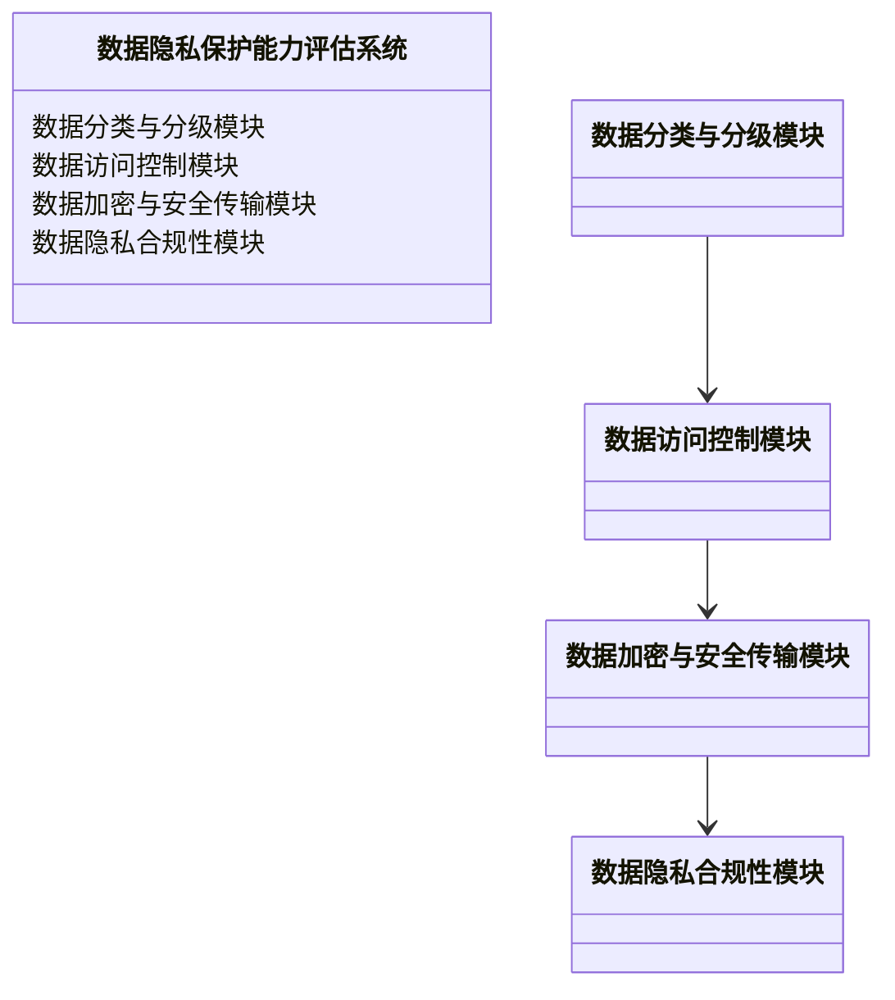
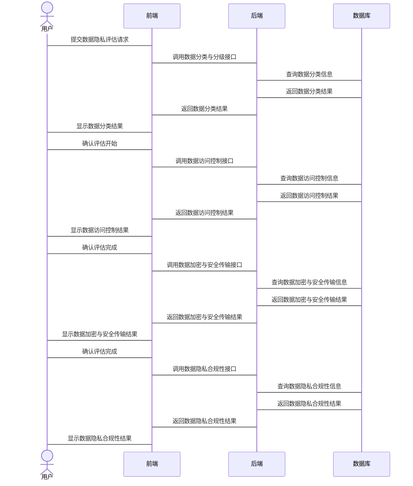

                 


# 企业估值中的数据隐私保护能力评估

> 关键词：企业估值，数据隐私保护，能力评估，数据安全，数据治理

> 摘要：本文深入探讨了数据隐私保护能力评估在企业估值中的重要性。通过分析数据隐私保护的核心概念、算法原理、系统架构设计以及实际项目案例，展示了如何将数据隐私保护能力与企业价值评估相结合，为企业提供更准确的估值依据。

---

## 第一部分: 数据隐私保护能力评估的背景与核心概念

### 第1章: 数据隐私保护能力评估的背景与问题背景

#### 1.1 数据隐私保护的重要性

- **1.1.1 数据隐私保护的定义与内涵**
  - 数据隐私保护是指保护个人或组织的数据不被未经授权的访问、泄露或滥用。
  - 在数字化时代，数据已成为企业的核心资产，数据隐私保护是确保这些资产安全的关键。

- **1.1.2 数据隐私保护的现状与挑战**
  - 随着数据量的激增，数据泄露事件频发，企业面临更大的数据隐私风险。
  - 各国法规如GDPR、CCPA等对企业数据隐私保护提出更高的要求。

- **1.1.3 企业估值与数据隐私保护能力评估的关联性**
  - 数据隐私保护能力是企业信用和市场价值的重要组成部分。
  - 良好的数据隐私保护能力可以提升企业形象，增强投资者信心。

#### 1.2 数据隐私保护能力评估的必要性

- **1.2.1 数据隐私保护能力评估的定义**
  - 对企业数据隐私保护能力的系统性测量和评价。

- **1.2.2 企业估值中数据隐私保护能力评估的意义**
  - 评估企业的数据风险管理能力。
  - 为投资者提供决策依据。

- **1.2.3 数据隐私保护能力评估的边界与外延**
  - 仅关注数据隐私保护，不涉及其他安全领域。
  - 包括数据分类、访问控制、加密等多个方面。

#### 1.3 数据隐私保护能力评估的核心要素

- **1.3.1 数据分类与分级**
  - 根据数据的重要性进行分类，制定不同的保护策略。

- **1.3.2 数据访问控制**
  - 确保只有授权人员可以访问敏感数据。

- **1.3.3 数据加密与安全传输**
  - 使用加密技术保护数据在传输过程中的安全性。

- **1.3.4 数据隐私合规性**
  - 确保企业数据处理符合相关法律法规。

### 第2章: 数据隐私保护能力评估的核心概念与联系

#### 2.1 数据隐私保护能力评估的核心原理

- **2.1.1 数据隐私保护能力评估的理论基础**
  - 基于风险管理理论，评估数据隐私保护能力的强弱。

- **2.1.2 数据隐私保护能力评估的关键技术**
  - 数据分类、加密、访问控制等技术。

- **2.1.3 数据隐私保护能力评估的数学模型**
  - 采用加权评分法，将各要素的影响程度量化。

#### 2.2 数据隐私保护能力评估的核心概念对比

- **2.2.1 数据隐私保护能力与数据安全能力的对比**
  - 数据隐私保护更关注数据的机密性，数据安全更关注整体安全性。

- **2.2.2 数据隐私保护能力与数据治理能力的对比**
  - 数据治理更广泛，包括数据质量管理、数据生命周期管理。

- **2.2.3 数据隐私保护能力与企业估值的关联性**
  - 数据隐私保护能力是影响企业估值的重要因素。

#### 2.3 数据隐私保护能力评估的ER实体关系图

```mermaid
er
  actor: 企业
  actor: 评估机构
  actor: 数据提供者
  actor: 数据消费者
  entity: 数据隐私保护能力
  entity: 数据分类与分级
  entity: 数据访问控制
  entity: 数据加密与安全传输
  entity: 数据隐私合规性
  relation: 企业 -> 数据隐私保护能力
  relation: 数据隐私保护能力 -> 数据分类与分级
  relation: 数据分类与分级 -> 数据访问控制
  relation: 数据访问控制 -> 数据加密与安全传输
  relation: 数据加密与安全传输 -> 数据隐私合规性
```

### 第3章: 数据隐私保护能力评估的算法原理

#### 3.1 数据隐私保护能力评估模型的构建

- **3.1.1 数据预处理与特征提取**
  - 对数据进行清洗、归一化处理，提取关键特征。

- **3.1.2 数据隐私保护能力评估模型的训练**
  - 使用机器学习算法（如随机森林、神经网络）进行训练。

- **3.1.3 数据隐私保护能力评估模型的验证**
  - 通过交叉验证评估模型的准确性和稳定性。

#### 3.2 数据隐私保护能力评估的数学模型

- **3.2.1 数据隐私保护能力评估的线性回归模型**
  $$ y = \beta_0 + \beta_1x_1 + \beta_2x_2 + ... + \beta_nx_n + \epsilon $$

- **3.2.2 基于决策树的评估模型**
  ```mermaid
  graph LR
    A[数据分类] --> B[数据访问控制]
    B --> C[数据加密]
    C --> D[数据隐私合规性]
    D --> E[数据隐私保护能力]
  ```

## 第二部分: 数据隐私保护能力评估的系统架构与实现

### 第4章: 系统架构设计

#### 4.1 问题场景介绍

- 企业需要评估自身数据隐私保护能力，以便在估值中体现其价值。

#### 4.2 项目介绍

- 开发一个数据隐私保护能力评估系统，帮助企业在估值中准确评估自身数据隐私保护能力。

#### 4.3 系统功能设计（领域模型）



#### 4.4 系统架构设计


#### 4.5 系统接口设计

- 接口1：数据分类与分级接口
- 接口2：数据访问控制接口
- 接口3：数据加密与安全传输接口
- 接口4：数据隐私合规性接口

#### 4.6 系统交互设计



### 第5章: 项目实战

#### 5.1 环境安装

- 安装Python、Jupyter Notebook、Pandas、Scikit-learn等工具。

#### 5.2 系统核心实现源代码

```python
import pandas as pd
from sklearn.model_selection import train_test_split
from sklearn.ensemble import RandomForestClassifier
from sklearn.metrics import accuracy_score

# 数据预处理
data = pd.read_csv('data.csv')
X = data.drop('label', axis=1)
y = data['label']

# 划分训练集和测试集
X_train, X_test, y_train, y_test = train_test_split(X, y, test_size=0.2)

# 训练模型
model = RandomForestClassifier()
model.fit(X_train, y_train)

# 预测与评估
y_pred = model.predict(X_test)
print("准确率:", accuracy_score(y_test, y_pred))
```

#### 5.3 代码应用解读与分析

- **数据预处理**：对数据进行清洗和特征提取。
- **模型训练**：使用随机森林算法训练数据隐私保护能力评估模型。
- **模型评估**：通过准确率评估模型的性能。

#### 5.4 实际案例分析

- **案例背景**：某互联网公司需要评估其数据隐私保护能力。
- **数据准备**：收集公司数据分类、访问控制、加密等信息。
- **模型训练**：使用收集的数据训练评估模型。
- **结果分析**：根据模型输出的结果，评估公司的数据隐私保护能力。

#### 5.5 项目小结

- 数据隐私保护能力评估模型能够有效帮助企业量化其数据隐私保护能力。
- 企业可以根据评估结果优化其数据隐私保护策略。

### 第6章: 数据隐私保护能力评估的最佳实践

#### 6.1 小结

- 数据隐私保护能力评估是企业估值的重要组成部分。
- 通过科学的评估方法和工具，企业可以更好地管理数据隐私风险。

#### 6.2 注意事项

- 确保数据隐私保护能力评估的准确性和全面性。
- 定期更新评估模型和策略，以应对新的数据隐私威胁。

#### 6.3 拓展阅读

- 建议阅读《数据隐私保护：从理论到实践》、《企业估值中的数据治理》等书籍，深入了解数据隐私保护和企业估值的相关知识。

---

## 结语

数据隐私保护能力评估是企业在数字化时代中不可或缺的能力。通过本文的系统讲解，读者可以深入了解数据隐私保护能力评估的核心概念、算法原理、系统架构设计以及实际项目案例。希望本文能为企业在数据隐私保护和估值方面提供有价值的参考和指导。

