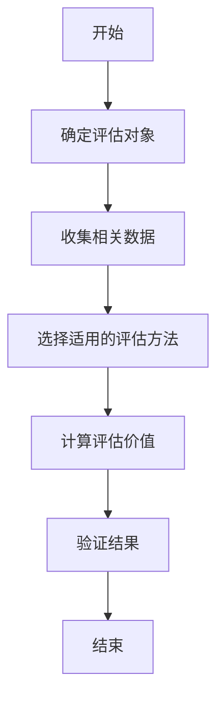
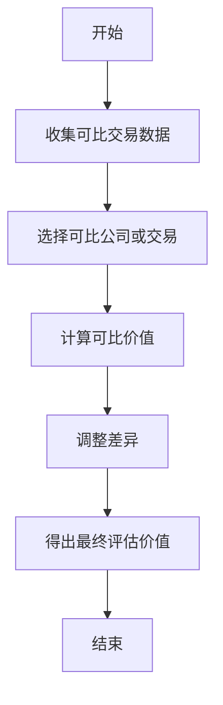
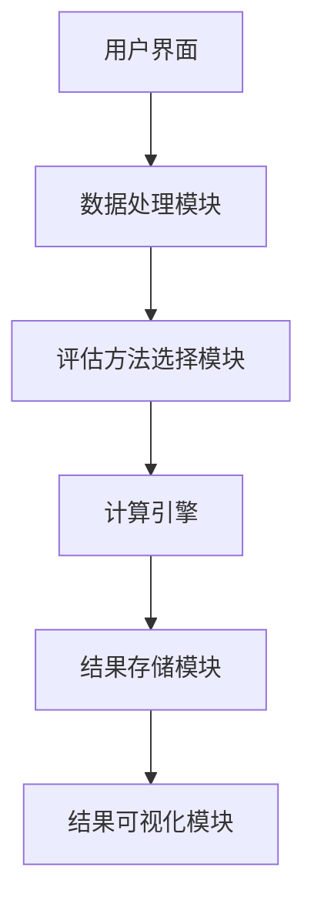

                 


# 企业估值中的无形资产评估

> 关键词：企业估值，无形资产评估，收益法，市场法，成本法

> 摘要：本文深入探讨了企业估值中的无形资产评估方法，从背景、概念、算法原理到系统设计和项目实战，全面分析了无形资产评估的关键步骤和应用。通过具体的案例分析和数学模型的建立，帮助读者理解如何在实际中应用这些方法。

---

## 第1章: 无形资产评估的背景与概念

### 1.1 无形资产评估的背景

随着企业竞争的加剧，无形资产在企业价值中的占比越来越高。无形资产包括专利、商标、商誉等，它们不仅影响企业的市场地位，还直接影响企业的盈利能力。传统的估值方法主要关注有形资产，但随着知识经济的发展，无形资产的重要性日益凸显，因此对无形资产进行科学评估变得尤为重要。

### 1.2 无形资产的定义与分类

无形资产是指企业拥有或控制的没有实物形态的资产，通常包括以下几类：

- **专利权**：技术专利的价值评估。
- **商标权**：品牌价值的评估。
- **商誉**：企业整体价值超出有形资产的部分。
- **非专利技术**：独特的技术或工艺的评估。

### 1.3 无形资产评估的核心问题

- **如何确定无形资产的经济价值？**
- **如何选择合适的评估方法？**
- **如何量化无形资产对收益的贡献？**

---

## 第2章: 无形资产评估的核心概念与联系

### 2.1 无形资产评估的核心概念

无形资产评估的核心在于量化其对收益的贡献。例如，一个专利的价值不仅取决于其技术先进性，还取决于其市场应用前景和盈利能力。评估时需要考虑市场风险、行业竞争和经济周期等因素。

### 2.2 无形资产的属性特征对比

通过对比分析，我们可以更清晰地理解不同无形资产的评估方法。例如，商标权的评估可能更依赖于品牌知名度和市场占有率，而专利权的评估则更关注技术的商业应用价值。

### 2.3 ER实体关系图

```mermaid
er
    entity 无形资产 {
        id: string
        名称: string
        类型: string
        评估价值: number
        所有权状态: string
    }
    entity 评估方法 {
        id: string
        名称: string
        适用范围: string
        计算公式: string
    }
    entity 评估结果 {
        id: string
        名称: string
        评估价值: number
        评估日期: date
    }
```

---

## 第3章: 无形资产评估的算法原理

### 3.1 收益法的原理与流程

收益法通过预测未来收益，折现到现值来评估资产价值。具体步骤如下：



### 3.2 收益法的数学模型

收益法的核心公式为：

$$ 评估价值 = \sum_{t=1}^{n} \frac{未来收益_t}{(1 + r)^t} $$

其中，\( r \) 是折现率，\( t \) 是时间单位。

### 3.3 市场法的原理与流程

市场法通过比较类似资产的交易价格来评估目标资产。流程如下：



---

## 第4章: 无形资产评估的系统分析与架构设计

### 4.1 系统功能设计

系统需要实现以下功能：

- 数据收集与处理
- 评估方法选择
- 评估结果计算
- 结果可视化

### 4.2 系统架构设计



### 4.3 接口设计

- 数据输入接口：接收无形资产的基本信息和相关数据。
- 评估方法选择接口：用户选择适合的评估方法。
- 结果输出接口：显示评估结果。

---

## 第5章: 无形资产评估的项目实战

### 5.1 案例分析

假设我们评估一家科技公司的专利价值。首先收集专利相关信息，选择收益法进行评估，计算其未来收益并折现。

### 5.2 代码实现

```python
def calculate_intrinsic_value(revenue, growth_rate, discount_rate):
    value = 0
    for t in range(1, 5):
        future_revenue = revenue * (1 + growth_rate)**t
        present_value = future_revenue / (1 + discount_rate)**t
        value += present_value
    return value

revenue = 1000000
growth_rate = 0.1
discount_rate = 0.05
print(calculate_intrinsic_value(revenue, growth_rate, discount_rate))
```

---

## 总结

无形资产评估是企业估值中的重要部分，涉及复杂的分析和计算。通过本文的介绍，读者可以系统地了解无形资产评估的方法和流程，并通过实际案例和代码实现进一步掌握相关技能。未来，随着技术的发展，无形资产评估将更加精准和高效。

---

### Tips

- 在选择评估方法时，需结合具体资产的特点和市场环境。
- 评估结果需定期更新，以反映市场变化和企业经营状况。
- 进一步学习可以阅读相关专业书籍和文献，掌握更多高级评估技巧。

---

通过本文的详细讲解，读者可以全面理解企业估值中的无形资产评估，并在实际工作中灵活应用这些方法。

