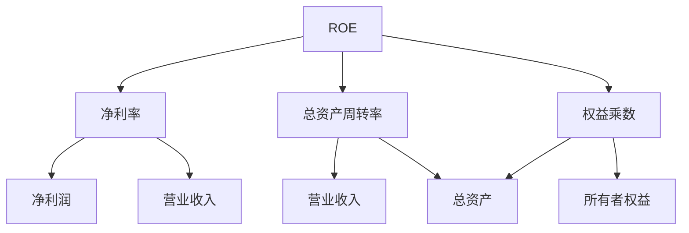
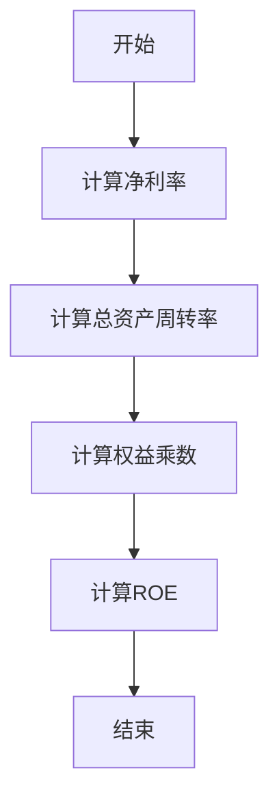
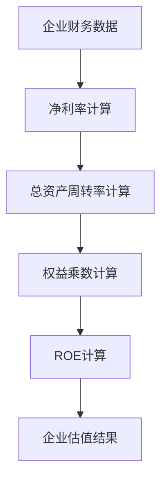

                 


# 《企业估值中的杜邦分析法》

> 关键词：企业估值、杜邦分析法、财务指标、净资产收益率、资产周转率

> 摘要：本文深入探讨杜邦分析法在企业估值中的应用，分析其核心概念、算法原理和实际案例，帮助读者理解如何通过分解财务指标来评估企业价值。

---

## 第一部分: 杜邦分析法的背景与基础

### 第1章: 杜邦分析法的起源与发展

#### 1.1 杜邦分析法的起源
杜邦分析法是由美国杜邦公司于1924年提出的一种财务分析方法。它的核心目标是通过分解净资产收益率（ROE）来评估企业的盈利能力。杜邦分析法的提出基于以下背景：

- **背景分析**：当时的企业财务管理主要关注整体利润，但缺乏对利润来源的具体分析。杜邦分析法的出现填补了这一空白，使管理者能够从资产使用效率、负债结构和盈利能力等多个维度分析企业绩效。
- **核心思想**：杜邦分析法认为，企业的盈利能力不仅取决于净利润，还与资产周转率、负债水平等因素密切相关。通过分解ROE，可以识别企业财务中的优势和劣势。

#### 1.2 杜邦分析法的基本概念
杜邦分析法的核心是将ROE分解为三个关键因素：净利率（Net Profit Margin）、总资产周转率（Total Asset Turnover）和权益乘数（Equity Multiplier）。这三个因素相互作用，共同决定了企业的整体盈利能力。

- **ROE（净资产收益率）**：衡量企业每单位股东权益创造的净利润。
- **净利率（Net Profit Margin）**：净利润与营业收入的比率，反映企业的销售利润能力。
- **总资产周转率（Total Asset Turnover）**：营业收入与平均总资产的比率，衡量企业资产的使用效率。
- **权益乘数（Equity Multiplier）**：平均总资产与平均股东权益的比率，反映企业的杠杆效应。

#### 1.3 杜邦分析法在企业估值中的作用
杜邦分析法在企业估值中的作用主要体现在以下几个方面：

- **分析企业盈利能力**：通过分解ROE，可以识别企业盈利的关键驱动因素。
- **评估资产使用效率**：总资产周转率的分析可以帮助企业发现资产闲置或过度使用的状况。
- **衡量杠杆效应**：权益乘数的分析可以揭示企业的负债水平对净资产收益率的影响。

#### 1.4 杜邦分析法与其他分析方法的区别
杜邦分析法与其他财务分析方法相比，有以下主要区别：

- **与传统财务分析的区别**：传统财务分析通常关注整体财务指标，而杜邦分析法则通过分解ROE来深入分析企业的盈利能力。
- **与价值链分析的区别**：价值链分析侧重于企业内部流程和价值创造，而杜邦分析法则更关注财务指标的分解和相互关系。
- **与KPI分析的区别**：KPI分析通常基于特定的绩效指标，而杜邦分析法则通过财务指标的分解来全面评估企业绩效。

### 第2章: 杜邦分析法的核心概念与联系

#### 2.1 杜邦分析法的核心概念
杜邦分析法的核心概念包括以下几个方面：

- **净利率（Net Profit Margin）**：净利润与营业收入的比率，反映企业的销售利润能力。
- **总资产周转率（Total Asset Turnover）**：营业收入与平均总资产的比率，衡量企业资产的使用效率。
- **权益乘数（Equity Multiplier）**：平均总资产与平均股东权益的比率，反映企业的杠杆效应。

#### 2.2 杜邦分析法的核心公式
杜邦分析法的核心公式是：

$$ROE = 净利率 \times 总资产周转率 \times 权益乘数$$

其中：
- 净利率 = 净利润 / 营业收入
- 总资产周转率 = 营业收入 / 平均总资产
- 权益乘数 = 平均总资产 / 平均所有者权益

#### 2.3 杜邦分析法的指标对比
以下是杜邦分析法中几个关键指标的对比分析：

| 指标 | 定义 | 作用 | 示例 |
|------|------|------|------|
| 净利率 | 净利润 / 营业收入 | 衡量企业销售利润能力 | 高净利率表明企业盈利能力强 |
| 总资产周转率 | 营业收入 / 平均总资产 | 衡量企业资产使用效率 | 高周转率表明资产利用效率高 |
| 权益乘数 | 平均总资产 / 平均所有者权益 | 衡量企业杠杆效应 | 高乘数表明企业负债较高 |

#### 2.4 杜邦分析法的实体关系图
以下是杜邦分析法的实体关系图：



---

## 第三部分: 杜邦分析法的算法原理

### 第3章: 杜邦分析法的算法流程

#### 3.1 杜邦分析法的算法流程
杜邦分析法的算法流程如下：

1. **计算净利率**：净利润 / 营业收入
2. **计算总资产周转率**：营业收入 / 平均总资产
3. **计算权益乘数**：平均总资产 / 平均所有者权益
4. **计算ROE**：净利率 × 总资产周转率 × 权益乘数

以下是杜邦分析法的算法流程图：



#### 3.2 杜邦分析法的数学模型
杜邦分析法的数学模型可以表示为：

$$ROE = \left(\frac{\text{净利润}}{\text{营业收入}}\right) \times \left(\frac{\text{营业收入}}{\text{平均总资产}}\right) \times \left(\frac{\text{平均总资产}}{\text{平均所有者权益}}\right)$$

简化为：

$$ROE = \text{净利率} \times \text{总资产周转率} \times \text{权益乘数}$$

#### 3.3 杜邦分析法的代码实现
以下是杜邦分析法的Python代码实现：

```python
# 输入数据
net_profit = 100  # 净利润
revenue = 500     # 营业收入
total_assets = 1000  # 平均总资产
equity = 500          # 平均所有者权益

# 计算净利率
net_margin = net_profit / revenue

# 计算总资产周转率
tato = revenue / total_assets

# 计算权益乘数
equity_multiplier = total_assets / equity

# 计算ROE
roe = net_margin * tato * equity_multiplier

print(f"净利率: {net_margin}")
print(f"总资产周转率: {tato}")
print(f"权益乘数: {equity_multiplier}")
print(f"ROE: {roe}")
```

#### 3.4 杜邦分析法的案例分析
以下是一个杜邦分析法的实际案例：

假设某公司2023年的财务数据如下：
- 净利润：100万元
- 营业收入：500万元
- 平均总资产：1000万元
- 平均所有者权益：500万元

根据上述数据，计算ROE：

$$ROE = \left(\frac{100}{500}\right) \times \left(\frac{500}{1000}\right) \times \left(\frac{1000}{500}\right) = 1\% \times 0.5 \times 2 = 1\%$$

---

## 第四部分: 杜邦分析法在企业估值中的应用

### 第4章: 杜邦分析法的实际应用

#### 4.1 杜邦分析法的企业估值场景
杜邦分析法在企业估值中的应用场景包括：
- **评估企业盈利能力**：通过分解ROE，识别企业盈利的关键驱动因素。
- **分析资产使用效率**：通过总资产周转率，发现资产闲置或过度使用的问题。
- **衡量杠杆效应**：通过权益乘数，评估企业的负债水平对净资产收益率的影响。

#### 4.2 杜邦分析法的系统设计
以下是杜邦分析法的系统设计图：



#### 4.3 杜邦分析法的项目实战
以下是杜邦分析法的项目实战：

1. **环境安装**：
   - 安装Python和相关库（如pandas、numpy）。
2. **核心代码实现**：
   ```python
   import pandas as pd

   # 输入数据
   data = {
       '净利润': [100],
       '营业收入': [500],
       '平均总资产': [1000],
       '平均所有者权益': [500]
   }
   df = pd.DataFrame(data)

   # 计算净利率
   df['净利率'] = df['净利润'] / df['营业收入']

   # 计算总资产周转率
   df['总资产周转率'] = df['营业收入'] / df['平均总资产']

   # 计算权益乘数
   df['权益乘数'] = df['平均总资产'] / df['平均所有者权益']

   # 计算ROE
   df['ROE'] = df['净利率'] * df['总资产周转率'] * df['权益乘数']

   print(df)
   ```

3. **案例分析**：
   以某公司为例，分析其杜邦分析结果，并根据结果提出改进建议。

#### 4.4 杜邦分析法的最佳实践
- **定期更新数据**：企业财务数据会随时间变化，需要定期更新并重新计算。
- **结合其他分析方法**：杜邦分析法可以与其他分析方法（如价值链分析、KPI分析）结合使用，以全面评估企业绩效。
- **注意数据质量**：确保输入数据的准确性和完整性，避免因数据错误导致分析结果偏差。

---

## 第五部分: 总结与展望

### 第5章: 杜邦分析法的总结与展望

#### 5.1 本章小结
杜邦分析法是一种有效的财务分析方法，通过分解ROE，可以深入分析企业的盈利能力、资产使用效率和杠杆效应。本文详细介绍了杜邦分析法的核心概念、算法原理和实际应用，并通过案例分析展示了其在企业估值中的具体应用。

#### 5.2 未来展望
杜邦分析法在企业估值中的应用前景广阔，未来可以通过以下方式进一步优化和扩展：

- **结合人工智能技术**：利用机器学习算法对杜邦分析法的结果进行预测和优化。
- **多维度分析**：结合其他分析方法，如价值链分析和KPI分析，构建更加全面的企业估值模型。
- **实时监控**：通过实时数据分析，帮助企业及时发现和解决财务问题。

---

## 附录: 杜邦分析法的拓展阅读

### 附录A: 杜邦分析法的数学推导
杜邦分析法的数学推导如下：

$$ROE = \frac{\text{净利润}}{\text{平均所有者权益}} = \left(\frac{\text{净利润}}{\text{营业收入}}\right) \times \left(\frac{\text{营业收入}}{\text{平均总资产}}\right) \times \left(\frac{\text{平均总资产}}{\text{平均所有者权益}}\right)$$

### 附录B: 杜邦分析法的局限性
杜邦分析法的局限性包括：
- **数据依赖性**：分析结果依赖于准确的财务数据。
- **假设限制**：假设企业的财务数据稳定，不考虑市场波动等因素。
- **单一维度**：仅关注财务指标，忽略非财务因素对企业价值的影响。

---

通过本文的详细讲解，读者可以深入理解杜邦分析法在企业估值中的应用，并能够在实际工作中灵活运用这一方法。

