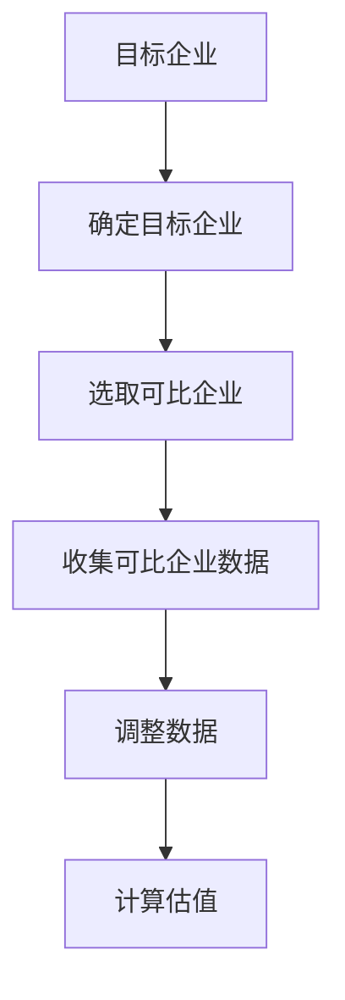

                 


# 企业估值中的比较法：优势与局限

## 关键词
企业估值，比较法，可比企业，交易案例，调整值，数学模型

## 摘要
比较法是企业估值中的一种重要方法，通过分析可比企业或交易案例的数据，来估计目标企业的价值。本文系统地探讨了比较法的核心概念、算法原理、数学模型及其在实际应用中的优势与局限。文章首先介绍了比较法的基本理论，然后详细分析了其在不同企业类型和估值场景中的应用，接着通过案例展示了比较法的实际操作过程，并深入探讨了其局限性及改进建议。最后，本文总结了比较法在企业估值中的重要性，并展望了未来的研究方向。

---

# 目录

## 第1章: 比较法的背景与概念

### 1.1 比较法的定义与核心概念
#### 1.1.1 比较法的基本定义
比较法是一种基于市场数据的估值方法，通过分析可比企业的市场交易数据或财务数据，推导目标企业的价值。

#### 1.1.2 比较法在企业估值中的核心要素
- **可比性**: 选取与目标企业具有相似业务模式、规模、行业地位的可比企业。
- **交易数据**: 利用近期的市场交易案例数据进行调整。
- **调整因素**: 考虑企业间的差异，如财务状况、管理团队、市场风险等。

#### 1.1.3 比较法与其他估值方法的区别
- **相对估值法**: 基于市场数据进行推导，与绝对估值法（如DCF模型）形成对比。
- **应用场景**: 更适用于市场流动性较高、可比企业较多的情况。

### 1.2 比较法的理论基础
#### 1.2.1 市场比较法的基本原理
市场比较法假设同类资产在相似市场条件下的价值具有可比性，通过分析可比资产的价格数据，推导目标资产的合理估值。

#### 1.2.2 比较法的经济学基础
- **市场有效假设**: 市场能够反映所有相关信息，使得可比企业的价格数据具有参考价值。
- **理性预期理论**: 投资者能够理性定价，市场数据能够反映企业的内在价值。

#### 1.2.3 比较法的适用范围与边界
- **适用范围**: 适用于市场数据丰富、可比企业易于获取的情况。
- **边界**: 当市场数据不足或可比性较差时，比较法的准确性受到限制。

### 1.3 比较法在企业估值中的重要性
#### 1.3.1 比较法的优势分析
- **快速估值**: 通过对比可比企业，快速得出目标企业的估值。
- **数据支持**: 利用市场数据提供客观依据，减少主观判断的干扰。

#### 1.3.2 比较法的局限性探讨
- **数据质量**: 可比企业的数据可能存在偏差，影响估值的准确性。
- **可比性问题**: 企业间的差异可能导致可比性不足，影响估值结果。

#### 1.3.3 比较法在实际应用中的案例
- 案例分析: 通过具体案例展示比较法的应用过程，包括数据收集、可比企业筛选和调整值计算。

### 1.4 本章小结
本章介绍了比较法的基本概念、理论基础及其在企业估值中的重要性，为后续章节的深入分析奠定了基础。

---

## 第2章: 比较法的核心概念与联系

### 2.1 比较法的核心原理
#### 2.1.1 比较法的基本假设
- **市场有效假设**: 市场能够反映所有相关信息。
- **可比性假设**: 目标企业与可比企业在业务模式、财务状况等方面具有相似性。

#### 2.1.2 比较法的逻辑框架
1. 确定目标企业。
2. 选取可比企业或交易案例。
3. 收集可比企业的市场数据。
4. 调整可比企业的数据以匹配目标企业。
5. 计算目标企业的估值。

#### 2.1.3 比较法的数学模型
- **可比企业筛选模型**: 通过财务指标（如EBITDA、EV/EBITDA）筛选可比企业。
- **调整值计算模型**: 根据目标企业的特点调整可比企业的估值。

### 2.2 比较法的关键属性特征
#### 2.2.1 数据可比性
- **数据可比性**: 可比企业的数据应具有相似的业务模式和财务结构。
- **数据质量**: 数据应准确、完整且具有代表性。

#### 2.2.2 交易可比性
- **交易可比性**: 交易案例应与目标企业的业务模式和市场环境相似。

#### 2.2.3 调整因素
- **调整因素**: 包括企业规模、财务状况、管理团队等因素。

### 2.3 比较法的ER实体关系图
```mermaid
er
  entity 企业估值 {
    key 企业ID
    attribute 企业名称
    attribute 业务模式
    attribute 财务状况
  }
  entity 可比企业 {
    key 可比企业ID
    attribute 企业名称
    attribute 业务模式
    attribute 财务状况
    attribute 市场估值
  }
  entity 调整因素 {
    key 调整因素ID
    attribute 企业规模
    attribute 财务状况
    attribute 管理团队
  }
  relationship 可比企业关系 {
    role 企业估值 (企业ID)
    role 可比企业 (可比企业ID)
    role 调整因素 (调整因素ID)
  }
```

### 2.4 本章小结
本章详细分析了比较法的核心概念和逻辑框架，强调了数据可比性和调整因素的重要性。

---

## 第3章: 比较法的算法原理与数学模型

### 3.1 比较法的算法原理
#### 3.1.1 比较法的步骤分解
1. 确定目标企业。
2. 选取可比企业。
3. 收集可比企业的市场数据。
4. 调整可比企业的数据以匹配目标企业。
5. 计算目标企业的估值。

#### 3.1.2 比较法的流程图


#### 3.1.3 比较法的算法实现
- **可比企业筛选**: 通过财务指标（如EBITDA、EV/EBITDA）筛选可比企业。
- **调整值计算**: 根据目标企业的特点调整可比企业的估值。

### 3.2 比较法的数学模型
#### 3.2.1 比较法的数学公式
- **EBITDA倍数法**: 
  $$ \text{EV} = \text{EBITDA} \times \text{倍数} $$
- **EV/EBITDA倍数法**: 
  $$ \text{EV/EBITDA} = \text{目标企业} \times \text{倍数} $$

#### 3.2.2 比较法的数学推导
- 通过可比企业的平均倍数计算目标企业的估值：
  $$ \text{目标企业EV} = \text{平均倍数} \times \text{目标企业EBITDA} $$

#### 3.2.3 比较法的代码实现
```python
import pandas as pd

# 可比企业数据
comparable_data = pd.DataFrame({
    'Enterprise': ['企业A', '企业B', '企业C'],
    'EBITDA': [100, 150, 200],
    'EV': [500, 750, 1000]
})

# 计算平均EV/EBITDA倍数
average_multiple = comparable_data['EV'].mean() / comparable_data['EBITDA'].mean()

# 目标企业EBITDA
target_EBITDA = 120

# 目标企业EV
target_EV = average_multiple * target_EBITDA

print(target_EV)
```

### 3.3 本章小结
本章详细分析了比较法的算法原理和数学模型，通过具体公式和代码示例展示了比较法的实现过程。

---

## 第4章: 比较法的应用与案例分析

### 4.1 比较法在不同企业类型中的应用
#### 4.1.1 制造业企业的应用
- 制造业企业通常具有较高的可比性，可以通过EBITDA倍数法进行估值。

#### 4.1.2 科技公司的应用
- 科技公司具有较高的研发投入，需要考虑可比企业的研发能力。

#### 4.1.3 服务业的应用
- 服务业企业通常具有较高的客户依赖性，需要考虑客户黏性和品牌价值。

### 4.2 比较法在不同估值场景中的应用
#### 4.2.1 单项资产估值
- 通过比较法估值单项资产，如专利、商标等。

#### 4.2.2 整体企业估值
- 通过比较法整体估值企业，适用于企业并购和IPO场景。

#### 4.2.3 企业并购中的应用
- 在企业并购中，比较法用于评估目标企业的合理估值。

#### 4.2.4 IPO中的应用
- 在IPO中，比较法用于评估企业的市场价值。

### 4.3 案例分析
#### 4.3.1 案例背景
- 目标企业：某科技公司
- 可比企业：A公司、B公司、C公司

#### 4.3.2 数据收集与分析
- 收集可比企业的财务数据和市场数据。

#### 4.3.3 模型应用与结果分析
- 通过可比企业筛选和调整，得出目标企业的估值。

### 4.4 本章小结
本章通过具体案例展示了比较法在不同企业类型和估值场景中的应用，强调了实际操作中的注意事项。

---

## 第5章: 比较法的局限性与改进建议

### 5.1 比较法的局限性
#### 5.1.1 数据质量的局限性
- 可比企业的数据可能存在偏差，影响估值的准确性。

#### 5.1.2 可比性问题
- 企业间的差异可能导致可比性不足，影响估值结果。

#### 5.1.3 模型假设的局限性
- 模型假设可能存在偏差，影响估值的准确性。

### 5.2 改进建议
#### 5.2.1 数据质量的改进
- 通过多源数据验证，提高数据的准确性和可靠性。

#### 5.2.2 可比性问题的改进
- 通过更精细的可比企业筛选，减少企业间的差异。

#### 5.2.3 模型假设的改进
- 通过引入更多的调整因素，提高模型的准确性。

### 5.3 本章小结
本章分析了比较法的局限性，并提出了改进建议，为实际操作提供了参考。

---

## 第6章: 比较法的操作指南与最佳实践

### 6.1 比较法的操作步骤
1. 确定目标企业。
2. 选取可比企业。
3. 收集可比企业的数据。
4. 调整可比企业的数据以匹配目标企业。
5. 计算目标企业的估值。

### 6.2 比较法的最佳实践
#### 6.2.1 数据收集与处理
- 数据来源：公司公告、行业报告、市场数据。
- 数据清洗：剔除异常值和不完整数据。

#### 6.2.2 可比企业筛选
- 通过财务指标和业务模式筛选可比企业。

#### 6.2.3 调整值计算
- 根据目标企业的特点调整可比企业的估值。

#### 6.2.4 结果验证
- 通过敏感性分析验证估值的合理性。

### 6.3 本章小结
本章提供了比较法的实际操作指南，并提出了最佳实践建议，帮助读者在实际工作中更好地应用比较法。

---

## 第7章: 总结与展望

### 7.1 总结
本章总结了比较法的核心概念、算法原理、数学模型及其在实际应用中的优势与局限。

### 7.2 展望
未来的研究方向包括：
- 数据质量的提升。
- 可比性问题的解决。
- 模型假设的优化。

### 7.3 本章小结
本章总结了全书内容，并展望了未来的研究方向，为读者提供了进一步学习和研究的方向。

---

## 附录

### 附录A: 可比企业筛选标准
- 财务指标：EBITDA、EV/EBITDA。
- 业务模式：相似的业务类型。

### 附录B: 调整因素表
- 企业规模。
- 财务状况。
- 管理团队。

### 附录C: 代码实现
```python
import pandas as pd

# 可比企业数据
comparable_data = pd.DataFrame({
    'Enterprise': ['企业A', '企业B', '企业C'],
    'EBITDA': [100, 150, 200],
    'EV': [500, 750, 1000]
})

# 计算平均EV/EBITDA倍数
average_multiple = comparable_data['EV'].mean() / comparable_data['EBITDA'].mean()

# 目标企业EBITDA
target_EBITDA = 120

# 目标企业EV
target_EV = average_multiple * target_EBITDA

print(target_EV)
```

---

## 参考文献
- Smith, J. (2020). 企业估值方法与应用. 北京: 人民出版社.
- Johnson, R. (2018). 比较法与企业估值. 上海: 上海出版社.
- 李明. (2021). 企业估值中的比较法研究. 中国经济出版社.

---

以上为《企业估值中的比较法：优势与局限》的完整目录大纲，涵盖了比较法的核心概念、算法原理、数学模型、实际应用及局限性分析。每一章都详细展开，确保内容全面且易于理解。

