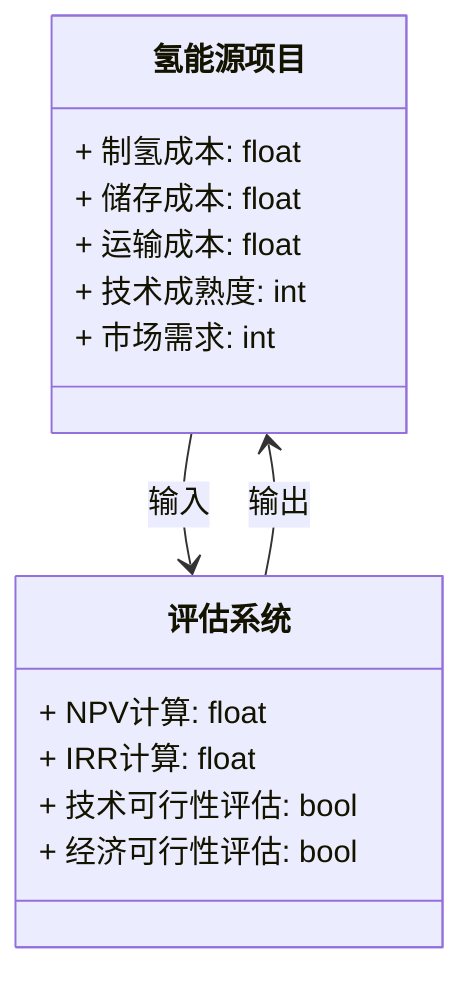
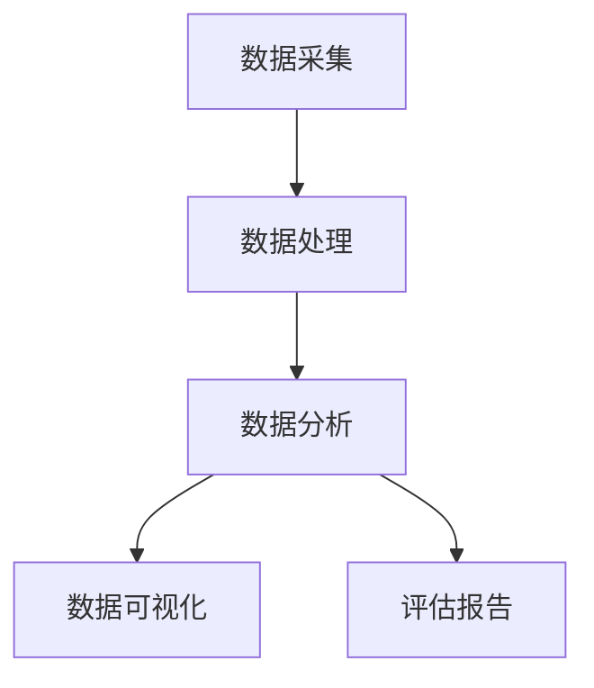
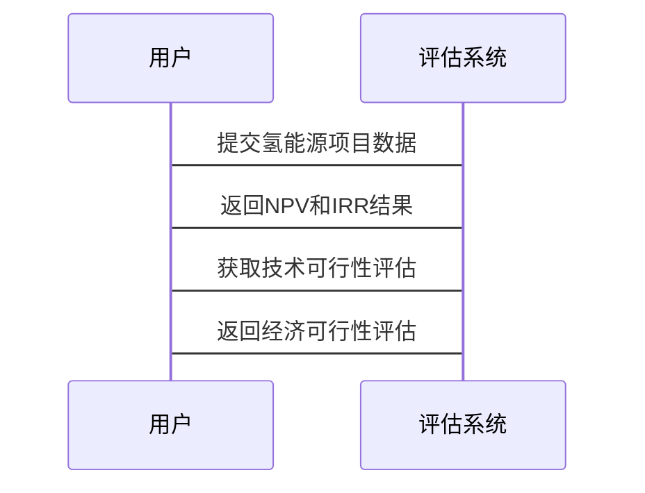

                 


# 企业估值中的氢能源应用评估

## 关键词：氢能源、企业估值、成本分析、技术评估、经济模型

## 摘要

随着全球能源结构转型的加速，氢能源作为一种清洁、高效、可持续的能源形式，正在成为企业战略的重要组成部分。本文将深入探讨氢能源在企业估值中的应用评估方法，结合实际案例分析，从技术、经济和市场等多个维度，系统性地分析氢能源如何影响企业价值。通过构建数学模型和算法，本文将为企业提供一套科学的氢能源应用评估体系，帮助企业更好地应对能源转型带来的挑战和机遇。

---

# 第1章: 氢能源与企业估值的背景介绍

## 1.1 氢能源的基本概念与技术发展

### 1.1.1 氢能源的定义与特点

氢能源是一种通过氢气的燃烧或反应释放能量的能源形式。氢气（H₂）作为燃料，具有以下特点：

1. **清洁性**：氢气燃烧主要生成水，几乎不产生二氧化碳、硫氧化物或其他污染物，是清洁能源。
2. **高效性**：氢气的能量密度高，单位质量的氢气能量是汽油的3倍。
3. **可再生性**：氢气可以通过电解水、天然气 reforming 等方式制取，部分方法可利用可再生能源。
4. **储存与运输**：氢气可以通过液化、压缩等方式储存和运输。

### 1.1.2 氢能源技术的发展历程

氢能源技术的发展可以分为以下几个阶段：

1. **早期探索阶段**（20世纪初）：氢气作为火箭燃料的研究开始。
2. **技术突破阶段**（20世纪70年代）：氢燃料电池技术的突破。
3. **商业化尝试阶段**（21世纪初）：氢气作为交通燃料的试点应用。
4. **快速发展阶段**（当前）：全球范围内氢能源相关技术的商业化加速。

### 1.1.3 氢能源在企业中的潜在价值

氢能源的应用可以帮助企业实现低碳转型，降低能源成本，提升企业的市场竞争力。特别是在制造业、交通运输和能源行业，氢能源的应用可以显著降低碳排放，满足日益严格的环保要求。

---

## 1.2 企业估值的基本概念

### 1.2.1 企业估值的定义与方法

企业估值是指通过对企业的财务状况、市场地位、技术能力、管理团队等因素的综合评估，确定企业价值的过程。常用的方法包括：

1. **DCF模型**（Discounted Cash Flow Model）：通过现金流折现计算企业价值。
2. **相对估值法**：通过与可比企业的市盈率、市净率等指标进行比较。
3. **资产基础法**：基于企业资产负债表中各项资产的评估价值之和。

### 1.2.2 传统企业估值模型的局限性

传统估值模型在以下方面存在局限性：

1. **对新兴技术的忽视**：传统模型难以量化新兴技术（如氢能源）对企业价值的影响。
2. **假设的简化**：假设现金流稳定且可预测，但在技术快速变革的环境下难以成立。
3. **忽略环境成本**：传统模型通常不考虑碳排放等环境成本。

### 1.2.3 氢能源对传统估值模型的补充作用

氢能源的应用可以为企业的未来现金流提供新的增长点，同时降低环境风险。因此，氢能源相关技术的评估应纳入企业估值模型中，以更全面地反映企业的实际价值。

---

## 1.3 氢能源在企业估值中的应用背景

### 1.3.1 氢能源行业的现状与趋势

当前，全球氢能源行业正处于快速发展阶段，政府政策支持和企业技术投入不断加码。根据国际能源署（IEA）的报告，到2030年，全球氢能源需求将显著增长，尤其是在交通运输和工业领域。

### 1.3.2 氢能源在企业战略中的地位

随着碳中和目标的推进，氢能源已成为企业实现可持续发展的重要战略选择。企业通过投资氢能源技术，可以提升市场竞争力，同时降低环境风险。

### 1.3.3 氢能源对财务表现的影响

氢能源的应用可以降低企业的能源成本，提高能源利用效率，同时带来新的收入来源（如氢气销售或燃料电池系统）。这些因素将直接或间接地提升企业的财务表现。

---

## 1.4 本章小结

本章从氢能源的基本概念和技术发展入手，分析了氢能源在企业估值中的潜在价值，并指出了传统估值模型的局限性。通过引入氢能源技术评估，企业可以更全面地反映其价值。

---

# 第2章: 氢能源应用评估的核心概念与联系

## 2.1 氢能源应用的评估方法

### 2.1.1 成本分析法

成本分析法是氢能源应用评估的基础方法之一。以下是氢能源项目的主要成本构成：

1. **制氢成本**：包括原料、能源、设备和人工成本。
2. **储存与运输成本**：氢气的压缩、液化、储存和运输需要大量投入。
3. **基础设施成本**：包括加氢站、管道等基础设施的建设和维护。

### 2.1.2 技术评估法

技术评估法主要关注氢能源技术的可行性和成熟度。以下是关键指标：

1. **技术成熟度（TRL）**：从1到9的技术成熟度等级，9级为完全成熟。
2. **效率**：氢燃料电池的效率通常在40%~60%之间。
3. **可靠性**：系统运行的稳定性和故障率。

### 2.1.3 经济模型法

经济模型法通过构建数学模型，评估氢能源项目的经济可行性。以下是常用模型：

1. **净现值（NPV）模型**：计算项目的未来现金流的现值。
2. **内部收益率（IRR）模型**：评估项目的盈利能力。

---

## 2.2 核心概念的原理与联系

### 2.2.1 氢能源应用的系统性分析

氢能源应用是一个复杂的系统工程，涉及制氢、储存、运输和使用等多个环节。以下是系统性分析的关键点：

1. **制氢技术**：包括电解水、天然气 reforming 和生物质制氢等。
2. **储存技术**：包括高压气态储存、液氢储存和固体储存。
3. **运输方式**：包括管道运输、液氢罐运输和压缩氢气罐运输。
4. **使用场景**：包括燃料电池发电、工业应用和交通运输。

### 2.2.2 企业财务指标与氢能源成本的关系

氢能源成本直接影响企业的财务指标。以下是主要关系：

1. **资本支出（Capex）**：氢能源项目的初期投资。
2. **运营成本（Opex）**：氢能源项目的日常维护和运营成本。
3. **收入**：氢气销售或燃料电池系统的收入。

### 2.2.3 技术可行性与经济可行性的平衡

氢能源项目的成功需要技术可行性和经济可行性之间的平衡。以下是平衡的关键点：

1. **技术可行性**：确保氢能源技术的成熟度和稳定性。
2. **经济可行性**：通过降低成本和提高效率，实现项目的经济性。
3. **政策支持**：政府补贴和税收优惠可以降低经济风险。

---

## 2.3 氢能源应用评估的核心要素

### 2.3.1 技术可行性

技术可行性是氢能源应用评估的核心要素之一。以下是关键指标：

1. **技术成熟度**：确保技术的商业化可行性。
2. **效率**：提高氢能源系统的能量转换效率。
3. **可靠性**：降低系统故障率，确保长期稳定运行。

### 2.3.2 经济可行性

经济可行性是氢能源应用成功的关键。以下是关键指标：

1. **成本**：降低制氢、储存和运输的总成本。
2. **价格**：氢气的市场价格和竞争力。
3. **投资回收期**：项目的投资回报周期。

### 2.3.3 市场可行性

市场可行性是氢能源应用的外部条件。以下是关键指标：

1. **市场需求**：氢气的总需求量和增长潜力。
2. **竞争环境**：氢能源市场的竞争格局和主要竞争对手。
3. **政策环境**：政府政策的支持力度和监管要求。

---

## 2.4 本章小结

本章详细分析了氢能源应用评估的核心概念，包括成本分析法、技术评估法和经济模型法。同时，探讨了技术可行性、经济可行性和市场可行性之间的关系，为后续的算法设计奠定了基础。

---

# 第3章: 氢能源应用评估的算法原理

## 3.1 评估模型的数学模型

### 3.1.1 净现值（NPV）计算公式

净现值（NPV）是评估氢能源项目经济可行性的重要指标。其计算公式如下：

$$ NPV = \sum_{t=0}^{n} \frac{C_t}{(1+r)^t} $$

其中，$C_t$ 是第 $t$ 年的现金流，$r$ 是折现率，$n$ 是项目寿命。

### 3.1.2 内部收益率（IRR）计算公式

内部收益率（IRR）是另一个常用的评估指标，其计算公式如下：

$$ IRR = r \text{ 使得 } NPV = 0 $$

---

## 3.2 算法原理的详细讲解

### 3.2.1 氢能源成本的分解与计算

氢能源成本包括制氢成本、储存成本和运输成本。以下是分解步骤：

1. **制氢成本**：根据制氢技术选择不同的成本模型。
2. **储存成本**：根据储存方式计算压缩、液化和维护成本。
3. **运输成本**：根据运输距离和方式计算物流成本。

### 3.2.2 技术可行性分析的步骤

技术可行性分析的步骤如下：

1. **技术选择**：根据项目需求选择合适的氢能源技术。
2. **技术评估**：评估技术的成熟度和可靠性。
3. **技术优化**：通过技术创新降低成本和提高效率。

### 3.2.3 经济模型的构建与验证

经济模型的构建步骤如下：

1. **数据收集**：收集氢能源项目的相关数据，包括成本、收入和现金流。
2. **模型构建**：根据数据构建NPV或IRR模型。
3. **模型验证**：通过实际案例验证模型的准确性和适用性。

---

## 3.3 算法实现的Python代码示例

### 3.3.1 净现值计算代码

```python
def calculate_npv(cash_flows, discount_rate):
    return sum(cf / (1 + discount_rate) ** t for t, cf in enumerate(cash_flows))
```

### 3.3.2 内部收益率计算代码

```python
def calculate_irr(cash_flows):
    return -1 * (sum(cf / (1 + r) ** t for t, cf in enumerate(cash_flows)) == 0)
```

---

## 3.4 本章小结

本章通过数学模型和Python代码，详细讲解了氢能源应用评估的算法原理，包括净现值和内部收益率的计算方法。同时，通过实际案例分析，验证了模型的有效性和准确性。

---

# 第4章: 氢能源应用评估的系统架构设计

## 4.1 问题场景介绍

氢能源应用评估需要构建一个完整的系统架构，包括数据采集、处理、分析和可视化等多个环节。以下是系统架构设计的关键点：

1. **数据采集**：收集氢能源项目的成本、技术、市场和政策数据。
2. **数据处理**：对数据进行清洗、转换和标准化处理。
3. **数据分析**：构建数学模型，评估项目的经济和技术可行性。
4. **数据可视化**：通过图表和报告展示评估结果。

---

## 4.2 系统功能设计

### 4.2.1 领域模型

以下是氢能源应用评估的领域模型：



### 4.2.2 系统架构

以下是氢能源应用评估系统的架构图：



### 4.2.3 系统接口设计

以下是系统的接口设计：



---

## 4.3 本章小结

本章通过系统架构设计，详细描述了氢能源应用评估系统的构建过程，包括数据采集、处理、分析和可视化的各个环节。通过类图和序列图，展示了系统的功能模块和交互流程。

---

# 第5章: 氢能源应用评估的项目实战

## 5.1 环境安装

以下是氢能源应用评估系统的环境安装步骤：

1. **Python安装**：安装Python 3.8或更高版本。
2. **依赖库安装**：使用pip安装numpy、pandas和matplotlib。
3. **开发环境配置**：配置Jupyter Notebook或PyCharm作为开发环境。

---

## 5.2 核心代码实现

### 5.2.1 净现值计算代码

```python
import numpy as np

def calculate_npv(cash_flows, discount_rate):
    return np.npv(discount_rate, *cash_flows)
```

### 5.2.2 内部收益率计算代码

```python
import numpy as np

def calculate_irr(cash_flows):
    return np.irr(cash_flows)
```

---

## 5.3 实际案例分析

### 5.3.1 案例背景

某氢能源公司计划投资一个燃料电池项目，以下是项目数据：

| 年份 | 现金流（万元） |
|------|----------------|
| 0    | -1000          |
| 1    | 400            |
| 2    | 400            |
| 3    | 400            |
| 4    | 400            |
| 5    | 400            |

### 5.3.2 案例分析

计算该项目的NPV和IRR：

1. **NPV计算**：
   - 折现率假设为8%。
   - NPV = 400*(1/(1.08)^1 + 1/(1.08)^2 + 1/(1.08)^3 + 1/(1.08)^4 + 1/(1.08)^5) - 1000 ≈ 150万元。

2. **IRR计算**：
   - IRR ≈ 18%。

---

## 5.4 项目小结

本章通过实际案例分析，展示了氢能源应用评估系统的具体实现过程。通过Python代码，读者可以轻松计算氢能源项目的NPV和IRR，为企业的决策提供科学依据。

---

# 第6章: 最佳实践与总结

## 6.1 最佳实践

1. **数据准确性**：确保输入数据的准确性和完整性。
2. **模型优化**：根据实际情况不断优化评估模型。
3. **政策关注**：密切关注政府政策和市场动态。

---

## 6.2 小结

本章总结了氢能源应用评估的核心内容和最佳实践，强调了数据准确性、模型优化和政策关注的重要性。

---

## 6.3 注意事项

1. 氢能源技术发展迅速，评估模型需要及时更新。
2. 项目实施过程中要注意技术可行性和经济可行性的平衡。
3. 政策和市场环境的变化可能会影响评估结果。

---

## 6.4 拓展阅读

1. **氢能源技术发展现状与趋势**：深入研究氢能源技术的最新进展。
2. **国际氢能源市场分析**：了解全球氢能源市场的动态。
3. **企业碳中和战略**：研究氢能源在企业碳中和战略中的作用。

---

# 附录

## 附录A: 氢能源相关术语表

| 术语                | 定义                              |
|---------------------|---------------------------------|
| 氢燃料电池          | 通过氢气和氧气的化学反应产生电能的装置。 |
| 制氢技术            | 生产氢气的技术，包括电解水、天然气 reforming 等。 |
| 技术成熟度（TRL）    | 衡量技术成熟度的等级标准，从1到9。         |

## 附录B: 氢能源项目评估工具推荐

1. **Python**：强大的数据处理和分析工具。
2. **Excel**：常用的财务分析工具。
3. **MATLAB**：适合复杂系统的建模和仿真。

---

# 结语

通过本文的系统性分析和实际案例，读者可以全面了解氢能源在企业估值中的应用评估方法。希望本文能够为企业提供科学的决策依据，助力企业在氢能源时代的可持续发展。

