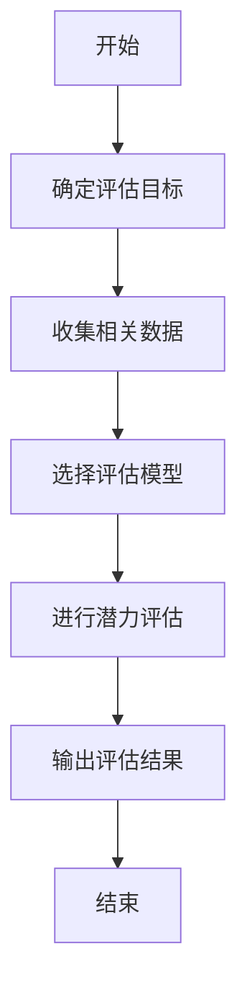

                 


# 第二章: 生物科技潜力评估的核心概念与联系

## 2.1 核心概念的定义与解释

### 2.1.1 生物科技创新能力
生物科技创新能力衡量企业在生物技术研发方面的投入和成果，包括专利数量、研发投入比例和技术创新速度。例如，一家公司每年申请的专利数量越多，通常表示其创新能力越强。

### 2.1.2 市场竞争力
市场竞争力反映企业在市场中的地位和表现，包括市场份额、客户满意度和产品线丰富度。例如，拥有更多市场份额的企业通常在市场中更具竞争力。

### 2.1.3 研发效率
研发效率关注企业在研发过程中的产出效果，如单位研发投入产生的专利数量或新产品推出速度。例如，高效的研发流程能显著提高企业的创新能力。

## 2.2 核心概念的属性特征对比

以下是三个核心概念的属性对比表格：

| 指标名称            | 指标类型 | 适用范围 | 数据来源 | 时间维度 |
|---------------------|----------|----------|----------|----------|
| 生物科技创新能力    | 技术型   | R&D部门 | 专利数据 | 短期与长期 |
| 市场竞争力          | 市场型   | 销售部门 | 销售数据 | 短期 |
| 研发效率            | 效率型   | R&D部门 | 项目数据 | 中期 |

### 2.2.1 对比分析
- **生物科技创新能力**：主要关注技术层面的创新，适合评估长期发展潜力。
- **市场竞争力**：侧重市场表现，适合评估短期盈利能力。
- **研发效率**：关注研发过程的效果，适合评估中期发展能力。

## 2.3 实体关系图与流程图

### 2.3.1 生物科技潜力评估的ER实体关系图
```mermaid
er
  entity 生物科技企业 {
    key: 企业ID
    attribute: 企业名称, 成立时间, 所属行业
  }
  entity 产品 {
    key: 产品ID
    attribute: 产品名称, 产品类型, 研发阶段
  }
  entity 评估指标 {
    key: 指标ID
    attribute: 指标名称, 指标权重
  }
  relationship 企业-产品 {
    role: 企业 -> 产品
  }
  relationship 产品-评估指标 {
    role: 产品 -> 评估指标
  }
```

### 2.3.2 生物科技潜力评估的流程图


## 2.4 本章小结
本章详细介绍了生物科技创新能力、市场竞争力和研发效率这三个核心概念，并通过属性对比和图表分析，帮助读者理解它们在潜力评估中的重要性及其相互关系。这些概念为后续的算法设计和系统实现奠定了基础。

