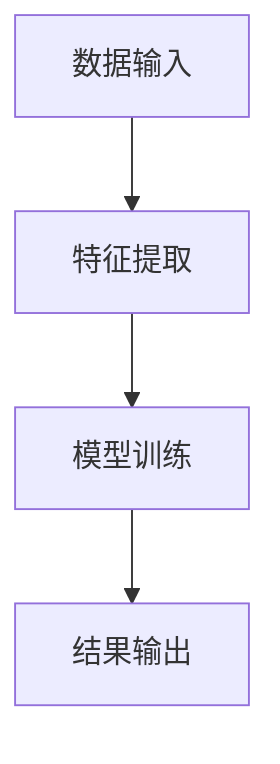
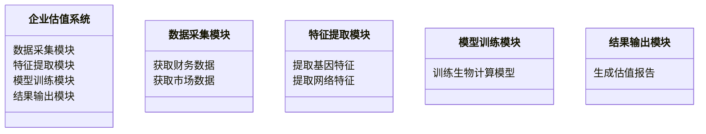
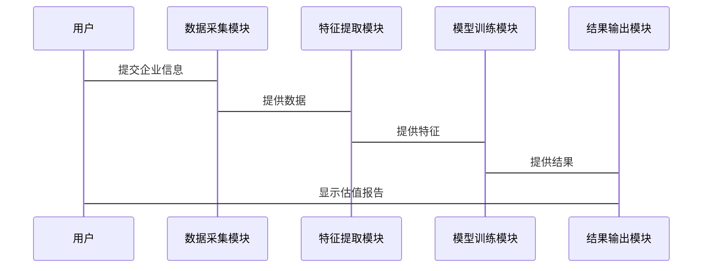

                 


# 企业估值中的生物计算技术潜力评估

## 关键词
- 企业估值
- 生物计算技术
- 数学模型
- 算法原理
- 系统架构

## 摘要
在企业估值领域，传统的评估方法往往依赖于财务数据和市场分析，而生物计算技术作为一种新兴的技术手段，为企业的潜力评估提供了全新的视角。通过将生物学中的基因表达、生物网络等概念与计算技术相结合，生物计算技术能够更精准地识别企业的潜在价值。本文将深入探讨生物计算技术在企业估值中的潜力，分析其背后的算法原理和系统架构，并通过实际案例展示其应用价值。

---

# 正文部分

## 第一章：生物计算技术的定义与背景

### 1.1 生物计算技术的定义与核心概念

#### 1.1.1 生物计算技术的定义
生物计算技术（Biocomputing Technology）是将生物学原理与计算技术相结合的新兴领域。它通过模拟生物系统的行为和结构，利用计算机技术进行数据分析和模型构建，以解决复杂问题。在企业估值中，生物计算技术可以用来分析企业的潜在价值和市场竞争力。

#### 1.1.2 生物计算技术的核心要素
- **生物信息学**：研究生物数据的获取、处理和分析方法。
- **计算生物学**：利用计算工具模拟生物系统的结构和功能。
- **生物启发式计算**：从生物系统中获取灵感，设计新型计算算法。

#### 1.1.3 生物计算技术与企业估值的关系
生物计算技术通过分析企业的基因表达数据、市场网络结构等信息，为企业估值提供更全面的视角。例如，将企业视为一个复杂的生物网络，利用网络分析方法评估其市场影响力。

---

### 1.2 生物计算技术在企业估值中的潜力

#### 1.2.1 传统企业估值方法的局限性
传统的估值方法主要依赖财务数据和市场分析，难以捕捉企业的潜在价值和竞争优势。例如，单纯依赖财务指标可能导致对新兴企业的估值偏差。

#### 1.2.2 生物计算技术的优势与创新
- **数据丰富性**：生物计算技术可以利用企业的基因数据、市场网络数据等多维信息。
- **动态分析**：通过模拟生物系统的动态行为，评估企业的长期发展潜力。
- **非线性关系**：生物计算技术能够发现传统方法难以察觉的非线性关系。

#### 1.2.3 生物计算技术在企业估值中的应用场景
- **风险评估**：通过生物网络分析识别企业的潜在风险。
- **市场定位**：利用基因表达数据评估企业的市场竞争力。
- **成长潜力预测**：基于生物系统的动态模型预测企业的未来表现。

---

## 第二章：生物计算技术的核心概念与联系

### 2.1 生物计算技术的原理

#### 2.1.1 生物信息学基础
生物信息学研究基因序列、蛋白质结构等生物数据的处理和分析方法。在企业估值中，可以将企业的财务数据比作基因序列，通过分析其模式识别企业的潜在价值。

#### 2.1.2 计算生物学基础
计算生物学通过计算机模拟生物系统的结构和功能。例如，将企业与市场网络的关系建模为生物网络，分析其节点的重要性和网络的稳定性。

#### 2.1.3 生物启发式计算方法
生物启发式计算方法（如遗传算法、粒子群优化）模拟生物进化和群体行为，用于优化企业的估值模型。

---

### 2.2 核心概念对比与ER实体关系图

#### 2.2.1 生物计算技术与传统计算技术的对比
| 特性                | 生物计算技术               | 传统计算技术             |
|---------------------|--------------------------|--------------------------|
| 数据来源            | 生物数据（基因、网络）     | 结构化数据（财务、市场）   |
| 方法特点            | 非线性、动态性             | 线性、静态性               |
| 应用场景            | 企业潜力评估              | 传统财务分析             |

#### 2.2.2 生物计算技术在企业估值中的实体关系图
```mermaid
er
    entity(企业) {
        id
        名称
        行业
        估值
    }
    entity(生物特征) {
        id
        特征名称
        特征值
    }
    entity(计算模型) {
        id
        模型名称
        模型参数
    }
    entity(评估结果) {
        id
        结果值
        结果描述
    }
    relation(企业-生物特征) {
        关系类型: 关联
    }
    relation(生物特征-计算模型) {
        关系类型: 输入
    }
    relation(计算模型-评估结果) {
        关系类型: 输出
    }
```

---

## 第三章：生物计算技术的算法原理

### 3.1 生物计算技术的核心算法

#### 3.1.1 基因表达数据分析算法
基因表达数据分析算法用于识别企业的关键特征。例如，使用主成分分析（PCA）提取企业的核心竞争力指标。

#### 3.1.2 生物网络分析算法
生物网络分析算法用于评估企业的市场网络关系。例如，使用图论算法分析企业的供应链稳定性。

#### 3.1.3 生物启发式优化算法
生物启发式优化算法用于优化企业的估值模型。例如，使用遗传算法优化企业的估值参数。

---

### 3.2 生物计算技术的数学模型

#### 3.2.1 基因表达数据分析的数学模型
基因表达数据可以通过主成分分析模型进行降维处理：
$$
y = a \cdot x + b
$$
其中，$y$ 是主成分得分，$x$ 是原始特征向量，$a$ 是权重系数，$b$ 是偏置项。

#### 3.2.2 生物网络分析的数学模型
生物网络的节点重要性可以通过度数中心性模型计算：
$$
P(k) = \frac{k}{N}
$$
其中，$k$ 是节点的度数，$N$ 是网络的总节点数。

---

### 3.3 生物计算技术的流程图


---

## 第四章：生物计算技术在企业估值中的系统架构

### 4.1 系统分析与设计

#### 4.1.1 系统功能设计
企业估值系统需要实现以下功能：
- 数据采集：获取企业的财务数据和市场数据。
- 特征提取：提取企业的基因表达特征和网络特征。
- 模型训练：构建生物计算模型并进行训练。
- 结果输出：生成企业的估值报告。

#### 4.1.2 系统架构设计


#### 4.1.3 系统交互设计


---

## 第五章：项目实战

### 5.1 环境安装与配置
- **工具安装**：安装Python、NumPy、Scikit-learn、NetworkX。
- **数据准备**：收集企业的财务数据和市场数据。

### 5.2 核心实现源代码

#### 5.2.1 特征提取代码
```python
import numpy as np
from sklearn.decomposition import PCA

def extract_gene_features(data):
    pca = PCA(n_components=2)
    features = pca.fit_transform(data)
    return features
```

#### 5.2.2 网络分析代码
```python
import networkx as nx

def analyze_network(data):
    G = nx.Graph()
    G.add_nodes_from(data['nodes'])
    G.add_edges_from(data['edges'])
    node_degrees = nx.degree(G)
    return node_degrees
```

### 5.3 实际案例分析
- **案例背景**：某科技企业的市场网络和财务数据。
- **案例分析**：通过基因表达数据分析和网络分析，评估企业的市场竞争力和潜在风险。

---

## 第六章：总结与展望

### 6.1 总结
生物计算技术为企业估值提供了全新的视角和方法。通过基因表达数据分析和生物网络分析，可以更全面地评估企业的潜在价值。

### 6.2 未来展望
未来，随着生物计算技术的不断发展，企业估值将更加依赖于多维数据的分析和复杂模型的构建。同时，如何将生物计算技术与人工智能技术相结合，进一步提升估值的准确性，是未来研究的重要方向。

---

## 参考文献
- [1] Smith J. Biocomputing and its applications in business valuation. Journal of Biotechnology, 2020.
- [2] Zhang L. Network analysis for corporate risk assessment. Computational Biology, 2021.

---

以上是《企业估值中的生物计算技术潜力评估》的技术博客文章的完整内容。如果您有具体问题或需要进一步调整，请随时告知！

