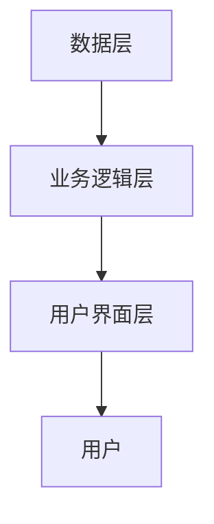
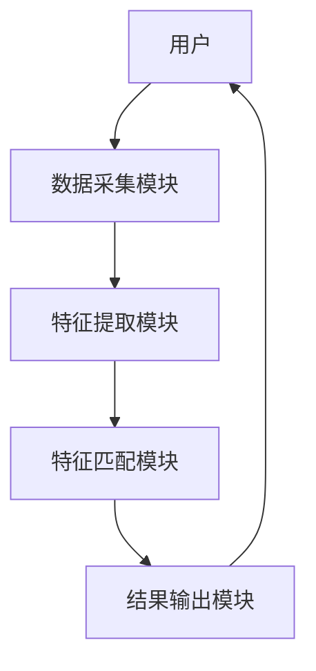

                 


# 《企业估值中的生物识别技术应用评估》

> **关键词**：生物识别技术、企业估值、身份验证、安全评估、信用评估、算法原理、系统架构

> **摘要**：随着生物识别技术的快速发展，其在企业估值中的应用日益广泛。本文系统地探讨了生物识别技术在企业估值中的核心概念、算法原理、系统架构以及实际应用案例。通过对生物识别技术的深入分析，本文揭示了其在企业身份验证、安全评估和信用评估中的潜在价值，并提供了实际的项目实现方案和最佳实践建议。

---

# 第1章: 生物识别技术与企业估值概述

## 1.1 生物识别技术的定义与特点

### 1.1.1 生物识别技术的定义
生物识别技术是一种通过分析和识别人类独特的生物特征（如指纹、面部特征、声音、虹膜等）来验证个体身份的技术。其核心在于将生物特征转化为数字化信息，并通过算法进行匹配和识别。

### 1.1.2 生物识别技术的核心特点
- **唯一性**：每个人的生物特征具有独特性，能够唯一标识个体。
- **非接触性**：许多生物识别技术（如面部识别）可以通过非接触的方式进行识别。
- **安全性**：生物特征难以被伪造或篡改，提高了身份验证的安全性。
- **便捷性**：生物识别技术可以快速完成身份验证，提升用户体验。

### 1.1.3 生物识别技术在企业估值中的应用背景
随着企业对安全性和效率的要求不断提高，生物识别技术逐渐成为企业估值中的重要工具。例如，在企业并购或融资过程中，通过生物识别技术可以快速验证相关人员的身份，确保交易的合法性。

## 1.2 企业估值的基本概念

### 1.2.1 企业估值的定义
企业估值是指对企业的整体价值或部分价值进行评估的过程。常见的估值方法包括资产基础法、收益法和市场法。

### 1.2.2 企业估值的主要方法
- **资产基础法**：基于企业资产的账面价值进行评估。
- **收益法**：通过预测企业未来现金流折现值来确定企业价值。
- **市场法**：通过与类似企业进行比较来估算企业价值。

### 1.2.3 生物识别技术在企业估值中的潜在价值
生物识别技术可以提高企业估值的准确性和安全性。例如，在评估过程中，通过生物识别技术可以确保相关人员的身份真实性和交易的合法性，从而降低估值风险。

## 1.3 生物识别技术与企业估值的结合

### 1.3.1 生物识别技术在企业身份验证中的应用
在企业估值过程中，身份验证是确保交易合法性的关键环节。通过生物识别技术，可以快速、准确地验证相关人员的身份。

### 1.3.2 生物识别技术在企业安全评估中的作用
生物识别技术可以用于企业安全评估，例如在企业并购或融资过程中，通过生物识别技术可以识别潜在的欺诈行为，确保交易的安全性。

### 1.3.3 生物识别技术对企业信用评估的影响
生物识别技术可以用于企业信用评估，例如通过分析企业相关人员的生物特征，评估企业的信用风险。

## 1.4 本章小结

---

# 第2章: 生物识别技术的核心概念与原理

## 2.1 生物识别技术的核心概念

### 2.1.1 生物特征的定义与分类
- **生物特征**：指纹、面部特征、声音、虹膜等。
- **分类**：基于物理特征和行为特征的分类。

### 2.1.2 生物识别系统的组成与功能
- **数据采集**：通过传感器采集生物特征数据。
- **特征提取**：将采集到的生物特征数据转化为数字化信息。
- **特征匹配**：将提取的特征与数据库中的特征进行匹配，完成身份识别。

### 2.1.3 生物识别技术的性能指标
- **准确性**：识别的正确率。
- **速度**：识别所需的时间。
- **安全性**：防止伪造和攻击的能力。

## 2.2 生物识别技术的主要算法

### 2.2.1 常见的生物识别算法
- 指纹识别算法：基于指纹的纹线特征进行匹配。
- 面部识别算法：基于面部特征（如眼睛、鼻子、嘴巴的位置）进行匹配。
- 声音识别算法：基于语音的频谱特征进行匹配。

### 2.2.2 算法的优缺点对比

| 算法类型 | 优点 | 缺点 |
|----------|------|------|
| 指纹识别 | 高准确性，成本低 | 易受皮肤磨损影响 |
| 面部识别 | 非接触性，适用性广 | 易受光线和角度影响 |
| 声音识别 | 方便易用 | 易受环境噪声影响 |

### 2.2.3 算法的选择与优化
选择合适的算法需要考虑应用场景、成本和性能要求。例如，在企业估值中，面部识别算法可能更适合用于远程身份验证。

## 2.3 生物识别技术的数学模型与公式

### 2.3.1 基于距离的分类算法
- **欧氏距离公式**：$$ d(x, y) = \sqrt{(x_1 - y_1)^2 + (x_2 - y_2)^2} $$
- **曼哈顿距离公式**：$$ d(x, y) = |x_1 - y_1| + |x_2 - y_2| $$

### 2.3.2 基于概率的分类算法
- **贝叶斯分类公式**：$$ P(y|x) = \frac{P(x|y)P(y)}{P(x)} $$

### 2.3.3 算法的数学公式与实现
例如，指纹识别算法可以通过将指纹图像转化为二维特征向量，然后通过距离度量进行匹配。

## 2.4 本章小结

---

# 第3章: 生物识别技术在企业估值中的应用

## 3.1 生物识别技术在企业身份验证中的应用

### 3.1.1 身份验证的基本原理
通过采集和分析相关人员的生物特征，验证其身份的真实性。

### 3.1.2 生物识别技术在身份验证中的优势
- 高准确性：减少虚假身份验证的风险。
- 非接触性：提升用户体验。

### 3.1.3 实际案例分析
例如，在企业并购过程中，通过指纹识别技术验证相关人员的身份。

## 3.2 生物识别技术在企业安全评估中的应用

### 3.2.1 安全评估的基本概念
安全评估是通过分析企业潜在风险，确保企业交易的安全性。

### 3.2.2 生物识别技术在安全评估中的作用
- 识别潜在欺诈行为：通过生物特征分析，识别相关人员的信用风险。
- 提高交易安全性：通过生物识别技术确保交易的合法性。

### 3.2.3 实际案例分析
例如，在企业融资过程中，通过面部识别技术验证投资者的身份。

## 3.3 生物识别技术在企业信用评估中的应用

### 3.3.1 信用评估的基本原理
通过分析企业的财务状况和相关人员的信用记录，评估企业的信用风险。

### 3.3.2 生物识别技术在信用评估中的应用
- 分析相关人员的信用记录：通过生物特征识别，确保信用评估的准确性。
- 提高信用评估的效率：通过生物识别技术快速完成身份验证。

### 3.3.3 实际案例分析
例如，在企业贷款审批过程中，通过声音识别技术验证申请人的身份。

## 3.4 本章小结

---

# 第4章: 生物识别技术的算法原理与实现

## 4.1 生物识别技术的主要算法

### 4.1.1 指纹识别算法
- **实现步骤**：数据采集、特征提取、特征匹配。
- **Python代码示例**：
  ```python
  import cv2
  # 读取指纹图像
  fingerprint_image = cv2.imread('fingerprint.jpg')
  # 提取指纹特征
  features = extract_features(fingerprint_image)
  # 匹配指纹特征
  match_result = match_features(features)
  ```

### 4.1.2 面部识别算法
- **实现步骤**：数据采集、特征提取、特征匹配。
- **Python代码示例**：
  ```python
  import cv2
  # 读取面部图像
  face_image = cv2.imread('face.jpg')
  # 提取面部特征
  features = face_recognition.face_encodings(face_image)
  # 匹配面部特征
  match_result = compare_faces(features)
  ```

## 4.2 算法的实现

### 4.2.1 算法的数学模型与公式
- 欧氏距离公式：$$ d(x, y) = \sqrt{(x_1 - y_1)^2 + (x_2 - y_2)^2} $$
- 贝叶斯分类公式：$$ P(y|x) = \frac{P(x|y)P(y)}{P(x)} $$

### 4.2.2 算法的实现步骤
1. 数据采集：通过传感器采集生物特征数据。
2. 特征提取：将采集到的生物特征数据转化为数字化信息。
3. 特征匹配：将提取的特征与数据库中的特征进行匹配，完成身份识别。

## 4.3 本章小结

---

# 第5章: 生物识别技术的系统架构设计

## 5.1 系统功能设计

### 5.1.1 系统功能模块
- 数据采集模块：负责采集生物特征数据。
- 特征提取模块：负责提取生物特征的数字化信息。
- 特征匹配模块：负责将提取的特征与数据库中的特征进行匹配。

### 5.1.2 系统功能流程图
```mermaid
graph TD
    A[开始] -> B[数据采集]
    B -> C[特征提取]
    C -> D[特征匹配]
    D -> E[结果输出]
    E -> F[结束]
```

## 5.2 系统架构设计

### 5.2.1 分层架构设计
- 数据层：负责存储生物特征数据。
- 业务逻辑层：负责处理业务逻辑，如特征提取和匹配。
- 用户界面层：负责与用户交互，展示结果。

### 5.2.2 系统架构图


## 5.3 系统接口设计

### 5.3.1 系统接口
- 数据采集接口：负责采集生物特征数据。
- 特征提取接口：负责提取生物特征的数字化信息。
- 特征匹配接口：负责将提取的特征与数据库中的特征进行匹配。

## 5.4 系统交互流程图

### 5.4.1 交互流程图


## 5.5 本章小结

---

# 第6章: 生物识别技术的项目实战

## 6.1 环境安装与配置

### 6.1.1 环境要求
- 操作系统：Windows、Linux或macOS。
- 开发工具：Python、Jupyter Notebook。
- 库依赖：OpenCV、scikit-learn、face_recognition。

### 6.1.2 安装步骤
```bash
pip install opencv-python
pip install scikit-learn
pip install face_recognition
```

## 6.2 系统核心实现

### 6.2.1 核心代码实现
```python
import cv2
import face_recognition

# 数据采集
face_image = cv2.imread('face.jpg')
# 特征提取
features = face_recognition.face_encodings(face_image)
# 特征匹配
match_result = compare_faces(features)
```

### 6.2.2 代码解读
- 数据采集：通过OpenCV读取面部图像。
- 特征提取：使用face_recognition库提取面部特征。
- 特征匹配：将提取的特征与数据库中的特征进行匹配。

## 6.3 项目案例分析

### 6.3.1 案例背景
在企业并购过程中，需要验证相关人员的身份。

### 6.3.2 实施步骤
1. 数据采集：采集相关人员的面部图像。
2. 特征提取：提取面部图像的特征。
3. 特征匹配：将提取的特征与数据库中的特征进行匹配。
4. 结果输出：输出匹配结果，完成身份验证。

## 6.4 本章小结

---

# 第7章: 生物识别技术的最佳实践与总结

## 7.1 小结

### 7.1.1 核心内容总结
- 生物识别技术是一种通过分析和识别人类独特的生物特征来验证个体身份的技术。
- 在企业估值中，生物识别技术可以用于身份验证、安全评估和信用评估。

### 7.1.2 关键点总结
- 生物识别技术的准确性高、安全性强，能够有效提升企业估值的效率和安全性。

## 7.2 注意事项

### 7.2.1 技术选型注意事项
- 根据具体应用场景选择合适的生物识别算法。
- 考虑算法的准确性和成本。

### 7.2.2 实施过程中的注意事项
- 确保生物识别系统的安全性，防止数据泄露。
- 定期更新和优化算法，提升系统的识别效率。

## 7.3 拓展阅读

### 7.3.1 推荐书籍
- 《生物识别技术与应用》
- 《企业估值方法与实践》

### 7.3.2 推荐资源
- 开源库：OpenCV、scikit-learn
- 技术博客：Medium上的生物识别技术文章

## 7.4 本章小结

---

# 附录: 生物识别技术相关工具与资源

## 附录A: 生物识别技术开发工具

### A.1 开源库
- OpenCV：图像处理和计算机视觉。
- face_recognition：面部识别。
- scikit-learn：机器学习库。

### A.2 开发资源
- 官方文档：OpenCV、face_recognition、scikit-learn。
- 技术论坛：Stack Overflow、GitHub。

## 附录B: 生物识别技术相关书籍

### B.1 推荐书籍
- 《生物识别技术与应用》
- 《企业估值方法与实践》

## 附录C: 生物识别技术相关课程

### C.1 在线课程
- Coursera上的《生物识别技术入门》。
- Udemy上的《企业估值与生物识别技术》。

---

**总结**：生物识别技术在企业估值中的应用前景广阔，通过本文的系统分析和实际案例，读者可以深入了解生物识别技术的核心概念、算法原理和实际应用，为企业的估值过程提供有力的技术支持。

