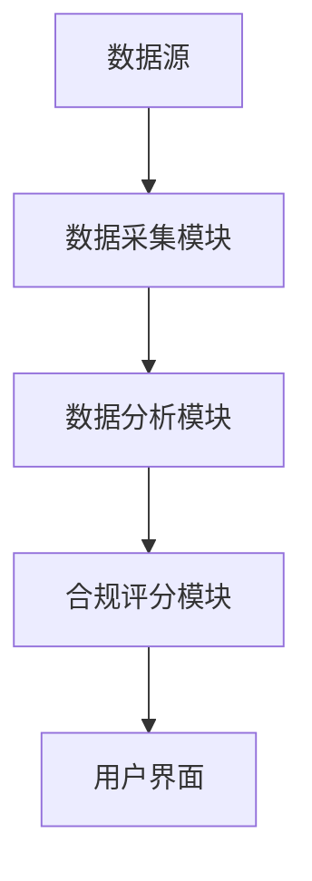
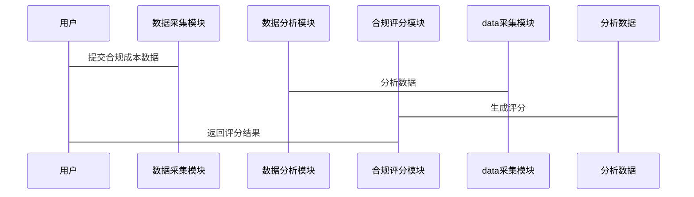

                 


# 企业估值中的监管合规成本分析

> 关键词：企业估值、监管合规成本、风险管理、成本分析、数学模型、系统架构、项目实战

> 摘要：本文系统地分析了监管合规成本对企业估值的影响，从概念、方法、模型到系统设计和项目实战，全面探讨了如何在企业估值中准确评估和优化监管合规成本。文章结合实际案例，提出了基于数学模型的分析方法和系统架构设计方案，为企业估值中的监管合规成本分析提供了理论支持和实践指导。

---

## 第1章: 监管合规成本的定义与重要性

### 1.1 什么是监管合规成本

#### 1.1.1 监管合规成本的定义
监管合规成本是指企业在遵守相关法律法规、行业标准及监管要求的过程中所产生的所有直接和间接成本。这些成本包括但不限于合规人员的工资、合规培训费用、合规技术投入、合规咨询费用等。

#### 1.1.2 监管合规成本的核心要素
- **人员成本**：合规团队的工资、奖金、福利等。
- **技术成本**：合规系统开发、维护及升级费用。
- **培训成本**：员工合规培训费用。
- **咨询成本**：聘请外部合规顾问的费用。
- **惩罚成本**：因违规被罚款或赔偿的费用。

#### 1.1.3 监管合规成本与企业估值的关系
监管合规成本直接影响企业的盈利能力、资产价值和未来现金流，进而影响企业的整体估值。高合规成本可能导致企业利润减少，从而降低企业估值。

#### 1.1.4 监管合规成本的动态变化
监管政策的变化、企业规模的扩张、行业竞争的加剧都会导致监管合规成本的变化。企业需要实时监控这些变化，及时调整合规策略。

### 1.2 监管合规成本的重要性

#### 1.2.1 监管合规成本对企业估值的影响
- 监管合规成本过高会降低企业的净利润，从而影响企业的市盈率和市净率。
- 合规成本的不确定性可能增加企业的财务风险，影响投资者对企业估值的信心。

#### 1.2.2 监管合规成本与企业风险管理
合规成本是企业风险管理的重要组成部分。通过合理控制合规成本，企业可以降低法律风险、声誉风险和财务风险。

#### 1.2.3 监管合规成本与企业竞争力
在行业竞争中，合规成本的高低直接影响企业的运营效率和成本结构。低合规成本可能为企业带来竞争优势。

### 1.3 监管合规成本的分类与边界

#### 1.3.1 监管合规成本的分类
- **直接合规成本**：直接用于合规活动的费用，如合规人员工资、合规技术投入等。
- **间接合规成本**：因合规要求而产生的间接费用，如业务流程调整、系统升级等。

#### 1.3.2 监管合规成本的边界与外延
监管合规成本的边界包括企业内部合规活动的所有相关成本，而外延则包括因合规要求而影响的上下游企业的成本变化。

#### 1.3.3 监管合规成本与其他成本的关系
监管合规成本与其他成本（如运营成本、管理成本）密切相关，但具有较强的独立性和系统性。

### 1.4 监管合规成本的核心概念结构

#### 1.4.1 监管合规成本的构成要素
- 合规目标：企业需要达到的监管要求。
- 合规主体：企业内部的合规部门或人员。
- 合规客体：企业的业务活动、资产、数据等。
- 合规手段：合规技术、合规流程、合规培训等。

#### 1.4.2 监管合规成本的系统性分析
监管合规成本是一个复杂的系统问题，涉及企业内部的各个部门和外部的监管环境。

#### 1.4.3 监管合规成本的动态变化
监管政策的变化、企业战略的调整、行业环境的变化都会导致监管合规成本的变化。

---

## 第2章: 监管合规成本的分析方法与模型

### 2.1 监管合规成本的定性分析方法

#### 2.1.1 风险评估法
通过评估企业可能面临的监管风险，确定合规成本的优先级和重要性。

#### 2.1.2 案例分析法
通过分析行业内的合规案例，总结经验教训，评估企业的合规成本。

#### 2.1.3 专家评估法
邀请行业专家对企业的合规成本进行评估和建议。

### 2.2 监管合规成本的定量分析方法

#### 2.2.1 成本加成模型
$$C = \sum_{i=1}^{n} c_i$$
其中，$C$ 表示监管合规成本总和，$c_i$ 表示第 $i$ 项合规成本。

#### 2.2.2 收益减损模型
$$E = R - C$$
其中，$E$ 表示企业净收益，$R$ 表示企业总收入，$C$ 表示合规成本。

#### 2.2.3 概率加权模型
$$E[C] = \sum_{i=1}^{n} P_i \cdot C_i$$
其中，$P_i$ 表示第 $i$ 项合规成本发生的概率，$C_i$ 表示第 $i$ 项合规成本的金额。

### 2.3 监管合规成本的综合分析方法

#### 2.3.1 定性与定量结合法
通过定性分析确定合规成本的重要性和优先级，再通过定量分析计算具体数值。

#### 2.3.2 场景模拟法
模拟不同的监管环境和企业战略，评估不同场景下的合规成本。

#### 2.3.3 数据驱动法
利用大数据技术分析企业的历史合规成本，预测未来的合规成本。

---

## 第3章: 监管合规成本的数学模型与公式

### 3.1 监管合规成本的基本公式

#### 3.1.1 监管合规成本的计算公式
$$C = \sum_{i=1}^{n} c_i$$
其中，$C$ 表示监管合规成本总和，$c_i$ 表示第 $i$ 项合规成本。

#### 3.1.2 监管合规成本的加权模型
$$w_i = \frac{c_i}{\sum_{j=1}^{n} c_j}$$
其中，$w_i$ 表示第 $i$ 项合规成本的权重。

### 3.2 监管合规成本的概率加权模型

#### 3.2.1 概率加权公式
$$E[C] = \sum_{i=1}^{n} P_i \cdot C_i$$
其中，$P_i$ 表示第 $i$ 项合规成本发生的概率，$C_i$ 表示第 $i$ 项合规成本的金额。

#### 3.2.2 概率加权模型的应用
通过概率加权模型，企业可以更准确地预测未来的合规成本，优化企业估值。

---

## 第4章: 监管合规成本的系统分析与架构设计

### 4.1 监管合规成本的系统分析

#### 4.1.1 问题场景介绍
企业需要在复杂的监管环境下，合理分配资源，优化合规成本。

#### 4.1.2 系统功能设计
- 数据采集模块：采集企业的合规成本数据。
- 数据分析模块：分析合规成本的构成和趋势。
- 合规评分模块：评估企业的合规风险。

### 4.2 监管合规成本的架构设计

#### 4.2.1 系统架构图


#### 4.2.2 系统接口设计
- 数据接口：与企业内部系统对接，获取合规成本数据。
- 用户接口：提供给企业用户查询和分析合规成本的界面。

### 4.3 监管合规成本的交互设计

#### 4.3.1 交互流程图


---

## 第5章: 监管合规成本的项目实战

### 5.1 环境安装

#### 5.1.1 安装Python
```bash
pip install python
```

#### 5.1.2 安装数据分析库
```bash
pip install pandas numpy
```

### 5.2 核心实现

#### 5.2.1 合规成本计算代码
```python
import pandas as pd

# 数据加载
df = pd.read_csv('compliance_cost.csv')

# 计算总合规成本
total_cost = df['cost'].sum()

# 输出结果
print(f"Total compliance cost: {total_cost}")
```

#### 5.2.2 概率加权模型代码
```python
import pandas as pd

# 数据加载
df = pd.read_csv('compliance_cost.csv')

# 计算期望合规成本
expected_cost = df['cost'] * df['probability'].sum()

# 输出结果
print(f"Expected compliance cost: {expected_cost}")
```

### 5.3 案例分析

#### 5.3.1 案例背景
某企业面临新的监管政策，需要评估其合规成本。

#### 5.3.2 数据分析
通过Python代码分析企业的历史合规成本数据，预测未来的合规成本。

#### 5.3.3 结果解读
企业未来的合规成本预计为 $X，建议企业提前做好资金准备。

---

## 第6章: 总结与展望

### 6.1 本章小结
本文系统地分析了监管合规成本对企业估值的影响，提出了基于数学模型和系统架构的分析方法，为企业估值提供了理论支持和实践指导。

### 6.2 应用中的注意事项
- 数据的准确性和完整性
- 模型的适用性和可扩展性
- 企业内部的合规文化建设

### 6.3 未来研究方向
- 更复杂的监管环境下的合规成本分析
- 大数据技术在合规成本分析中的应用
- 人工智能技术在合规成本预测中的应用

---

通过本文的分析，企业可以更好地理解和优化监管合规成本，从而提高企业估值和竞争力。

