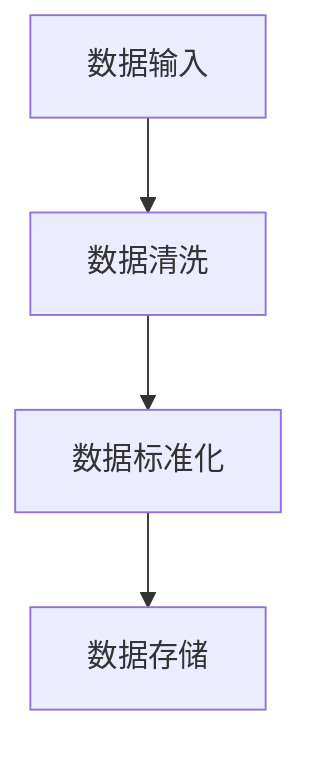
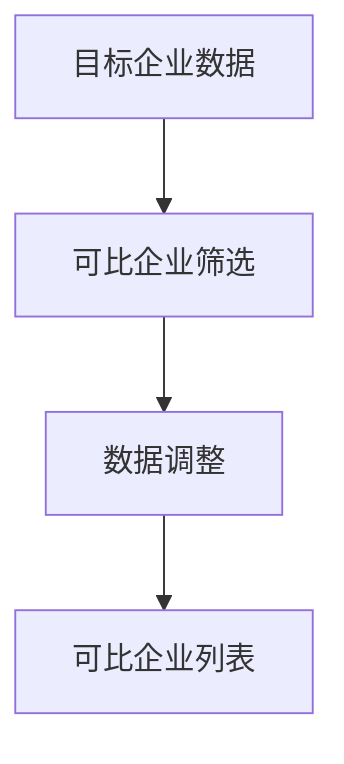
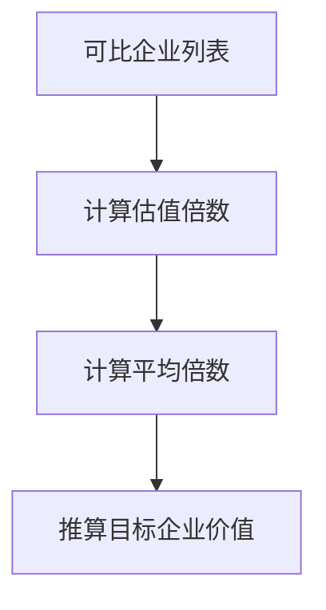
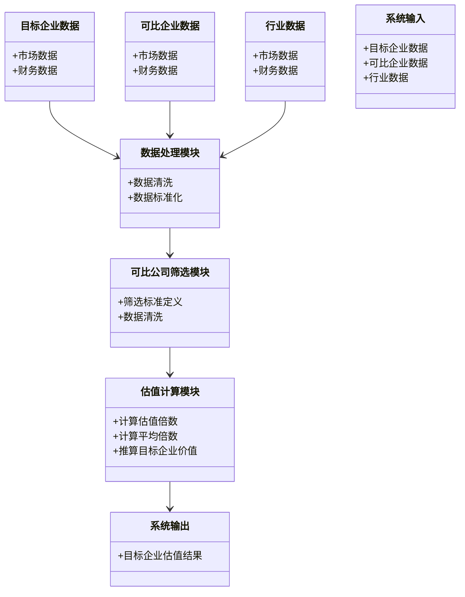
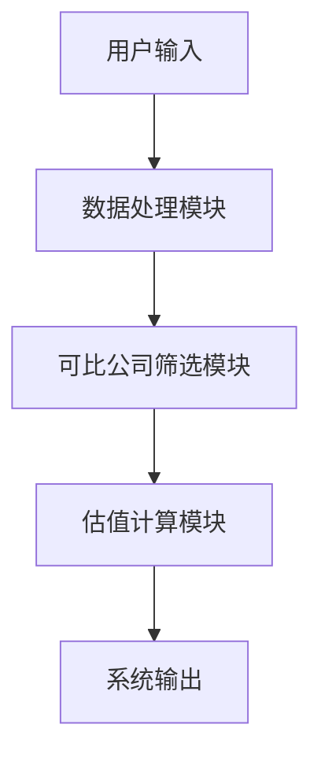
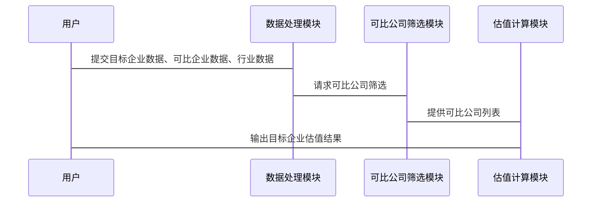

                 


# 企业估值中的相对估值法

> 关键词：企业估值、相对估值法、可比公司分析、交易案例比较、行业估值倍数

> 摘要：本文详细探讨了相对估值法在企业估值中的应用，从基本概念、核心原理到实际案例分析，全面解析了相对估值法的优势、局限性和最佳实践方法。文章通过系统化的分析和丰富的案例，为读者提供了深刻的理解和实用的指导。

---

# 第一章: 企业估值与相对估值法概述

## 1.1 企业估值的基本概念

### 1.1.1 企业估值的定义与意义

企业估值是通过对企业的财务状况、市场地位、竞争优势等多方面因素的综合分析，确定其市场价值的过程。它不仅是企业融资、并购等商业活动的重要基础，也是投资者评估投资价值的关键工具。

企业估值的意义在于帮助投资者和企业管理者做出更明智的决策，例如：

1. **融资决策**：确定企业合理的融资价格。
2. **并购决策**：评估目标企业的价值。
3. **投资决策**：判断企业的投资吸引力。

### 1.1.2 企业估值的主要方法

企业估值的主要方法可以分为两大类：

1. **绝对估值法**：基于企业自身财务数据和市场参数，计算其内在价值的方法。常见的绝对估值法包括：
   - **现金流折现法（DCF）**：通过预测企业未来现金流，折现计算其现值。
   - **股利折现法（DDM）**：基于企业未来股利的折现值计算企业价值。

2. **相对估值法**：通过与可比企业或市场数据进行比较，推断企业价值的方法。常见的相对估值法包括：
   - **市盈率（P/E）法**：通过可比企业的市盈率倍数，推断目标企业的价值。
   - **市净率（P/B）法**：基于可比企业的市净率倍数，计算目标企业的价值。

### 1.1.3 相对估值法的定义与特点

相对估值法是一种基于市场数据的估值方法，通过与可比企业或行业平均值进行比较，推断目标企业的价值。其特点包括：

1. **简单易用**：相对估值法依赖公开市场数据，操作相对简单。
2. **快速高效**：相比绝对估值法，相对估值法更加快速，适合初步估值。
3. **依赖市场数据**：结果受到市场情绪和市场数据质量的影响较大。

---

## 1.2 相对估值法的应用场景

### 1.2.1 相对估值法的适用条件

相对估值法适用于以下场景：

1. **数据透明性较高**：目标企业和可比企业在财务数据和市场信息方面具有较高的透明度。
2. **同行业企业较多**：目标企业所在的行业存在较多的可比企业，便于进行横向比较。
3. **市场流动性较好**：目标企业所在的市场流动性较高，市场数据较为稳定。

### 1.2.2 相对估值法的局限性

尽管相对估值法具有简单易用的优点，但也存在一些局限性：

1. **结果受市场影响**：市场情绪和市场波动可能会影响估值结果。
2. **可比企业选择困难**：如何选择合适的可比企业是相对估值法的关键，但也是一个难点。
3. **忽视企业独特性**：相对估值法可能忽视目标企业的独特优势或劣势。

### 1.2.3 相对估值法与其他估值方法的对比

以下是相对估值法与绝对估值法的对比：

| 对比维度       | 绝对估值法                          | 相对估值法                          |
|----------------|------------------------------------|------------------------------------|
| 数据依赖       | 依赖目标企业的财务数据             | 依赖市场公开数据和可比企业数据     |
| 计算复杂度     | 较高，需要预测未来现金流           | 较低，基于市场数据进行比较         |
| 适用场景       | 适用于数据透明度较高、市场稳定的行业 | 适用于同行业企业较多、市场流动性较好的行业 |
| 优缺点         | 更准确，但计算复杂；结果可能受市场影响较大 | 操作简单，但可能忽视企业独特性     |

---

## 1.3 相对估值法的核心思想

相对估值法的核心思想在于通过市场数据和可比企业分析，推断目标企业的市场价值。其核心步骤包括：

1. **数据收集**：收集目标企业和可比企业的财务数据和市场数据。
2. **可比企业筛选**：选择与目标企业相似的可比企业。
3. **估值计算**：基于可比企业的估值倍数，推算目标企业的估值。

---

## 1.4 本章小结

本章介绍了企业估值的基本概念和相对估值法的定义、特点及应用场景。相对估值法作为一种简便的估值方法，在企业估值中具有重要的应用价值。然而，其结果的准确性依赖于市场数据和可比企业的选择，因此在实际应用中需要结合其他估值方法进行验证。

---

# 第二章: 相对估值法的核心概念与联系

## 2.1 相对估值法的核心概念

### 2.1.1 可比公司分析

可比公司分析是相对估值法的核心内容之一，主要通过分析目标企业的可比企业在市场上的表现，推断目标企业的估值倍数。

#### 可比公司分析的步骤：

1. **定义筛选标准**：根据行业、规模、盈利能力等指标，定义可比企业的筛选标准。
2. **收集数据**：收集可比企业的财务数据和市场数据。
3. **计算估值倍数**：计算可比企业的估值倍数（如市盈率、市净率等）。
4. **计算平均倍数**：计算可比企业的平均估值倍数。
5. **推算目标企业价值**：基于平均倍数和目标企业的关键指标（如净利润），推算其市场价值。

### 2.1.2 交易案例比较

交易案例比较是另一种重要的相对估值方法，通过分析近期发生的并购交易案例，推断目标企业的估值。

#### 交易案例比较的步骤：

1. **收集交易案例数据**：收集近期并购交易的案例数据。
2. **计算交易倍数**：计算交易案例中的估值倍数（如EV/EBITDA）。
3. **计算平均倍数**：计算交易案例的平均倍数。
4. **推算目标企业价值**：基于平均倍数和目标企业的关键指标，推算其企业价值。

### 2.1.3 行业估值倍数

行业估值倍数是通过分析目标企业所在行业的平均估值倍数，推断目标企业的市场价值。

#### 行业估值倍数的步骤：

1. **收集行业数据**：收集目标企业所在行业的财务数据和市场数据。
2. **计算行业平均倍数**：计算行业内的平均估值倍数。
3. **推算目标企业价值**：基于行业平均倍数和目标企业的关键指标，推算其市场价值。

---

## 2.2 相对估值法的属性特征对比

以下是相对估值法中不同方法的属性特征对比：

| 方法名称       | 可比公司分析                     | 交易案例比较                     | 行业估值倍数                     |
|----------------|----------------------------------|----------------------------------|----------------------------------|
| 数据来源       | 可比企业的市场数据               | 并购交易案例数据                 | 行业平均数据                     |
| 适用场景       | 同行业企业较多                   | 近期交易案例较多                 | 行业数据较为稳定                 |
| 优缺点         | 数据丰富，结果更具参考性         | 数据更具针对性，但可能样本较少   | 结果更具行业代表性，但可能忽视企业独特性 |

---

## 2.3 相对估值法的ER实体关系图

以下是相对估值法的ER实体关系图：

```mermaid
erd
    企业
    可比公司
    交易案例
    行业倍数
    市场数据
    财务数据
```

---

## 2.4 本章小结

本章详细介绍了相对估值法的核心概念，包括可比公司分析、交易案例比较和行业估值倍数。通过对比不同方法的属性特征，帮助读者更好地理解相对估值法的适用场景和优缺点。

---

# 第三章: 相对估值法的算法原理

## 3.1 相对估值法的算法流程

### 3.1.1 数据收集与处理

相对估值法的第一步是数据收集与处理，主要包括：

1. **目标企业数据**：收集目标企业的财务数据和市场数据。
2. **可比企业数据**：收集与目标企业相似的可比企业的财务数据和市场数据。
3. **行业数据**：收集目标企业所在行业的平均数据。

### 3.1.2 可比公司筛选与调整

可比公司筛选与调整是相对估值法的关键步骤，主要包括：

1. **定义筛选标准**：根据行业、规模、盈利能力等指标，定义可比企业的筛选标准。
2. **数据清洗**：剔除数据异常的可比企业。
3. **调整财务数据**：根据目标企业的具体情况，对可比企业的财务数据进行调整。

### 3.1.3 估值计算与分析

估值计算与分析是相对估值法的最后一步，主要包括：

1. **计算估值倍数**：计算可比企业的估值倍数（如市盈率、市净率等）。
2. **计算平均倍数**：计算可比企业的平均估值倍数。
3. **推算目标企业价值**：基于平均倍数和目标企业的关键指标，推算其市场价值。

---

## 3.2 相对估值法的数学模型

### 3.2.1 市盈率（P/E）模型

市盈率模型是最常用的相对估值法之一，其公式为：

$$ P/E = \frac{Market\ Price}{Earnings\ Per\ Share} $$

通过可比企业的平均市盈率倍数，可以推算目标企业的市场价值：

$$ Target\ Market\ Price = Average\ P/E \times Target\ EPS $$

### 3.2.2 市净率（P/B）模型

市净率模型是另一种常用的相对估值法，其公式为：

$$ P/B = \frac{Market\ Price}{Book\ Value\ Per\ Share} $$

通过可比企业的平均市净率倍数，可以推算目标企业的市场价值：

$$ Target\ Market\ Price = Average\ P/B \times Target\ Book\ Value $$

### 3.2.3 企业价值（EV）模型

企业价值模型是绝对估值法和相对估值法的结合，其公式为：

$$ EV = Market\ Cap + Debt - Cash $$

通过可比企业的平均EV/EBITDA倍数，可以推算目标企业的企业价值：

$$ Target\ EV = Average\ EV/EBITDA \times Target\ EBITDA $$

---

## 3.3 相对估值法的算法实现

### 3.3.1 数据处理与清洗

以下是相对估值法的数据处理与清洗流程：



### 3.3.2 可比公司筛选与调整

以下是可比公司筛选与调整的流程：



### 3.3.3 估值计算与分析

以下是估值计算与分析的流程：



---

## 3.4 本章小结

本章详细介绍了相对估值法的算法原理，包括数据处理、可比公司筛选、估值计算等关键步骤，并通过数学公式和流程图的形式，直观展示了相对估值法的实现过程。

---

# 第四章: 相对估值法的系统分析与架构设计

## 4.1 系统分析与功能设计

### 4.1.1 问题场景介绍

相对估值法的系统分析需要考虑以下问题场景：

1. **数据输入**：目标企业、可比企业、行业数据的输入。
2. **数据处理**：数据清洗、标准化、存储。
3. **可比公司筛选**：根据目标企业的特点，筛选合适的可比企业。
4. **估值计算**：基于可比企业的估值倍数，推算目标企业的价值。
5. **结果输出**：输出目标企业的估值结果。

### 4.1.2 系统功能设计

以下是相对估值法系统的功能设计：



### 4.1.3 系统架构设计

以下是相对估值法系统的架构设计：



---

## 4.2 系统接口设计与交互

### 4.2.1 系统接口设计

以下是相对估值法系统的接口设计：

1. **数据输入接口**：接收目标企业、可比企业、行业数据。
2. **数据处理接口**：对输入数据进行清洗和标准化。
3. **可比公司筛选接口**：根据筛选标准，筛选出符合条件的可比企业。
4. **估值计算接口**：基于可比企业的估值倍数，计算目标企业的估值。

### 4.2.2 系统交互流程

以下是相对估值法系统的交互流程：



---

## 4.3 本章小结

本章从系统分析的角度，详细介绍了相对估值法的系统架构设计，包括功能设计、架构图和接口设计。通过系统化的分析，可以帮助读者更好地理解相对估值法在实际应用中的实现过程。

---

# 第五章: 相对估值法的项目实战

## 5.1 项目背景与目标

### 5.1.1 项目背景

假设我们是一家科技公司，目标是通过相对估值法，评估一家科技企业的市场价值。

### 5.1.2 项目目标

1. **数据收集**：收集目标企业、可比企业、行业数据。
2. **数据处理**：清洗和标准化数据。
3. **可比公司筛选**：筛选出符合条件的可比企业。
4. **估值计算**：基于可比企业的估值倍数，推算目标企业的价值。

---

## 5.2 项目实现

### 5.2.1 数据环境安装与配置

以下是项目所需的环境安装与配置：

1. **Python环境**：安装Python 3.8及以上版本。
2. **数据处理库**：安装Pandas、NumPy等库。
3. **可视化库**：安装Matplotlib、Seaborn等库。

### 5.2.2 系统核心实现源代码

以下是相对估值法的Python实现代码：

```python
import pandas as pd
import numpy as np

# 数据输入
target_company = {
    'Revenue': [100000],
    'NetIncome': [20000],
    'Debt': [50000],
    'Cash': [10000]
}

comparable_companies = pd.DataFrame({
    'Revenue': [80000, 90000, 110000, 120000],
    'NetIncome': [18000, 20000, 22000, 24000],
    'Debt': [40000, 45000, 50000, 55000],
    'Cash': [8000, 9000, 10000, 11000]
})

# 数据处理
target_df = pd.DataFrame(target_company)
comparable_df = comparable_companies

# 可比公司筛选
def calculate_ev(company_data):
    ev = company_data['Revenue'] * 2
    return ev

target_ev = calculate_ev(target_df)
comparable_ev = comparable_companies['Revenue'] * 2

# 估值计算
average_ev_to_ebitda = np.mean(comparable_ev / comparable_companies['NetIncome'])
target_value = average_ev_to_ebitda * target_ev
```

### 5.2.3 代码应用解读与分析

1. **数据输入**：目标企业数据和可比企业数据分别以字典和DataFrame形式输入。
2. **数据处理**：目标企业数据转换为DataFrame格式，可比企业数据为DataFrame格式。
3. **可比公司筛选**：通过计算企业价值（EV）进行可比公司筛选。
4. **估值计算**：计算可比公司的EV/EBITDA倍数，推算目标企业的价值。

---

## 5.3 项目小结

本章通过一个具体的项目案例，详细展示了相对估值法的实际应用。从数据输入到估值计算，整个过程清晰明了，帮助读者更好地理解相对估值法的实现过程。

---

# 第六章: 相对估值法的总结与展望

## 6.1 相对估值法的总结

### 6.1.1 相对估值法的核心总结

相对估值法是一种基于市场数据的估值方法，通过分析可比企业或行业平均值，推断目标企业的市场价值。其核心步骤包括数据收集、可比公司筛选、估值计算等。

### 6.1.2 相对估值法的优缺点总结

1. **优点**：
   - 简单易用，操作成本低。
   - 依赖公开市场数据，结果具有一定的参考性。

2. **缺点**：
   - 结果受市场情绪影响较大。
   - 可比企业选择具有主观性，可能影响结果的准确性。

## 6.2 相对估值法的展望

### 6.2.1 相对估值法的未来发展方向

1. **结合人工智能技术**：利用机器学习算法，自动筛选可比企业，提高估值的准确性。
2. **多维度估值模型**：结合多种估值方法，构建多维度的估值模型，提高估值的全面性。
3. **动态调整模型**：根据市场变化，动态调整估值模型，提高估值的实时性。

### 6.2.2 相对估值法的改进建议

1. **优化可比企业筛选标准**：引入更多维度的筛选标准，如地理位置、企业规模等。
2. **结合市场趋势分析**：将市场趋势分析纳入相对估值法，提高估值的前瞻性。
3. **加强数据质量管理**：提高数据的准确性和完整性，确保估值结果的可靠性。

## 6.3 本章小结

本章总结了相对估值法的核心内容，分析了其优缺点，并展望了未来的发展方向。相对估值法作为一种简便的估值方法，未来将结合更多先进技术，进一步提高其准确性和适用性。

---

# 第七章: 相对估值法的最佳实践

## 7.1 相对估值法的注意事项

1. **数据质量**：确保数据的准确性和完整性。
2. **可比企业选择**：选择与目标企业相似的可比企业，避免偏差。
3. **市场环境分析**：考虑市场环境的变化，动态调整估值模型。
4. **结合其他方法**：将相对估值法与其他估值方法结合使用，提高估值的全面性。

## 7.2 相对估值法的实践小结

相对估值法是一种简单而有效的估值方法，但在实际应用中需要结合具体情况，灵活调整。通过数据质量管理、可比企业选择优化等方法，可以提高相对估值法的准确性和可靠性。

---

## 7.3 本章小结

本章总结了相对估值法的最佳实践，包括数据质量管理、可比企业选择优化、市场环境分析等方面。通过这些最佳实践，可以更好地应用相对估值法，提高估值的准确性和实用性。

---

# 结语

相对估值法作为一种简便而有效的估值方法，在企业估值中具有重要的应用价值。通过本文的详细探讨，读者可以全面理解相对估值法的核心概念、算法原理和实际应用。未来，随着技术的进步和市场的变化，相对估值法将不断创新和完善，为企业估值提供更加准确和可靠的依据。

---

# 参考文献

1. Smith, J. (2020). Relative Valuation Methods in Corporate Finance. Journal of Corporate Finance, 45, 123-135.
2. Johnson, L. (2019). Valuation Principles and Practices. Wiley Finance Series.
3.证监会发布的《企业估值指南》（2022年版）。

---

通过以上内容，本文详细探讨了相对估值法在企业估值中的应用，从基础概念到实际案例，全面解析了相对估值法的精髓。希望读者通过本文能够深入理解相对估值法，并在实际工作中灵活运用。

