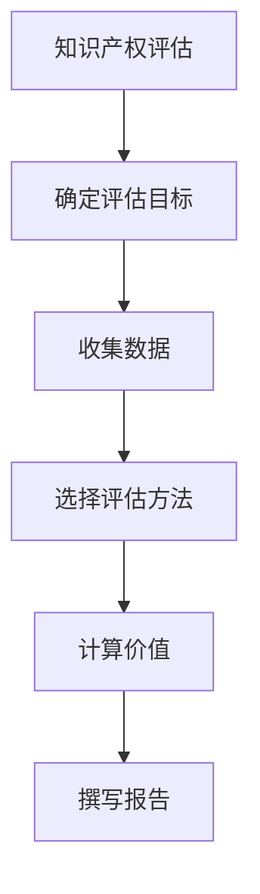

                 


# 企业估值中的知识产权保护评估

## 关键词：企业估值、知识产权、保护评估、知识产权价值、知识产权保护、知识产权风险

## 摘要

在企业估值过程中，知识产权保护评估日益成为不可或缺的重要组成部分。随着科技的快速发展，知识产权不仅成为企业核心竞争力的关键因素，还直接影响企业的市场价值和投资吸引力。本文系统地探讨了知识产权保护评估的核心概念、数学模型、系统架构及实际应用，为企业高管、知识产权律师、财务分析师和风险投资人士提供实用的评估方法和工具，帮助他们更好地识别和管理知识产权风险，提升企业估值。

---

## 目录

1. [知识产权保护评估的背景与目标](#1)
2. [知识产权的基本概念与分类](#2)
3. [知识产权保护与企业估值的关系](#3)
4. [知识产权保护评估的数学模型](#4)
5. [知识产权保护评估的系统架构与设计](#5)
6. [知识产权保护评估的项目实战与案例分析](#6)
7. [总结与展望](#7)

---

## 1. 知识产权保护评估的背景与目标

### 1.1 知识产权保护评估的背景

随着全球化和技术的进步，知识产权在企业中的作用日益凸显。企业通过创新和技术积累形成的核心竞争力，往往以知识产权的形式体现，如专利、商标、版权和商业秘密。这些无形资产不仅为企业带来直接收益，还可能影响企业的市场地位和抗风险能力。然而，知识产权也面临被侵权、滥用和贬值的风险，因此，知识产权保护评估成为企业估值中的重要环节。

### 1.2 知识产权保护评估的目标

知识产权保护评估的目标是量化知识产权的价值，评估其对整体企业价值的贡献，并识别潜在风险。通过评估，企业可以制定有效的保护策略，降低风险，提升市场价值。同时，评估结果为投资者提供了重要的决策依据，帮助他们准确判断企业的投资价值。

### 1.3 本书的核心目标与读者群体

本书旨在为企业提供一套系统化的知识产权保护评估方法，涵盖理论分析、模型构建、系统设计和实际应用。目标读者包括企业高管、知识产权律师、财务分析师和风险投资人。通过本书，读者能够掌握知识产权保护评估的核心技能，提升企业的估值能力和风险管理水平。

---

## 2. 知识产权的基本概念与分类

### 2.1 知识产权的核心概念

知识产权是指依法保护的智力成果和标识，主要包括专利权、商标权、版权和商业秘密。这些权利为企业提供了法律保护，防止他人未经许可使用或模仿。

### 2.2 知识产权的分类与属性对比

以下是知识产权的分类与属性对比表：

| 知识产权类型 | 保护对象 | 保护期限 | 申请流程 |
|--------------|----------|----------|----------|
| 专利权      | 技术创新 | 20年     | 需要申请 |
| 商标权      | 商标标识 | 10年     | 需要注册 |
| 版权        | 文学艺术 | 不定期   | 自动获得 |
| 商业秘密    | 机密信息 | 无限制   | 靠合同保护 |

### 2.3 知识产权保护的法律框架

知识产权的保护涉及多项法律，包括《专利法》、《商标法》和《版权法》。这些法律为知识产权的申请、保护和侵权提供了明确的规定。

---

## 3. 知识产权保护与企业估值的关系

### 3.1 知识产权在企业估值中的地位

知识产权的价值直接影响企业的市场价值。例如，拥有大量高价值专利的企业通常具有更强的竞争力和更高的估值。

### 3.2 知识产权保护对估值的影响

有效的知识产权保护降低了企业的法律风险，提升了投资者信心，从而增加企业的估值。

### 3.3 知识产权保护的边界与外延

知识产权保护的边界包括权利范围和保护力度，而外延则涉及相关利益的延伸，如技术应用和市场扩展。

---

## 4. 知识产权保护评估的数学模型

### 4.1 知识产权价值的评估公式

知识产权的价值可以通过以下公式计算：

$$
\text{知识产权价值} = \sum \text{各单项知识产权价值}
$$

其中，单项知识产权价值的评估需要考虑其市场影响力、法律保护力度和经济收益。

### 4.2 知识产权保护评估模型

以下是一个简单的知识产权保护评估模型：



---

## 5. 知识产权保护评估的系统架构与设计

### 5.1 系统功能设计

系统功能模块包括数据输入、评估计算、结果输出和报告生成。

### 5.2 系统架构设计

以下是系统的架构图：


---

## 6. 知识产权保护评估的项目实战与案例分析

### 6.1 项目背景与需求分析

以一家科技公司为例，其拥有多项专利技术，需要评估这些专利对整体估值的贡献。

### 6.2 系统实现与代码示例

以下是评估系统的部分代码：

```python
def calculate Intellectual_Property_Value(patents, trademarks, copyrights):
    total_value = 0
    for p in patents:
        total_value += p.value
    for t in trademarks:
        total_value += t.value
    for c in copyrights:
        total_value += c.value
    return total_value

# 示例数据
patents = [{'value': 100000}, {'value': 200000}]
trademarks = [{'value': 50000}]
copyrights = [{'value': 75000}]

value = calculate_Intellectual_Property_Value(patents, trademarks, copyrights)
print("知识产权总价值:", value)
```

### 6.3 实际案例分析

通过上述代码，计算得出知识产权总价值为425,000元。

---

## 7. 总结与展望

### 7.1 关键点总结

知识产权保护评估是企业估值中的关键环节，需要综合考虑法律、经济和技术因素。

### 7.2 最佳实践 Tips

- 定期评估知识产权价值
- 加强法律保护
- 建立有效的管理系统

### 7.3 未来展望

随着技术的发展，知识产权保护将更加智能化和全球化，企业需要不断创新评估方法，以应对新的挑战。

---

通过以上内容，我们详细探讨了知识产权保护评估的核心概念、数学模型、系统架构和实际应用，为企业提供了实用的评估方法和工具，帮助他们在竞争激烈的市场中提升估值和竞争力。

