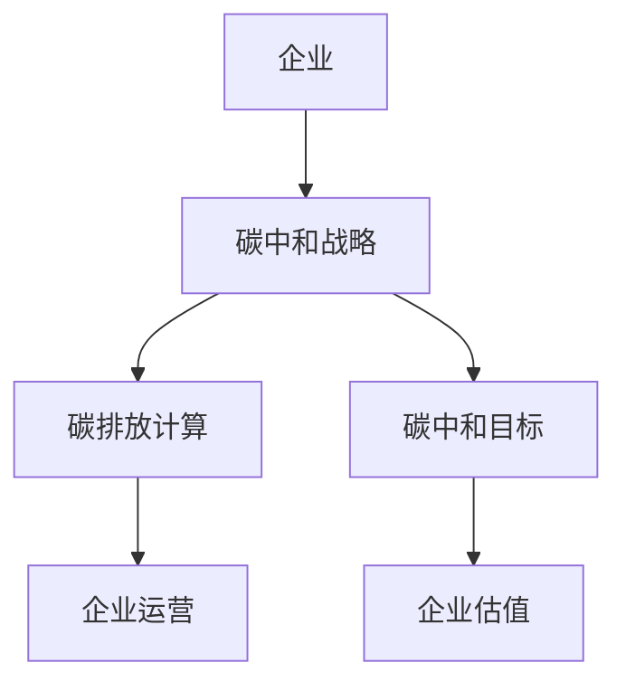
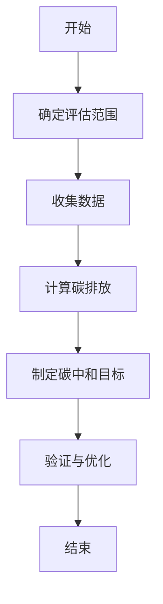
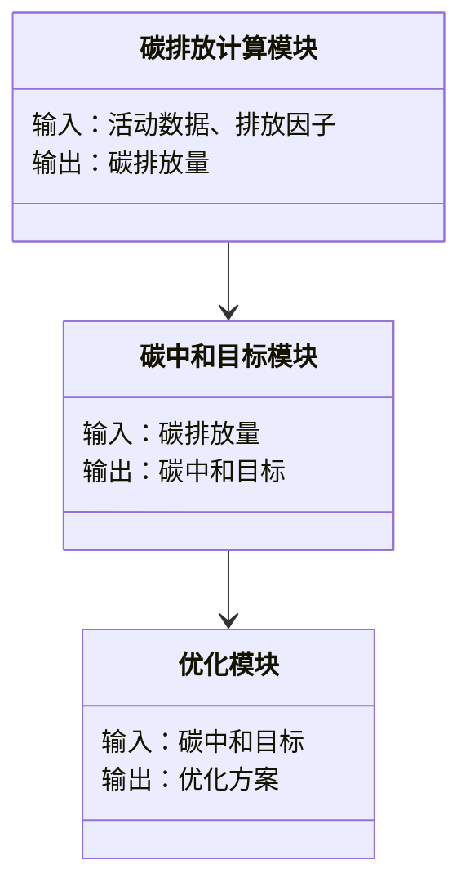
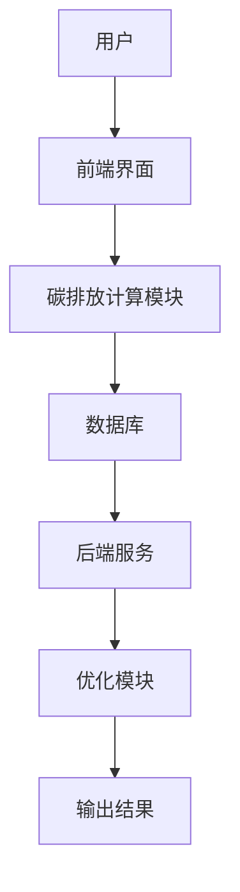
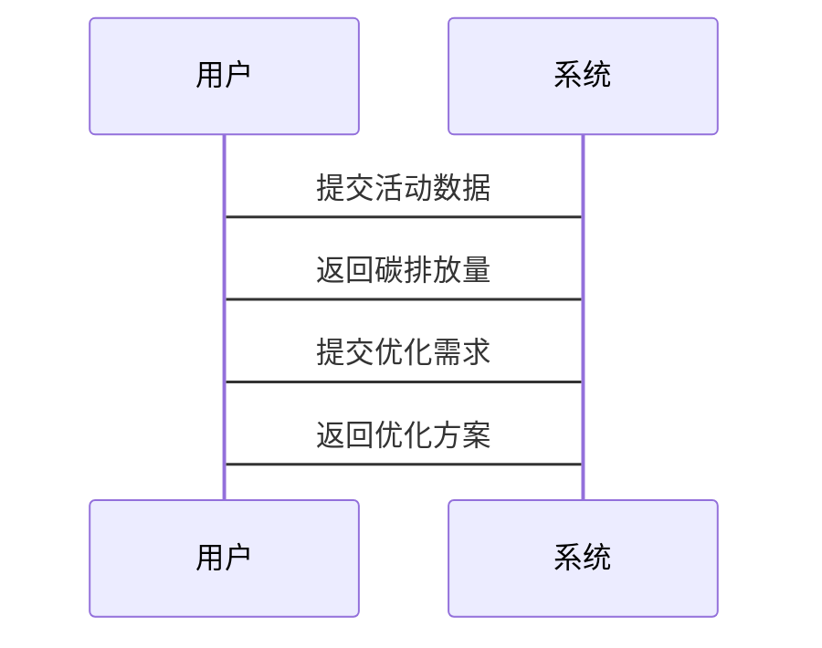

                 


# 企业估值中的碳中和战略评估

## 关键词：
- 企业估值
- 碳中和
- 碳排放计算
- 可持续发展
- 碳中和战略

## 摘要：
随着全球气候变化问题的加剧，碳中和已成为企业和投资者关注的焦点。企业估值不再仅关注财务指标，还需考虑碳中和战略的实施和影响。本文详细探讨碳中和战略对企业估值的核心作用，从背景、原理到系统设计，再到实际案例，全面分析碳中和如何成为企业价值评估的关键因素。

---

# 第1章: 碳中和与企业估值的背景介绍

## 1.1 碳中和的基本概念
### 1.1.1 碳中和的定义与内涵
碳中和是指企业通过减少碳排放和增加碳汇，使净碳排放量为零。它不仅是环境责任，更是企业可持续发展的核心策略。

### 1.1.2 碳中和的目标与意义
碳中和目标包括减少温室气体排放、使用可再生能源和碳抵消等。它不仅提升企业形象，还降低监管风险，增强竞争力。

### 1.1.3 碳中和与企业可持续发展的关系
碳中和战略是企业实现可持续发展的重要途径，通过减少环境影响，企业赢得客户和投资者的信任。

## 1.2 企业估值的背景与挑战
### 1.2.1 传统企业估值方法的局限性
传统估值方法忽视环境因素，导致无法全面评估企业价值。

### 1.2.2 碳中和对企业估值的影响
碳中和战略直接影响企业的运营成本、风险和竞争优势，进而影响估值。

### 1.2.3 碳中和战略在企业估值中的重要性
碳中和战略已成为投资者的重要考量因素，影响企业的长期价值和财务表现。

---

# 第2章: 碳中和战略的核心概念与联系

## 2.1 碳中和战略的原理
### 2.1.1 碳排放的计算与评估方法
碳排放计算包括直接排放（Scope 1）、间接排放（Scope 2）和潜在排放（Scope 3）。

### 2.1.2 碳中和目标的实现路径
包括减少排放、使用碳抵消和碳汇等方法。

### 2.1.3 碳中和战略与企业运营的结合
碳中和战略需与企业业务模式、供应链和技术创新相结合，才能有效实施。

## 2.2 核心概念对比分析
### 2.2.1 碳中和与碳减排的对比
碳中和是长期目标，而碳减排是阶段性的行动。

### 2.2.2 碳中和与企业社会责任的关系
碳中和是企业社会责任的重要组成部分，体现了企业的社会价值。

### 2.2.3 碳中和与企业竞争力的关联
实施碳中和战略有助于提升企业的市场竞争力和品牌价值。

## 2.3 实体关系架构


---

# 第3章: 碳中和战略评估的算法原理

## 3.1 碳足迹计算方法
### 3.1.1 生命周期评估法
通过评估产品或服务的全生命周期碳排放，确定碳足迹。

### 3.1.2 碳排放因子法
利用行业标准的碳排放因子，计算活动数据对应的碳排放。

### 3.1.3 碳中和目标实现的路径分析
通过技术手段和管理优化，减少碳排放，实现碳中和目标。

## 3.2 算法流程图


## 3.3 碳排放计算的Python代码实现
```python
import pandas as pd

def calculate_carbon_emissions(activity_data, emission_factor):
    emissions = activity_data * emission_factor
    return emissions.sum()

# 示例数据
activity_data = pd.DataFrame({
    'activity': [100, 200, 150],
    'unit': ['ton', 'kg', 'mwh']
})
emission_factor = pd.Series({'ton': 0.5, 'kg': 0.01, 'mwh': 0.2})

total_emissions = calculate_carbon_emissions(activity_data['activity'], emission_factor)
print(f"总碳排放量为: {total_emissions}")
```

## 3.4 数学模型和公式
### 碳排放总量计算公式：
$$ \text{总碳排放量} = \sum_{i=1}^{n} (\text{活动数据}_i \times \text{排放因子}_i) $$

### 碳中和目标可行性评估：
$$ \text{可行性} = \frac{\text{碳减排潜力}}{\text{总碳排放量}} \times 100\% $$

---

# 第4章: 系统分析与架构设计方案

## 4.1 问题场景介绍
碳中和战略评估系统需帮助企业计算碳排放，制定和优化碳中和目标。

## 4.2 系统功能设计


## 4.3 系统架构设计


## 4.4 系统接口设计
API接口：
- `GET /api/carbon/emissions`：获取碳排放数据
- `POST /api/carbon/optimization`：提交优化方案

## 4.5 系统交互流程图


---

# 第5章: 项目实战

## 5.1 环境安装
安装Python和相关库：
```bash
pip install pandas numpy
```

## 5.2 核心代码实现
```python
import pandas as pd

def calculate_carbon_emissions(activity_data, emission_factor):
    return (activity_data * emission_factor).sum()

activity_data = pd.Series([100, 200, 150], index=['电力', '交通', '生产'])
emission_factor = pd.Series({'电力': 0.5, '交通': 0.01, '生产': 0.2})

total_emissions = calculate_carbon_emissions(activity_data, emission_factor)
print(f"总碳排放量为: {total_emissions}")
```

## 5.3 实际案例分析
案例：某制造企业碳中和战略评估。
1. 计算碳排放：总排放量为500吨CO2。
2. 制定目标：2025年前实现碳中和。
3. 优化措施：采用可再生能源和碳抵消。

## 5.4 项目小结
通过实战项目，验证了碳中和战略评估的有效性，帮助企业实现减排目标。

---

# 第6章: 最佳实践与注意事项

## 6.1 最佳实践
1. 数据准确性是关键。
2. 结合企业实际，制定可行目标。
3. 持续监测和优化。

## 6.2 小结
碳中和战略评估是企业估值的重要组成部分，需结合实际，制定长期目标。

## 6.3 注意事项
- 数据收集要全面。
- 目标设定要合理。
- 持续跟踪和调整。

## 6.4 拓展阅读
推荐书籍：《碳中和：全球变暖的解决方案》。

---

通过以上章节，本文系统地介绍了碳中和战略在企业估值中的应用，从理论到实践，帮助读者全面理解并实施碳中和战略。

