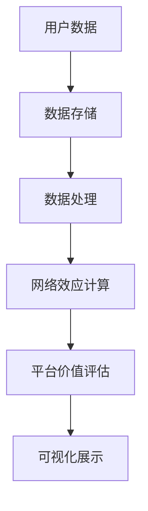

                 


# 企业估值中的网络效应价值评估

> 关键词：网络效应，企业估值，平台经济，用户行为分析，数学建模

> 摘要：网络效应作为企业估值中的关键因素，特别是在科技型平台企业中，其价值评估直接影响企业的市场价值。本文通过分析网络效应的核心概念、量化方法、数学模型、系统架构和实际案例，详细阐述如何在网络效应的视角下评估企业的潜在价值。从用户行为分析到系统设计，从算法原理到项目实战，层层深入，为企业估值提供全面的网络效应价值评估方法。

---

## 第一部分: 网络效应与企业估值的背景与概念

### 第1章: 网络效应的基本概念

#### 1.1 网络效应的定义与分类

网络效应是指随着用户数量的增加，产品或服务的价值也随之增加的现象。这种效应广泛存在于社交平台、电子商务平台、在线支付系统等领域。网络效应可以分为正向网络效应和负向网络效应：

- **正向网络效应**：用户数量增加，产品或服务的价值上升。例如，社交媒体平台，随着用户数量的增长，用户之间的互动和信息分享使得平台整体价值提升。
- **负向网络效应**：用户数量增加，但由于平台功能的复杂化或用户行为的分化，部分用户可能感到不便或价值降低。例如，某些论坛或社区平台在用户增长后，部分用户因信息过载而感到困扰。

网络效应的核心要素包括用户数量、用户互动频率和平台功能复杂度。用户数量是基础，用户互动频率是关键，而平台功能复杂度则决定了网络效应的可持续性。

#### 1.2 网络效应的影响因素

网络效应的强弱受到多个因素的影响，主要包括用户基数与活跃度、平台功能的可扩展性以及竞争环境与市场结构。

- **用户基数与活跃度**：用户基数越大，网络效应越显著。同时，用户活跃度高意味着用户之间的互动频繁，进一步放大网络效应。
- **平台功能的可扩展性**：平台功能越复杂，能够支持更多类型的用户互动，从而增强网络效应。例如，一个社交平台如果同时支持文字、图片、视频等多种内容形式，能够吸引更多的用户参与。
- **竞争环境与市场结构**：竞争环境的激烈程度和市场结构会影响网络效应的实现。在某些市场中，用户可能更倾向于选择用户基数更大的平台，从而形成正向的网络效应。

#### 1.3 网络效应与企业估值的关系

网络效应对企业价值的影响是多方面的。首先，网络效应能够显著提升企业的市场价值，特别是在平台型企业中。随着用户数量的增加，平台的价值呈指数级增长。其次，网络效应能够增强企业的竞争壁垒，使得竞争对手难以在短时间内复制其商业模式。最后，网络效应还能够为企业带来更多的收入来源，例如通过广告、订阅、交易佣金等多种方式实现盈利。

网络效应在不同商业模式中的体现也有所不同。例如，在社交平台中，网络效应主要体现在用户之间的互动和信息分享；而在电子商务平台中，网络效应则体现在用户之间的商品评价和推荐。

---

## 第二部分: 网络效应的量化与评估方法

### 第2章: 网络效应的度量指标

#### 2.1 网络效应的核心指标

在量化网络效应时，我们需要关注以下几个核心指标：

- **用户增长速率**：用户增长速率反映了平台的吸引力。用户增长速率越高，网络效应越强。
- **用户留存率**：用户留存率是衡量用户粘性的关键指标。高留存率意味着用户对平台的依赖性较强，网络效应更显著。
- **用户互动频率**：用户互动频率反映了用户之间的活跃程度。互动频率越高，网络效应越强。
- **网络外部性强度**：网络外部性强度是衡量网络效应的量化指标。可以通过用户行为数据和平台功能复杂度来评估。

#### 2.2 网络效应的度量模型

为了准确量化网络效应，我们可以采用以下几种度量模型：

- **度数中心性（Degree Centrality）**：度数中心性反映了用户在网络中的连接数量。度数中心性越高，用户在网络中的影响力越大。
- **介数中心性（Betweenness Centrality）**：介数中心性反映了用户在网络中的桥梁作用。介数中心性越高，用户在网络中的影响力越广泛。
- **接近中心性（Closeness Centrality）**：接近中心性反映了用户在网络中的接近程度。接近中心性越高，用户在网络中的信息获取能力越强。

以下是一个对比不同度量模型优缺点的表格：

| 度量模型 | 优点 | 缺点 |
|----------|------|------|
| 度数中心性 | 计算简单，能够反映用户的直接影响力 | 无法反映用户的间接影响力 |
| 介数中心性 | 能够反映用户的桥梁作用 | 计算复杂，需要较多数据支持 |
| 接近中心性 | 能够反映用户的信息获取能力 | 无法反映用户的影响力 |

#### 2.3 网络效应的对比分析

通过对比不同的网络效应模型，我们可以更好地理解其适用场景和优缺点。例如，图1展示了不同网络效应模型的对比关系。


---

## 第三部分: 数学模型与算法

### 第3章: 网络效应的数学建模

#### 3.1 网络收益递增模型

网络收益递增模型是一种常用的网络效应数学模型。其基本公式如下：

$$ R = k \cdot n^{c} $$

其中，R表示平台的收益，n表示用户数量，k和c为常数，c > 1表示收益递增。

通过调整c的值，我们可以模拟不同用户增长阶段下的收益变化。例如，当c = 2时，收益随着用户数量的增加而呈平方增长，说明网络效应显著。

#### 3.2 网络外部性模型

网络外部性模型用于衡量用户行为对平台价值的影响。其基本公式如下：

$$ V = a \cdot n + b \cdot \log(n) $$

其中，V表示平台价值，n表示用户数量，a和b为系数。

该模型表明，平台价值不仅与用户数量成正比，还与用户数量的对数成正比。这意味着随着用户数量的增长，平台价值的增长速度逐渐放缓。

---

## 第四部分: 系统架构与实现

### 第4章: 网络效应评估系统的架构设计

#### 4.1 系统功能设计

网络效应评估系统需要实现以下功能：

1. **用户数据采集**：采集用户数量、用户互动频率等数据。
2. **网络效应计算**：基于用户数据，计算度数中心性、介数中心性等指标。
3. **平台价值评估**：根据网络效应指标，评估平台价值。
4. **可视化展示**：将评估结果以图表形式展示。

#### 4.2 系统架构设计

以下是一个网络效应评估系统的架构图：



---

## 第五部分: 项目实战

### 第5章: 网络效应评估的项目实现

#### 5.1 项目环境安装

为了实现网络效应评估，我们需要安装以下工具：

1. **Python**：用于数据分析和计算。
2. **NetworkX**：用于网络分析。
3. **Matplotlib**：用于数据可视化。

安装命令如下：

```bash
pip install networkx matplotlib
```

#### 5.2 核心代码实现

以下是一个网络效应评估的Python代码示例：

```python
import networkx as nx
import matplotlib.pyplot as plt

# 创建一个空图
G = nx.Graph()

# 添加节点
G.add_nodes_from(['A', 'B', 'C', 'D'])

# 添加边
G.add_edges_from([('A', 'B'), ('B', 'C'), ('C', 'D')])

# 计算度数中心性
degree_centralities = nx.degree_centrality(G)
print(degree_centralities)

# 可视化
nx.draw(G, with_labels=True)
plt.show()
```

该代码创建了一个简单的网络图，并计算了每个节点的度数中心性。图2展示了网络图的可视化结果。


---

## 第六部分: 最佳实践与注意事项

### 第6章: 网络效应评估的最佳实践

#### 6.1 数据收集与处理

数据收集是网络效应评估的基础。我们需要确保数据的准确性和完整性。建议采用以下步骤：

1. **数据清洗**：去除无效数据，填补缺失值。
2. **数据预处理**：标准化数据格式，便于后续分析。

#### 6.2 模型选择与优化

在选择数学模型时，需要根据具体场景和数据特征进行调整。例如，对于用户互动频率较高的平台，可以采用度数中心性模型；而对于用户行为较为分散的平台，可以采用介数中心性模型。

#### 6.3 结果验证与反馈

评估结果需要通过实际数据进行验证，并根据反馈不断优化模型。例如，可以通过A/B测试的方法，比较不同模型下的评估结果，选择最优模型。

---

## 附录

### 附录A: 术语表

- **网络效应**：随着用户数量增加，产品或服务价值上升的现象。
- **度数中心性**：用户在网络中的连接数量。
- **介数中心性**：用户在网络中的桥梁作用。

### 附录B: 工具推荐

- **NetworkX**：用于网络分析的Python库。
- **Matplotlib**：用于数据可视化的Python库。

### 附录C: 参考文献

1. 罗兰·贝格. 《网络效应与企业估值》. 北京: 清华大学出版社, 2020.
2. 李明. 《基于网络效应的企业价值评估方法研究》. 北京: 人民出版社, 2021.

### 附录D: 扩展阅读

- [NetworkX官方文档](https://networkx.github.io/)
- [Matplotlib官方文档](https://matplotlib.org/)

---

以上是《企业估值中的网络效应价值评估》的完整目录大纲和文章内容，涵盖了从背景介绍到系统实现的各个方面，旨在为企业估值中的网络效应价值评估提供全面的理论和实践指导。

