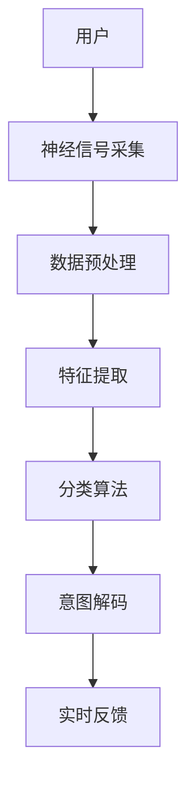
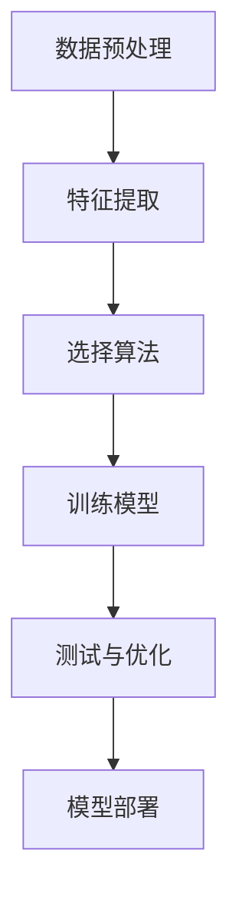
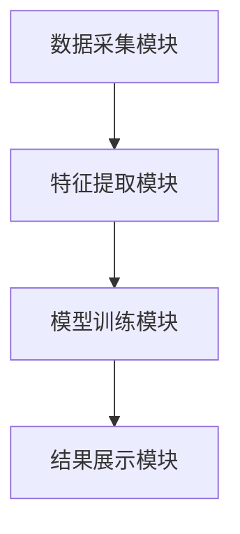
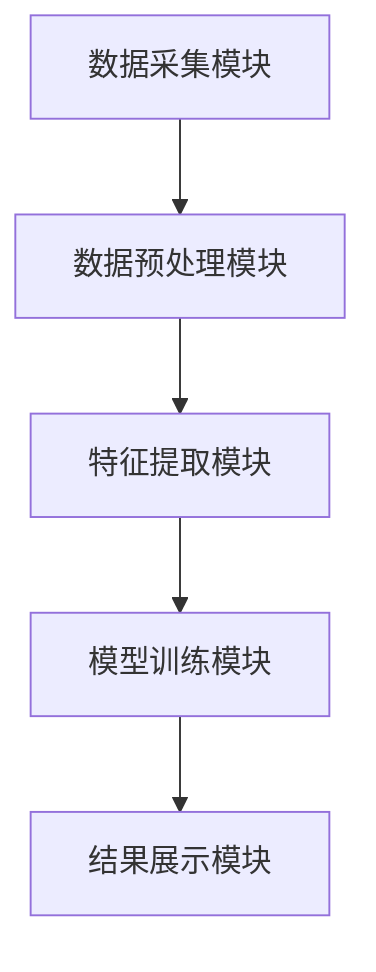
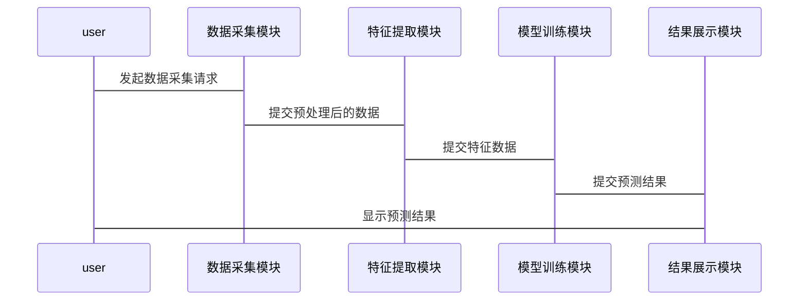

                 

# 企业估值中的脑机接口技术潜力评估

---

## 关键词：
脑机接口、企业估值、潜力评估、神经信号、数据驱动

---

## 摘要：
脑机接口（BCI）技术作为一种革命性的神经科学技术，正在逐步从实验室走向实际应用。在企业估值领域，脑机接口技术通过采集和分析神经信号，为企业价值评估提供了全新的视角和方法。本文从脑机接口技术的基本原理出发，结合企业估值的核心需求，详细探讨了脑机接口技术在潜力评估中的应用价值、实现方法以及系统架构设计。通过对技术原理、算法模型和系统架构的深入分析，本文旨在为企业估值提供一种基于神经科学的创新解决方案。

---

## 第1章: 脑机接口技术与企业估值概述

### 1.1 脑机接口技术的定义与核心概念

#### 1.1.1 脑机接口技术的定义
脑机接口（Brain-Computer Interface, BCI）是一种通过直接连接人脑与外部设备的技术，旨在通过采集、分析和解码神经信号，实现人脑与计算机或其他设备之间的信息交互。BCI技术的核心在于理解和解析神经信号，从而将人类的意图转化为可被计算机识别的指令。

#### 1.1.2 脑机接口技术的核心要素
- **神经信号采集**：通过 EEG（脑电图）、fMRI（功能性磁共振成像）等设备采集大脑神经活动信号。
- **信号处理**：对采集到的神经信号进行预处理、特征提取和降噪。
- **意图解码**：通过算法模型将神经信号转化为具体的意图或指令。
- **用户反馈**：通过实时反馈机制优化神经信号的采集和解码过程。

#### 1.1.3 脑机接口技术的分类与应用场景
| 类型          | 描述                                      | 应用场景                     |
|---------------|-------------------------------------------|------------------------------|
| 非侵入式BCI   | 通过头皮电极采集脑电活动，无创性强          | 辅助康复、游戏娱乐、市场调研 |
| 侵入式BCI     | 直接植入大脑，信号采集精度高              | 神经康复、治疗癫痫           |
| 混合式BCI     | 结合非侵入式和侵入式技术，兼顾便捷性和精度 | 精准医疗、高端科研           |

### 1.2 企业估值中的脑机接口技术潜力评估背景

#### 1.2.1 企业估值的基本概念与方法
企业估值是通过对企业的财务状况、市场地位、发展潜力等多方面因素的综合评估，确定其市场价值的过程。传统的企业估值方法主要包括：

- **财务指标法**：基于收入、利润、现金流等财务数据进行估值。
- **市场比较法**：通过对比同行业可比企业的市场表现进行估值。
- **DCF模型**：基于现金流折现法进行估值。

#### 1.2.2 脑机接口技术在企业估值中的潜在价值
脑机接口技术能够通过采集和分析神经信号，揭示企业的潜在价值和市场反应。例如：

- **消费者偏好分析**：通过分析消费者对产品或服务的神经反应，评估市场需求和潜在收益。
- **员工情绪监测**：通过分析员工的工作状态和情绪，评估企业内部效率和凝聚力。
- **市场反应预测**：通过分析市场参与者对企业的神经反应，预测市场走势和企业价值。

#### 1.2.3 当前技术发展对企业估值的影响
随着脑机接口技术的不断发展，其在企业估值中的应用潜力逐渐显现。然而，目前仍面临以下挑战：

- **数据采集成本高**：脑机接口设备的使用需要较高的技术门槛和设备投入。
- **数据隐私问题**：神经信号数据的采集和处理涉及个人隐私保护。
- **技术成熟度不足**：脑机接口技术在企业估值中的应用仍处于探索阶段。

---

## 第2章: 脑机接口技术的核心原理与实现

### 2.1 脑机接口技术的基本原理

#### 2.1.1 神经信号的采集与处理
- **信号采集**：通过 EEG 设备采集头皮电位变化，记录大脑神经活动。
- **数据预处理**：去除噪声、漂移和伪迹，提取有用的神经信号特征。
- **特征提取**：通过傅里叶变换、小波分析等方法提取信号的频域和时域特征。

#### 2.1.2 神经信号的特征提取与分析
- **特征选择**：筛选出与目标任务相关的神经特征，如 α 波、β 波等。
- **分类算法**：使用支持向量机（SVM）、随机森林等算法对神经特征进行分类。

#### 2.1.3 神经信号的解码与应用
- **意图解码**：通过训练好的模型，将神经信号转化为具体的意图或指令。
- **实时反馈**：将解码结果实时反馈给用户，优化神经信号的采集和解码过程。

#### 2.1.4 脑机接口系统的组成与流程

### 2.2 脑机接口技术的关键算法

#### 2.2.1 常见的脑机接口算法介绍
| 算法名称       | 描述                                      | 优点                     | 缺点                     |
|----------------|-------------------------------------------|--------------------------|--------------------------|
| LDA            | 线性判别分析，用于分类和降维              | 简单高效                 | 易受数据分布影响         |
| SVM            | 支持向量机，用于分类和回归                | 高精度                   | 计算复杂性较高           |
| Random Forest  | 随机森林，基于决策树的集成算法            | 鲁棒性强                 | 训练时间较长             |
| LSTM            | 长短期记忆网络，用于时间序列分析          | 适合处理时序数据         | 参数多，训练复杂          |

#### 2.2.2 算法的选择与优化
- **算法选择**：根据具体应用场景和数据特点选择合适的算法。
- **参数优化**：通过交叉验证和网格搜索优化算法参数，提高分类精度。

#### 2.2.3 算法的实现步骤

#### 2.2.4 算法的数学模型与公式
- **线性判别分析（LDA）**：
  - 模型目标：最大化类间距离，最小化类内距离。
  - 损失函数：$L = \sum_{i=1}^{n} y_i \log p(y_i) + (1 - y_i)\log (1 - p(y_i))$
- **支持向量机（SVM）**：
  - 模型目标：在特征空间中找到一个超平面，使得正负样本分离。
  - 损失函数：$L = \sum_{i=1}^{n} \xi_i + C \sum_{i=1}^{n} \xi_i$

### 2.3 脑机接口技术的实现流程

#### 2.3.1 数据采集与预处理
- **数据采集**：通过 EEG 设备采集神经信号，记录时间戳和信号强度。
- **数据预处理**：去除噪声、漂移和伪迹，提取有用信号。

#### 2.3.2 特征提取与分类
- **特征提取**：使用傅里叶变换提取信号的频域特征，如功率谱密度（PSD）。
- **分类算法**：通过 SVM 或 Random Forest 对特征进行分类，得到分类结果。

#### 2.3.3 神经信号解码与应用
- **意图解码**：根据分类结果，解码出具体的意图或指令。
- **实时反馈**：将解码结果反馈给用户，优化神经信号的采集和解码过程。

---

## 第3章: 脑机接口技术在企业估值中的潜力评估方法

### 3.1 潜力评估的核心指标

#### 3.1.1 技术可行性评估
- **技术成熟度**：脑机接口技术的成熟度和可靠性。
- **数据采集成本**：设备成本、数据处理成本等。

#### 3.1.2 市场需求评估
- **目标市场规模**：企业估值领域的市场规模和增长潜力。
- **市场竞争情况**：现有解决方案和技术提供商的市场占有率。

#### 3.1.3 经济效益评估
- **成本效益分析**：脑机接口技术的投入与收益比。
- **投资回收期**：技术投入的回报周期。

### 3.2 潜力评估的数学模型与公式

#### 3.2.1 模型的构建与假设
- **模型假设**：假设神经信号与企业价值存在显著相关性。
- **模型目标**：通过神经信号数据预测企业价值。

#### 3.2.2 模型的输入与输出
- **输入**：神经信号特征、企业财务数据。
- **输出**：企业估值预测值。

#### 3.2.3 模型的验证与优化
- **验证方法**：通过交叉验证和ROC曲线评估模型性能。
- **优化策略**：调整模型参数，引入更多的特征和数据。

#### 3.2.4 潜力评估的数学公式
- **线性回归模型**：
  $$ y = \beta_0 + \beta_1 x_1 + \beta_2 x_2 + \ldots + \beta_n x_n + \epsilon $$
  其中，$y$ 为预测的企业价值，$x_i$ 为神经信号特征，$\beta_i$ 为回归系数，$\epsilon$ 为误差项。
- **逻辑回归模型**：
  $$ P(y=1|x) = \frac{e^{\beta_0 + \beta_1 x_1 + \ldots + \beta_n x_n}}{1 + e^{\beta_0 + \beta_1 x_1 + \ldots + \beta_n x_n}} $$

### 3.3 潜力评估的实施步骤

#### 3.3.1 数据收集与整理
- **数据来源**：收集企业的财务数据和神经信号数据。
- **数据清洗**：去除无效数据和异常值。

#### 3.3.2 数据分析与建模
- **特征工程**：提取与企业估值相关的神经信号特征。
- **模型训练**：使用机器学习算法对数据进行建模和训练。

#### 3.3.3 结果解读与应用
- **结果解读**：分析模型预测结果，评估脑机接口技术在企业估值中的潜力。
- **实际应用**：将模型应用于实际企业估值中，验证其有效性和可行性。

### 3.4 本章小结

---

## 第4章: 脑机接口技术潜力评估的系统架构设计

### 4.1 问题场景介绍
企业估值中的脑机接口技术潜力评估系统需要满足以下需求：
- 实时采集和处理神经信号数据。
- 高效分析和解码神经信号，预测企业价值。
- 提供直观的可视化界面，方便用户查看和分析结果。

### 4.2 系统功能设计

#### 4.2.1 系统模块划分
- **数据采集模块**：负责采集和预处理神经信号数据。
- **特征提取模块**：提取与企业估值相关的神经信号特征。
- **模型训练模块**：训练和优化潜力评估模型。
- **结果展示模块**：可视化模型预测结果和企业估值分析。

#### 4.2.2 系统功能流程

### 4.3 系统架构设计

#### 4.3.1 系统架构图

#### 4.3.2 系统接口设计
- **数据接口**：提供 RESTful API 接口，供其他系统调用。
- **用户界面**：提供直观的可视化界面，方便用户操作。

### 4.4 系统交互设计

#### 4.4.1 交互流程

#### 4.4.2 交互界面设计
- **数据采集界面**：显示采集设备的状态和数据采集进度。
- **结果展示界面**：显示模型预测结果和可视化分析。

### 4.5 本章小结

---

## 第5章: 项目实战——基于脑机接口的企业估值潜力评估

### 5.1 项目背景与目标
本项目旨在通过脑机接口技术，评估企业在市场中的潜在价值。通过采集和分析神经信号数据，结合企业财务数据，构建一个基于神经科学的企业估值模型。

### 5.2 项目核心实现

#### 5.2.1 环境安装与配置
- **安装 EEG 数据采集设备**：如 OpenBCI 或 Emotiv Epoc。
- **安装数据分析工具**：如 Python、Matplotlib、Scikit-learn。
- **安装可视化工具**：如 Tableau 或 Power BI。

#### 5.2.2 数据采集与预处理
- **数据采集**：通过 EEG 设备采集神经信号数据。
- **数据预处理**：去除噪声和伪迹，提取有用信号。

#### 5.2.3 模型训练与优化
- **特征提取**：使用傅里叶变换提取神经信号的频域特征。
- **模型训练**：基于 SVM 或 Random Forest 算法训练潜力评估模型。
- **模型优化**：通过交叉验证和网格搜索优化模型参数。

#### 5.2.4 结果展示与分析
- **结果展示**：通过可视化工具展示模型预测结果和分析报告。
- **结果解读**：结合神经信号数据和企业财务数据，分析脑机接口技术在企业估值中的应用效果。

### 5.3 项目小结

---

## 第6章: 最佳实践与注意事项

### 6.1 最佳实践
- **数据质量控制**：确保神经信号数据的准确性和完整性。
- **模型优化**：通过不断优化算法和参数，提高模型的预测精度。
- **隐私保护**：严格遵守数据隐私保护法规，确保神经信号数据的安全性。

### 6.2 注意事项
- **技术成熟度**：脑机接口技术目前仍处于发展阶段，需谨慎评估其实际应用效果。
- **数据依赖性**：模型的预测结果依赖于高质量的数据，数据不足可能导致模型性能下降。
- **伦理问题**：神经信号数据的采集和使用需遵循相关伦理规范。

### 6.3 拓展阅读
- **推荐书籍**：《脑机接口入门》、《数据驱动的企业估值》。
- **推荐论文**：Nature Neuroscience 和 Science 上的相关研究论文。

### 6.4 本章小结

---

## 结语
脑机接口技术作为一项前沿的神经科学技术，正在逐步改变我们对企业估值的认知和方法。通过采集和分析神经信号数据，脑机接口技术为企业估值提供了全新的视角和方法。然而，其应用仍面临技术成熟度、数据隐私和伦理等问题，需要我们进一步研究和探索。

---

**附录**：包含完整的代码示例和数据集链接。

