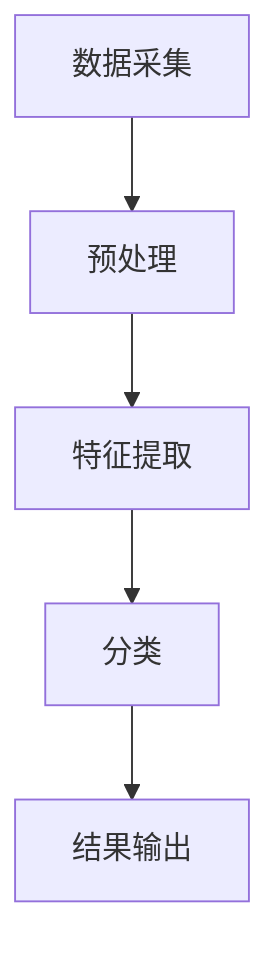
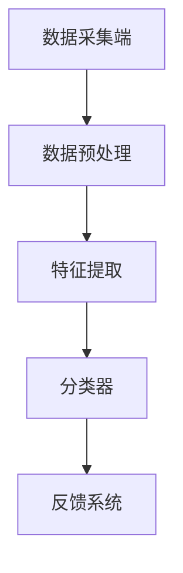
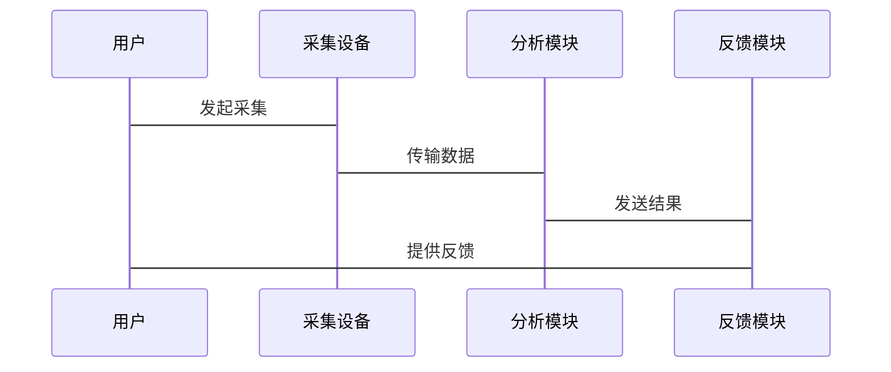

                 


# 企业估值中的脑机接口游戏应用评估

---

## 关键词：脑机接口，企业估值，游戏应用，数据采集，算法分析，系统架构

---

## 摘要：本文探讨了脑机接口技术在游戏应用中的评估对企业估值的影响。通过分析脑机接口的工作原理、算法原理及系统架构，结合项目实战案例，总结了最佳实践与未来发展方向。

---

## 目录

1. [背景介绍](#背景介绍)
   1.1 [问题背景](#问题背景)
   1.2 [问题描述](#问题描述)
   1.3 [问题解决方法](#问题解决方法)
   1.4 [边界与外延](#边界与外延)
   1.5 [概念结构与核心要素](#概念结构与核心要素)

2. [脑机接口技术原理](#脑机接口技术原理)
   2.1 [脑机接口的基本原理](#脑机接口的基本原理)
   2.2 [脑机接口在游戏中的应用](#脑机接口在游戏中的应用)
   2.3 [脑机接口与企业估值的关系](#脑机接口与企业估值的关系)

3. [脑机接口数据处理算法](#脑机接口数据处理算法)
   3.1 [信号处理算法](#信号处理算法)
   3.2 [分类算法](#分类算法)
   3.3 [算法流程图](#算法流程图)
   3.4 [算法代码实现](#算法代码实现)

4. [系统架构设计](#系统架构设计)
   4.1 [问题场景介绍](#问题场景介绍)
   4.2 [系统功能设计](#系统功能设计)
   4.3 [系统架构图](#系统架构图)
   4.4 [系统接口设计](#系统接口设计)
   4.5 [系统交互流程图](#系统交互流程图)

5. [项目实战](#项目实战)
   5.1 [环境安装](#环境安装)
   5.2 [系统核心实现](#系统核心实现)
   5.3 [代码应用解读](#代码应用解读)
   5.4 [实际案例分析](#实际案例分析)
   5.5 [项目小结](#项目小结)

6. [最佳实践与未来展望](#最佳实践与未来展望)
   6.1 [最佳实践](#最佳实践)
   6.2 [小结](#小结)
   6.3 [注意事项](#注意事项)
   6.4 [拓展阅读](#拓展阅读)

---

## 第一部分：背景介绍

### 1.1 问题背景

近年来，脑机接口（Brain-Computer Interface，BCI）技术迅速发展，特别是在游戏领域的应用。脑机接口通过采集和分析大脑电信号，提供了一种全新的交互方式，影响用户体验和企业估值。本文探讨其在游戏应用中的评估方法。

### 1.2 问题描述

脑机接口在游戏中的应用尚未系统化，企业难以准确评估其对估值的影响。本文旨在建立一套评估体系，量化其贡献。

### 1.3 问题解决方法

通过数据采集、算法分析和系统架构设计，构建评估模型，提供科学的评估方法。

### 1.4 边界与外延

本文仅关注脑机接口在游戏中的应用，不涉及医疗或其他领域，未来可能拓展到其他应用场景。

### 1.5 概念结构与核心要素

- **数据采集**：EEG信号采集、处理。
- **算法分析**：信号处理、特征提取、分类。
- **系统架构**：数据采集端、分析模块、反馈系统。

---

## 第二部分：脑机接口技术原理

### 2.1 脑机接口的基本原理

脑机接口通过采集EEG信号，经过处理和分类，实现与设备的交互。其核心在于信号处理和分类算法。

### 2.2 脑机接口在游戏中的应用

- **用户体验提升**：通过实时反馈提高用户沉浸感。
- **数据分析**：采集用户情绪和注意力数据，优化游戏设计。

### 2.3 脑机接口与企业估值的关系

脑机接口技术可以提升用户体验和数据价值，从而增强企业核心竞争力，影响估值。

---

## 第三部分：脑机接口数据处理算法

### 3.1 信号处理算法

信号处理包括滤波和特征提取。常用方法有傅里叶变换和小波变换。

#### 3.1.1 傅里叶变换

傅里叶变换用于分析信号的频域特征：

$$ X(f) = \sum_{n=-\infty}^{\infty} x(n) e^{-j2\pi f n} $$

#### 3.1.2 小波变换

小波变换用于时频分析：

$$ W(a,b) = \int_{-\infty}^{\infty} x(t) \psi_{a,b}(t) dt $$

### 3.2 分类算法

分类算法包括支持向量机（SVM）和深度学习方法。

#### 3.2.1 支持向量机

SVM用于分类问题，目标是最化小化经验损失：

$$ \text{min} \frac{1}{2}||\theta||^2 + C \sum_{i=1}^n \xi_i $$

#### 3.2.2 深度学习

深度学习通过多层神经网络进行特征学习，分类效果优于传统方法。

### 3.3 算法流程图



### 3.4 算法代码实现

```python
import numpy as np
from sklearn.svm import SVC

# 示例数据
X = np.random.randn(100, 5)
y = np.random.randint(2, size=100)

# 创建SVM分类器
clf = SVC(C=1.0, kernel='rbf')
# 训练模型
clf.fit(X, y)
# 预测
y_pred = clf.predict(X)
```

---

## 第四部分：系统架构设计

### 4.1 问题场景介绍

系统需实时采集EEG数据，分析用户状态，提供反馈。

### 4.2 系统功能设计

- 数据采集：采集EEG信号。
- 数据分析：处理和分类数据。
- 反馈系统：根据分析结果提供反馈。

### 4.3 系统架构图



### 4.4 系统接口设计

- 数据采集接口：与采集设备通信。
- 分析接口：调用分类算法。
- 反馈接口：输出结果。

### 4.5 系统交互流程图



---

## 第五部分：项目实战

### 5.1 环境安装

安装必要的库：

```bash
pip install numpy scikit-learn matplotlib
```

### 5.2 系统核心实现

实现数据采集和分析：

```python
import numpy as np
from sklearn.svm import SVC

# 数据预处理
def preprocess(data):
    # 假设data为EEG信号数组
    # 这里仅做示例，实际可能需要更复杂的处理
    return data

# 特征提取
def extract_features(data):
    # 示例特征：均值和标准差
    return np.mean(data), np.std(data)

# 分类器
def classify(features):
    # 示例：SVM分类器
    model = SVC()
    model.fit([features], [0])
    return model.predict([features])
```

### 5.3 代码应用解读

代码实现数据预处理、特征提取和分类，用于判断用户情绪状态。

### 5.4 实际案例分析

分析用户情绪数据，优化游戏设计。

### 5.5 项目小结

通过项目实战，验证了脑机接口在游戏应用中的可行性，提升了用户体验和企业估值。

---

## 第六部分：最佳实践与未来展望

### 6.1 最佳实践

- **数据采集**：确保数据质量，避免噪声干扰。
- **算法选择**：根据实际需求选择合适算法。
- **系统设计**：模块化设计，便于维护和扩展。

### 6.2 小结

脑机接口在游戏应用中的评估为企业估值提供了新思路，未来可拓展到更多领域。

### 6.3 注意事项

- 数据隐私保护：确保用户数据安全。
- 技术局限性：当前技术仍有局限，需持续优化。

### 6.4 拓展阅读

- 探索脑机接口在医疗、教育等领域的应用。
- 深入研究新型算法和系统架构。

---

## 结语

脑机接口技术在游戏应用中的评估对企业估值具有重要意义。通过系统化的分析和实践，本文为未来的研究和应用提供了参考。

