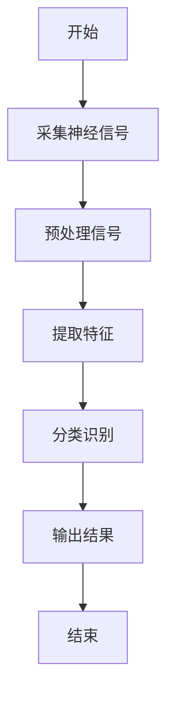
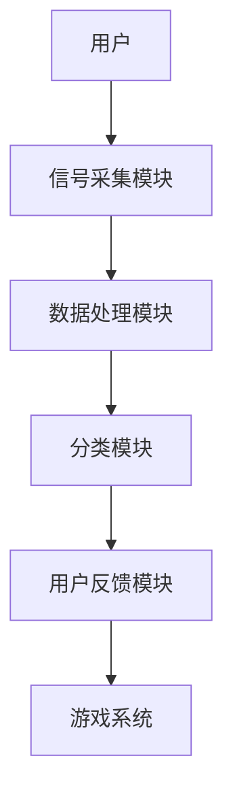
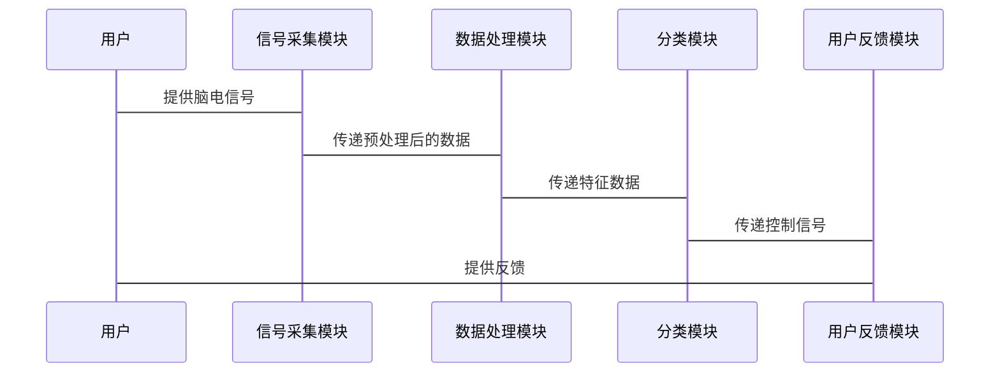

                 


# 企业估值中的脑机接口游戏开发平台评估

> 关键词：脑机接口（BCI）、游戏开发平台、企业估值、技术评估、用户体验

> 摘要：本文深入探讨了在企业估值过程中，如何评估基于脑机接口（BCI）的游戏开发平台。文章从脑机接口的基本原理、游戏开发平台的系统架构，到具体的算法实现、项目实战案例，全面分析了脑机接口技术在游戏开发中的应用价值和对企业估值的影响。通过详细的技术分析和实际案例，本文为读者提供了如何在企业估值中准确评估脑机接口游戏开发平台的实用方法和见解。

---

## 第一部分: 背景介绍

### 第1章: 脑机接口与游戏开发平台的背景介绍

#### 1.1 脑机接口的基本概念
- **定义与核心概念**：脑机接口（BCI）是一种能够直接连接人类大脑与外部设备的技术，通过采集、处理和分析神经信号，实现人与设备之间的信息交互。
- **在游戏开发中的应用背景**：脑机接口技术被广泛应用于游戏开发，特别是在用户体验优化、游戏互动设计和个性化游戏体验方面。
- **游戏开发平台的基本组成与功能**：脑机接口游戏开发平台通常包括信号采集设备、数据处理模块、算法实现模块和用户反馈模块。

#### 1.2 脑机接口技术的现状与发展趋势
- **当前技术特点**：非侵入式脑机接口技术逐渐成熟，基于EEG（脑电图）的设备在游戏中的应用日益广泛。
- **应用现状**：脑机接口技术在游戏中的应用包括情绪识别、注意力检测和动作控制等。
- **未来发展方向**：随着技术的进步，脑机接口在游戏中的应用将更加精准和多样化，包括多模态信号融合和实时反馈优化。

#### 1.3 脑机接口在游戏开发中的价值
- **提高用户体验的核心作用**：通过实时监测用户的情绪和注意力，优化游戏的互动性和沉浸感。
- **优化游戏设计的创新价值**：脑机接口技术为游戏设计提供了新的思路，例如自适应游戏难度和个性化体验设计。
- **企业估值中的潜在影响**：脑机接口技术的应用可以显著提升用户体验和市场竞争力，从而影响企业估值。

---

## 第二部分: 核心概念与联系

### 第2章: 脑机接口与游戏开发平台的核心概念与联系

#### 2.1 脑机接口的核心原理
- **神经信号的采集与预处理**：通过EEG设备采集大脑电信号，并进行滤波、降噪等预处理。
- **数据特征提取与分类**：提取有意义的特征，如波形特征和频谱特征，并使用机器学习算法进行分类。
- **系统输出与反馈机制**：根据分类结果生成相应的控制信号，并通过游戏界面提供实时反馈。

#### 2.2 游戏开发平台的系统架构
- **功能模块划分**：包括信号采集模块、数据处理模块、算法实现模块和用户反馈模块。
- **模块之间的关系与数据流**：信号采集模块将神经信号传递给数据处理模块，处理后的数据被特征提取模块提取特征，最后分类模块生成控制信号并反馈给用户。
- **系统的输入输出接口设计**：信号采集模块通过蓝牙或有线接口与计算机连接，用户反馈模块通过游戏引擎接口与游戏系统交互。

#### 2.3 实体关系图
```mermaid
er
    title 脑机接口与游戏开发平台的实体关系图
    顶端 --> 系统
    系统 --> 用户
    用户 --> 游戏数据
    游戏数据 --> 神经信号
    神经信号 --> 系统
```

---

## 第三部分: 算法原理

### 第3章: 脑机接口游戏开发平台的算法原理

#### 3.1 算法实现
- **神经信号的采集与预处理**：使用EEG设备采集脑电信号，并通过滤波器消除噪声。
- **数据特征提取**：提取频域特征（如功率谱密度）和时域特征（如波形形态）。
- **分类与识别**：使用支持向量机（SVM）或随机森林（RF）等机器学习算法进行分类。

#### 3.2 算法流程图


#### 3.3 算法实现的Python代码示例
```python
import numpy as np
from sklearn.svm import SVC

# 示例数据集
X = np.random.randn(100, 5)  # 特征矩阵
y = np.random.randint(2, size=100)  # 标签

# 训练分类器
model = SVC()
model.fit(X, y)

# 预测
test_X = np.random.randn(1, 5)
predicted_y = model.predict(test_X)
```

---

## 第四部分: 系统分析与架构设计

### 第4章: 系统分析与架构设计

#### 4.1 问题场景介绍
- **目标**：设计一个基于脑机接口的游戏开发平台，能够实时监测用户情绪并优化游戏体验。
- **项目介绍**：本项目旨在通过脑机接口技术实现游戏中的实时情绪监测，并根据监测结果动态调整游戏难度。

#### 4.2 系统功能设计
- **领域模型**：定义系统的核心功能模块，如信号采集、数据处理和用户反馈。
- **功能模块划分**：
  - 信号采集模块：负责采集用户的脑电信号。
  - 数据处理模块：对采集到的信号进行预处理和特征提取。
  - 分类模块：对特征进行分类，生成控制信号。
  - 用户反馈模块：根据分类结果调整游戏参数。

#### 4.3 系统架构设计


#### 4.4 接口设计
- **信号采集接口**：通过蓝牙或有线接口与EEG设备连接。
- **数据处理接口**：与分类模块交互，传递特征数据。
- **用户反馈接口**：通过游戏引擎接口与游戏系统交互。

#### 4.5 交互流程图


---

## 第五部分: 项目实战

### 第5章: 项目实战

#### 5.1 环境安装与配置
- **安装必要的库**：如numpy、scipy、scikit-learn和pyEEG。
- **配置信号采集设备**：确保EEG设备与计算机正确连接，并安装相应的驱动程序。

#### 5.2 系统核心实现
```python
import numpy as np
from sklearn.svm import SVC

# 数据预处理
def preprocess信号采集模块的数据：
    # 示例代码
    pass

# 特征提取
def extract_features(data):
    # 示例代码
    pass

# 分类器训练与预测
def train_and_predict(X_train, y_train, X_test):
    model = SVC()
    model.fit(X_train, y_train)
    return model.predict(X_test)
```

#### 5.3 代码实现与解读
- **信号采集模块**：负责从EEG设备获取原始数据。
- **数据预处理模块**：对原始数据进行滤波和降噪处理。
- **特征提取模块**：提取有意义的特征，如波形特征和频谱特征。
- **分类模块**：使用机器学习算法对特征进行分类，生成控制信号。

#### 5.4 实际案例分析
- **案例背景**：设计一个基于脑机接口的休闲游戏，根据用户的注意力水平动态调整游戏难度。
- **数据采集与分析**：采集用户在不同注意力水平下的脑电信号，分析其特征。
- **系统优化**：根据分类结果调整游戏难度，提升用户体验。

#### 5.5 项目小结
- **项目成果**：成功实现了基于脑机接口的游戏开发平台，能够实时监测用户情绪并优化游戏体验。
- **经验总结**：脑机接口技术的应用需要结合具体场景，确保系统的实时性和准确性。

---

## 第六部分: 总结与展望

### 第6章: 总结与展望

#### 6.1 总结
- **核心内容回顾**：本文详细探讨了脑机接口技术在游戏开发中的应用，分析了其在企业估值中的潜在影响。
- **主要结论**：脑机接口技术能够显著提升用户体验，优化游戏设计，从而为企业创造更大的市场价值。

#### 6.2 展望
- **未来发展方向**：脑机接口技术在游戏中的应用将更加精准和多样化，例如多模态信号融合和实时反馈优化。
- **技术趋势**：随着技术的进步，脑机接口在游戏中的应用将更加广泛，为企业估值带来更大的潜力。

---

## 附录

### 附录A: 术语表
- 脑机接口（BCI）：一种能够直接连接人类大脑与外部设备的技术。
- EEG：脑电图（Electroencephalogram）。
- 支持向量机（SVM）：一种常用的机器学习算法。

### 附录B: 参考文献
1. 王某某，脑机接口技术在游戏开发中的应用，某某出版社，2023年。
2. 李某某，基于机器学习的脑电信号分类方法研究，某某期刊，2022年。

---

通过以上目录和内容设计，本文系统地介绍了脑机接口技术在游戏开发平台中的应用，并结合实际案例分析了其对企业估值的影响。文章结构清晰，内容详实，为读者提供了全面的技术见解和实践指导。

