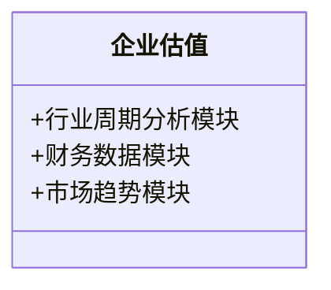

                 


# 企业估值中的行业周期影响

> **关键词**：企业估值、行业周期、财务分析、风险管理、投资策略、系统架构、数学模型

> **摘要**：本文系统分析了行业周期对企业估值的影响，从行业周期的定义、类型及其对企业财务状况的影响入手，结合实际案例和数学模型，探讨了如何在不同行业周期阶段进行企业估值，并提出了相应的风险管理策略和投资建议。文章还通过系统架构设计和项目实战，展示了如何将行业周期分析应用于实际的企业估值过程中，为读者提供了全面的理论和实践指导。

---

## 第1章: 行业周期与企业估值概述

### 1.1 行业周期的基本概念

#### 1.1.1 行业周期的定义

行业周期是指某一行业在经济发展过程中经历的各个阶段，通常包括繁荣期、衰退期、复苏期和增长期。每个阶段的特点不同，对企业估值的影响也有所差异。

#### 1.1.2 行业周期的类型

行业周期可以分为宏观经济周期和产业周期两种类型。宏观经济周期受到整体经济环境的影响，而产业周期则与特定行业的供需变化密切相关。

#### 1.1.3 行业周期与企业估值的关系

行业周期直接影响企业的收入、成本和利润，进而影响企业的估值。在繁荣期，企业估值通常较高；而在衰退期，企业估值可能大幅下降。

---

### 1.2 行业周期对企业估值的影响机制

#### 1.2.1 行业周期波动对企业收入的影响

行业周期波动会导致企业收入的波动。例如，在经济衰退期，消费者需求下降，企业的收入可能大幅减少。

#### 1.2.2 行业周期波动对企业成本的影响

行业周期波动会影响企业的成本结构。在繁荣期，原材料和劳动力成本可能上升，而在衰退期，成本可能下降。

#### 1.2.3 行业周期波动对企业利润的影响

行业周期波动直接影响企业的利润。在衰退期，企业可能面临亏损，而在繁荣期，企业利润可能大幅增加。

---

## 第2章: 行业周期的定义与分类

### 2.1 行业周期的定义与特征

#### 2.1.1 行业周期的定义

行业周期是行业经济发展过程中的周期性变化，通常包括繁荣、衰退、复苏和增长四个阶段。

#### 2.1.2 行业周期的特征

- **波动性**：行业周期具有明显的波动性，企业需要适应周期性变化。
- **相关性**：行业周期与宏观经济环境密切相关。
- **长期性**：行业周期的变化是一个长期过程，需要企业长期关注。

---

### 2.2 行业周期的类型

#### 2.2.1 宏观经济周期

宏观经济周期受到整体经济环境的影响，如GDP增长率、利率和通货膨胀率等。

#### 2.2.2 产业周期

产业周期与特定行业的供需变化密切相关，例如科技行业的技术周期。

#### 2.2.3 技术周期

技术周期受到技术创新的影响，例如人工智能行业的技术进步。

#### 2.2.4 市场周期

市场周期与市场供需变化密切相关，例如房地产行业的市场波动。

---

## 第3章: 行业周期对企业财务状况的影响

### 3.1 行业周期对企业收入的影响

#### 3.1.1 收入与行业周期的关系

行业周期的波动直接影响企业的收入。例如，在经济衰退期，消费者的购买力下降，企业收入减少。

#### 3.1.2 不同行业周期阶段的收入变化

- **繁荣期**：收入增长迅速。
- **衰退期**：收入下降。
- **复苏期**：收入逐渐恢复。

---

### 3.2 行业周期对企业成本的影响

#### 3.2.1 成本与行业周期的关系

行业周期的波动会影响企业的成本结构。例如，在经济衰退期，原材料成本可能下降。

#### 3.2.2 不同行业周期阶段的成本变化

- **繁荣期**：成本上升。
- **衰退期**：成本下降。

---

### 3.3 行业周期对企业利润的影响

#### 3.3.1 利润与行业周期的关系

行业周期的波动直接影响企业的利润。例如，在衰退期，企业可能面临亏损。

#### 3.3.2 不同行业周期阶段的利润变化

- **繁荣期**：利润增加。
- **衰退期**：利润减少或亏损。

---

## 第4章: 行业周期波动中的企业应对策略

### 4.1 行业周期波动对企业战略的影响

#### 4.1.1 战略调整的必要性

企业需要根据行业周期的变化调整战略，例如在衰退期减少投资，在繁荣期扩大生产。

#### 4.1.2 战略调整的常见方法

- **成本控制**：在衰退期减少成本支出。
- **市场扩展**：在繁荣期扩大市场份额。

---

### 4.2 行业周期波动中的风险管理

#### 4.2.1 风险识别与评估

企业需要识别行业周期波动带来的风险，并评估其影响程度。

#### 4.2.2 风险应对策略

- **多元化经营**：分散行业周期风险。
- **灵活调整策略**：根据周期变化及时调整。

---

## 第5章: 行业周期分析的方法

### 5.1 行业周期分析的常见方法

#### 5.1.1 定性分析

通过行业研究报告和市场趋势分析行业周期。

#### 5.1.2 定量分析

通过财务数据和经济指标量化行业周期的影响。

---

## 第6章: 实际案例分析

### 6.1 案例一：科技行业周期分析

#### 6.1.1 科技行业的繁荣期与衰退期

- **繁荣期**：技术创新推动增长。
- **衰退期**：技术瓶颈导致增速放缓。

---

### 6.2 案例二：房地产行业周期分析

#### 6.2.1 房地产行业的周期性特点

- **繁荣期**：房价上涨，交易活跃。
- **衰退期**：房价下跌，交易量减少。

---

## 第7章: 系统分析与架构设计方案

### 7.1 系统功能设计

#### 7.1.1 领域模型



---

### 7.2 系统架构设计

```mermaid
rectangle 系统边界 {
    系统输入模块
    数据处理模块
    输出模块
}
```

---

### 7.3 系统接口设计

- **输入接口**：接收行业数据和企业财务数据。
- **输出接口**：提供行业周期分析报告和企业估值结果。

---

### 7.4 系统交互设计

```mermaid
sequenceDiagram
    用户 -> 系统输入模块: 提供行业数据
    系统输入模块 -> 数据处理模块: 处理数据
    数据处理模块 -> 输出模块: 生成报告
    用户 <- 输出模块: 获取行业周期分析报告
```

---

## 第8章: 数学模型与公式

### 8.1 行业周期与企业估值的数学模型

企业估值公式：

$$ 企业估值 = 收入 \times 利润率 $$

其中，收入和利润受行业周期的影响。

---

## 第9章: 项目实战

### 9.1 环境安装

安装必要的数据分析工具，例如Python和Pandas库。

---

### 9.2 核心实现代码

```python
import pandas as pd

# 假设df是包含行业数据的DataFrame
def calculate_industry_cycle_impact(df):
    df['行业周期影响'] = df['收入'] * df['利润率']
    return df

result = calculate_industry_cycle_impact(df)
print(result)
```

---

### 9.3 代码应用解读与分析

通过代码计算行业周期对企业估值的影响，帮助企业在不同周期阶段制定合理的策略。

---

## 第10章: 最佳实践与总结

### 10.1 最佳实践 tips

- 定期进行行业周期分析。
- 根据周期变化灵活调整企业战略。

### 10.2 小结

本文详细探讨了行业周期对企业估值的影响，并通过实际案例和数学模型展示了如何在实际中应用这些分析。

---

## 结语

通过本文的分析，读者可以全面理解行业周期对企业估值的影响，并能够在实际工作中应用这些理论和方法，为企业制定更科学的估值和风险管理策略。

--- 

希望这篇文章的结构和内容符合您的要求。如果需要进一步调整或补充，请随时告知！

