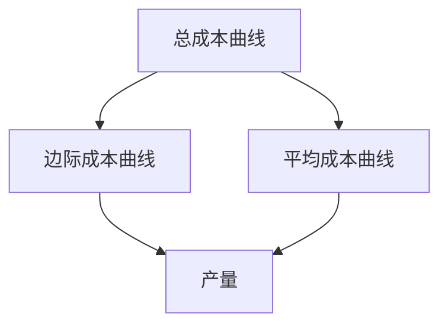

                 

# 企业估值中的规模经济效应分析

## 关键词：规模经济、企业估值、成本曲线、边际成本、市场结构、经济效益

## 摘要：  
本文从企业估值的角度深入分析了规模经济效应的原理、应用及其对企业发展和价值提升的影响。通过经济学理论与实际案例相结合，探讨了规模经济如何通过降低边际成本、提高市场占有率等方式优化企业估值，并提出了在实际操作中需要考虑的边界条件和风险因素。文章还结合了数学模型和图形化工具（如Mermaid图），为企业估值中的规模经济效应提供了系统化的分析框架。

---

# 第一部分: 规模经济效应的背景介绍

## 第1章: 规模经济效应的背景介绍

### 1.1 规模经济效应的核心概念

#### 1.1.1 什么是规模经济效应
规模经济效应是指随着企业生产规模的扩大，单位产品的平均成本下降的现象。它是企业通过扩大生产规模、优化资源配置、提高效率从而降低成本、增加利润的过程。

#### 1.1.2 规模经济效应的产生背景
规模经济效应的产生源于企业生产过程中固定成本的分摊和边际成本的递减。随着产量的增加，固定成本被分摊到更多的产品中，单位产品的平均成本降低。

#### 1.1.3 规模经济效应与企业估值的关系
规模经济效应直接影响企业的盈利能力，进而影响其市场价值。通过降低平均成本、提高市场份额，企业能够实现更高的利润，从而提升其估值。

### 1.2 规模经济效应的定义与特征

#### 1.2.1 规模经济的定义
规模经济是指随着生产规模的扩大，单位产品的平均成本下降，从而提高企业利润的现象。

#### 1.2.2 规模经济的核心特征
- **成本递减**：单位产品成本随着产量增加而降低。
- **效率提升**：生产流程优化、资源利用率提高。
- **市场优势**：通过成本优势扩大市场份额。

#### 1.2.3 规模经济与边际成本的关系
边际成本是指每增加一单位产品所增加的总成本。规模经济效应体现在边际成本的递减，从而降低单位产品的平均成本。

### 1.3 规模经济效应的边界与外延

#### 1.3.1 规模经济的边界条件
- **规模的上限**：随着产量增加，边际成本递减到一定程度后会趋于平稳。
- **资源限制**：企业的生产规模受限于资源、技术和市场需求。

#### 1.3.2 规模经济的外延与应用领域
- **制造业**：通过规模化生产降低成本。
- **信息技术行业**：通过 economies of scale 提高效率。
- **服务业**：通过规模效应降低服务成本。

#### 1.3.3 规模经济与企业规模的关系
企业规模越大，规模经济效应越明显，但过大的规模可能导致管理成本增加和效率下降。

### 1.4 本章小结
本章通过定义和特征分析，阐述了规模经济效应的核心概念，并讨论了其在企业估值中的重要性。

---

## 第2章: 规模经济效应的理论基础

### 2.1 规模经济的经济学原理

#### 2.1.1 边际成本与平均成本的关系
边际成本（MC）是指每增加一单位产品所增加的总成本。平均成本（AC）是指每单位产品的平均成本，计算公式为：
$$AC = \frac{TC}{Q}$$
其中，TC为总成本，Q为产量。

随着产量Q的增加，边际成本逐渐递减，平均成本也随之下降。

#### 2.1.2 规模经济的数学模型
规模经济可以通过成本曲线来描述。边际成本曲线（MC）和平均成本曲线（AC）的关系如下图所示：

从图中可以看出，随着产量的增加，边际成本先递减后趋于平稳，而平均成本则持续递减。

#### 2.1.3 规模经济与市场结构的互动
规模经济效应与市场结构密切相关。在完全竞争市场中，企业通过规模经济降低成本，从而在价格竞争中占据优势；在垄断市场中，规模经济可以帮助企业降低生产成本，提高市场占有率。

### 2.2 规模经济的数学模型与公式

#### 2.2.1 边际成本曲线的公式
$$MC = \frac{dC}{dq}$$
其中，C是总成本函数，q是产量。

#### 2.2.2 平均成本曲线的公式
$$AC = \frac{C}{q}$$

### 2.3 规模经济的比较优势分析

#### 2.3.1 比较优势的定义
比较优势是指企业通过专业化生产某些产品，从而在特定领域中获得成本优势。

#### 2.3.2 规模经济与比较优势的关系
规模经济通过降低成本，增强了企业的比较优势。例如，一家大型制造企业可以通过规模化生产降低成本，从而在国际市场上更具竞争力。

#### 2.3.3 案例分析：某行业的规模经济与比较优势
以电子行业为例，规模经济使得大型企业能够以更低的成本生产电子产品，从而在国际市场上占据优势。

### 2.4 本章小结
本章从经济学原理出发，分析了规模经济的数学模型和比较优势，并通过案例分析进一步阐述了规模经济的实际应用。

---

## 第3章: 企业估值中的规模经济效应分析

### 3.1 规模经济对企业估值的影响

#### 3.1.1 规模经济如何影响企业成本
规模经济通过降低边际成本和平均成本，直接影响企业的生产成本，从而影响其利润和估值。

#### 3.1.2 规模经济如何影响企业利润
通过降低成本和提高效率，规模经济能够增加企业的净利润，从而提高其市场估值。

#### 3.1.3 规模经济与企业市场价值的关系
规模经济通过提高企业盈利能力，增强其市场竞争力，从而提升其市场价值。

### 3.2 规模经济效应的测量与评估

#### 3.2.1 规模经济效应的测量方法
规模经济效应可以通过比较不同规模下的成本和利润变化来衡量。

#### 3.2.2 企业估值中的规模经济效应评估
通过分析企业的成本曲线和利润曲线，可以评估规模经济效应对企业估值的影响。

#### 3.2.3 案例分析：某企业的规模经济效应评估
以某制造企业为例，通过分析其成本曲线和利润曲线，评估规模经济效应对其估值的影响。

### 3.3 本章小结
本章从企业估值的角度，分析了规模经济效应的影响，并提出了测量和评估的方法。

---

## 第4章: 规模经济效应的实现路径

### 4.1 规模经济的实现路径

#### 4.1.1 技术创新
通过技术创新，企业可以提高生产效率，降低边际成本。

#### 4.1.2 管理优化
通过优化管理流程，企业可以提高资源配置效率，降低管理成本。

#### 4.1.3 市场扩展
通过扩大市场份额，企业可以实现规模经济，降低单位产品的平均成本。

### 4.2 本章小结
本章分析了规模经济的实现路径，包括技术创新、管理优化和市场扩展。

---

## 第5章: 规模经济效应的边界与风险

### 5.1 规模经济的边界条件

#### 5.1.1 边际成本的递减规律
随着产量增加，边际成本逐渐递减，但存在一个最低点。

#### 5.1.2 资源和市场的限制
企业规模受限于资源和市场需求。

### 5.2 规模经济的风险

#### 5.2.1 过度扩张的风险
过度扩张可能导致管理成本增加，效率下降。

#### 5.2.2 边际收益递减的风险
随着规模扩大，边际收益可能递减，影响企业利润。

### 5.3 本章小结
本章讨论了规模经济的边界条件和相关风险。

---

## 第6章: 规模经济效应的最佳实践与未来展望

### 6.1 最佳实践

#### 6.1.1 平衡规模与效率
企业应合理控制规模，避免过度扩张。

#### 6.1.2 技术驱动的规模经济
通过技术创新实现规模经济，提高效率。

### 6.2 未来展望

#### 6.2.1 数字化转型与规模经济
数字化转型将为企业实现规模经济提供新的机会。

#### 6.2.2 可持续发展与规模经济
可持续发展将推动企业实现绿色规模经济。

### 6.3 本章小结
本章总结了规模经济的最佳实践，并展望了未来的发展趋势。

---

## 参考文献

（此处可以列出相关的书籍、论文或研究报告）

---

通过以上章节的详细分析，本文从理论到实践，系统地探讨了规模经济效应在企业估值中的应用，为企业优化成本、提升利润和市场价值提供了有益的参考。

