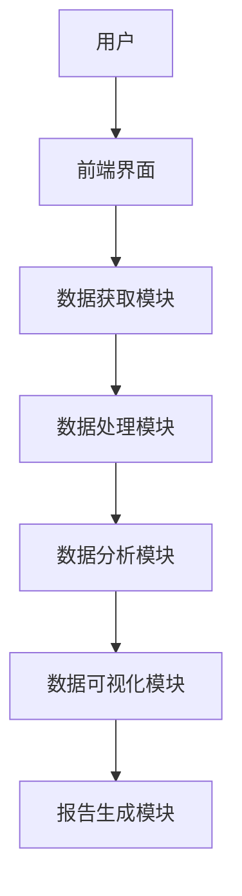
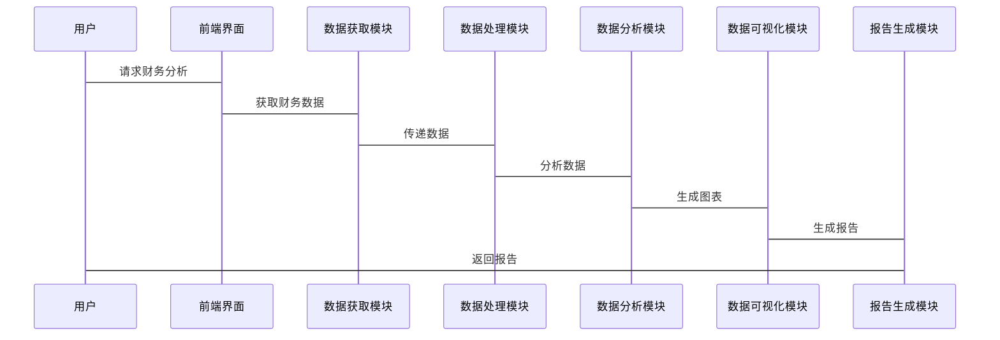
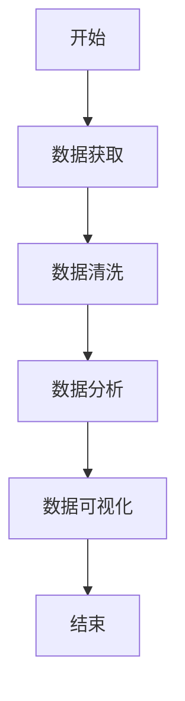
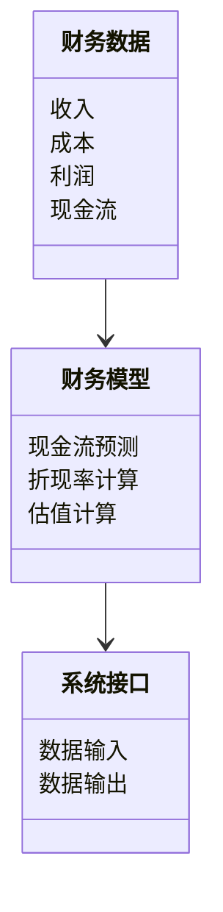
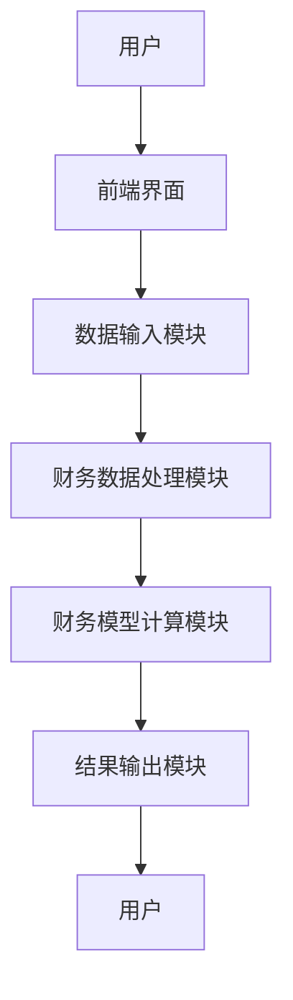
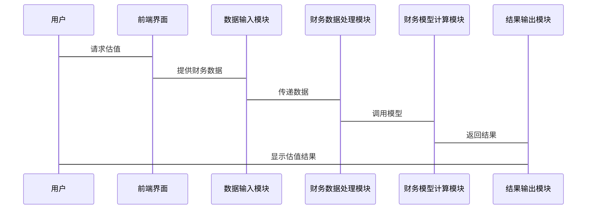

                 


# 企业估值中的财务报表分析方法

---

## 关键词：企业估值、财务报表分析、比率分析、DCF模型、财务建模

---

## 摘要：  
企业估值是投资决策中的核心问题，而财务报表分析是企业估值的基础。本文从财务报表分析的基本概念出发，逐步深入探讨如何通过财务报表分析对企业价值进行准确评估。文章结合实际案例，详细讲解了财务比率分析、现金流折现法（DCF模型）以及企业估值的系统架构，旨在帮助读者掌握企业估值的核心方法和实战技巧。

---

# 第1章: 财务报表分析的基础概念

## 1.1 财务报表分析的定义与作用

### 1.1.1 财务报表分析的定义  
财务报表分析是指通过对企业的财务报表（资产负债表、利润表、现金流量表）进行解读和评估，以揭示企业的财务状况、经营成果和现金流量变化的过程。它是企业估值的核心基础，能够为投资者提供重要的决策依据。

### 1.1.2 财务报表分析的作用  
- 揭示企业的财务健康状况。  
- 评估企业的盈利能力、成长能力和偿债能力。  
- 为投资决策提供数据支持。  
- 帮助识别财务风险和潜在问题。  

### 1.1.3 财务报表分析的核心要素  
- 资产、负债、所有者权益（资产负债表）。  
- 收入、成本、利润（利润表）。  
- 现金流入和流出（现金流量表）。  

---

## 1.2 财务报表的构成与结构

### 1.2.1 资产负债表  
资产负债表反映企业在某一特定日期的资产、负债和所有者权益的构成。  
- 资产：企业拥有的资源，分为流动资产和非流动资产。  
- 负债：企业需要偿还的债务，分为流动负债和非流动负债。  
- 所有者权益：企业净资产的价值。  

### 1.2.2 利润表  
利润表反映企业在一定会计期间内的收入、费用和利润情况。  
- 收入：企业经营活动的总收入。  
- 费用：为取得收入而发生的成本和支出。  
- 净利润：收入减去费用后的利润。  

### 1.2.3 现金流量表  
现金流量表反映企业在一定会计期间内现金流入和流出的情况。  
- 经营活动现金流：企业日常经营产生的现金流。  
- 投资活动现金流：企业投资活动产生的现金流。  
- 筹资活动现金流：企业筹资活动产生的现金流。  

---

## 1.3 财务报表分析的基本方法

### 1.3.1 比率分析法  
比率分析法是财务报表分析中最常用的方法之一。通过计算各种财务比率，可以评估企业的偿债能力、运营效率和盈利能力。  

#### 常见财务比率分类  
1. **流动性比率**：衡量企业短期偿债能力。  
   - 流动比率（Current Ratio）= 流动资产 / 流动负债  
   - 速动比率（Quick Ratio）= (流动资产 - 存货) / 流动负债  

2. **偿债能力比率**：衡量企业长期偿债能力。  
   - 负债比率（Debt Ratio）= 总负债 / 总资产  
   - 利息保障倍数（Interest Coverage Ratio）= 息税前利润（EBIT） / 利息支出  

3. **运营效率比率**：衡量企业资产使用效率。  
   - 存货周转率（Inventory Turnover）= 营业成本 / 平均存货  
   - 总资产周转率（Total Asset Turnover）= 营业收入 / 平均总资产  

4. **盈利能力比率**：衡量企业盈利能力。  
   - 净资产收益率（ROE）= 净利润 / 平均净资产  
   - 每股收益（EPS）= 净利润 / 总股数  

### 1.3.2 趋势分析法  
趋势分析法通过比较企业在不同会计期间的财务数据，识别其财务状况的变化趋势。例如，分析企业连续几年的收入增长率和利润率变化，可以判断企业的成长性和盈利能力。

### 1.3.3 行业比较法  
行业比较法将企业的财务数据与行业平均水平进行对比，识别企业在行业中的相对位置。例如，如果企业的毛利率低于行业平均水平，可能表明企业在成本控制或产品定价方面存在问题。

---

## 1.4 数据获取与处理

### 1.4.1 财务数据的获取渠道  
- 企业公开披露的财务报表（如年报、季报）。  
- 金融数据平台（如Wind、FactSet）。  
- 财务分析工具（如Excel、Python）。  

### 1.4.2 数据清洗与预处理  
- 处理缺失值：例如，用前值或均值填充缺失数据。  
- 处理异常值：例如，剔除明显错误的数据点。  
- 数据标准化：例如，将不同货币单位的财务数据统一化。  

### 1.4.3 数据可视化基础  
- 使用图表展示财务数据：例如，用折线图展示收入趋势，用柱状图展示资产结构。  
- 数据可视化工具：例如，Excel、Tableau、Python的matplotlib库。  

---

## 1.5 本章小结  
本章介绍了财务报表分析的基本概念、财务报表的构成与结构，以及常用的基本方法。通过这些分析方法，可以初步评估企业的财务状况和经营成果，为后续的企业估值打下基础。

---

# 第2章: 财务报表分析的核心方法

## 2.1 财务比率分析

### 2.1.1 流动性比率  
- 通过流动性比率分析，可以评估企业的短期偿债能力。例如，如果企业的速动比率低于1，可能表明企业在支付短期负债时存在困难。

### 2.1.2 偿债能力比率  
- 偿债能力比率分析可以帮助评估企业的长期偿债能力。例如，如果企业的负债比率过高，可能表明企业存在较高的财务风险。

### 2.1.3 运营效率比率  
- 运营效率比率分析可以帮助评估企业的资产使用效率。例如，如果企业的总资产周转率低于行业平均水平，可能表明企业资产利用效率较低。

### 2.1.4 盈利能力比率  
- 盈利能力比率分析可以帮助评估企业的盈利能力。例如，如果企业的净资产收益率（ROE）低于行业平均水平，可能表明企业盈利能力较弱。

---

## 2.2 财务报表分析的系统架构

### 2.2.1 系统需求分析  
- 用户需求：投资者需要快速获取企业的财务数据并进行分析。  
- 功能需求：支持多维度的财务分析（如比率分析、趋势分析、行业比较）。  

### 2.2.2 系统功能设计  
- 数据获取模块：从企业财务报表中提取数据。  
- 数据处理模块：清洗和标准化数据。  
- 数据分析模块：计算各种财务比率并生成分析结果。  
- 数据可视化模块：以图表形式展示分析结果。  
- 报告生成模块：自动生成财务分析报告。  

### 2.2.3 系统架构设计  


### 2.2.4 系统接口设计  
- 数据接口：通过API获取企业财务数据。  
- 分析接口：通过API调用财务分析模块。  
- 可视化接口：通过API生成图表。  

### 2.2.5 系统交互设计  


---

## 2.3 财务报表分析的算法原理

### 2.3.1 算法原理概述  
财务报表分析算法的核心是通过计算各种财务比率，对企业的财务状况进行量化评估。例如，计算流动比率、速动比率等流动性比率，评估企业的短期偿债能力。

### 2.3.2 算法实现步骤  
1. 数据获取：从财务报表中提取相关数据。  
2. 数据清洗：处理缺失值和异常值。  
3. 数据分析：计算各种财务比率。  
4. 数据可视化：生成图表展示分析结果。  

### 2.3.3 算法流程图  


### 2.3.4 算法代码实现  
```python
import pandas as pd

# 数据获取
df = pd.read_excel('financial_data.xlsx')

# 数据清洗
df.dropna(inplace=True)

# 数据分析
流动资产 = df['流动资产'].sum()
流动负债 = df['流动负债'].sum()
流动比率 =流动资产 /流动负债

速动资产 = df['速动资产'].sum()
速动比率 =速动资产 /流动负债

print(f"流动比率: {流动比率}")
print(f"速动比率: {速动比率}")
```

---

## 2.4 本章小结  
本章详细讲解了财务比率分析的核心方法，并通过系统架构和算法实现，展示了如何利用财务报表数据进行系统化的企业财务分析。

---

# 第3章: 企业估值的理论基础

## 3.1 企业估值的定义与方法

### 3.1.1 企业估值的定义  
企业估值是指通过对企业的财务状况、经营能力和市场地位进行综合评估，确定其市场价值的过程。它是企业融资、并购和投资决策的重要依据。

### 3.1.2 企业估值的主要方法  
- **相对估值法**：基于可比企业的市场价值进行估值。例如，市盈率（P/E）和市净率（P/B）方法。  
- **绝对估值法**：基于企业未来现金流的折现值进行估值。例如，现金流折现法（DCF模型）。  
- **资产重估法**：基于企业资产的公允价值进行估值。  

### 3.1.3 财务报表分析在估值中的作用  
财务报表分析是企业估值的基础，通过对企业的财务状况、盈利能力和发展潜力进行分析，可以为估值提供关键数据支持。

---

## 3.2 财务模型与估值方法

### 3.2.1 财务模型的构建  
财务模型是企业估值的核心工具，通常包括以下几个部分：  
1. **假设与参数设定**：例如，收入增长率、净利润率等。  
2. **现金流预测**：基于财务模型预测未来几年的现金流。  
3. **折现率计算**：例如，使用加权平均资本成本（WACC）作为折现率。  
4. **估值计算**：通过折现计算企业整体价值。  

### 3.2.2 现金流折现法（DCF模型）  
现金流折现法是绝对估值法的核心方法，通过折现企业未来自由现金流（FCFF）或股权现金流（FCFE）来计算企业价值。  

#### DCF模型的数学公式  
$$
\text{企业价值} = \sum_{t=1}^{n} \frac{\text{现金流}_t}{(1 + r)^t} + \frac{\text{终值}}{(1 + r)^n}
$$  
其中，\( r \) 是折现率，\( n \) 是预测期数，\( \text{终值} \) 是企业未来现金流的终值。

### 3.2.3 其他估值方法  
- **市盈率法**：$$ \text{估值} = \text{可比企业平均市盈率} \times \text{目标企业净利润} $$
- **市净率法**：$$ \text{估值} = \text{可比企业平均市净率} \times \text{目标企业净资产} $$

---

## 3.3 本章小结  
本章介绍了企业估值的定义与主要方法，并重点讲解了现金流折现法（DCF模型）的原理和应用。通过财务模型的构建和分析，可以为企业的估值提供科学依据。

---

# 第4章: 企业估值中的系统分析

## 4.1 问题场景介绍  
企业估值是一个复杂的系统工程，需要结合企业的财务状况、行业环境和市场前景进行综合分析。通过系统架构的设计，可以提高估值的准确性和效率。

---

## 4.2 系统功能设计

### 4.2.1 领域模型设计  


### 4.2.2 系统架构设计  


### 4.2.3 系统接口设计  
- 数据接口：通过API获取企业财务数据。  
- 模型接口：通过API调用财务模型进行计算。  
- 结果接口：通过API返回估值结果。  

### 4.2.4 系统交互设计  


---

## 4.3 本章小结  
本章通过系统架构和交互设计，展示了如何利用财务模型进行企业估值。通过系统化的方法，可以提高估值的效率和准确性。

---

# 第5章: 企业估值的实战案例

## 5.1 环境安装与数据准备

### 5.1.1 环境安装  
- 安装Python和相关库（如Pandas、NumPy、Matplotlib）。  
- 安装数据分析工具（如Excel、Tableau）。  

### 5.1.2 数据准备  
- 获取目标企业的财务数据（如资产负债表、利润表、现金流量表）。  
- 数据清洗和预处理。  

---

## 5.2 系统核心实现

### 5.2.1 财务数据处理  
```python
import pandas as pd

# 读取财务数据
df = pd.read_excel('financial_data.xlsx')

# 数据清洗
df.dropna(inplace=True)
df = df.astype('float')
```

### 5.2.2 财务模型实现  
```python
def calculate_discounted_cash_flows(cash_flows, discount_rate):
    discounted_flows = []
    for year, cash_flow in enumerate(cash_flows):
        discounted_flow = cash_flow / (1 + discount_rate) ** (year + 1)
        discounted_flows.append(discounted_flow)
    return discounted_flows

# 示例数据
cash_flows = [100, 120, 150, 200]
discount_rate = 0.10

# 计算折现现金流
discounted_flows = calculate_discounted_cash_flows(cash_flows, discount_rate)

# 计算终值
terminal_value = cash_flows[-1] * (1 + discount_rate)
discounted_terminal_value = terminal_value / (1 + discount_rate) ** 4

# 计算企业价值
enterprise_value = sum(discounted_flows) + discounted_terminal_value
print(f"企业价值: {enterprise_value}")
```

---

## 5.3 实际案例分析

### 5.3.1 案例选择  
以某科技公司为例，获取其最近5年的财务数据，包括收入、成本、利润和现金流。

### 5.3.2 数据分析与建模  
- 计算企业自由现金流（FCFF）。  
- 预测未来5年的现金流。  
- 使用WACC作为折现率，计算企业价值。  

### 5.3.3 结果解读  
- 通过DCF模型计算出的企业价值与市场价值进行对比，分析差异的原因。  
- 结合行业可比企业，验证估值的合理性。  

---

## 5.4 本章小结  
本章通过实际案例分析，展示了如何利用财务模型进行企业估值。通过实战练习，读者可以更好地掌握企业估值的核心方法和实际操作技巧。

---

# 第6章: 企业估值的进阶方法

## 6.1 财务预测模型

### 6.1.1 财务预测模型的构建  
财务预测模型是基于对企业历史财务数据和行业趋势的分析，预测企业未来几年的财务状况。  

### 6.1.2 财务预测模型的应用  
- 用于企业估值的现金流预测。  
- 用于投资决策的财务分析。  

---

## 6.2 财务风险评估

### 6.2.1 财务风险的定义  
财务风险是指企业在经营过程中由于财务状况的变化而产生的风险。  

### 6.2.2 财务风险评估方法  
- 通过财务比率分析识别财务风险。  
- 通过情景分析法评估不同假设下的财务风险。  

---

## 6.3 行业与市场因素

### 6.3.1 行业分析  
行业分析是企业估值的重要组成部分。例如，分析行业周期、竞争格局和市场容量，可以帮助评估企业的市场地位和未来发展前景。

### 6.3.2 市场因素  
市场因素包括宏观经济环境、政策变化和市场波动等，这些因素会影响企业的估值。例如，利率上升会增加企业的融资成本，从而影响企业价值。

---

## 6.4 本章小结  
本章介绍了企业估值的进阶方法，包括财务预测模型、财务风险评估以及行业与市场因素的分析。通过这些方法，可以更全面地评估企业的价值和风险。

---

# 第7章: 总结与展望

## 7.1 本章总结  
本文从财务报表分析的基本概念出发，逐步深入探讨了企业估值的核心方法和系统架构。通过实际案例分析和进阶方法的讲解，帮助读者掌握了企业估值的核心技巧。

## 7.2 最佳实践 Tips  
- 在进行企业估值时，应结合企业的财务状况、行业环境和市场前景进行综合分析。  
- 财务模型的假设和参数应尽量合理，避免过于乐观或悲观。  
- 定期更新财务模型，以反映企业的最新财务数据和市场变化。  

## 7.3 未来展望  
随着人工智能和大数据技术的发展，企业估值的方法和工具将更加多样化和智能化。未来，可以通过机器学习算法优化财务模型，提高估值的准确性和效率。

---

# 结语  
企业估值是一个复杂而重要的过程，财务报表分析是其中的核心基础。通过本文的学习，读者可以掌握企业估值的核心方法和实战技巧，为投资决策提供科学依据。

