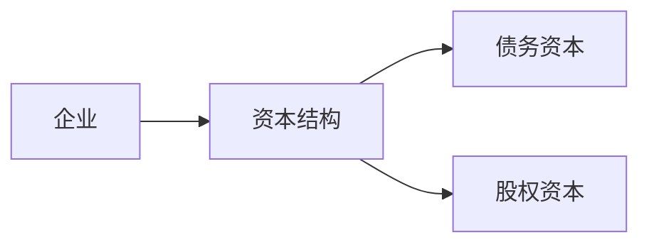

                 


# 企业估值中的资本结构分析

---

## 关键词：企业估值、资本结构、资本成本、财务模型、股权与债务、资本预算

---

## 摘要：本篇文章深入探讨了资本结构在企业估值中的重要性，分析了资本结构的核心要素及其对企业价值的影响，结合实际案例和数学模型，详细阐述了资本结构分析的理论基础和实践方法。文章从背景介绍、核心概念、算法原理、数学模型、系统设计、项目实战到最佳实践，层层递进，帮助读者全面理解资本结构对企业估值的深远影响。

---

# 第1章: 资本结构与企业估值概述

## 1.1 资本结构的基本概念

### 1.1.1 资本结构的定义

资本结构是指企业各类资本的构成比例，包括债务资本和股权资本等。资本结构影响企业的融资成本和财务稳定性。

### 1.1.2 资本结构的组成要素

- **债务资本**：企业通过借款或发行债券等方式筹集的资金。
- **股权资本**：企业通过发行股票或内部留存收益筹集的资金。
- **混合资本**：结合债务和股权特性的融资工具。

### 1.1.3 资本结构与企业价值的关系

资本结构合理优化能够降低资本成本，提高企业价值。

## 1.2 企业估值的基本原理

### 1.2.1 企业估值的定义

企业估值是对企业整体价值的评估，通常包括资产、收益、市场地位等因素。

### 1.2.2 企业估值的主要方法

- **净现值法（NPV）**：将未来现金流折现，评估项目或企业的价值。
- **加权平均资本成本（WACC）**：计算企业加权平均资本成本，作为折现率。

### 1.2.3 资本结构在企业估值中的作用

资本结构影响企业资本成本，进而影响估值。

## 1.3 资本结构分析的背景与意义

### 1.3.1 当前经济环境对企业估值的影响

经济波动影响企业的融资成本和投资决策。

### 1.3.2 资本结构对企业融资成本的影响

合理的资本结构能够降低综合资本成本。

### 1.3.3 资本结构对企业发展战略的影响

资本结构影响企业的扩张能力、风险承担能力。

## 1.4 本章小结

本章介绍了资本结构的基本概念、企业估值的基本原理，以及资本结构分析的背景与意义，为后续分析打下基础。

---

# 第2章: 资本结构的核心要素与理论基础

## 2.1 资本结构的核心要素

### 2.1.1 债务资本

债务资本的成本通常较低，但需要承担偿债压力。

### 2.1.2 股权资本

股权资本的风险较高，但收益潜力更大。

### 2.1.3 混合资本

混合资本结合了债务和股权的特点，兼具风险和收益。

## 2.2 资本结构理论基础

### 2.2.1 净现值法与资本预算

净现值法是评估投资项目的重要工具，资本预算需要考虑资本结构的影响。

### 2.2.2 加权平均资本成本（WACC）模型

WACC = (w_d * k_d) + (w_e * k_e)

其中：
- w_d：债务权重
- k_d：债务成本
- w_e：股权权重
- k_e：股权成本

### 2.2.3 股权资本成本与债务成本的差异

股权成本通常高于债务成本，且波动性更大。

## 2.3 资本结构与企业风险的关系

### 2.3.1 系统性风险与非系统性风险

系统性风险影响整体市场，非系统性风险影响特定企业。

### 2.3.2 资本结构对企业风险承受能力的影响

适度的债务可以提高企业杠杆效应，但也增加了风险。

## 2.4 本章小结

本章分析了资本结构的核心要素及其理论基础，重点介绍了WACC模型和资本成本差异。

---

# 第3章: 资本结构分析的核心概念与联系

## 3.1 资本结构的核心概念原理

### 3.1.1 股权与债务的比较分析

债务与股权的成本和风险不同，影响企业资本结构的选择。

### 3.1.2 资本成本的最小化

企业目标是通过合理配置债务和股权，实现综合资本成本最小化。

### 3.1.3 资本结构的最优解

在一定条件下，存在最优资本结构，使企业价值最大化。

## 3.2 资本结构与企业价值的对比分析

### 3.2.1 不同资本结构对企业价值的影响

较高的债务比例可能提高杠杆收益，但也增加了财务风险。

### 3.2.2 资本结构与企业杠杆的关系

杠杆是指通过债务融资提高权益回报率，但也增加了风险。

### 3.2.3 资本结构与企业财务稳定性

合理的资本结构能够平衡风险与收益，确保财务稳定性。

## 3.3 资本结构的ER实体关系图



---

# 第4章: 资本结构分析的算法与数学模型

## 4.1 资本结构分析的算法原理

### 4.1.1 净现值法与资本预算

使用净现值法评估投资项目，考虑资本结构对资本成本的影响。

### 4.1.2 加权平均资本成本（WACC）计算

根据WACC公式，计算企业加权平均资本成本。

## 4.2 资本结构分析的数学模型

### 4.2.1 WACC模型

$$ WACC = (w_d * k_d) + (w_e * k_e) $$

### 4.2.2 股权资本成本计算

$$ k_e = r_f + β * (市场风险溢价) $$

### 4.2.3 债务成本计算

$$ k_d = 利息率 - 税盾效应 $$

## 4.3 资本结构分析的Python代码实现

```python
# 示例代码：计算WACC
def calculate_wacc(w_d, k_d, w_e, k_e):
    return w_d * k_d + w_e * k_e

# 参数示例
w_d = 0.4
k_d = 0.05
w_e = 0.6
k_e = 0.10

wacc = calculate_wacc(w_d, k_d, w_e, k_e)
print(f"WACC = {wacc}")
```

### 代码解读

- 输入参数：债务权重（w_d）、债务成本（k_d）、股权权重（w_e）、股权成本（k_e）。
- 计算过程：根据WACC公式，计算加权平均资本成本。
- 输出结果：打印计算得到的WACC值。

## 4.4 本章小结

本章通过算法和数学模型，详细讲解了资本结构分析的核心方法，包括WACC计算和Python代码实现。

---

# 第5章: 资本结构分析的系统设计与架构

## 5.1 系统功能设计

### 5.1.1 系统功能模块

- 数据输入与处理
- 资本结构分析
- 结果输出与可视化

### 5.1.2 功能流程图


## 5.2 系统架构设计

### 5.2.1 系统架构图


### 5.2.2 接口设计

- 前端接口：接收用户输入，传递数据。
- 后端接口：处理数据，调用分析算法，返回结果。

### 5.2.3 交互设计


## 5.3 本章小结

本章通过系统设计与架构，展示了资本结构分析的实现过程，包括功能模块、架构设计和接口设计。

---

# 第6章: 资本结构分析的项目实战

## 6.1 项目环境安装

### 6.1.1 安装Python与相关库

- 安装Python：https://www.python.org/
- 安装NumPy和Pandas库：`pip install numpy pandas`

### 6.1.2 安装可视化工具

- 安装Matplotlib：`pip install matplotlib`

## 6.2 项目核心代码实现

### 6.2.1 加权平均资本成本计算

```python
import numpy as np
import pandas as pd
import matplotlib.pyplot as plt

def calculate_wacc(w_d, k_d, w_e, k_e):
    return w_d * k_d + w_e * k_e

# 示例数据
w_d = 0.4
k_d = 0.05
w_e = 0.6
k_e = 0.10

wacc = calculate_wacc(w_d, k_d, w_e, k_e)
print(f"WACC = {wacc}")
```

### 6.2.2 数据可视化

```python
# 可视化示例
data = {'债务成本': [5, 6, 7], '股权成本': [10, 12, 15]}
df = pd.DataFrame(data)
df.plot(kind='bar', figsize=(10,6))
plt.title('债务成本与股权成本对比')
plt.xlabel('项目')
plt.ylabel('成本率')
plt.show()
```

## 6.3 项目实现与分析

### 6.3.1 代码解读

- `calculate_wacc`函数：计算加权平均资本成本。
- 数据可视化部分：使用Matplotlib绘制成本对比图。

### 6.3.2 案例分析

假设某企业债务权重为40%，债务成本为5%，股权权重为60%，股权成本为10%，计算WACC：

$$ WACC = 0.4 * 0.05 + 0.6 * 0.10 = 0.02 + 0.06 = 0.08 $$

即WACC为8%。

## 6.4 项目小结

本章通过实际案例，展示了资本结构分析的项目实现过程，包括环境安装、代码实现和数据分析。

---

# 第7章: 资本结构分析的最佳实践

## 7.1 小结

资本结构分析是企业估值的重要部分，合理优化资本结构能够提升企业价值。

## 7.2 注意事项

- 考虑企业具体情况，避免过度杠杆。
- 定期评估资本结构，适应市场变化。
- 结合多种方法进行综合分析。

## 7.3 拓展阅读

- 《企业财务风险管理》
- 《资本预算与投资决策》
- 《企业价值评估方法》

---

# 结语

资本结构分析是企业估值的核心内容，通过合理配置债务与股权，优化资本成本，提升企业价值。希望本文能够为读者提供清晰的分析框架和实践指导。

--- 

（注：此目录大纲可根据具体需求进行调整和扩展。）

