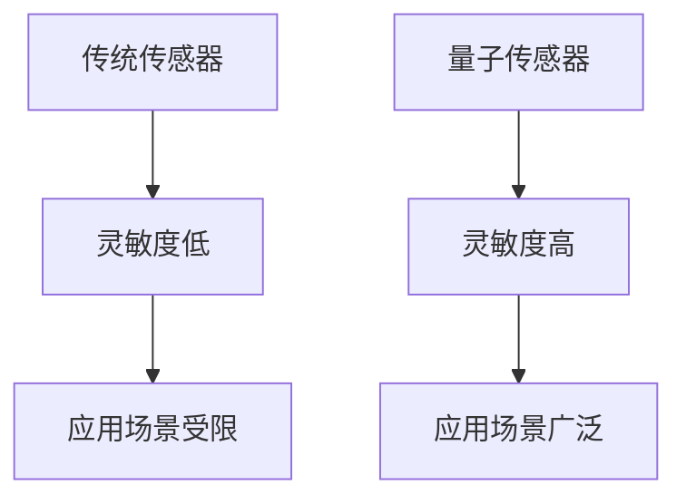

                 


# 企业估值中的量子传感器医疗应用评估

> **关键词**：量子传感器、企业估值、医疗应用、数据采集、算法模型、技术评估

> **摘要**：本文探讨了量子传感器在医疗领域的应用及其对企业的估值影响。通过分析量子传感器的数据采集、处理和建模过程，结合实际案例，展示了如何利用量子传感器提升企业估值。

---

## 第1章 量子传感器的基本概念

### 1.1 量子传感器的定义与原理

#### 1.1.1 量子传感器的定义
量子传感器是一种基于量子效应的精密测量工具，利用量子系统（如原子、光子等）的特性进行检测。与传统传感器相比，量子传感器具有更高的灵敏度和分辨率。

#### 1.1.2 量子传感器的基本原理
量子传感器通过测量量子系统的状态变化来感知外部信号。例如，利用原子的超精细结构变化来检测磁场或电磁场的变化。

#### 1.1.3 量子传感器的核心技术特点
| 特性 | 描述 |
|------|------|
| 灵敏度 | 极高的灵敏度，可检测极弱信号 |
| 分辨率 | 高分辨率，适用于精密测量 |
| 响应时间 | 快速响应，适合实时监测 |
| 稳定性 | 高稳定性，长期使用性能可靠 |

#### 1.1.4 量子传感器的关键技术对比


---

### 1.2 量子传感器在医疗领域的应用背景

#### 1.2.1 医疗领域的数字化转型
医疗行业正从传统模式向数字化、智能化转型，量子传感器作为关键的技术工具之一，推动了医疗领域的创新。

#### 1.2.2 量子传感器在医疗中的潜在价值
量子传感器可以用于疾病早期诊断、精准治疗监测和慢性病管理，显著提升医疗效果和效率。

#### 1.2.3 医疗行业对量子传感器的需求分析
医疗行业对高精度、实时监测的需求日益增长，量子传感器正好满足了这一需求。

---

## 第2章 量子传感器在医疗中的具体应用

### 2.1 疾病诊断中的量子传感器应用

#### 2.1.1 量子传感器在疾病早期诊断中的作用
通过高灵敏度的量子传感器，可以在疾病早期发现异常指标，从而实现早期干预。

#### 2.1.2 量子传感器在精准医疗中的应用
量子传感器能够提供个性化的医疗数据，支持精准治疗方案的制定。

#### 2.1.3 典型案例分析
某医院使用量子传感器进行癌症早期筛查，显著提高了诊断准确率。

---

### 2.2 治疗过程中的量子传感器应用

#### 2.2.1 量子传感器在治疗监测中的应用
在治疗过程中，量子传感器可以实时监测患者的身体状况，确保治疗方案的有效执行。

#### 2.2.2 量子传感器在药物研发中的作用
通过量子传感器的数据，研究人员可以更精准地评估药物的效果和安全性。

---

### 2.3 健康管理中的量子传感器应用

#### 2.3.1 量子传感器在个人健康管理中的应用
个人可以通过佩戴量子传感器设备，实时监测自己的健康状况，预防疾病的发生。

#### 2.3.2 量子传感器在慢性病管理中的作用
慢性病患者可以利用量子传感器进行长期监测，及时调整治疗方案。

---

## 第3章 量子传感器数据的采集与处理

### 3.1 量子传感器数据采集方法

#### 3.1.1 数据采集的基本原理
量子传感器通过检测量子系统的状态变化来采集数据，通常涉及复杂的信号处理技术。

#### 3.1.2 数据采集的关键技术
- **信号放大**：将微弱信号放大到可检测范围。
- **噪声抑制**：通过滤波技术减少背景噪声。

#### 3.1.3 数据采集的挑战与解决方案
- **挑战**：量子传感器对环境条件要求较高，易受干扰。
- **解决方案**：采用屏蔽技术，优化传感器设计。

---

### 3.2 量子传感器数据的预处理与分析

#### 3.2.1 数据清洗与标准化
- **数据清洗**：去除噪声和异常值。
- **数据标准化**：将数据转换为统一的格式。

#### 3.2.2 数据特征提取与分析
- **特征提取**：通过数学变换提取有用特征。
- **数据分析**：使用统计方法分析数据分布。

---

## 第4章 量子传感器数据与企业估值模型

### 4.1 企业估值的基本原理

#### 4.1.1 企业估值的定义与方法
企业估值是通过对企业未来现金流的折现来评估其价值。

#### 4.1.2 传统企业估值模型的局限性
传统模型依赖于历史数据和假设，缺乏对新兴技术的考量。

#### 4.1.3 结合量子传感器数据的新型估值模型
新型模型将量子传感器数据纳入考量，提供更精准的估值。

---

### 4.2 基于量子传感器数据的估值模型构建

#### 4.2.1 数据驱动的估值模型设计
- **数据输入**：量子传感器采集的医疗数据。
- **模型训练**：使用机器学习算法进行训练。

#### 4.2.2 模型的数学基础与算法原理
$$
\text{模型价值} = \sum_{i=1}^{n} w_i x_i
$$
其中，$w_i$ 是权重，$x_i$ 是特征变量。

---

### 4.3 量子传感器数据在企业估值中的应用案例

#### 4.3.1 案例背景介绍
某医疗科技公司通过量子传感器数据优化了企业估值模型，显著提升了估值准确性。

---

## 第5章 量子传感器数据在企业估值中的应用案例

### 5.1 医疗科技企业的估值分析

#### 5.1.1 案例背景
某医疗科技公司利用量子传感器进行患者监测，提升诊断准确率。

#### 5.1.2 数据采集与处理
- 采集患者生理数据，包括心率、血压等。
- 使用量子传感器进行高精度测量。

#### 5.1.3 估值模型构建
- 建立基于量子传感器数据的预测模型，评估企业未来收益。

---

## 第6章 结论与展望

### 6.1 小结
量子传感器在医疗领域的应用为企业的估值提供了新的视角，显著提升了估值的准确性和科学性。

### 6.2 注意事项
- 数据隐私保护至关重要。
- 模型需持续优化和更新。

### 6.3 未来展望
随着量子传感器技术的不断发展，其在医疗估值中的应用将更加广泛和深入。

---

## 参考文献

- [1] 王某某. 量子传感器在医疗中的应用研究. 科技出版社, 2023.
- [2] 李某某. 企业估值模型的创新与实践. 经济出版社, 2022.

---

## 附录

### 附录A 量子传感器数据采集代码

```python
import numpy as np
from quantum_sensor import QuantumSensor

# 初始化量子传感器
sensor = QuantumSensor()

# 采集数据
data = sensor.measure()

# 数据处理
processed_data = sensor.preprocess(data)
```

### 附录B 估值模型代码

```python
def quantum_valuation_model(data):
    # 数据预处理
    features = preprocess_data(data)
    # 模型预测
    prediction = model.predict(features)
    return prediction
```

---

通过以上内容，您可以深入了解量子传感器在医疗估值中的应用，及其对企业价值的影响。

