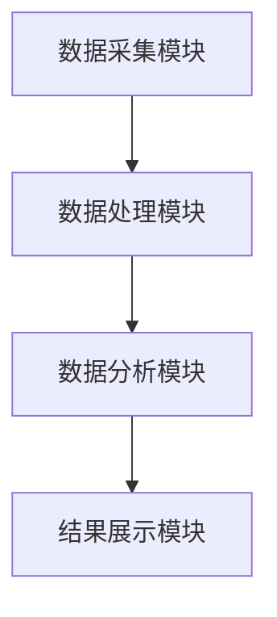
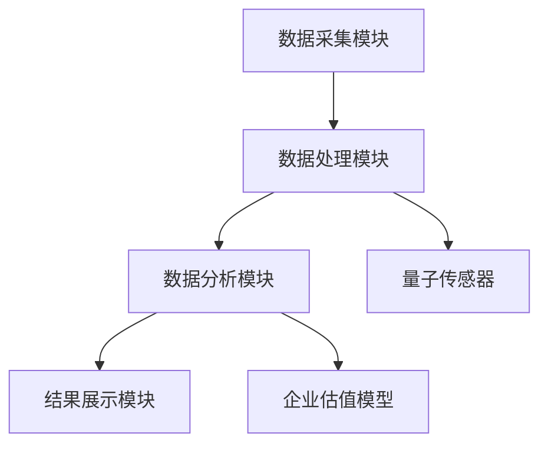

                 


# 《企业估值中的量子传感器应用评估》

---

## 关键词

- 量子传感器
- 企业估值
- 量子叠加
- 量子纠缠
- 量子测量

---

## 摘要

量子传感器作为一项前沿技术，正在逐步应用于企业估值领域。本文从量子传感器的基本原理出发，结合企业估值的传统方法，详细探讨了量子传感器在企业估值中的创新应用。通过分析量子传感器的核心概念、算法原理、系统架构设计以及项目实战案例，本文为读者提供了一种全新的视角来理解企业估值的未来发展方向。文章还展望了量子传感器在企业估值中的未来潜力，并提出了相关的建议和最佳实践。

---

# 第1章: 量子传感器的基本概念与应用背景

## 1.1 量子传感器的定义与基本原理

### 1.1.1 量子传感器的定义

量子传感器是一种基于量子力学原理设计的测量设备，能够以超高的精度和灵敏度感知物理量（如磁场、重力、温度等）。与传统传感器不同，量子传感器利用量子叠加和量子纠缠等特性，能够在微观层面捕捉到更精细的物理信息。

### 1.1.2 量子传感器的基本原理

量子传感器的工作原理基于量子力学的核心概念，包括：

- **量子叠加**：量子系统可以同时处于多个状态的叠加态。
- **量子纠缠**：两个或多个量子系统之间形成强关联，一个系统的状态会直接影响另一个系统的状态。
- **量子测量**：通过测量量子系统来获取信息，测量过程会破坏量子叠加态。

### 1.1.3 量子传感器的核心技术特征

| 特性         | 描述                                   |
|--------------|----------------------------------------|
| 灵敏度       | 极高的灵敏度，能够捕捉到微弱信号     |
| 精度         | 高精度，测量结果更准确               |
| 并行处理能力 | 可以同时处理多个测量任务             |
| 抗干扰能力   | 对外界干扰具有较强的免疫力           |

## 1.2 企业估值的传统方法与现状

### 1.2.1 传统企业估值方法概述

企业估值是企业价值评估的重要组成部分，传统方法主要包括：

- **DCF模型**：基于现金流折现法（Discounted Cash Flow）。
- **相对估值法**：基于可比公司或行业平均值进行估值。
- **资产基础法**：基于企业资产的重置成本进行估值。

### 1.2.2 传统方法的局限性与挑战

- **数据不足**：传统方法依赖于历史数据和市场假设，可能存在数据不足或不准确的问题。
- **假设偏差**：对未来的现金流预测和市场假设可能存在偏差，导致估值结果不准确。
- **计算复杂性**：在处理大规模数据时，计算复杂性较高，难以实时更新。

### 1.2.3 量子传感器在企业估值中的潜力

量子传感器的高精度和灵敏度使其在企业估值中的应用具有以下潜力：

- **实时监测**：可以实时监测企业的运营状态，提供动态估值。
- **数据丰富性**：能够捕捉到更多维度的物理数据，提升估值的准确性。
- **高效计算**：通过量子计算技术，可以显著提高估值计算的效率。

---

# 第2章: 量子传感器的核心概念与原理

## 2.1 量子传感器的核心概念

### 2.1.1 量子叠加

量子叠加是量子力学的核心概念之一，描述的是一个量子系统可以同时处于多个状态的叠加态。例如，一个量子比特（qubit）可以同时处于0和1的状态：

$$|\psi\rangle = a|0\rangle + b|1\rangle$$

其中，$a$ 和 $b$ 是复数系数，满足归一化条件 $|a|^2 + |b|^2 = 1$。

### 2.1.2 量子纠缠

量子纠缠是指两个或多个量子系统之间形成的一种特殊关联，其中一个系统的状态会直接影响另一个系统的状态。例如，两个纠缠的量子比特可以表示为：

$$|\psi\rangle = \frac{1}{\sqrt{2}}(|0\rangle|1\rangle + |1\rangle|0\rangle)$$

### 2.1.3 量子测量

量子测量是通过测量量子系统来获取信息的过程。测量会破坏量子叠加态，使系统 collapse 到一个特定的状态。例如，测量一个量子比特的状态会使其 collapse 到 $|0\rangle$ 或 $|1\rangle$。

## 2.2 量子传感器的数学模型与公式

### 2.2.1 量子态的数学表示

量子态可以用向量或波函数来表示。例如，一个二维量子系统可以表示为：

$$|\psi\rangle = \begin{bmatrix} a \\ b \end{bmatrix}$$

其中，$a$ 和 $b$ 是复数，满足归一化条件 $|a|^2 + |b|^2 = 1$。

### 2.2.2 量子测量的投影算符

测量操作可以用投影算符来表示。例如，测量基底为 $|0\rangle$ 和 $|1\rangle$ 的投影算符分别为：

$$P_0 = |0\rangle\langle 0| = \begin{bmatrix} 1 & 0 \\ 0 & 0 \end{bmatrix}$$
$$P_1 = |1\rangle\langle 1| = \begin{bmatrix} 0 & 0 \\ 0 & 1 \end{bmatrix}$$

---

# 第3章: 量子传感器在企业估值中的算法原理

## 3.1 量子传感器数据处理算法

### 3.1.1 数据采集与预处理

量子传感器采集的企业数据需要经过预处理，包括：

- 数据清洗：去除噪声和异常值。
- 数据标准化：将数据归一化到统一的范围。

### 3.1.2 数据特征提取

通过量子传感器采集的数据具有高度的复杂性，需要提取关键特征。例如，可以利用主成分分析（PCA）来降维。

### 3.1.3 数据分析与建模

基于量子传感器数据，构建企业估值模型。例如，可以使用量子叠加模型来进行预测：

$$V = \sum_{i} a_i |v_i\rangle$$

其中，$V$ 是企业估值，$a_i$ 是权重，$|v_i\rangle$ 是特征向量。

## 3.2 量子传感器算法的数学模型

### 3.2.1 量子叠加模型

量子叠加模型可以表示为：

$$|\psi\rangle = \sum_{i=1}^{n} \alpha_i |s_i\rangle$$

其中，$|s_i\rangle$ 是传感器测量的状态，$\alpha_i$ 是对应的权重。

### 3.2.2 量子纠缠模型

量子纠缠模型可以表示为：

$$|\psi\rangle = \frac{1}{\sqrt{n}} \sum_{i=1}^{n} |x_i\rangle |y_i\rangle$$

其中，$|x_i\rangle$ 和 $|y_i\rangle$ 分别是两个量子系统的状态。

---

# 第4章: 量子传感器在企业估值中的系统架构设计

## 4.1 系统功能设计

### 4.1.1 数据采集模块

负责采集量子传感器的数据，并进行初步处理。

### 4.1.2 数据处理模块

对采集的数据进行清洗、归一化等预处理。

### 4.1.3 数据分析模块

基于量子传感器数据，构建企业估值模型并进行预测。

### 4.1.4 结果展示模块

将企业估值结果以可视化的方式展示给用户。

## 4.2 系统架构设计

### 4.2.1 系统功能模块之间的关系



### 4.2.2 系统架构图



---

# 第5章: 量子传感器在企业估值中的项目实战

## 5.1 项目背景与目标

### 5.1.1 项目背景

随着量子技术的发展，量子传感器在企业估值中的应用逐渐成为研究热点。

### 5.1.2 项目目标

本项目旨在利用量子传感器技术，构建一个高效、准确的企业估值系统。

## 5.2 项目环境与工具安装

### 5.2.1 量子计算库安装

安装量子计算相关的库，例如Qiskit：

```bash
pip install qiskit
```

### 5.2.2 数据分析库安装

安装数据分析库，例如Pandas和NumPy：

```bash
pip install pandas numpy
```

## 5.3 核心代码实现

### 5.3.1 数据采集代码

```python
import qiskit
from qiskit import QuantumCircuit, Aer, execute

# 初始化量子电路
qc = QuantumCircuit(1, 1)
qc.h(0)
qc.measure(0, 0)

# 执行量子电路
backend = Aer.get_backend('qasm_simulator')
job = execute(qc, backend)
result = job.result()
counts = result.get_counts(qc)
print(counts)
```

### 5.3.2 数据处理代码

```python
import pandas as pd
import numpy as np

# 数据清洗
data = pd.read_csv('sensor_data.csv')
data_clean = data.dropna()
```

## 5.4 实际案例分析

### 5.4.1 案例背景

假设我们有一家制造企业，希望通过量子传感器技术对其价值进行评估。

### 5.4.2 数据分析与结果展示

通过对量子传感器数据的分析，得出该企业的估值结果，并以可视化的方式展示。

---

# 第6章: 总结与展望

## 6.1 本文总结

本文详细探讨了量子传感器在企业估值中的应用，从基本概念到算法原理，再到系统设计和项目实战，全面分析了量子传感器在企业估值中的潜力和优势。

## 6.2 未来展望

随着量子技术的不断发展，量子传感器在企业估值中的应用将更加广泛和深入。未来的研究方向包括：

- 提高量子传感器的灵敏度和精度。
- 开发更高效的量子计算算法。
- 探索更多量子传感器在企业估值中的应用场景。

## 6.3 最佳实践 tips

- 在实际应用中，建议结合经典方法和量子技术，形成混合型估值模型。
- 定期更新传感器数据，确保估值结果的实时性和准确性。
- 加强对量子技术的研究和培训，提升技术人员的能力。

---

# 参考文献

（此处列出相关的参考文献，如书籍、论文等）

---

通过本文的详细分析和探讨，我们希望能够为读者提供一个全面的视角，理解量子传感器在企业估值中的应用潜力，并为未来的研究和实践提供有价值的参考。

