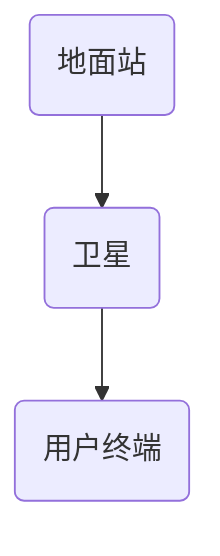
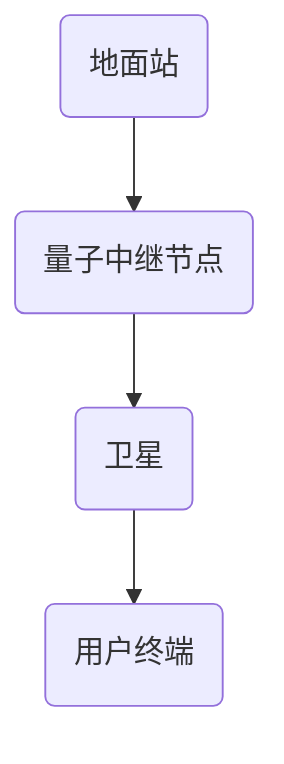
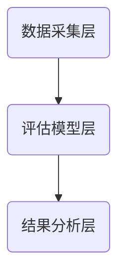

                 


# 企业估值中的量子加密通信卫星网络评估

> 关键词：量子加密通信、卫星网络、企业估值、信息安全性、通信技术、资产评估

> 摘要：随着量子通信技术的快速发展，量子加密通信卫星网络在企业估值中的重要性日益凸显。本文系统地探讨了量子加密通信的核心原理、卫星网络的构建与优化，以及如何将这些技术应用于企业估值模型中。通过构建评估系统，结合实际案例分析，本文提出了一套基于量子加密通信卫星网络的企业价值评估方法，为企业在通信领域的发展提供了新的视角和实践指导。

---

## 第1章：量子加密通信概述

### 1.1 量子加密通信的基本概念

#### 1.1.1 量子密钥分发（QKD）的原理
量子密钥分发是一种利用量子力学原理在通信双方之间安全共享密钥的技术。其核心思想是通过量子态的不可克隆性和测量扰动性，确保密钥的安全传输。QKD的实现依赖于量子态的特性，如单光子和纠缠光子，以及通信双方之间的物理距离。

**量子密钥分发的原理可以用以下步骤概括：**
1. **密钥生成**：发送方（Alice）生成一串随机的量子态，并将这些量子态发送给接收方（Bob）。
2. **基底选择**：Bob随机选择测量基底，Alice和Bob需要在相同基底上进行测量才能得到相同的密钥。
3. **密钥比较**：Alice和Bob将测量结果进行比较，如果不匹配，则说明有第三方窃听，需要重新生成密钥；如果匹配，则密钥有效。

**公式：**
当Alice和Bob在相同基底上测量时，密钥生成成功。假设Alice发送的量子态为$|0\rangle$或$|1\rangle$，Bob的测量结果为$r_i$，则密钥为$r_i$的序列。

#### 1.1.2 量子加密技术的核心特征
量子加密技术的核心特征包括：
- **安全性**：基于量子力学原理，无法被窃听而不被发现。
- **高效性**：通过量子态的传输，实现信息的快速共享。
- **抗干扰性**：量子态的测量会破坏其状态，从而检测潜在的窃听行为。

#### 1.1.3 量子加密与经典加密的对比
| 特性         | 量子加密          | 经典加密          |
|--------------|-------------------|-------------------|
| **安全性**    | 不可被窃听         | 可能被破解         |
| **密钥分发**  | 高效且安全        | 依赖于经典通信渠道 |
| **应用场景**  | 高安全需求领域     | 一般安全需求领域   |

### 1.2 卫星通信的基本原理

#### 1.2.1 卫星通信的工作模式
卫星通信通过地球上的终端与卫星之间的无线电波传输数据。常见的卫星通信模式包括：
- **单跳通信**：数据直接通过卫星传输到目标终端。
- **多跳通信**：数据通过多个卫星接力传输，扩大覆盖范围。

#### 1.2.2 卫星网络的结构与功能
卫星网络通常由地面站、卫星和用户终端组成。地面站负责与卫星的通信和数据处理，卫星作为中继节点，用户终端则是最终的数据接收设备。

**卫星网络结构的简化图：**


#### 1.2.3 卫星通信的优势与挑战
- **优势**：
  - 覆盖范围广，适合偏远地区的通信需求。
  - 高速数据传输，支持大带宽应用。
- **挑战**：
  - 卫星发射和维护成本高昂。
  - 信号延迟较高，影响实时性应用。

---

## 第2章：量子加密通信卫星网络的构建

### 2.1 量子加密通信卫星网络的架构

#### 2.1.1 网络拓扑结构
量子加密通信卫星网络的拓扑结构通常包括以下组成部分：
- **量子中继节点**：用于量子态的中转和放大。
- **卫星链路**：连接地面站和卫星的通信链路。
- **用户终端**：连接到卫星的用户设备。

**网络拓扑结构的简化图：**


#### 2.1.2 卫星节点的功能划分
卫星节点主要负责：
- **量子态传输**：接收和发送量子态信息。
- **经典数据处理**：对经典数据进行加密和解密。
- **中继功能**：作为量子态传输的中继站。

#### 2.1.3 量子加密通信的实现机制
量子加密通信的实现机制包括：
- **量子密钥分发**：确保通信双方共享相同的密钥。
- **量子加密算法**：基于共享密钥对数据进行加密和解密。

### 2.2 量子加密通信的关键技术

#### 2.2.1 量子密钥分发协议
量子密钥分发协议是量子加密通信的核心，常用的协议包括：
- **BB84协议**：基于单光子的极化状态。
- **EPR协议**：基于纠缠光子的量子态。

**BB84协议的工作流程：**
1. Alice生成随机的量子态并发送给Bob。
2. Bob随机选择测量基底进行测量。
3. Alice和Bob比较基底，保留相同基底的测量结果作为密钥。

**公式：**
假设Alice发送的量子态为$|0\rangle$或$|1\rangle$，Bob测量基底为$|0\rangle$或$|1\rangle$，则密钥为匹配的测量结果序列。

#### 2.2.2 量子纠错编码
量子纠错编码用于检测和纠正量子态传输中的错误，常见的编码方式包括：
- **Shor-Preskill码**：一种基于量子纠错码的方案。

#### 2.2.3 卫星量子通信的信道优化
卫星量子通信的信道优化主要考虑：
- **信道损耗**：量子态在传输过程中的损耗。
- **信道干扰**：外部环境对量子态的影响。

---

## 第3章：量子加密通信卫星网络的资产评估

### 3.1 企业估值的传统方法

#### 3.1.1 传统估值方法概述
企业估值的传统方法包括：
- **现金流折现法（DCF）**：基于未来现金流的现值计算企业价值。
- **相对估值法**：基于可比公司的市盈率、市净率等指标进行估值。

#### 3.1.2 量子加密通信卫星网络的特殊性
量子加密通信卫星网络的特殊性在于：
- **高技术门槛**：量子通信技术的复杂性和独特性。
- **高成本**：卫星发射和维护的成本高昂。
- **高安全性**：量子加密通信的安全性为企业提供了核心竞争优势。

### 3.2 量子加密通信卫星网络的估值模型

#### 3.2.1 量子加密通信的经济价值评估
量子加密通信的经济价值可以从以下几个方面进行评估：
- **技术优势**：量子加密技术的安全性带来的市场优势。
- **成本节约**：通过量子加密通信减少数据泄露带来的经济损失。
- **市场潜力**：量子加密技术在金融、军事等高安全需求领域的应用潜力。

#### 3.2.2 卫星网络的运营成本与收益
卫星网络的运营成本包括：
- **发射成本**：卫星的制造和发射费用。
- **维护成本**：卫星在轨维护和地面站的运营费用。
- **用户成本**：用户的使用费用。

收益方面，量子加密通信卫星网络可以通过提供高安全性的通信服务获得收入。

### 3.3 量子加密通信卫星网络的价值链分析

#### 3.3.1 价值链的关键环节
量子加密通信卫星网络的价值链包括：
- **技术开发**：量子通信技术的研发和改进。
- **设备制造**：量子通信设备的生产。
- **网络运营**：卫星网络的建设和维护。
- **客户服务**：为用户提供量子加密通信服务。

#### 3.3.2 价值链的优化策略
- **技术合作**：与高校和研究机构合作，提升技术水平。
- **成本控制**：优化卫星发射和维护的成本。
- **市场拓展**：积极拓展高安全需求的市场，如金融、军事等领域。

---

## 第4章：量子加密通信卫星网络的系统架构设计

### 4.1 系统功能模块划分

#### 4.1.1 数据采集模块
数据采集模块负责收集量子加密通信卫星网络的相关数据，包括：
- **量子态传输数据**：量子态的传输效率和损耗。
- **用户行为数据**：用户的使用情况和需求。

#### 4.1.2 评估模型模块
评估模型模块基于收集的数据，进行量子加密通信卫星网络的价值评估，包括：
- **密钥生成效率**：量子密钥分发的成功率。
- **网络稳定性**：卫星网络的传输稳定性和抗干扰能力。

#### 4.1.3 结果分析模块
结果分析模块对评估结果进行分析，提供可视化报告和改进建议。

### 4.2 系统架构设计

#### 4.2.1 系统架构
系统架构采用分层设计，包括：
- **数据采集层**：负责数据的采集和初步处理。
- **评估模型层**：进行量子加密通信卫星网络的价值评估。
- **结果分析层**：对评估结果进行分析和可视化。

**系统架构的简化图：**


#### 4.2.2 系统接口设计
系统接口设计包括：
- **数据接口**：与数据采集设备的接口。
- **用户接口**：供用户查看评估结果的界面。
- **第三方接口**：与外部数据库或服务的接口。

---

## 第5章：量子加密通信卫星网络评估的案例分析

### 5.1 案例背景
假设某量子通信公司计划发射一颗量子加密通信卫星，我们需要对其卫星网络进行估值。

### 5.2 数据收集与处理
数据收集包括：
- **卫星发射成本**：1亿美元。
- **地面站建设成本**：5000万美元。
- **用户需求预测**：未来5年用户数量增长10%。

### 5.3 评估模型的应用
使用现金流折现法进行估值：
- **自由现金流**：每年现金流为2000万美元。
- **贴现率**：假设为8%。

**计算公式：**
$$
\text{企业价值} = \sum_{t=1}^{n} \frac{\text{现金流}_t}{(1 + r)^t}
$$

假设未来5年现金流分别为2000万、2200万、2400万、2600万、2800万美元，贴现率为8%。

$$
\text{企业价值} = \frac{2000}{1.08} + \frac{2200}{1.08^2} + \frac{2400}{1.08^3} + \frac{2600}{1.08^4} + \frac{2800}{1.08^5}
$$

计算结果约为：$$\text{企业价值} \approx 8500 \text{万美元}$$

### 5.4 结果分析
通过评估模型，得出量子加密通信卫星网络的企业价值约为8500万美元，高于传统通信网络的价值。这表明量子加密通信卫星网络具有较高的市场价值和投资潜力。

---

## 第6章：总结与展望

### 6.1 总结
本文系统地探讨了量子加密通信卫星网络在企业估值中的应用，提出了基于量子加密通信技术的评估模型，并通过案例分析验证了模型的有效性。量子加密通信卫星网络的高安全性、高技术门槛和高市场潜力为企业估值提供了新的视角。

### 6.2 展望
未来，随着量子通信技术的进一步发展，量子加密通信卫星网络的评估方法将更加精确和多样化。建议企业加强技术研发，优化网络架构，以充分发挥量子加密通信的优势。

---

## 参考文献

1. 《量子密钥分发原理与应用》，作者：[作者姓名]。
2. 《卫星通信系统设计》，作者：[作者姓名]。
3. 《企业估值方法论》，作者：[作者姓名]。

---

**附录：代码实现**

以下是一个简单的量子密钥分发协议的Python实现示例：

```python
import random

def generate_key(length):
    # 生成随机的量子密钥
    key = [random.choice([0, 1]) for _ in range(length)]
    return key

def compare_bases(alice_bases, bob_bases):
    # 比较基底，返回匹配的索引
    matching_indices = [i for i in range(len(alice_bases)) if alice_bases[i] == bob_bases[i]]
    return matching_indices

# 示例
alice_bases = [random.choice([0, 1]) for _ in range(10)]
bob_bases = [random.choice([0, 1]) for _ in range(10)]
matching_indices = compare_bases(alice_bases, bob_bases)
print("Matching indices:", matching_indices)
```

---

通过以上内容，我们详细探讨了量子加密通信卫星网络在企业估值中的应用，结合实际案例和系统设计，为企业在通信领域的投资和决策提供了有力支持。

