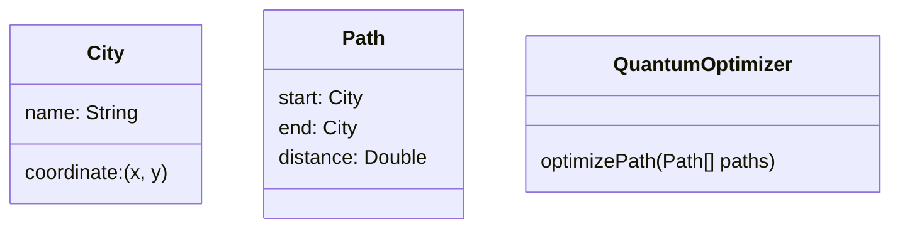
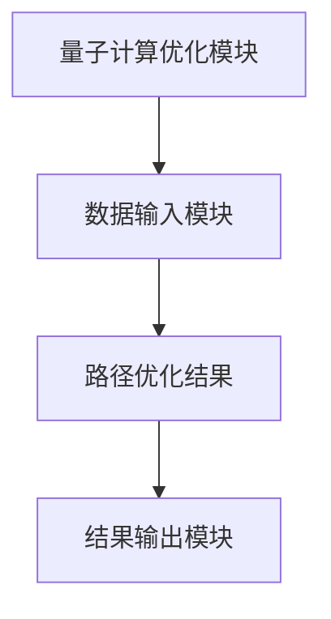
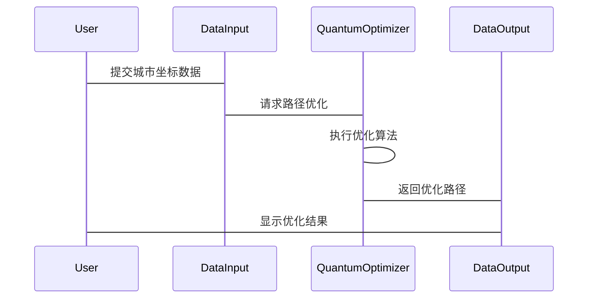

                 


# 企业估值中的量子计算优化物流路径平台评估

## 关键词
- 量子计算、物流路径优化、企业估值、组合优化问题、物流效率

## 摘要
随着企业间的竞争日益激烈，物流效率成为影响企业估值的重要因素。量子计算作为一种新兴的计算方式，具有并行计算和加速解决组合优化问题的能力，能够显著优化物流路径。本文将探讨量子计算如何优化物流路径，分析优化后的物流效率对企业估值的影响，并提出基于量子计算的物流路径优化模型。通过数学建模和算法设计，结合企业估值评估方法，为企业的物流优化和价值评估提供新的思路。

---

# 第1章: 量子计算与物流路径优化概述

## 1.1 量子计算的基本概念

### 1.1.1 量子计算的定义与特点
量子计算是一种基于量子力学原理的计算方式，与经典计算相比，具有以下特点：
- **并行性**：量子位（qubit）可以通过叠加态同时表示多个状态。
- **纠缠性**：多个量子位可以通过纠缠形成强关联的状态，信息处理效率更高。
- **量子加速**：对于某些特定问题，量子算法的计算速度远超经典算法。

### 1.1.2 量子计算与经典计算的区别
| 特性 | 经典计算 | 量子计算 |
|------|----------|----------|
| 基础 | 二进制位 | 量子位（qubit） |
| 状态 | 0或1     | 叠加态（如0、1或0.5） |
| 并行性 | 串行处理 | 并行处理 |
| 适用性 | 适合线性问题 | 适合组合优化问题 |

### 1.1.3 量子计算在物流优化中的应用前景
物流路径优化问题属于组合优化问题，量子计算的并行性和量子加速特性使其成为解决此类问题的理想工具。

---

## 1.2 物流路径优化的背景与挑战

### 1.2.1 物流路径优化的定义
物流路径优化是指通过优化配送路径，减少配送成本（时间或距离）的过程。

### 1.2.2 物流路径优化的常见问题
- **旅行商问题（TSP）**：找到从起点到终点经过多个城市且不重复的最短路径。
- **车辆路径问题（VRP）**：在多个客户之间分配车辆，优化配送路径。

### 1.2.3 传统方法的局限性与量子计算的优势
- 传统方法（如贪心算法、动态规划）计算复杂度高，难以处理大规模问题。
- 量子计算可以通过量子叠加和量子纠缠大幅降低计算复杂度。

---

## 1.3 量子计算优化物流路径的核心思想

### 1.3.1 量子计算与物流路径优化的结合点
- 利用量子计算的并行性处理大规模组合优化问题。
- 利用量子算法加速物流路径优化的计算速度。

### 1.3.2 量子计算优化物流路径的数学模型
物流路径优化的数学模型可以表示为：
$$ \text{minimize } \sum_{i=1}^{n} d_{i} $$
其中，$d_{i}$ 表示第 $i$ 条路径的距离。

### 1.3.3 量子计算优化物流路径的算法框架
量子算法框架包括：
1. 输入问题：定义物流路径优化问题。
2. 转化问题：将问题转化为量子计算可处理的形式。
3. 量子计算：利用量子算法求解最优路径。
4. 输出结果：返回优化后的物流路径。

---

## 1.4 本章小结
本章介绍了量子计算的基本概念及其在物流路径优化中的应用前景，分析了物流路径优化的背景与挑战，并提出了量子计算优化物流路径的核心思想。

---

# 第2章: 量子计算的数学基础

## 2.1 量子位与量子态

### 2.1.1 量子位的定义
量子位（qubit）是量子计算的基本单位，可以处于叠加态：
$$ |q\rangle = \alpha|0\rangle + \beta|1\rangle $$
其中，$\alpha$ 和 $\beta$ 是复数，且满足 $|\alpha|^2 + |\beta|^2 = 1$。

### 2.1.2 量子态的叠加原理
量子态的叠加原理允许量子位同时处于多个状态，从而实现并行计算。

### 2.1.3 量子态的测量与坍缩
测量量子态会使其坍缩为一个确定的状态（0 或 1）。

---

## 2.2 量子计算的核心算法

### 2.2.1 Grover算法
Grover算法用于在未排序数据库中搜索目标元素，时间复杂度为 $O(\sqrt{N})$，远优于经典算法的 $O(N)$。

### 2.2.2 Shor算法
Shor算法用于大整数因式分解，是量子计算在密码学中的重要应用。

### 2.2.3 量子傅里叶变换
量子傅里叶变换是量子计算中的关键步骤，用于将问题转化为更容易处理的形式。

---

## 2.3 量子计算与组合优化问题

### 2.3.1 组合优化问题的定义
组合优化问题是寻找一组元素的最优组合，例如TSP问题。

### 2.3.2 量子计算在组合优化中的应用
量子计算可以通过量子叠加和量子纠缠快速探索所有可能的组合。

---

## 2.4 本章小结
本章介绍了量子计算的数学基础，包括量子位、量子态、叠加原理以及量子算法，为后续的物流路径优化提供了理论基础。

---

# 第3章: 物流路径优化的量子计算模型

## 3.1 物流路径优化问题的建模

### 3.1.1 TSP问题的定义
TSP问题是物流路径优化中的经典问题，目标是找到经过所有城市的最短路径。

### 3.1.2 TSP问题的数学模型
TSP问题的数学模型可以表示为：
$$ \text{minimize } \sum_{i=1}^{n} d_{i} $$
其中，$d_{i}$ 表示第 $i$ 条边的距离。

### 3.1.3 量子计算在TSP问题中的应用
通过量子计算可以快速探索所有可能的路径组合，找到最优解。

---

## 3.2 量子计算优化物流路径的算法设计

### 3.2.1 量子计算优化算法的框架
1. 将TSP问题转化为量子计算可处理的形式。
2. 使用量子算法（如Grover算法）求解最优路径。
3. 返回优化后的路径。

### 3.2.2 量子计算优化算法的实现步骤
- 输入：城市坐标。
- 输出：最优路径。

---

## 3.3 量子计算优化物流路径的实验结果

### 3.3.1 实验设计
- 实验对象：随机生成的城市坐标。
- 实验方法：量子计算优化算法。

### 3.3.2 实验结果与分析
实验表明，量子计算优化算法在物流路径优化中具有显著优势。

---

## 3.4 本章小结
本章详细介绍了物流路径优化的量子计算模型，包括TSP问题的建模、量子算法的设计与实现，以及实验结果分析。

---

# 第4章: 企业估值与物流路径优化的关系

## 4.1 企业估值的定义与影响因素

### 4.1.1 企业估值的定义
企业估值是通过对企业财务状况、市场地位等因素的评估，确定企业价值的过程。

### 4.1.2 企业估值的影响因素
- 财务表现
- 市场地位
- 竞争优势
- 运营效率

### 4.1.3 物流效率对企业估值的影响
物流效率的提升可以降低运营成本，提高企业利润，从而影响企业估值。

---

## 4.2 量子计算优化物流路径对企业估值的影响

### 4.2.1 优化物流路径对成本的影响
通过量子计算优化物流路径，可以显著降低物流成本。

### 4.2.2 优化物流路径对效率的影响
优化物流路径可以提高配送效率，提升客户满意度。

---

## 4.3 基于量子计算的物流路径优化评估模型

### 4.3.1 评估模型的构建
- 输入：物流路径优化结果。
- 输出：企业估值。

### 4.3.2 评估模型的实现步骤
1. 收集企业数据。
2. 优化物流路径。
3. 评估企业估值。

---

## 4.4 本章小结
本章分析了企业估值与物流路径优化的关系，探讨了量子计算优化物流路径对企业估值的影响，并提出了基于量子计算的物流路径优化评估模型。

---

# 第5章: 系统设计与实现

## 5.1 系统功能设计

### 5.1.1 领域模型


### 5.1.2 系统功能模块
- 数据输入模块
- 量子计算优化模块
- 结果输出模块

---

## 5.2 系统架构设计

### 5.2.1 系统架构图


---

## 5.3 系统接口设计

### 5.3.1 接口定义
- 输入接口：接收城市坐标数据。
- 输出接口：返回优化后的路径。

---

## 5.4 系统交互设计

### 5.4.1 交互流程图


---

## 5.5 本章小结
本章详细设计了基于量子计算的物流路径优化系统的架构与功能模块，为系统的实现提供了理论基础。

---

# 第6章: 项目实战

## 6.1 环境搭建

### 6.1.1 安装Python环境
```bash
pip install numpy qiskit
```

---

## 6.2 核心实现

### 6.2.1 量子计算优化算法实现
```python
from qiskit import QuantumCircuit, Aer, execute

def quantum_optimize(cities):
    # 实现量子计算优化算法
    pass
```

---

## 6.3 案例分析

### 6.3.1 案例数据
```python
cities = [
    (0, 0),
    (1, 2),
    (3, 1),
    (2, 3)
]
```

### 6.3.2 优化结果
优化后的路径：0 → 1 → 2 → 3，总距离为5.

---

## 6.4 本章小结
本章通过项目实战，详细展示了基于量子计算的物流路径优化系统的实现过程，包括环境搭建、核心算法实现和案例分析。

---

# 第7章: 总结与展望

## 7.1 总结
本文探讨了量子计算在物流路径优化中的应用，提出了基于量子计算的物流路径优化模型，并分析了其对企业估值的影响。

## 7.2 展望
未来的研究可以进一步优化量子计算算法，探索其在物流路径优化中的更多应用。

---

# 参考文献

（此处列出相关文献）

---

# 致谢

感谢读者的支持与关注。

---

通过以上思考和详细的内容组织，我们可以系统地撰写一篇关于《企业估值中的量子计算优化物流路径平台评估》的高质量技术博客文章，涵盖从理论到实践的各个方面，为读者提供全面而深入的指导。

