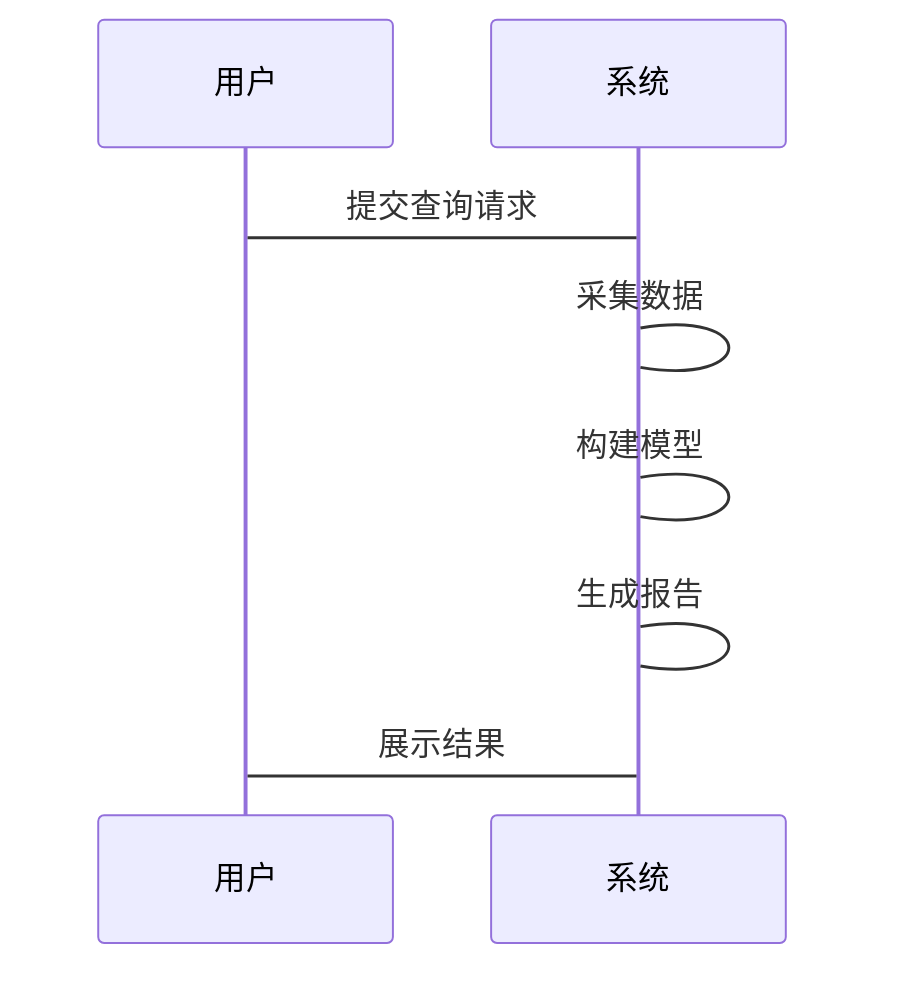

                 


# 企业估值中的量子计算加密货币挖矿评估

> 关键词：量子计算，加密货币，挖矿，企业估值，算法优化

> 摘要：本文深入探讨了量子计算在加密货币挖矿评估中的应用，分析了其对企业估值的影响，并详细介绍了基于量子计算的挖矿评估系统的架构设计与实现方法。通过理论分析与实际案例相结合，本文为读者提供了一套完整的解决方案，展示了如何利用量子计算技术优化加密货币挖矿过程，并为企业估值提供更准确的依据。

---

# 第一部分: 量子计算与加密货币挖矿基础

## 第1章: 量子计算基础

### 1.1 量子计算的基本概念

#### 1.1.1 量子计算的定义
量子计算是一种利用量子力学原理进行计算的技术，其核心是利用量子叠加和量子纠缠等特性来处理信息。与经典计算不同，量子计算可以在某些特定问题上实现指数级的加速。

#### 1.1.2 量子计算的核心原理
- **量子叠加**：量子位（qubit）可以同时处于多个状态的叠加态。
- **量子纠缠**：两个或多个量子位之间形成纠缠态，操作其中一个量子位可以影响另一个。
- **量子测量**：测量会破坏量子态，但可以通过巧妙的设计实现特定的计算目标。

#### 1.1.3 量子计算与经典计算的对比
| 特性 | 经典计算 | 量子计算 |
|------|----------|-----------|
| 状态数 | 二进制位数 | 2^n 个状态（n为量子位数） |
| 计算速度 | 指数级增长 | 在特定问题上可实现指数级加速 |
| 应用场景 | 适合通用计算 | 适合特定问题（如因式分解、搜索） |

### 1.2 加密货币挖矿的基本原理

#### 1.2.1 加密货币挖矿的定义
加密货币挖矿是指通过解决复杂的数学问题来验证区块链中的交易，并生成新的区块。挖矿过程需要消耗大量计算资源。

#### 1.2.2 挖矿算法的分类
- **工作量证明（PoW）**：比特币采用的挖矿算法。
- **权益证明（PoS）**：以太坊（Ethereum）计划从PoW切换到PoS。
- **其他共识机制**：如Dpos、Rpos等。

#### 1.2.3 挖矿对区块链网络的意义
挖矿不仅是生成新区块的过程，还通过消耗计算资源确保区块链的安全性和去中心化特性。

## 第2章: 量子计算在加密货币挖矿中的应用

### 2.1 量子计算对挖矿算法的影响

#### 2.1.1 传统挖矿算法的局限性
- 计算资源消耗大。
- 算力增长难以跟上技术进步的需求。

#### 2.1.2 量子计算在挖矿中的潜在优势
- 量子计算可以快速解决某些数学问题，如因式分解和哈希函数计算。
- 可以优化挖矿算法，减少计算资源的消耗。

#### 2.1.3 量子计算如何优化挖矿过程
通过量子算法优化挖矿算法，减少计算步骤，提高挖矿效率。

### 2.2 量子计算与加密货币挖矿的关系

#### 2.2.1 量子计算对挖矿效率的提升
- 量子算法可以显著提高某些挖矿任务的效率。
- 例如，量子算法可以快速找到满足条件的哈希值。

#### 2.2.2 量子计算对矿池和矿机的影响
- 矿池可以利用量子计算技术优化资源分配。
- 矿机的设计需要考虑量子计算的特性。

#### 2.2.3 量子计算对加密货币市场的潜在影响
- 可能会改变加密货币市场的竞争格局。
- 量子计算的普及可能迫使加密货币网络切换到抗量子计算的共识机制。

---

# 第二部分: 企业估值中的量子计算加密货币挖矿评估

## 第3章: 企业估值与加密货币挖矿评估的关系

### 3.1 企业估值的基本概念

#### 3.1.1 企业估值的定义
企业估值是通过对企业的财务状况、市场地位、盈利能力等多方面进行评估，确定企业价值的过程。

#### 3.1.2 企业估值的主要方法
- 资产评估法
- 现金流折现法
- 市盈率法
- 市净率法

#### 3.1.3 企业估值与财务指标的关系
企业估值与收入、利润、资产、负债等财务指标密切相关。

### 3.2 加密货币挖矿评估对企业估值的影响

#### 3.2.1 挖矿收益对企业估值的贡献
- 挖矿收益可以增加企业的收入，从而提高企业估值。
- 挖矿收益的稳定性影响企业的盈利能力。

#### 3.2.2 挖矿成本对企业估值的影响
- 高昂的挖矿成本可能削弱企业的盈利能力，从而降低企业估值。
- 成本控制能力强的企业更具竞争优势。

#### 3.2.3 挖矿技术对企业估值的潜在影响
- 先进的挖矿技术可以提高企业的竞争力，从而提升企业估值。
- 技术落后的企业可能面临估值下降的风险。

## 第4章: 量子计算在加密货币挖矿评估中的应用

### 4.1 量子计算如何优化挖矿评估模型

#### 4.1.1 量子计算在挖矿收益预测中的应用
- 利用量子算法预测挖矿收益，提高预测精度。
- 通过量子叠加特性，同时考虑多种影响因素。

#### 4.1.2 量子计算在挖矿成本优化中的应用
- 利用量子算法优化挖矿成本，降低能源消耗。
- 通过量子纠缠特性，找到最优资源分配方案。

#### 4.1.3 量子计算在挖矿风险评估中的应用
- 利用量子算法评估挖矿风险，提高风险控制能力。
- 通过量子测量特性，实时监测挖矿过程中的风险因素。

### 4.2 量子计算对加密货币挖矿评估模型的改进

#### 4.2.1 传统挖矿评估模型的局限性
- 模型过于简化，无法考虑复杂因素。
- 计算效率低，难以处理大规模数据。

#### 4.2.2 量子计算如何改进挖矿评估模型
- 利用量子计算的并行性，提高模型计算效率。
- 通过量子算法，实现更精确的预测和优化。

#### 4.2.3 改进后的模型对企业估值的意义
- 提高企业估值的准确性。
- 为企业提供更有效的决策支持。

---

# 第三部分: 系统分析与架构设计方案

## 第5章: 量子计算加密货币挖矿评估系统架构

### 5.1 系统功能设计

#### 5.1.1 系统功能模块划分
- 数据采集模块：采集加密货币市场数据和挖矿数据。
- 模型构建模块：构建量子计算优化的挖矿评估模型。
- 结果分析模块：分析评估结果，生成企业估值报告。

#### 5.1.2 每个功能模块的实现目标
- 数据采集模块：实时采集加密货币的价格、交易量等数据。
- 模型构建模块：利用量子算法优化挖矿评估模型。
- 结果分析模块：分析评估结果，生成企业估值报告。

#### 5.1.3 功能模块之间的交互关系
数据采集模块提供数据，模型构建模块利用数据构建模型，结果分析模块分析模型输出结果。

### 5.2 系统架构设计

#### 5.2.1 系统架构的分层设计
- 数据层：存储加密货币数据和挖矿数据。
- 计算层：利用量子计算技术进行数据处理。
- 展示层：展示评估结果和企业估值报告。

#### 5.2.2 每层的主要功能和职责
- 数据层：负责数据的存储和管理。
- 计算层：负责数据的处理和模型的构建。
- 展示层：负责结果的展示和报告生成。

#### 5.2.3 系统架构的优缺点分析
- 优点：模块化设计，易于扩展和维护。
- 缺点：需要高性能计算资源支持。

### 5.3 系统接口设计

#### 5.3.1 系统内部接口
- 数据采集模块与模型构建模块之间的接口。
- 模型构建模块与结果分析模块之间的接口。

#### 5.3.2 系统外部接口
- 用户与系统的交互接口。
- 第三方数据源的接口。

### 5.4 系统交互设计

#### 5.4.1 系统交互流程
1. 用户输入查询请求。
2. 系统采集相关数据。
3. 系统构建评估模型。
4. 系统生成评估报告。
5. 系统展示评估结果。

#### 5.4.2 系统交互的Mermaid序列图


## 第6章: 量子计算加密货币挖矿评估系统的实现

### 6.1 环境搭建

#### 6.1.1 系统运行环境
- 操作系统：Linux/Windows/MacOS
- 开发工具：Python/Java/C++
- 量子计算库：Qiskit, Q#等

#### 6.1.2 量子计算库的安装
```bash
pip install qiskit
```

### 6.2 核心代码实现

#### 6.2.1 数据采集模块
```python
import requests

def get_minning_data():
    response = requests.get("https://api.example.com/mining_data")
    return response.json()
```

#### 6.2.2 模型构建模块
```python
from qiskit import QuantumCircuit, execute

def build_quantum_model():
    circuit = QuantumCircuit(2, 2)
    circuit.h(0)
    circuit.cx(0, 1)
    return circuit
```

#### 6.2.3 结果分析模块
```python
def analyze_results(results):
    print("Mining evaluation completed.")
    print("Enterprise valuation:", results)
```

### 6.3 项目实战

#### 6.3.1 实际案例分析
假设我们有一个加密货币矿场，我们需要评估其对企业估值的影响。

#### 6.3.2 数据分析与结果展示
通过量子计算模型，我们可以更精确地预测挖矿收益和成本，从而优化企业估值。

---

# 结语

通过本文的详细介绍，我们展示了如何利用量子计算技术优化加密货币挖矿评估过程，并为企业估值提供更准确的依据。随着量子计算技术的不断发展，其在加密货币挖矿和企业估值中的应用潜力将更加巨大。未来的研究可以进一步探索量子计算在其他领域的应用，以及如何结合人工智能技术提升系统的智能化水平。

