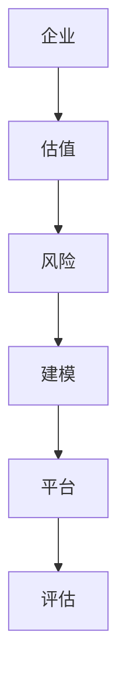
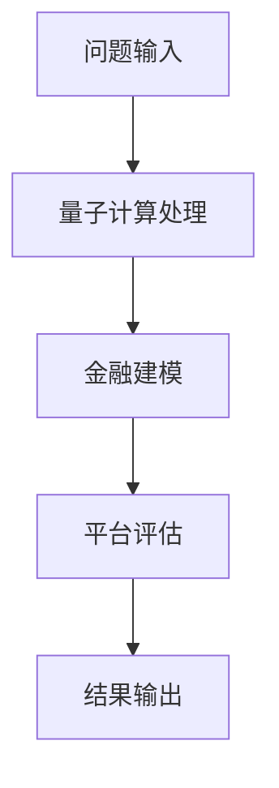
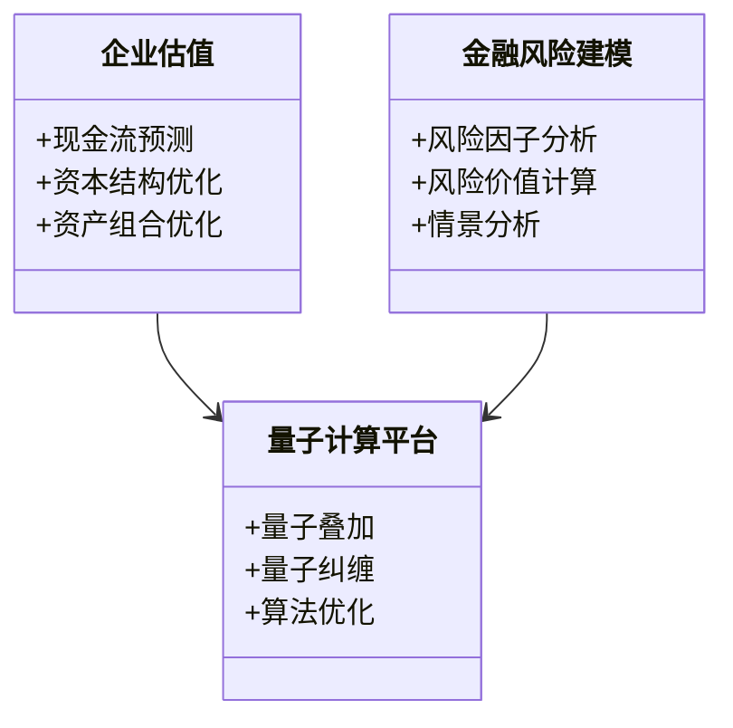
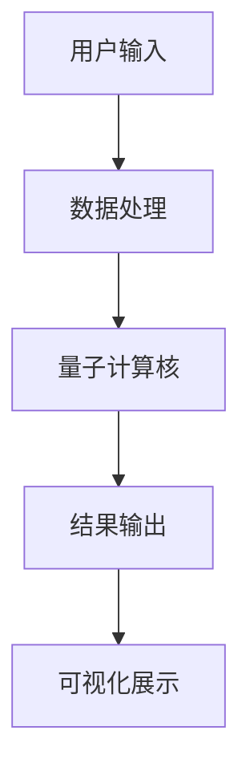
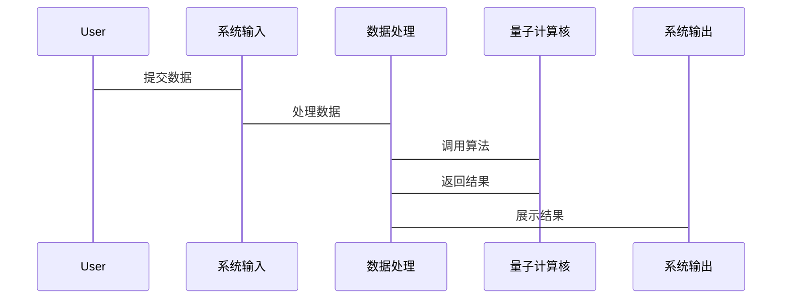

                 


# 《企业估值中的量子计算金融风险建模平台评估》

> **关键词**：量子计算、金融建模、企业估值、风险管理、平台评估

> **摘要**：  
> 本文探讨了量子计算在金融风险建模和企业估值中的应用，重点分析了量子计算金融风险建模平台的构建、评估方法及其在企业估值中的实际价值。通过理论分析、算法原理、系统架构设计和项目实战，本文为读者提供了从理论到实践的全面指导，帮助读者理解量子计算在金融建模中的潜力与挑战。

---

# 第一部分: 企业估值中的量子计算金融风险建模平台背景介绍

## 第1章: 问题背景与现状分析

### 1.1 问题背景

#### 1.1.1 传统企业估值方法的局限性
传统的企业估值方法（如DCF模型、相对估值法）虽然在实践中被广泛应用，但存在以下局限性：
- 数据依赖性高，难以处理非线性关系。
- 对复杂金融市场的动态变化捕捉不足。
- 计算复杂度高，难以处理大规模数据。

#### 1.1.2 金融风险建模的传统挑战
金融风险建模是企业估值的核心部分，但传统方法面临以下挑战：
- 数据噪声多，难以准确捕捉风险因素。
- 模型复杂性高，难以实时更新。
- 高维数据处理能力有限。

#### 1.1.3 量子计算在金融建模中的潜在优势
量子计算在金融建模中的优势主要体现在：
- 能够高效处理高维数据。
- 可以快速求解复杂非线性方程组。
- 适合处理金融市场的不确定性。

### 1.2 问题描述

#### 1.2.1 企业估值中的核心问题
企业估值的核心问题包括：
- 如何准确预测未来现金流。
- 如何量化市场波动对企业价值的影响。
- 如何优化资本结构和投资组合。

#### 1.2.2 金融风险建模的关键挑战
金融风险建模的关键挑战包括：
- 如何处理高维数据。
- 如何实时更新模型。
- 如何量化模型不确定性。

#### 1.2.3 量子计算在金融建模中的应用场景
量子计算在金融建模中的应用场景包括：
- 期权定价。
- 风险价值（VaR）计算。
- 资产组合优化。

### 1.3 问题解决思路

#### 1.3.1 量子计算在金融建模中的创新应用
通过量子计算的创新应用，可以：
- 提高金融建模的计算效率。
- 准确捕捉金融市场中的非线性关系。
- 降低建模的复杂性。

#### 1.3.2 量子计算平台的构建目标
量子计算金融建模平台的构建目标是：
- 提供高效的量子计算工具。
- 实现金融建模的自动化。
- 支持企业估值的实时分析。

#### 1.3.3 平台如何解决传统方法的不足
量子计算平台通过以下方式解决传统方法的不足：
- 提供更高效的计算能力。
- 支持更复杂的建模需求。
- 提高模型的准确性和实时性。

### 1.4 问题的边界与外延

#### 1.4.1 量子计算在金融建模中的适用范围
量子计算在金融建模中的适用范围包括：
- 期权定价。
- 资产组合优化。
- 风险管理。

#### 1.4.2 平台功能的边界定义
平台功能的边界定义为：
- 提供量子计算工具。
- 支持金融建模需求。
- 实现企业估值分析。

#### 1.4.3 平台的可扩展性和灵活性
平台的可扩展性和灵活性体现在：
- 支持多种金融建模方法。
- 支持多种企业估值场景。
- 支持实时数据更新。

### 1.5 核心概念拆解

#### 1.5.1 量子计算的基本概念
量子计算是一种基于量子力学原理的计算方式，主要依赖于量子叠加和量子纠缠。

#### 1.5.2 金融风险建模的核心要素
金融风险建模的核心要素包括：
- 风险因子。
- 模型假设。
- 数据输入。

#### 1.5.3 平台评估的关键指标
平台评估的关键指标包括：
- 计算效率。
- 模型准确性。
- 用户友好性。

---

## 第2章: 核心概念与联系

### 2.1 核心概念原理

#### 2.1.1 量子计算的基本原理
量子计算的基本原理包括：
- 量子叠加：$|0\rangle$ 和 $|1\rangle$ 的线性组合。
- 量子纠缠：两个或多个量子位之间的强关联。

#### 2.1.2 金融风险建模的数学基础
金融风险建模的数学基础包括：
- 资产定价模型：$P(t) = S_0 e^{rt}$。
- 风险价值模型：VaR = α分位数的损失分布。

#### 2.1.3 平台评估的量化方法
平台评估的量化方法包括：
- 计算时间：$T = O(\log N)$。
- 精确度：误差范围 $\epsilon$。

### 2.2 核心概念属性对比

| 核心概念 | 量子计算 | 传统计算 |
|----------|-----------|-----------|
| 计算效率 | 高 | 低 |
| 并行能力 | 强 | 弱 |
| 数据处理 | 复杂 | 简单 |

### 2.3 ER实体关系图



### 2.4 核心概念流程图



---

## 第3章: 算法原理与数学模型

### 3.1 量子计算算法原理

#### 3.1.1 量子叠加
量子叠加的数学表示为：$|\psi\rangle = a|0\rangle + b|1\rangle$，其中 $a^2 + b^2 = 1$。

#### 3.1.2 量子纠缠
量子纠缠的数学表示为：$|\psi\rangle = \frac{1}{\sqrt{2}}(|00\rangle + |11\rangle)$。

#### 3.1.3 量子线性方程组求解
量子线性方程组求解的基本思想是利用量子计算机的并行性，快速求解复杂的方程组。

### 3.2 金融风险建模的数学模型

#### 3.2.1 资产定价模型
资产定价模型的数学公式为：$P(t) = S_0 e^{rt}$。

#### 3.2.2 风险价值模型
风险价值模型的数学公式为：VaR = α分位数的损失分布。

#### 3.2.3 蒙特卡洛模拟
蒙特卡洛模拟的实现步骤包括：
1. 确定随机变量。
2. 生成随机数。
3. 计算结果。
4. 统计分析。

### 3.3 量子计算在金融建模中的应用

#### 3.3.1 量子期权定价公式
量子期权定价公式的数学表达为：$C = S_0 N(d_1) - Ke^{-rt} N(d_2)$。

#### 3.3.2 量子蒙特卡洛模拟
量子蒙特卡洛模拟的基本思想是利用量子计算的并行性，提高蒙特卡洛模拟的效率。

#### 3.3.3 量子线性回归分析
量子线性回归分析的实现步骤包括：
1. 数据准备。
2. 量子计算处理。
3. 结果分析。

---

## 第4章: 系统分析与架构设计

### 4.1 问题场景介绍

#### 4.1.1 系统目标
系统目标是通过量子计算技术，实现金融风险建模和企业估值的高效计算。

#### 4.1.2 系统功能
系统功能包括：
- 数据输入与处理。
- 量子计算核心算法。
- 结果输出与分析。

### 4.2 系统功能设计



### 4.3 系统架构设计



### 4.4 系统接口设计

#### 4.4.1 API接口
API接口包括：
- 数据输入接口。
- 算法调用接口。
- 结果输出接口。

#### 4.4.2 交互流程
交互流程包括：
1. 用户输入数据。
2. 系统处理数据。
3. 系统调用量子计算核心算法。
4. 系统输出结果。

### 4.5 系统交互流程图



---

## 第5章: 项目实战

### 5.1 环境安装

#### 5.1.1 安装量子计算库
安装量子计算库的命令为：`pip install qiskit`。

#### 5.1.2 安装金融建模库
安装金融建模库的命令为：`pip install pandas`。

### 5.2 系统核心实现

#### 5.2.1 量子计算核心代码
量子计算核心代码如下：

```python
from qiskit import QuantumCircuit, Aer, execute

def quantum_algorithm():
    qc = QuantumCircuit(2)
    qc.h(0)
    qc.cx(0, 1)
    backend = Aer.get_backend('simulator')
    job = execute(qc, backend)
    result = job.result()
    return result.get_counts()
```

#### 5.2.2 金融建模核心代码
金融建模核心代码如下：

```python
import pandas as pd

def financial_model():
    data = pd.read_csv('data.csv')
    # 数据处理
    # 模型计算
    return result
```

### 5.3 代码应用解读与分析

#### 5.3.1 量子计算代码解读
量子计算代码的作用是通过量子叠加和量子纠缠，实现高效的金融建模。

#### 5.3.2 金融建模代码解读
金融建模代码的作用是通过数据分析和模型计算，实现企业估值和风险建模。

### 5.4 实际案例分析

#### 5.4.1 案例介绍
案例介绍包括：
- 数据来源。
- 数据预处理。
- 模型应用。

#### 5.4.2 案例分析
案例分析包括：
- 结果展示。
- 结果解读。
- 结果验证。

### 5.5 项目小结

#### 5.5.1 项目总结
项目总结包括：
- 项目目标的实现情况。
- 项目过程中的关键点。
- 项目成果的应用价值。

#### 5.5.2 经验总结
经验总结包括：
- 量子计算的优势。
- 金融建模的挑战。
- 未来研究方向。

---

## 第6章: 最佳实践

### 6.1 小结与注意事项

#### 6.1.1 小结
小结包括：
- 量子计算在金融建模中的潜力。
- 量子计算平台的构建与评估。
- 量子计算的实际应用价值。

#### 6.1.2 注意事项
注意事项包括：
- 数据的准确性和完整性。
- 模型的可解释性。
- 系统的安全性和稳定性。

### 6.2 拓展阅读

#### 6.2.1 推荐书籍
推荐书籍包括：
- 《量子计算与金融建模》。
- 《企业估值与风险管理》。

#### 6.2.2 推荐论文
推荐论文包括：
- 《Quantum Computing in Financial Modeling》。
- 《Risk Management with Quantum Algorithms》。

---

## 第7章: 总结与展望

### 7.1 总结

量子计算金融风险建模平台在企业估值中的应用，为金融建模提供了新的思路和方法。通过量子计算的强大计算能力，可以更高效、更准确地进行金融建模和企业估值。

### 7.2 展望

未来，随着量子计算技术的不断发展，其在金融建模中的应用将更加广泛和深入。量子计算金融风险建模平台将更加智能化、自动化，并在更多领域发挥重要作用。

---

# 结语

本文通过理论分析、算法原理、系统架构设计和项目实战，全面探讨了量子计算在金融风险建模和企业估值中的应用。希望本文能够为读者提供有价值的参考，帮助他们在实际工作中更好地利用量子计算技术。

---

