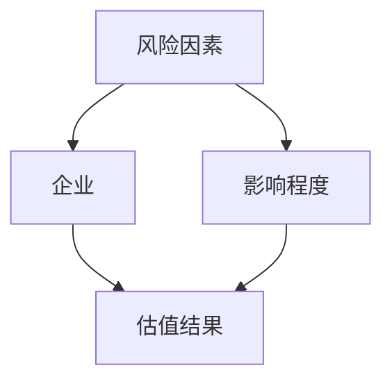
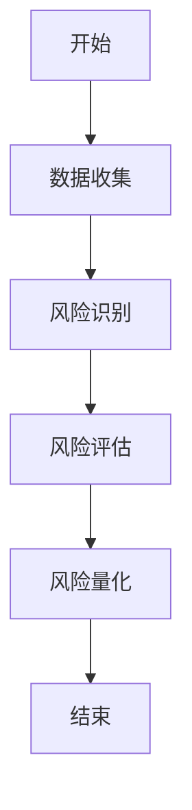
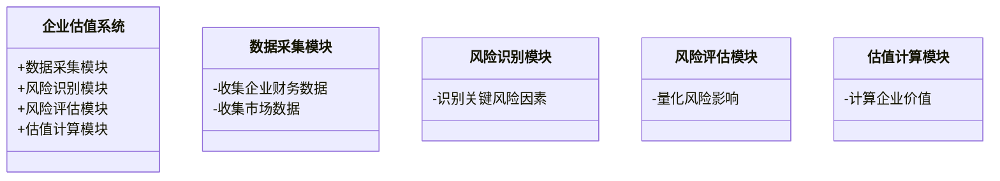
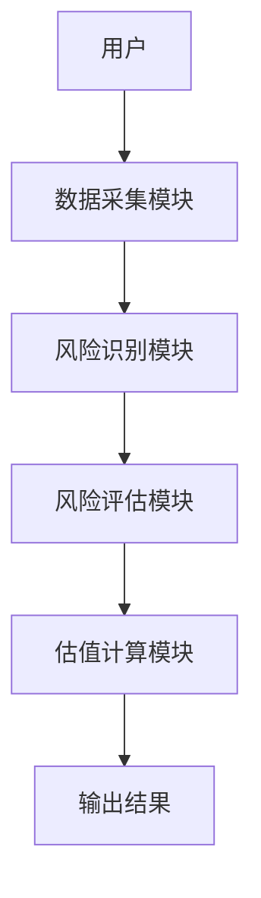

                 


# 企业估值中的风险因素分析

> 关键词：企业估值、风险因素、财务指标、市场风险、模型构建

> 摘要：本文系统地探讨了企业估值中的风险因素分析，通过分析风险因素对企业价值的影响，构建了基于风险调整的估值模型，详细阐述了风险识别、量化和情景分析的方法，结合实际案例，为企业估值提供了科学的分析框架和方法论。

---

## 第1章: 企业估值与风险因素分析的背景

### 1.1 企业估值的基本概念
#### 1.1.1 企业估值的定义与意义
企业估值是通过对企业的财务状况、市场地位、盈利能力等多方面因素的综合分析，确定其市场价值的过程。在企业并购、融资、上市等场景中，企业估值是核心决策依据。

#### 1.1.2 风险因素在企业估值中的重要性
风险因素是影响企业未来现金流的核心变量，直接决定了估值的准确性和可靠性。忽视风险因素可能导致估值偏差，影响投资决策。

#### 1.1.3 企业估值的核心问题与边界
- 核心问题：如何准确预测企业未来的现金流，并合理调整风险因素的影响。
- 边界：企业估值基于现有信息和假设，具有一定的局限性。

### 1.2 风险因素分析的必要性
#### 1.2.1 风险因素对企业估值的影响
风险因素通过影响企业的盈利能力、成长性和稳定性，间接影响其市场价值。

#### 1.2.2 风险因素的分类与特征
- 分类：财务风险、市场风险、法律风险、经营风险等。
- 特征：不确定性、相关性、可量化性。

#### 1.2.3 风险因素分析的边界与外延
- 边界：基于现有数据和假设，不考虑黑天鹅事件。
- 外延：风险因素分析是企业估值的重要组成部分，但需结合其他因素综合判断。

---

## 第2章: 风险因素分析的核心概念与联系

### 2.1 风险因素分析的原理
#### 2.1.1 风险因素分析的基本原理
通过识别和量化风险因素，评估其对企业和估值结果的影响，从而调整估值模型的参数。

#### 2.1.2 风险因素与企业估值的关系
- 风险因素是企业估值的核心变量。
- 风险调整是企业估值的关键步骤。

#### 2.1.3 风险因素的量化方法
- 相对指标：β系数、波动率等。
- 绝对指标：VaR、CVaR等。

### 2.2 风险因素分析的ER实体关系图


---

## 第3章: 风险因素分析的算法原理

### 3.1 风险因素分析的流程图


### 3.2 算法实现的Python代码
```python
def preprocess(data):
    # 数据清洗和特征工程
    processed_data = data.dropna().fillna(0)
    return processed_data

def identify_risks(processed_data):
    # 风险识别：基于特征工程的结果
    risks = []
    for feature in processed_data.columns:
        if processed_data[feature].std() > 0:
            risks.append(feature)
    return risks

def assess_risks(identified_risks):
    # 风险评估：计算风险评分
    risk_scores = {}
    for risk in identified_risks:
        score = processed_data[risk].std() * processed_data[risk].mean()
        risk_scores[risk] = score
    return risk_scores

# 示例数据
data = pd.DataFrame({
    'Revenue': [100, 200, 300, 400],
    'Profit': [20, 30, 40, 50],
    'Market_Risk': [1.2, 1.1, 1.3, 1.0]
})

processed_data = preprocess(data)
identified_risks = identify_risks(processed_data)
risk_scores = assess_risks(identified_risks)
print(risk_scores)
```

---

## 第4章: 风险因素分析的数学模型与公式

### 4.1 风险调整的数学模型
$$企业价值 = 现金流的现值 - 风险调整值$$

### 4.2 情景分析模型
$$情景分析 = \sum_{i=1}^{n} P_i \times V_i$$
其中，$P_i$ 是情景 $i$ 的概率，$V_i$ 是情景 $i$ 下的企业价值。

---

## 第5章: 系统分析与架构设计

### 5.1 企业估值分析系统介绍
- 系统目标：构建一个基于风险因素分析的企业估值系统。
- 系统功能：数据采集、风险识别、风险评估、估值计算。

### 5.2 系统功能设计（领域模型）


### 5.3 系统架构设计


---

## 第6章: 项目实战

### 6.1 项目背景与目标
- 项目背景：某科技公司估值案例。
- 项目目标：通过风险因素分析，评估公司价值。

### 6.2 项目实施步骤
1. 数据收集：收集公司财务数据和市场数据。
2. 风险识别：识别关键风险因素。
3. 风险评估：量化风险影响。
4. 估值计算：计算企业价值。

### 6.3 代码实现与解读
```python
import pandas as pd

def calculateenterprisevalue(data):
    processed_data = preprocess(data)
    identified_risks = identify_risks(processed_data)
    risk_scores = assess_risks(identified_risks)
    # 计算企业价值
    enterprise_value = sum(processed_data['Revenue'] * risk_scores['Market_Risk'])
    return enterprise_value

# 示例数据
data = pd.DataFrame({
    'Revenue': [100, 200, 300, 400],
    'Profit': [20, 30, 40, 50],
    'Market_Risk': [1.2, 1.1, 1.3, 1.0]
})

enterprise_value = calculateenterprisevalue(data)
print(f"企业价值：{enterprise_value}")
```

### 6.4 案例分析与结果解读
- 数据分析：市场风险系数较高，影响企业价值。
- 结果展示：企业价值计算结果。

---

## 第7章: 总结与展望

### 7.1 核心要点回顾
- 风险因素对企业估值的重要性。
- 风险分析的流程与方法。

### 7.2 最佳实践 tips
- 数据质量是关键。
- 模型假设需合理。
- 结合实际情况进行调整。

### 7.3 未来展望
- 风险因素分析的自动化。
- 多因素模型的应用。

---

通过以上目录结构，文章系统地介绍了企业估值中的风险因素分析，结合理论与实践，为企业估值提供了科学的方法论。

