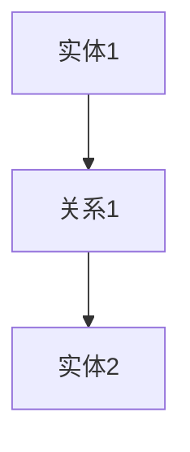
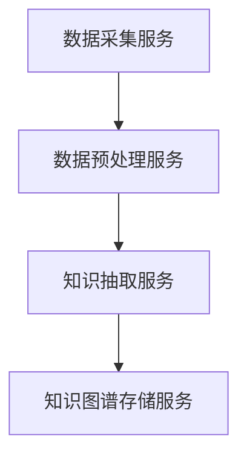

                 


# 企业知识图谱构建：增强AI Agent的领域理解

## 关键词：
知识图谱, AI Agent, 企业知识管理, 实体识别, 关系抽取, 图嵌入, 系统架构

## 摘要：
知识图谱是一种强大的工具，用于构建企业级的知识体系，帮助AI代理更好地理解和处理复杂业务场景。本文将详细介绍知识图谱的构建过程，包括核心概念、算法原理、系统架构设计以及实际项目中的应用案例。通过逐步分析和详细讲解，帮助读者掌握知识图谱的核心技术，并将其应用于实际业务场景中。

---

## 第一部分：知识图谱基础

### 第1章：知识图谱的定义与应用

#### 1.1 知识图谱的定义与特点
- **1.1.1 知识图谱的定义**
  - 知识图谱是一种以图结构形式表示知识的语义网络，通过实体和关系描述世界。
  - 典型特征包括语义性、结构化和可扩展性。

- **1.1.2 知识图谱的核心特点**
  - 语义性：通过关系描述实体间的关联。
  - 结构化：采用标准化的格式表示知识。
  - 可扩展性：支持大规模数据的整合与扩展。

- **1.1.3 知识图谱与传统数据库的区别**
  - 知识图谱：基于语义网络，支持复杂关系的表达。
  - 传统数据库：基于行和列的二维结构，难以描述复杂关系。

#### 1.2 知识图谱的构建流程
- **1.2.1 数据采集与预处理**
  - 数据来源包括结构化数据（数据库）、非结构化数据（文本、文档）和半结构化数据（HTML、XML）。
  - 预处理步骤包括数据清洗、格式统一和数据融合。

- **1.2.2 实体识别与抽取**
  - 实体识别：从文本中识别出具体实体（如人名、组织名、地名）。
  - 抽取方法：基于规则、统计模型和深度学习模型。

- **1.2.3 关系抽取与构建**
  - 关系抽取：识别实体之间的关系（如“属于”、“构成”）。
  - 构建方法：基于规则、模式匹配和语义理解。

- **1.2.4 知识图谱存储与管理**
  - 存储方式：采用图数据库（如Neo4j）或关系型数据库。
  - 管理工具：使用图数据库的查询语言（如Cypher）进行管理和维护。

#### 1.3 知识图谱的应用领域
- **1.3.1 智能搜索与推荐**
  - 在搜索引擎中，知识图谱可以提供更智能的搜索结果。
  - 在推荐系统中，知识图谱可以提供上下文信息，提升推荐的准确性。

- **1.3.2 自然语言处理**
  - 知识图谱可以为NLP任务提供丰富的语义信息。
  - 在问答系统中，知识图谱可以提供准确的知识库支持。

- **1.3.3 企业知识管理**
  - 在企业内部，知识图谱可以整合分散的知识资源，提升知识共享效率。

---

## 第二部分：知识图谱的核心概念与联系

### 第2章：知识图谱的核心概念

#### 2.1 实体与关系的定义
- **实体**：知识图谱中的基本单元，代表现实世界中的具体事物。
- **关系**：连接两个或多个实体的桥梁，描述实体之间的关联。

#### 2.2 知识图谱的语义网络结构
- **语义网络**：通过节点和边表示实体和关系，构建语义网络。
- **图结构**：节点代表实体，边代表关系，构建复杂的语义网络。

#### 2.3 实体与关系的对比分析
| 特性       | 实体       | 关系       |
|------------|------------|------------|
| 定义       | 具体事物    | 实体间的关联 |
| 表示方式   | 节点       | 边         |
| 作用       | 存储信息    | 描述联系    |

#### 2.4 ER实体关系图


---

## 第三部分：知识图谱的构建算法与数学模型

### 第3章：知识图谱的构建算法

#### 3.1 数据预处理与实体识别
- **数据预处理**：清洗、去重、格式统一。
- **实体识别**：基于规则或深度学习模型识别实体。

#### 3.2 关系抽取与构建
- **关系抽取**：使用模式匹配或语义理解技术识别关系。
- **关系构建**：将抽取的关系存储到知识图谱中。

#### 3.3 知识图谱的存储与管理
- **存储方式**：图数据库、关系型数据库。
- **管理工具**：使用查询语言（如Cypher）进行数据管理和维护。

### 第4章：知识图谱的数学模型

#### 4.1 实体表示的向量空间模型
- **向量空间模型**：将实体表示为高维向量。
- **公式**：$v_i = (v_{i1}, v_{i2}, ..., v_{in})$

#### 4.2 关系表示的矩阵模型
- **关系矩阵**：表示实体间的关系。
- **公式**：$R = [r_{ij}]$，其中$r_{ij}$表示实体i和j之间的关系强度。

#### 4.3 知识图谱的图嵌入算法
- **图嵌入**：将实体和关系嵌入到低维向量空间中。
- **算法示例**：Word2Vec、GloVe、FastText。

---

## 第四部分：知识图谱的系统架构设计

### 第5章：系统功能设计

#### 5.1 数据采集模块
- **功能**：从多种数据源采集数据。
- **工具**：爬虫工具、数据库连接工具。

#### 5.2 数据预处理模块
- **功能**：清洗、去重、格式统一。
- **工具**：Python的Pandas库、数据清洗工具。

#### 5.3 知识抽取模块
- **功能**：识别实体和关系。
- **工具**：spaCy、NLTK、深度学习模型。

#### 5.4 知识图谱存储模块
- **功能**：将抽取的知识存储到知识图谱中。
- **工具**：Neo4j、MySQL、MongoDB。

### 第6章：系统架构设计

#### 6.1 微服务架构
- **服务划分**：数据采集、数据处理、知识抽取、知识图谱存储。
- **交互方式**：通过API进行服务间的通信。

#### 6.2 系统交互流程图


---

## 第五部分：项目实战与应用案例

### 第7章：项目实战

#### 7.1 环境安装
- **工具安装**：安装Python、pip、Neo4j、spaCy。
- **依赖库安装**：`pip install neo4j spacy`

#### 7.2 核心代码实现
```python
from neo4j import GraphDatabase
from spacy.lang.zh import Chinese

# 实体识别示例代码
nlp = Chinese()
doc = nlp("北京是中国的首都。")
for ent in doc.ents:
    print(ent.text, ent.label_)
```

#### 7.3 数据处理与模型训练
- **数据处理**：清洗、分词、去除停用词。
- **模型训练**：训练实体识别和关系抽取模型。

#### 7.4 应用案例分析
- **电商领域**：构建商品知识图谱，提升推荐系统的准确性。
- **金融领域**：构建公司关系图谱，辅助风险评估。

---

## 第六部分：总结与展望

### 第8章：总结与最佳实践

#### 8.1 总结
- 知识图谱是一种强大的工具，能够帮助企业构建高效的知识管理体系。
- 通过构建知识图谱，AI代理可以更好地理解和处理复杂业务场景。

#### 8.2 最佳实践
- 数据质量：确保数据的准确性、完整性。
- 模型优化：定期更新模型，提升识别准确率。
- 安全性：保护知识图谱中的敏感信息。

#### 8.3 小结
- 知识图谱的构建是一个复杂但 rewarding 的过程。
- 通过不断优化和扩展，知识图谱将在更多领域发挥重要作用。

---

## 参考文献与进一步阅读
- 知识图谱相关论文
- 图数据库技术文档
- 机器学习与自然语言处理相关书籍

