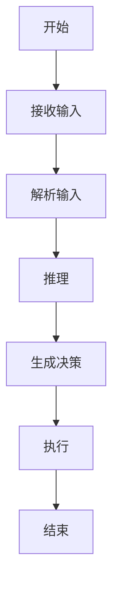
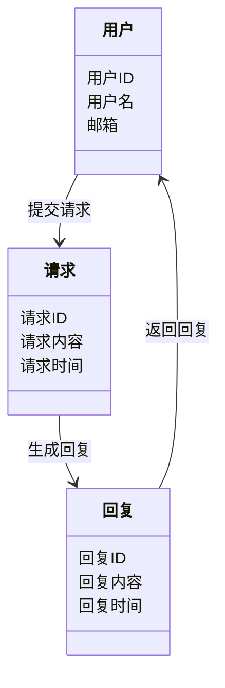
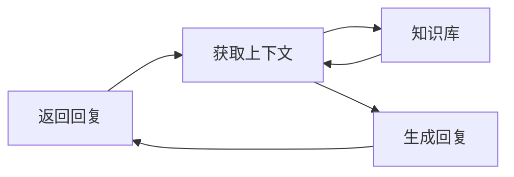

                 


# 企业级AI Agent开发：从需求分析到部署的全流程指南

## 关键词：
企业级AI Agent，需求分析，系统设计，算法实现，部署与监控

## 摘要：
本文为企业级AI Agent的开发提供全面指导，涵盖从需求分析到部署的完整流程。通过系统化的分析与实战案例，详细介绍AI Agent的核心概念、算法原理、系统架构设计、项目实现及优化与维护策略，帮助开发者掌握从零到一的开发流程。

---

## 第1章: AI Agent的基本概念与核心原理

### 1.1 AI Agent的定义与特点

#### 1.1.1 AI Agent的定义
AI Agent（人工智能代理）是一种能够感知环境并采取行动以实现目标的智能实体。它通过传感器获取信息，利用推理能力做出决策，并通过执行器与环境交互。AI Agent可以是软件程序、机器人或其他智能系统。

#### 1.1.2 AI Agent的核心特点
AI Agent具有以下核心特点：
- **自主性**：能够在没有外部干预的情况下运行。
- **反应性**：能够实时感知环境并做出响应。
- **目标导向性**：以明确的目标为导向进行决策和行动。
- **社会能力**：能够与其他AI Agent或人类进行协作或竞争。

#### 1.1.3 AI Agent与传统软件的区别
以下是AI Agent与传统软件的主要区别：

| 属性 | 传统软件 | AI Agent |
|------|----------|----------|
| 行为方式 | 确定性、静态 | 动态、自适应 |
| 决策机制 | 预先定义 | 自主推理、动态调整 |
| 交互方式 | 单向输入/输出 | 双向互动、实时反馈 |

---

### 1.2 AI Agent的核心概念与联系

#### 1.2.1 核心概念原理
AI Agent的核心概念包括：
- **感知**：通过传感器获取环境信息。
- **推理**：基于感知信息进行逻辑推理。
- **决策**：根据推理结果做出最优决策。
- **执行**：通过执行器将决策转化为具体行动。

#### 1.2.2 概念属性特征对比表格
以下是AI Agent核心概念的对比表格：

| 概念 | 输入 | 输出 | 描述 |
|------|------|------|------|
| 感知 | 环境数据 | 状态描述 | 从环境中提取有用信息 |
| 推理 | 状态描述 | 行动策略 | 根据当前状态推导可能的行动 |
| 决策 | 行动策略 | 最优决策 | 选择最优的行动方案 |
| 执行 | 最优决策 | 环境反馈 | 执行决策并获取反馈 |

#### 1.2.3 ER实体关系图架构
以下是AI Agent的实体关系图：

```mermaid
erDiagram
    actor 用户 {
        string 用户ID
        string 用户名
    }
    agent AIAgent {
        string 代理ID
        string 代理名称
        rational 状态
    }
    action 行动 {
        string 行动ID
        string 行动名称
        date 时间
    }
    用户 --> 状态: 提供输入
    状态 --> AIAgent: 维护当前状态
    AIAgent --> 行动: 生成行动
    行动 --> 用户: 反馈结果
```

---

## 第2章: AI Agent的算法原理与数学模型

### 2.1 算法原理讲解

#### 2.1.1 算法原理的 Mermaid 流程图
以下是AI Agent算法的流程图：



#### 2.1.2 算法的 Python 源代码实现
以下是AI Agent算法的Python实现示例：

```python
def agent_algorithm(inputs):
    # 解析输入
    state = parse_input(inputs)
    # 推理
    action = inference(state)
    # 执行
    result = execute(action)
    return result
```

#### 2.1.3 示例说明
假设输入为用户查询“天气如何”，AI Agent将解析输入并生成天气查询的行动，最终返回天气信息。

### 2.2 数学模型与公式

#### 2.2.1 数学模型的详细讲解
AI Agent的数学模型通常基于概率论和优化理论。以下是一个简单的概率模型：

$$ P(A|B) = \frac{P(B|A)P(A)}{P(B)} $$

其中：
- \( P(A|B) \) 是在B条件下A发生的概率。
- \( P(B|A) \) 是在A条件下B发生的概率。
- \( P(A) \) 是A的先验概率。
- \( P(B) \) 是B的边缘概率。

#### 2.2.2 公式的数学推导
以最大似然估计为例：

$$ \theta = \arg \max_{\theta} \sum_{i=1}^n \log P(x_i|\theta) $$

其中：
- \( \theta \) 是模型参数。
- \( x_i \) 是训练数据点。
- \( P(x_i|\theta) \) 是似然函数。

---

## 第3章: 系统分析与架构设计

### 3.1 问题场景介绍

#### 3.1.1 项目背景
假设我们正在开发一个企业级AI Agent，用于自动化处理客户支持请求。

#### 3.1.2 项目目标
- 实现自动回复客户咨询。
- 提供7x24小时的客户支持服务。
- 提高客户满意度和效率。

### 3.2 系统功能设计

#### 3.2.1 领域模型 Mermaid 类图
以下是领域模型的类图：



### 3.3 系统架构设计

#### 3.3.1 系统架构 Mermaid 架构图
以下是系统架构图：



---

## 第4章: 项目实战与实现

### 4.1 环境安装与配置

#### 4.1.1 开发环境搭建
- 操作系统：Linux/Windows/MacOS
- 开发工具：PyCharm/VSCode
- 依赖管理：pipenv/virtualenv

#### 4.1.2 依赖库安装
```bash
pip install python-agentx
```

### 4.2 核心功能实现

#### 4.2.1 代码实现
```python
from agentx import Agent

class AIAssistant(Agent):
    def on_message(self, message):
        # 接收消息
        action = self.inference(message)
        # 执行操作
        response = self.execute(action)
        return response

if __name__ == "__main__":
    assistant = AIAssistant()
    assistant.start()
```

#### 4.2.2 代码解读与分析
- `on_message` 方法：接收用户输入并生成回复。
- `inference` 方法：根据输入进行推理。
- `execute` 方法：根据推理结果执行操作。

### 4.3 实际案例分析

#### 4.3.1 案例背景
用户输入：“如何重置密码？”

#### 4.3.2 案例实现与结果
AI Agent解析输入并生成回复：“请访问我们的网站，进入‘忘记密码’页面进行重置。”

---

## 第5章: 优化与维护

### 5.1 性能优化策略

#### 5.1.1 算法优化
- 使用缓存技术减少重复计算。
- 优化推理算法的复杂度。

#### 5.1.2 系统优化
- 优化数据库查询效率。
- 使用分布式架构提高处理能力。

### 5.2 系统维护与监控

#### 5.2.1 日志监控
- 记录用户请求和系统响应。
- 分析日志发现潜在问题。

#### 5.2.2 性能调优
- 定期检查系统负载。
- 根据负载调整资源分配。

### 5.3 最佳实践 Tips

#### 5.3.1 开发建议
- 使用模块化设计提高代码可维护性。
- 定期进行代码审查。

#### 5.3.2 部署注意事项
- 确保部署环境与开发环境一致。
- 配置完善的监控和报警机制。

---

## 第6章: 部署与扩展

### 6.1 部署流程

#### 6.1.1 部署步骤
1. 环境准备。
2. 代码上传。
3. 依赖安装。
4. 启动服务。

#### 6.1.2 部署工具选择
- 使用Docker进行容器化部署。
- 使用Kubernetes进行 orchestration。

### 6.2 扩展与集成

#### 6.2.1 扩展方法
- 水平扩展：增加实例数量。
- 垂直扩展：增加实例资源。

#### 6.2.2 集成方案
- 与现有系统集成，例如CRM系统。

### 6.3 最终小结

#### 6.3.1 全流程总结
本文从需求分析到部署，详细介绍了企业级AI Agent的开发流程。

#### 6.3.2 未来发展趋势
- 更强的自主学习能力。
- 更高效的推理算法。

---

## 第7章: 企业级AI Agent的未来与发展

### 7.1 未来趋势分析

#### 7.1.1 技术发展方向
- 多模态AI Agent。
- 自适应学习算法。

#### 7.1.2 应用领域的扩展
- 智慧城市。
- 智能制造。

### 7.2 企业级AI Agent的挑战

#### 7.2.1 技术挑战
- 复杂环境下的推理难度。
- 数据隐私和安全问题。

#### 7.2.2 业务挑战
- 不同行业的定制化需求。

### 7.3 未来的学习与实践方向

#### 7.3.1 学习建议
- 关注AI Agent领域的最新研究。
- 参与开源项目。

#### 7.3.2 实践建议
- 参与实际项目积累经验。
- 不断优化现有系统。

### 7.4 本书的结束语
感谢您的阅读！希望本文能为您提供有价值的内容，助您在企业级AI Agent开发领域取得成功。

--- 

**全文完**

