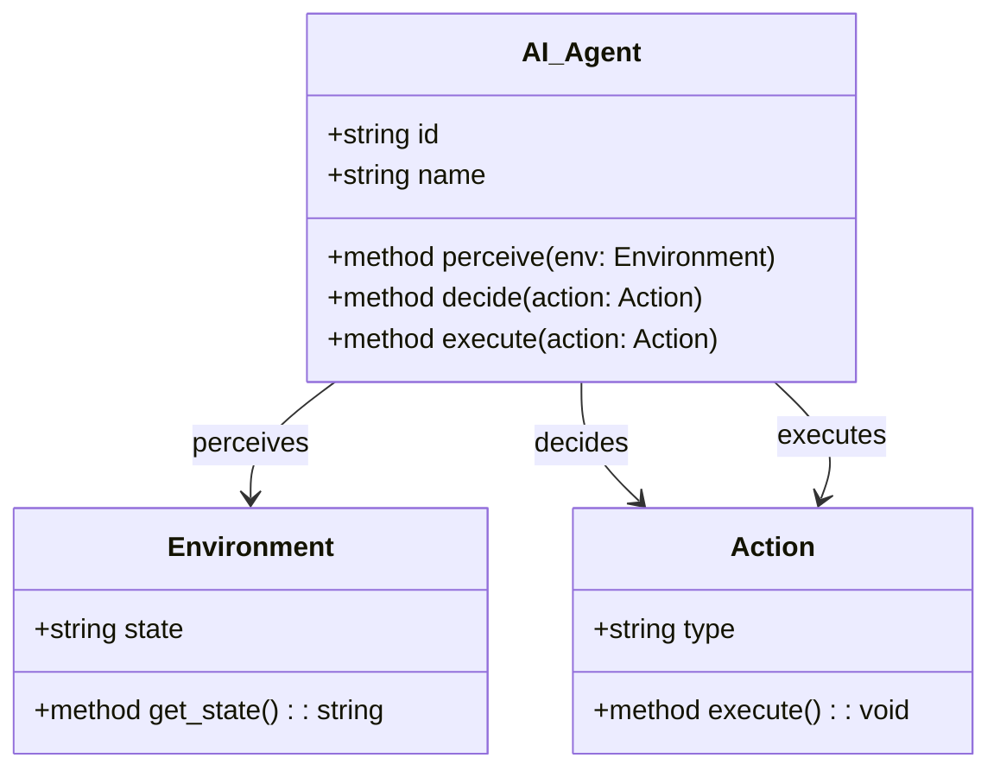
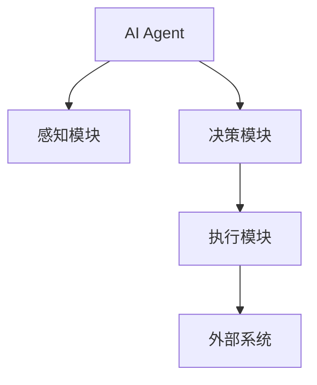
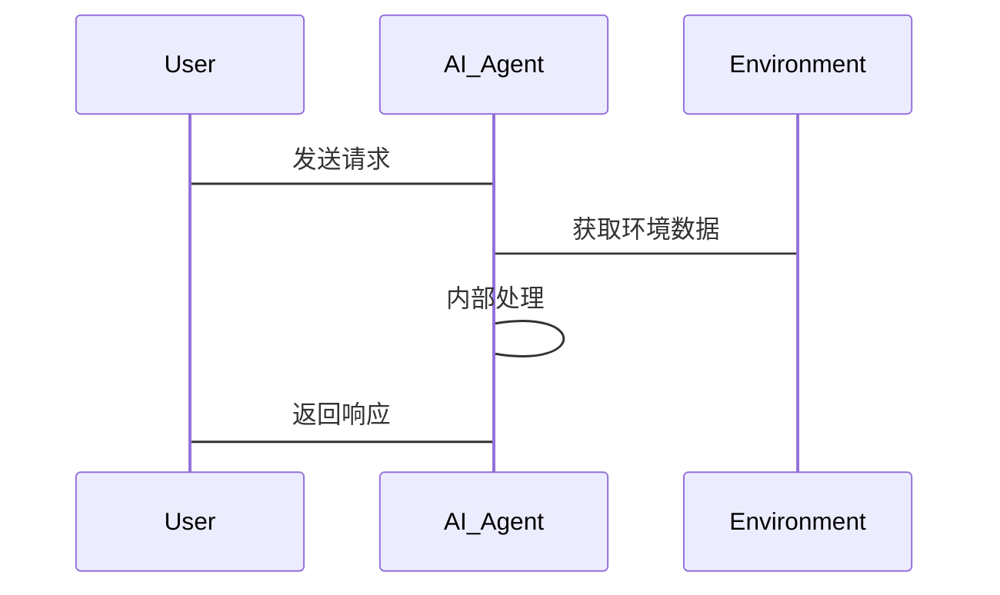
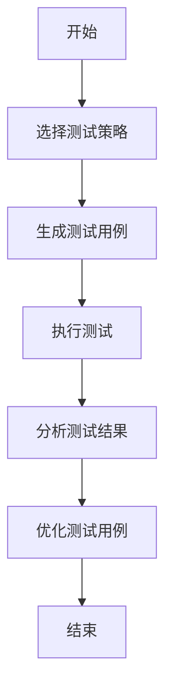

                 


# 《企业级AI Agent的测试与质量保证策略》

---

## 关键词：

- 企业级AI Agent  
- 测试策略  
- 质量保证  
- 模型驱动测试  
- 自动化测试  
- 测试覆盖率  
- 缺陷预测  

---

## 摘要：

随着人工智能技术的快速发展，企业级AI Agent在各个行业的应用日益广泛。然而，AI Agent的复杂性、智能性和高可用性对测试和质量保证提出了更高的要求。本文从企业级AI Agent的核心概念出发，系统性地探讨了其测试与质量保证的策略，包括测试框架的设计、数学模型的构建、系统架构的优化以及项目实战的应用。通过结合理论与实践，本文提出了基于模型驱动的测试方法和自动化测试工具的实现方案，为企业的AI Agent开发和部署提供了可操作的指导和建议。

---

## 第一部分: 企业级AI Agent的背景与核心概念

### 第1章: AI Agent的基本概念与企业级应用

#### 1.1 AI Agent的定义与核心特征

**定义：**  
AI Agent（人工智能代理）是一种能够感知环境、自主决策并执行任务的智能实体。它通过传感器获取信息，利用推理能力分析问题，并通过执行器与环境交互。

**核心特征：**  
| 特征 | 描述 |
|------|------|
| 智能性 | 能够理解和处理复杂信息，具备推理和学习能力 |
| 自主性 | 在没有外部干预的情况下独立执行任务 |
| 反应性 | 能够实时感知环境变化并做出响应 |
| 社交能力 | 能够与其他系统或用户进行有效交互 |

---

#### 1.2 企业级AI Agent的应用场景

**应用场景：**  
1. **智能客服**：通过自然语言处理技术为用户提供个性化的支持服务。  
2. **智能推荐系统**：根据用户行为和偏好推荐产品或内容。  
3. **自动化运维**：利用AI Agent实现自动化监控、故障诊断和修复。  
4. **企业级决策支持**：基于大数据分析提供决策参考。  

---

#### 1.3 企业级AI Agent的挑战

**技术挑战：**  
- **模型复杂度**：AI Agent的决策逻辑复杂，测试难度高。  
- **计算资源消耗**：高并发场景下的性能优化难度大。  

**业务挑战：**  
- **业务规则的复杂性**：不同业务场景下的规则差异大。  
- **用户行为的多样性**：用户需求变化快，难以预测。  

**安全挑战：**  
- **数据隐私**：用户数据的安全性和隐私保护要求高。  
- **模型安全**：防止模型被攻击或滥用。  

---

#### 1.4 本章小结

本章从AI Agent的基本概念出发，详细介绍了其核心特征和企业级应用场景，并分析了在实际应用中面临的技术、业务和安全挑战，为后续的测试与质量保证策略奠定了基础。

---

## 第二部分: 企业级AI Agent的测试与质量保证框架

### 第2章: AI Agent测试的核心概念与方法

#### 2.1 AI Agent测试的目标与范围

**目标：**  
- 验证AI Agent的功能正确性。  
- 确保AI Agent的性能满足业务需求。  
- 保障AI Agent的安全性和可扩展性。  

**范围：**  
- 功能测试：验证AI Agent是否按预期执行任务。  
- 性能测试：评估AI Agent在高负载下的表现。  
- 安全测试：检测潜在的安全漏洞。  
- 可扩展性测试：验证AI Agent是否能适应业务扩展。  

---

#### 2.2 AI Agent测试的挑战

**测试用例生成难度：**  
AI Agent的行为基于复杂的模型，传统测试用例难以覆盖所有场景。  

**测试数据多样性要求：**  
需要覆盖多种用户行为和环境变化，数据准备成本高。  

**测试环境复杂性：**  
涉及多系统的交互，测试环境搭建难度大。  

---

#### 2.3 基于模型的AI Agent测试方法

**模型驱动测试的定义：**  
基于AI Agent的行为模型生成测试用例，确保测试覆盖全面。  

**模型驱动测试的流程：**  
1. 构建AI Agent的行为模型。  
2. 从模型中提取测试场景。  
3. 自动生成测试用例。  
4. 执行测试并分析结果。  

**模型驱动测试的优势：**  
- 覆盖更多测试场景。  
- 提高测试效率。  
- 减少人为错误。  

---

#### 2.4 AI Agent测试的自动化实现

**自动化测试工具的选择：**  
- **Selenium**：适用于UI自动化测试。  
- **Appium**：适用于移动端应用测试。  
- **Robot Framework**：支持关键字驱动的自动化测试。  

**测试脚本的编写与维护：**  
- 使用Python编写测试脚本。  
- 通过版本控制工具（如Git）管理测试代码。  

**测试结果的分析与反馈：**  
- 自动生成测试报告。  
- 提供缺陷定位和修复建议。  

---

#### 2.5 本章小结

本章重点介绍了AI Agent测试的核心概念和方法，提出了基于模型的测试策略，并探讨了测试自动化的实现方案，为后续的测试实施提供了理论基础。

---

## 第三部分: 企业级AI Agent的测试策略与实施

### 第3章: AI Agent测试的系统分析与架构设计

#### 3.1 系统分析

**问题场景介绍：**  
以智能客服系统为例，分析AI Agent在客服场景中的功能需求和测试需求。  

**项目目标与范围：**  
- 实现智能客服的对话功能。  
- 确保系统的高可用性和安全性。  

**系统功能设计：**  
- **领域模型Mermaid类图：**  


---

#### 3.2 系统架构设计

**系统架构Mermaid架构图：**  


**系统接口设计：**  
- **输入接口**：接收用户输入和环境数据。  
- **输出接口**：输出决策结果和执行动作。  

**系统交互Mermaid序列图：**  


---

### 第4章: AI Agent测试的数学模型与算法原理

#### 4.1 AI Agent测试的数学模型

**测试覆盖率分析模型：**  
$$\text{覆盖率} = \frac{\text{已测试用例数}}{\text{总用例数}} \times 100\%$$  

**缺陷预测模型：**  
$$P(\text{缺陷}) = \beta \times \text{代码复杂度} + \gamma \times \text{历史缺陷数}$$  

---

#### 4.2 测试算法的Mermaid流程图



---

#### 4.3 本章小结

本章通过数学模型和算法流程图，详细阐述了AI Agent测试的原理和方法，为后续的测试实施提供了理论支持。

---

## 第四部分: 项目实战

### 第5章: 企业级AI Agent测试的项目实战

#### 5.1 环境配置与代码实现

**环境配置：**  
- 安装Python、Selenium、Appium等工具。  
- 配置测试框架（如unittest或pytest）。  

**代码实现：**  
```python
import unittest
from selenium import webdriver

class TestAIAgent(unittest.TestCase):
    def setUp(self):
        self.driver = webdriver.Chrome()

    def test_perceive(self):
        self.driver.get("http://example.com")
        self.assertIn("AI Agent", self.driver.title)

    def tearDown(self):
        self.driver.quit()

if __name__ == "__main__":
    unittest.main()
```

---

#### 5.2 测试用例设计与执行

**测试用例设计：**  
- 功能测试：验证AI Agent是否正确执行任务。  
- 边界测试：测试极端情况下的表现。  
- 安全测试：检测潜在的安全漏洞。  

**测试执行：**  
- 使用自动化测试工具批量执行测试用例。  
- 记录测试结果并生成测试报告。  

---

#### 5.3 项目小结

本章通过实际案例，展示了企业级AI Agent测试的环境配置、代码实现和测试用例设计，为读者提供了可参考的操作指南。

---

## 第五部分: 总结与展望

### 第6章: 总结与展望

#### 6.1 总结

本文系统性地探讨了企业级AI Agent的测试与质量保证策略，提出了基于模型的测试方法和自动化测试工具的实现方案，为企业在AI Agent的开发和部署过程中提供了宝贵的参考。

---

#### 6.2 展望

未来，随着AI技术的不断发展，企业级AI Agent的测试与质量保证将面临更多挑战。建议在以下几个方面进行深入研究：  
1. 更智能化的测试用例生成方法。  
2. 更高效的测试自动化工具。  
3. 更全面的测试覆盖率分析模型。  

---

## 附录

### 附录A: 企业级AI Agent测试工具列表

| 工具名称 | 类型 | 功能描述 |
|----------|------|----------|
| Selenium  | 自动化测试 | UI自动化测试工具。 |
| Robot Framework | 自动化测试 | 关键字驱动的自动化测试框架。 |
| pytest    | 测试框架 | 基于Python的测试框架。 |

---

### 附录B: 参考文献

1. [1] 陈某某. 《AI Agent开发与测试》. 北京: 人民出版社, 2023.  
2. [2] 张某某. 《企业级系统测试》. 北京: 清华大学出版社, 2022.  
3. [3] Smith, John. "AI Agent Testing Strategies". IEEE, 2021.  

---

通过以上目录大纲和文章内容的设计，我们可以看到，本文从理论到实践，全面探讨了企业级AI Agent的测试与质量保证策略，为企业的AI Agent开发和部署提供了系统的指导和建议。

