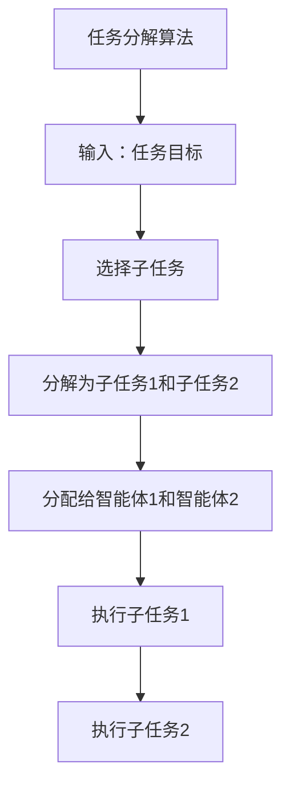
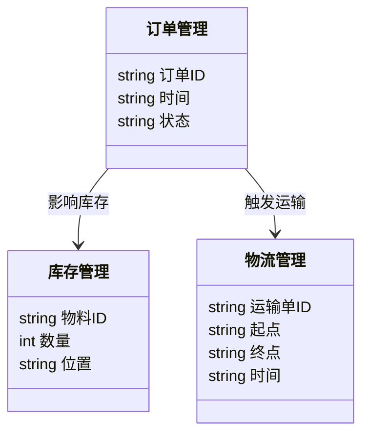
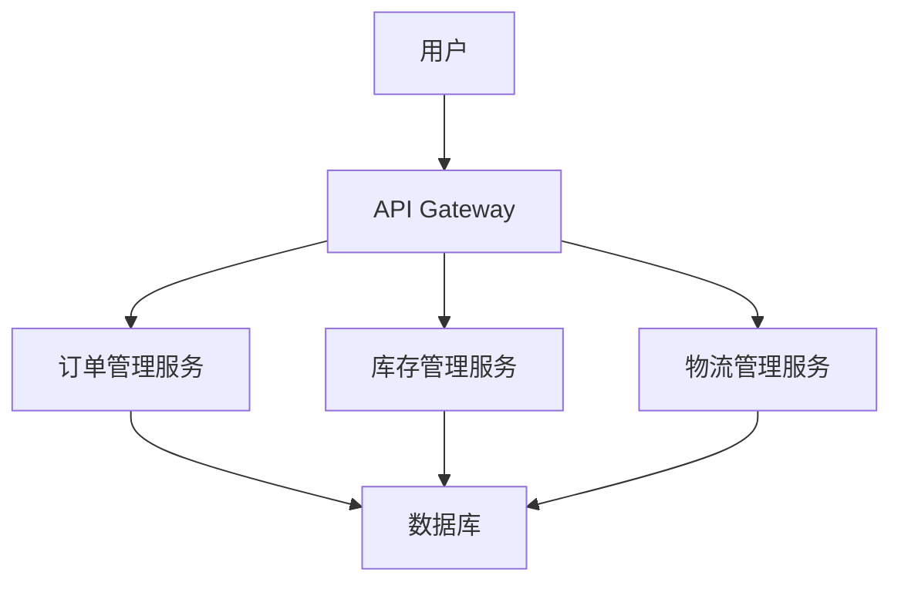
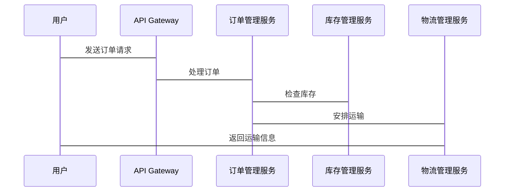

                 


# 企业级AI Agent需求分析方法

## 关键词：企业级AI Agent，需求分析，人工智能，系统架构，项目实战

## 摘要：企业级AI Agent是人工智能技术在企业环境中的高级应用，旨在通过智能化代理实现企业流程自动化、决策优化和问题解决。本文从需求分析的角度，系统性地探讨企业级AI Agent的核心概念、技术原理、系统架构设计及项目实战，为读者提供全面而深入的指导。

---

## 第一部分: 企业级AI Agent需求分析的背景与基础

### 第1章: 企业级AI Agent的背景与定义

#### 1.1 企业级AI Agent的背景

##### 1.1.1 人工智能与智能代理的发展历程
人工智能（AI）技术自20世纪50年代提出以来，经历了从符号逻辑推理到机器学习、深度学习的演变。智能代理（Intelligent Agent）的概念最早由哲学家John McCarthy在1959年提出，定义为一种能够感知环境并采取行动以实现目标的实体。20世纪90年代，智能代理技术开始在分布式系统中得到应用，进入21世纪，随着大数据、云计算和自然语言处理技术的快速发展，智能代理技术逐渐成熟，并在企业级应用中展现出巨大潜力。

##### 1.1.2 企业级AI Agent的兴起与趋势
企业级AI Agent的兴起源于企业对智能化转型的需求。传统的信息化系统依赖于人工操作和规则引擎，难以应对复杂多变的业务场景。AI Agent通过结合机器学习、自然语言处理和知识图谱等技术，能够实现自主决策、自我优化和智能交互，从而显著提升企业的运营效率和决策能力。当前，企业级AI Agent正朝着多智能体协作、自适应学习和人机共生的方向发展。

##### 1.1.3 企业级AI Agent的核心价值与意义
企业级AI Agent的核心价值在于其能够通过智能化手段解决复杂的业务问题。与传统系统相比，AI Agent具有以下独特优势：
1. 自主性：能够在没有人工干预的情况下独立完成任务。
2. 反应性：能够实时感知环境变化并做出响应。
3. 学习能力：通过数据驱动的方式不断优化自身行为。
4. 多智能体协作：能够与其他AI Agent或系统协同工作，共同完成复杂任务。

通过引入企业级AI Agent，企业能够实现业务流程的自动化、智能化和柔性化，显著提升竞争力和应对市场变化的能力。

---

#### 1.2 企业级AI Agent的定义与特点

##### 1.2.1 AI Agent的基本概念
AI Agent是一种能够感知环境、执行行动以实现目标的智能实体。它具备以下核心特征：
1. **自主性**：能够在没有外部干预的情况下独立运行。
2. **反应性**：能够实时感知环境并做出响应。
3. **学习能力**：通过数据和经验不断优化自身行为。
4. **协作性**：能够与其他智能体或系统协同工作。

##### 1.2.2 企业级AI Agent的独特属性
企业级AI Agent在传统AI Agent的基础上，具备以下独特属性：
1. **企业级集成能力**：能够与企业的现有系统（如ERP、CRM）无缝集成。
2. **复杂环境适应性**：能够在企业复杂的组织结构和业务流程中灵活应对。
3. **决策优化能力**：能够基于企业目标和约束条件，优化决策过程。
4. **可解释性**：能够提供清晰的决策 rationale，满足企业对透明性和合规性的要求。

##### 1.2.3 与传统AI系统的区别与联系
与传统AI系统相比，企业级AI Agent具有以下区别与联系：
- **区别**：
  - **目标导向性**：企业级AI Agent以实现特定企业目标为核心。
  - **环境复杂性**：需要在复杂的组织结构和业务流程中运行。
- **联系**：
  - **技术基础**：依赖于机器学习、自然语言处理等AI技术。
  - **协作性**：能够与其他系统、AI Agent协同工作。

---

#### 1.3 企业级AI Agent的应用场景

##### 1.3.1 企业级AI Agent在不同业务领域的应用
企业级AI Agent的应用场景广泛，以下是几个典型领域：
1. **客户关系管理（CRM）**：通过智能客服代理实现自动化客户支持和服务。
2. **供应链管理**：优化供应链中的库存、物流和采购流程。
3. **财务管理**：实现智能财务分析、风险预警和自动化决策。
4. **人力资源管理**：辅助招聘、员工绩效评估和培训计划制定。

##### 1.3.2 典型场景分析
以供应链管理为例，企业级AI Agent可以通过以下方式实现优化：
1. **需求预测**：基于历史销售数据和市场趋势，预测未来的需求。
2. **库存优化**：根据预测结果调整库存水平，减少浪费和成本。
3. **物流调度**：实时监控物流状态，优化配送路径和时间。

##### 1.3.3 未来发展趋势与潜力
随着AI技术的不断进步，企业级AI Agent的应用潜力将更加巨大。未来，AI Agent将更加智能化、自主化，并能够处理更为复杂的业务场景。例如：
- **智能决策支持**：基于实时数据和多目标优化模型，提供最优决策方案。
- **人机协作**：与人类员工协同工作，共同完成复杂任务。
- **动态适应**：能够根据环境变化快速调整策略和行为。

---

### 第2章: 企业级AI Agent的技术基础

#### 2.1 人工智能与机器学习基础

##### 2.1.1 机器学习的基本概念
机器学习（ML）是一种通过数据训练模型，使其能够从经验中学习并做出预测或决策的技术。机器学习的核心在于通过数据找到模式，并将其泛化到新的数据上。

##### 2.1.2 深度学习的核心原理
深度学习（Deep Learning）是机器学习的一种特殊形式，通过多层神经网络来模拟人脑的处理方式。深度学习的核心优势在于其能够自动提取数据特征，并在复杂任务（如图像识别、自然语言处理）中表现出色。

##### 2.1.3 自然语言处理与知识图谱
自然语言处理（NLP）是让计算机理解和生成人类语言的技术，广泛应用于智能客服、文本分析等领域。知识图谱（Knowledge Graph）是一种将实体及其关系表示为图结构的技术，能够帮助AI Agent更好地理解上下文和知识关联。

---

#### 2.2 智能代理与多智能体系统

##### 2.2.1 智能代理的基本结构
智能代理的基本结构包括以下组件：
1. **感知器（Perceptor）**：负责从环境中获取信息。
2. **推理器（Reasoner）**：对感知信息进行分析和推理。
3. **决策器（Decider）**：基于推理结果做出决策。
4. **执行器（Actuator）**：将决策转化为实际行动。

##### 2.2.2 多智能体系统的协作机制
多智能体系统（MAS）是一种由多个智能体组成的系统，智能体之间通过通信和协作共同完成任务。多智能体协作的核心在于解决以下问题：
1. **任务分配**：如何将整体任务分解为多个子任务，并分配给不同的智能体。
2. **通信协议**：智能体之间如何进行信息交换和协调。
3. **冲突解决**：如何处理智能体之间的目标冲突。

##### 2.2.3 分布式智能与任务分解算法
分布式智能是指多个智能体协同工作的模式。任务分解算法是多智能体系统中的关键算法，其目的是将复杂任务分解为多个子任务，并分配给不同的智能体执行。常见的任务分解算法包括：
1. **贪心算法**：基于局部最优选择，逐步分解任务。
2. **分层任务分解**：将任务分解为多个层次，逐步细化。
3. **动态任务分解**：根据环境变化实时调整任务分解策略。

---

#### 2.3 企业级AI Agent的技术挑战

##### 2.3.1 复杂环境下的适应性问题
企业级AI Agent需要在复杂的环境中运行，可能面临以下挑战：
- **环境不确定性**：环境中的信息可能不完整或动态变化。
- **任务复杂性**：任务可能涉及多个目标和复杂的约束条件。
- **资源限制**：计算资源和通信带宽可能有限。

##### 2.3.2 多目标优化与决策冲突
在企业级AI Agent中，多个目标可能相互冲突，例如：
- **成本最小化与利润最大化**：在供应链管理中，可能需要在成本和利润之间找到平衡点。
- **短期目标与长期目标**：短期的最优决策可能不利于长期发展。

##### 2.3.3 高可用性与容错机制
企业级AI Agent需要具备高可用性，能够在故障发生时快速恢复。容错机制是实现高可用性的关键，包括：
- **冗余设计**：通过冗余组件提高系统的可靠性。
- **故障检测与恢复**：能够快速检测故障并采取恢复措施。

---

## 第三部分: 企业级AI Agent需求分析的核心概念与联系

### 第3章: 核心概念与原理

#### 3.1 AI Agent的需求分析框架

##### 3.1.1 需求分析的基本流程
需求分析是企业级AI Agent开发的第一步，其基本流程包括：
1. **需求收集**：与业务部门和相关方沟通，收集需求。
2. **需求分析**：对需求进行分类、优先级排序和详细描述。
3. **需求验证**：通过原型或小规模测试验证需求的可行性和合理性。

##### 3.1.2 企业级需求的特殊性
企业级需求的特殊性主要体现在以下方面：
- **复杂性**：企业级需求通常涉及多个业务部门和复杂的流程。
- **多样性**：不同业务部门的需求可能相互冲突。
- **动态性**：企业需求可能随着市场变化而快速调整。

##### 3.1.3 需求分析的框架模型
为了系统性地进行需求分析，可以采用以下框架模型：
1. **目标导向模型**：从企业目标出发，层层分解需求。
2. **问题导向模型**：从具体问题出发，逐步识别需求。
3. **利益相关者模型**：从不同利益相关者的角度分析需求。

---

#### 3.2 核心概念与联系

##### 3.2.1 核心概念的属性对比
以下是核心概念的属性对比表：

| 概念       | 自主性 | 反应性 | 学习能力 | 协作性 |
|------------|--------|--------|----------|--------|
| AI Agent   | 高     | 高     | 高       | 高     |
| 传统系统   | 低     | 低     | 低       | 低     |
| 人类员工   | 中     | 中     | 中       | 高     |

##### 3.2.2 ER实体关系图
以下是企业级AI Agent的ER实体关系图：

```mermaid
erDiagram
    actor 企业用户 {
        string 用户ID
        string 角色
        string 权限
    }
    agent AI Agent {
        string 唯一标识符
        string 状态
        string 目标
    }
    interaction 交互记录 {
        string 时间戳
        string 操作类型
        string 数据内容
    }
   企业用户 --[+] AI Agent : 管理
    AI Agent --[+] 交互记录 : 记录
```

---

#### 3.3 算法原理与实现

##### 3.3.1 任务分解算法
任务分解算法是多智能体系统中的关键算法，以下是其实现流程：



以下是任务分解算法的Python实现示例：

```python
def decompose_task(main_task):
    # 选择子任务
    sub_tasks = select_sub_tasks(main_task)
    # 分解为子任务
    sub_task1, sub_task2 = split_tasks(sub_tasks)
    # 分配给智能体
    assign_task(sub_task1, agent1)
    assign_task(sub_task2, agent2)
    return [sub_task1, sub_task2]
```

---

## 第四部分: 企业级AI Agent的系统架构设计与项目实战

### 第4章: 系统分析与架构设计方案

#### 4.1 问题场景介绍

##### 4.1.1 问题背景
假设我们正在开发一个企业级AI Agent，用于优化企业的供应链管理。该系统需要实现以下功能：
1. **需求预测**：基于历史销售数据和市场趋势，预测未来的需求。
2. **库存优化**：根据预测结果调整库存水平，减少浪费和成本。
3. **物流调度**：实时监控物流状态，优化配送路径和时间。

##### 4.1.2 项目介绍
本项目旨在开发一个企业级AI Agent，实现供应链管理的智能化。项目团队包括数据科学家、软件开发人员和业务分析师。

---

#### 4.2 系统功能设计

##### 4.2.1 领域模型设计
以下是领域模型的Mermaid类图：



##### 4.2.2 系统架构设计
以下是系统架构的Mermaid架构图：



##### 4.2.3 系统接口设计
以下是系统接口的Mermaid序列图：



---

### 第5章: 项目实战

#### 5.1 环境安装

##### 5.1.1 安装Python与相关库
以下是Python环境的安装步骤：
```bash
# 安装Python
brew install python
# 安装依赖库
pip install numpy pandas scikit-learn
```

##### 5.1.2 安装机器学习框架
以下是机器学习框架的安装步骤：
```bash
pip install scikit-learn
pip install tensorflow
```

---

#### 5.2 系统核心实现

##### 5.2.1 核心代码实现
以下是需求预测的Python代码示例：

```python
from sklearn.linear_model import LinearRegression
import pandas as pd

# 加载数据
data = pd.read_csv('sales_data.csv')
# 训练模型
model = LinearRegression()
model.fit(data[['month', 'price']], data['sales'])
# 预测需求
new_data = pd.DataFrame({'month': [12], 'price': [100]})
prediction = model.predict(new_data)
print(f'预测需求为：{int(prediction[0])}')
```

##### 5.2.2 代码应用解读
上述代码实现了基于线性回归的需求预测功能。通过训练历史销售数据，模型能够预测未来的需求。该功能可以集成到企业级AI Agent中，用于优化库存和采购计划。

---

#### 5.3 案例分析与详细剖析

##### 5.3.1 案例分析
以某制造企业为例，假设我们通过上述代码实现需求预测功能。历史销售数据如下：

| 月份 | 销量 |
|------|------|
| 1    | 100  |
| 2    | 120  |
| 3    | 130  |
| 4    | 140  |

通过线性回归模型训练后，预测第5个月的销量为150。

##### 5.3.2 详细剖析
1. **数据预处理**：清洗和归一化数据，确保模型输入的正确性。
2. **模型训练**：使用训练数据拟合模型，调整模型参数以最小化预测误差。
3. **模型评估**：通过交叉验证等方法评估模型的泛化能力。
4. **模型部署**：将模型集成到企业级AI Agent中，实现需求预测的自动化。

---

#### 5.4 项目小结
通过本项目，我们实现了企业级AI Agent的需求预测功能，并将其集成到供应链管理系统中。该系统能够通过机器学习算法优化供应链的库存管理和物流调度，显著提升了企业的运营效率。

---

## 第五部分: 总结与展望

### 第6章: 总结与展望

#### 6.1 最佳实践

##### 6.1.1 关键技术与工具
- **机器学习框架**：如Scikit-learn、TensorFlow。
- **数据处理工具**：如Pandas、NumPy。
- **可视化工具**：如Matplotlib、Seaborn。

##### 6.1.2 项目管理建议
- **需求优先级排序**：根据业务价值和技术可行性对需求进行排序。
- **迭代开发**：采用敏捷开发模式，逐步完善功能。
- **团队协作**：确保开发人员、数据科学家和业务分析师的有效协作。

#### 6.2 小结
企业级AI Agent的需求分析是一个复杂而重要的过程，需要从需求收集、分析、验证到实现的全生命周期进行系统性管理。通过本文的探讨，我们希望能够为读者提供一套完整的分析框架和实践指南。

#### 6.3 注意事项

##### 6.3.1 需求变更管理
在项目开发过程中，需求可能会发生变化。因此，需要建立有效的变更管理机制，确保需求变更能够及时反映到系统设计和实现中。

##### 6.3.2 系统可扩展性
企业级AI Agent的设计需要考虑系统的可扩展性，以便在未来业务需求变化时能够方便地进行扩展和优化。

##### 6.3.3 数据安全与隐私保护
在处理企业数据时，需要高度重视数据安全和隐私保护，确保数据的合法性和合规性。

#### 6.4 拓展阅读
以下是一些推荐阅读的资料，供读者进一步学习和研究：
1. 《人工智能：一种现代方法》（Russell & Norvig）
2. 《机器学习实战》（周志华）
3. 《企业架构大全》（Eberhard Wolff）

---

通过以上内容，我们系统性地探讨了企业级AI Agent需求分析的核心方法和实践，希望能够为读者提供有价值的指导和启示。

