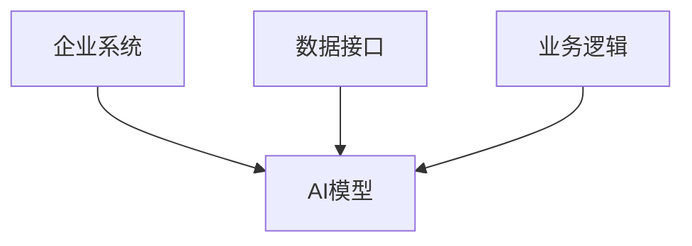
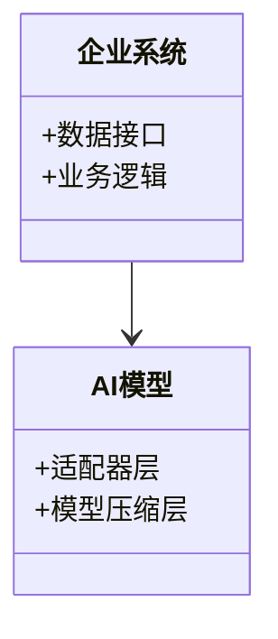
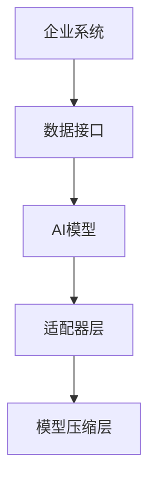
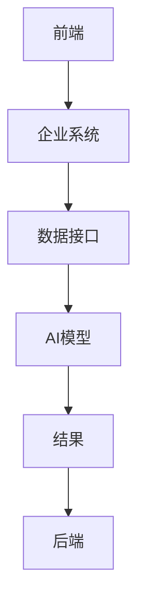
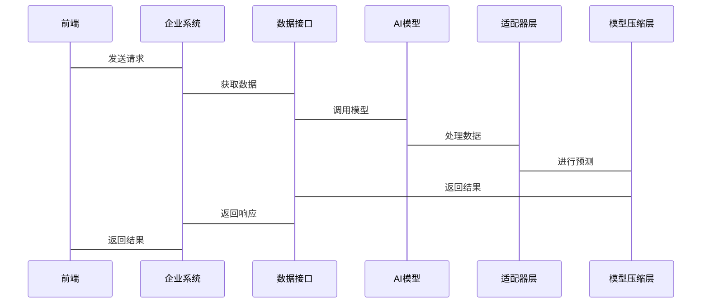

                 


# 《企业级AI模型的集成策略：无缝对接现有系统》

## 关键词：
- 企业级AI模型
- AI模型集成
- 系统对接
- 模型压缩
- 适配器微调
- 联邦学习
- 技术实战

## 摘要：
本文系统地探讨了企业级AI模型的集成策略，重点分析了如何将AI模型无缝集成到现有企业系统中。文章从背景与挑战、核心概念与原理、系统分析与架构设计、项目实战等方面展开，详细讲解了模型压缩、适配器微调和联邦学习等关键技术，并通过实际案例和系统设计展示了如何在企业环境中实现高效的AI模型集成。文章最后总结了最佳实践和注意事项，为读者提供了全面的技术指导。

---

# 第一部分: 企业级AI模型集成的背景与挑战

## 第1章: 企业级AI模型集成的背景与问题描述

### 1.1 企业AI应用的现状与挑战

#### 1.1.1 企业AI应用的现状分析
随着AI技术的快速发展，企业正在将AI模型集成到现有系统中以提升业务效率。然而，企业系统通常复杂且异构，集成AI模型面临数据格式不统一、接口不兼容、性能瓶颈等问题。

#### 1.1.2 当前AI模型集成的主要挑战
1. **数据兼容性问题**：企业系统中的数据格式多样，AI模型需要适应不同的数据结构。
2. **性能瓶颈**：AI模型的计算资源需求与企业现有系统的资源分配存在冲突。
3. **安全性与隐私性**：企业数据敏感，如何在集成过程中保护数据安全是一个重要挑战。

#### 1.1.3 企业级AI模型集成的必要性
企业级AI模型集成可以提升系统的智能化水平，优化业务流程，同时降低运营成本。通过集成AI模型，企业能够更高效地处理数据，提升决策能力。

### 1.2 问题背景与目标

#### 1.2.1 问题背景介绍
企业在数字化转型过程中，需要将AI模型与现有业务系统结合，以实现智能化升级。然而，现有系统的架构和数据格式限制了AI模型的直接应用。

#### 1.2.2 问题目标设定
目标是设计一种方法，将AI模型无缝集成到企业现有系统中，确保数据格式兼容、性能优化和数据安全。

#### 1.2.3 边界与外延
- **边界**：仅关注AI模型的集成，不涉及系统架构的全面重构。
- **外延**：包括数据预处理、模型训练、模型部署和系统对接等环节。

### 1.3 核心概念与联系

#### 1.3.1 核心概念的定义与属性
- **企业系统**：现有业务系统，包含数据库、API和业务逻辑。
- **AI模型**：需要集成到企业系统中的机器学习模型。

#### 1.3.2 核心概念之间的关系
企业系统与AI模型通过数据接口进行交互，AI模型对系统数据进行处理，输出结果。

#### 1.3.3 ER实体关系图架构


---

# 第二部分: 企业级AI模型集成的核心概念与原理

## 第2章: 核心概念与原理分析

### 2.1 企业级AI模型集成的核心原理

#### 2.1.1 模型压缩技术
模型压缩通过减少模型参数数量，降低计算复杂度。常用技术包括剪枝、量化和知识蒸馏。

#### 2.1.2 适配器微调技术
适配器微调是在原有模型上添加适配器层，通过微调使模型适应新的数据格式和任务。

#### 2.1.3 联邦学习机制
联邦学习通过在分布式数据源上训练模型，保护数据隐私，同时利用数据进行模型优化。

### 2.2 核心概念对比分析

#### 2.2.1 模型压缩与适配器微调的对比
| 技术 | 模型压缩 | 适配器微调 |
|------|----------|------------|
| 定义 | 减少模型大小 | 在模型上添加适配器层 |
| 优势 | 降低计算资源需求 | 适应新数据格式 |
| 局限 | 可能影响模型性能 | 依赖原有模型结构 |

#### 2.2.2 联邦学习与传统数据共享的对比
| 技术 | 联邦学习 | 传统数据共享 |
|------|----------|-------------|
| 数据 | 分布式数据源 | 集中化数据 |
| 隐私 | 保护隐私 | 可能泄露数据 |
| 计算 | 分布式计算 | 中心化计算 |

#### 2.2.3 企业级AI与传统AI的对比
| 技术 | 企业级AI | 传统AI |
|------|----------|---------|
| 集成 | 需要与现有系统集成 | 独立运行 |
| 数据 | 复杂数据结构 | 简单数据结构 |
| 性能 | 高要求 | 较低要求 |

### 2.3 算法原理讲解

#### 2.3.1 模型压缩算法
模型压缩通过降低模型复杂度来减少计算资源需求。例如，矩阵分解用于低秩近似：
$$ A = U \Sigma V^T $$

#### 2.3.2 适配器微调算法
适配器微调在原有模型上添加适配器层，通过微调使模型适应新的数据格式。例如：
$$ \theta_{adapter} = \theta_{adapter} - \eta \nabla L $$

#### 2.3.3 联邦学习算法
联邦学习通过分布式数据源训练模型，保护数据隐私。例如，联邦平均算法：
$$ \theta_{new} = \frac{1}{n}\sum_{i=1}^{n}\theta_i $$

---

## 第3章: 数学模型与公式分析

### 3.1 模型压缩的数学基础

#### 3.1.1 矩阵分解与低秩近似
矩阵分解用于降低模型复杂度，例如：
$$ A = U \Sigma V^T $$

#### 3.1.2 知识蒸馏的损失函数
知识蒸馏通过教师模型指导学生模型：
$$ L = D(K(x), S(x)) $$

### 3.2 适配器微调的数学模型

#### 3.2.1 适配器层的参数更新
适配器微调通过更新适配器层参数：
$$ \theta_{adapter} = \theta_{adapter} - \eta \nabla L $$

### 3.3 联邦学习的数学公式

#### 3.3.1 联邦平均的更新规则
联邦学习通过分布式计算更新模型参数：
$$ \theta_{new} = \frac{1}{n}\sum_{i=1}^{n}\theta_i $$

---

# 第三部分: 企业级AI模型集成的系统分析与架构设计

## 第4章: 系统分析与架构设计

### 4.1 问题场景介绍

#### 4.1.1 系统架构
企业系统通常包括前端、后端和数据库，AI模型需要与这些部分集成。

#### 4.1.2 数据流
数据从前端输入，经过后端处理，通过AI模型进行预测，返回结果。

### 4.2 系统功能设计

#### 4.2.1 领域模型
领域模型描述系统中的实体及其关系，例如：


#### 4.2.2 系统架构
系统架构设计展示了AI模型与企业系统的交互，例如：


#### 4.2.3 系统接口设计
系统接口设计包括输入接口和输出接口，例如：


#### 4.2.4 系统交互流程
系统交互流程展示了数据从输入到输出的全过程，例如：


---

## 第5章: 项目实战

### 5.1 环境安装

#### 5.1.1 安装Python
安装Python 3.8及以上版本，确保环境兼容。

#### 5.1.2 安装依赖
安装必要的依赖库，例如：
```bash
pip install numpy scikit-learn transformers
```

### 5.2 核心代码实现

#### 5.2.1 数据预处理代码
```python
import numpy as np
from sklearn.preprocessing import StandardScaler

# 示例数据预处理代码
def preprocess_data(data):
    scaler = StandardScaler()
    processed_data = scaler.fit_transform(data)
    return processed_data
```

#### 5.2.2 AI模型集成代码
```python
from transformers import AutoModelForSequenceClassification
import torch

# 示例AI模型集成代码
class AdapterLayer(torch.nn.Module):
    def __init__(self, input_size, output_size):
        super(AdapterLayer, self).__init__()
        self.adapter = torch.nn.Linear(input_size, output_size)
    
    def forward(self, inputs):
        return self.adapter(inputs)
```

### 5.3 案例分析与详细解读

#### 5.3.1 案例分析
以自然语言处理任务为例，展示如何将BERT模型集成到企业系统中。

#### 5.3.2 详细解读
- 数据预处理：将企业系统中的文本数据进行标准化处理。
- 模型集成：在BERT模型上添加适配器层，使模型适应企业的特定任务。
- 性能优化：通过模型压缩技术降低计算资源需求。

### 5.4 项目小结

#### 5.4.1 成果展示
展示了如何将AI模型无缝集成到企业系统中，提升系统性能。

#### 5.4.2 经验总结
- 数据预处理是关键步骤。
- 适配器微调能够有效适应新的数据格式。
- 模型压缩技术可以显著降低计算资源需求。

---

## 第6章: 最佳实践与总结

### 6.1 最佳实践

#### 6.1.1 小结
总结企业级AI模型集成的关键点，包括数据兼容性、性能优化和数据安全。

#### 6.1.2 注意事项
- 确保数据预处理的准确性。
- 选择合适的模型压缩和适配器微调技术。
- 定期监控系统性能，及时优化。

#### 6.1.3 拓展阅读
推荐相关书籍和论文，供读者进一步学习。

---

## 结语

企业级AI模型的集成策略是实现智能化升级的重要手段。通过本文的系统分析和实际案例，读者可以深入了解如何将AI模型无缝集成到现有系统中，提升企业的竞争力。未来，随着技术的不断进步，企业级AI模型的集成将更加高效和智能化。

---

通过以上内容，您可以根据实际需求进一步扩展和深化每个部分的内容，以满足具体的技术要求和读者需求。

