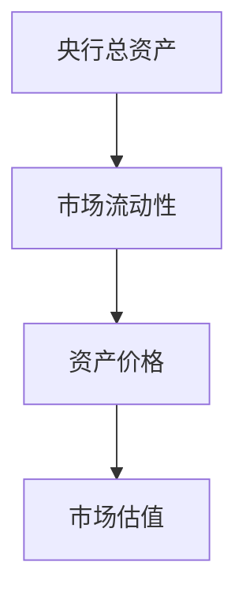

                 

# 优化版指标:加入央行总资产的市场估值新方法

> 关键词：优化版指标, 市场估值, 央行总资产, 算法原理, 系统架构, 项目实战

> 摘要：本文提出了一种基于央行总资产的优化版市场估值方法，通过详细分析传统估值方法的局限性，引入央行总资产这一关键指标，构建了新的估值模型，并通过数学公式和算法实现，提供了一种更为准确和高效的市场估值方法。

---

# 第1章: 优化版指标的背景与概念

## 1.1 问题背景与概念

### 1.1.1 传统市场估值方法的局限性
传统的市场估值方法主要依赖于市场交易数据、财务指标等，但在复杂经济环境下，这些方法往往无法捕捉到央行货币政策对市场的影响。例如，央行的资产购买行为直接影响市场流动性，进而影响资产价格，但传统方法未能充分考虑这一点。

### 1.1.2 央行总资产的核心定义
央行总资产包括央行持有的政府债券、外汇储备、银行贷款等资产。这些资产的变化直接影响市场资金流动性，从而影响市场估值。例如，当央行增加资产购买时，市场流动性增加，资产价格可能上升。

### 1.1.3 优化版指标的提出
为了弥补传统估值方法的不足，本文提出了一种基于央行总资产的优化版市场估值指标，该指标结合了传统方法和央行资产数据，能够更准确地反映市场的真实价值。

---

## 1.2 央行总资产与市场估值的关系

### 1.2.1 央行总资产的动态变化
央行总资产的变化往往与货币政策调整密切相关。例如，当央行实施量化宽松政策时，总资产规模会显著增加，从而影响市场流动性。

### 1.2.2 央行总资产对市场估值的影响
通过分析央行总资产的变化，可以更好地预测市场估值的变化趋势。例如，当央行总资产增加时，市场估值可能上升，反之则可能下降。

### 1.2.3 央行总资产与市场估值的对比
通过对比传统市场估值方法和优化版指标，可以发现优化版指标在捕捉市场变化方面更具优势。

---

## 1.3 优化版指标的核心要素

### 1.3.1 优化版指标的数学模型
优化版指标的数学模型如下：
$$ V = f(M, A) $$
其中，$V$ 表示市场估值，$M$ 表示市场因素，$A$ 表示央行总资产。

### 1.3.2 优化版指标与传统指标的对比
通过对比表格可以清晰看出优化版指标的优势：

| 指标维度 | 传统指标 | 优化版指标 |
|----------|-----------|------------|
| 数据来源 | 市场交易数据 | 市场交易数据 + 央行总资产数据 |
| 计算方式 | 简单线性回归 | 基于央行总资产的优化函数 |
| 应用场景 | 单一市场分析 | 复杂经济环境下的市场估值 |

### 1.3.3 央行总资产对市场估值的影响机制
以下是央行总资产对市场估值影响的机制图：

---

## 1.4 优化版指标的应用价值

### 1.4.1 提高市场估值的准确性
通过引入央行总资产数据，优化版指标能够更准确地反映市场的真实价值。

### 1.4.2 弥补传统方法的不足
优化版指标弥补了传统方法在捕捉央行货币政策影响方面的不足。

### 1.4.3 为投资者提供新的决策工具
优化版指标为投资者提供了更全面的市场估值工具，帮助其做出更明智的投资决策。

---

## 总结

通过本章的介绍，我们了解了优化版指标的背景、核心概念以及其在市场估值中的应用价值。接下来，我们将详细探讨优化版指标的算法原理和系统实现。

