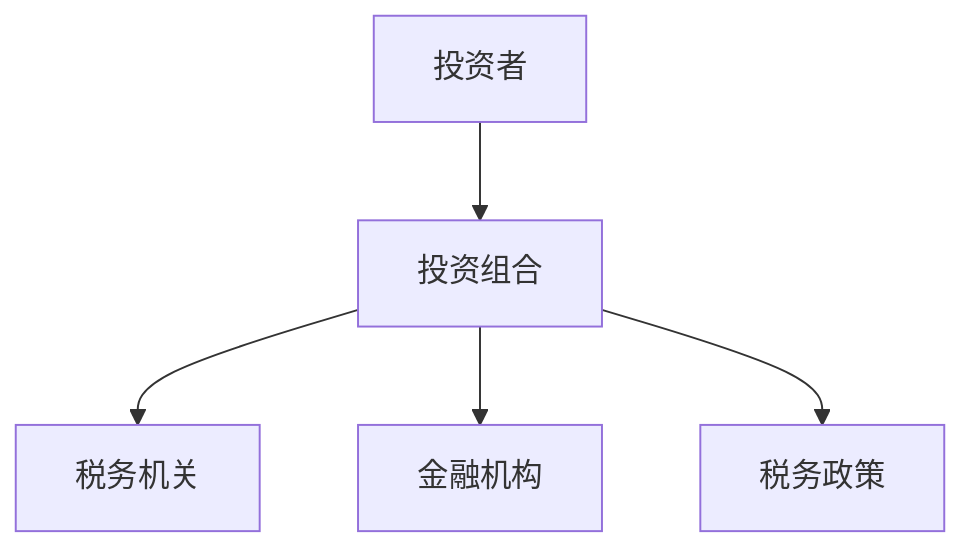

                 

# 《伯格的税收效率投资：如何减少投资税负》

---

## 关键词
- 税收效率投资  
- 税收优化  
- 投资策略  
- 税后收益  
- 税收规划  

---

## 摘要
本文深入探讨伯格的税收效率投资理念，分析如何通过优化投资结构和税务规划，最大限度地减少税负，提高投资回报。文章从背景、核心概念、算法原理、系统架构到实战案例，全面解析税收效率投资的策略和方法。通过详细讲解数学模型、系统设计和实际操作，读者将掌握如何在投资中实现税负最小化，提升整体收益。

---

# 第一部分: 税收效率投资的背景与概念

## 第1章: 税收效率投资的背景与问题描述

### 1.1 税收效率投资的背景
#### 1.1.1 投资与税负的基本概念
在投资过程中，税负是影响最终收益的重要因素。无论是股票、基金还是房地产投资，税收都会对收益产生直接影响。理解税负的基本概念，是进行税收效率投资的第一步。

#### 1.1.2 税收对投资收益的影响
税收对投资收益的影响体现在多个方面。例如，资本利得税会减少投资收益，而利息税则会影响债券投资的回报。不同类型的资产和投资策略会面临不同的税收政策，这对投资者的决策至关重要。

#### 1.1.3 税收效率投资的定义与目标
税收效率投资是指在合法合规的前提下，通过优化投资结构和选择合适的税务策略，使投资收益最大化、税负最小化。其目标是实现投资回报与税负之间的最佳平衡，确保在遵守税法的前提下，获得最优的投资收益。

### 1.2 税收效率投资的核心问题
#### 1.2.1 投资中的税种与税率分析
常见的投资相关税种包括资本利得税、股息税、利息税和增值税等。不同税种的税率和征税对象不同，这需要投资者根据自身情况选择最优的投资方式。

#### 1.2.2 税后收益与税前收益的差异
税后收益与税前收益的差异直接影响最终的投资回报。通过合理规划税务，可以有效缩小这种差异，提升实际收益。

#### 1.2.3 税收对投资决策的影响
税收是影响投资决策的重要因素。投资者在选择投资品种和结构时，需要充分考虑税后的实际回报，以做出最优决策。

## 第2章: 伯格的税收效率投资解决方案

### 2.1 伯格的税收效率投资理念
#### 2.1.1 税收效率投资的核心原则
伯格提出的核心原则包括：合法合规、风险可控、收益最大化。投资者应在不违反税法的前提下，通过合理结构设计和税务规划，实现收益最大化。

#### 2.1.2 投资组合的税收优化策略
伯格的策略强调分散投资、利用税收优惠账户和优化资产配置。通过分散投资降低风险，利用税收优惠账户减少税负，优化资产配置提高收益。

#### 2.1.3 税收效率与投资回报的关系
伯格认为，合理的税收规划能够显著提高投资回报。通过最小化税负，投资者可以将更多资金用于再投资，从而实现收益的滚雪球效应。

### 2.2 伯格的投资结构设计
#### 2.2.1 税收效率投资的资产配置
伯格建议投资者根据税收政策选择资产类别，例如优先配置长期资本利得税较低的资产，避免短期交易频繁产生的高税率。

#### 2.2.2 税收优惠账户的利用
利用401(k)、IRA等税收优惠账户，可以有效降低当前税负，同时享受税收递延的好处，这在长期投资中尤为有利。

#### 2.2.3 税后投资收益的最小化
通过合理的资产分配和投资品种选择，伯格主张在投资过程中尽量减少高税率事件的发生，如避免频繁买卖以减少资本利得税。

## 第3章: 税收效率投资的核心概念与联系

### 3.1 税收效率投资的原理
#### 3.1.1 税收效率投资的数学模型
伯格提出的数学模型旨在计算不同投资策略下的税后收益。公式如下：
$$ \text{税后收益} = \text{投资收益} \times (1 - \text{税率}) $$

#### 3.1.2 税收效率投资的优化目标
通过优化投资组合，伯格的目标是使税后收益最大化，同时考虑风险因素。

#### 3.1.3 税收效率投资的关键因素
关键因素包括税率、资产流动性、投资期限和税收政策的变化。

### 3.2 税收效率投资的核心概念对比
#### 3.2.1 不同税种对投资的影响
不同税种如资本利得税、股息税对投资的影响不同，需根据具体情况选择最优策略。

#### 3.2.2 不同投资类型与税收的关系
股票、债券、房地产等不同投资类型面临的税种和税率不同，需综合考虑。

#### 3.2.3 税收优惠与非优惠账户的对比
税收优惠账户在税前和税后的影响不同，需根据投资目标选择合适账户。

### 3.3 税收效率投资的ER实体关系图

---

# 第二部分: 税收效率投资的算法与数学模型

## 第4章: 税收效率投资的数学模型

### 4.1 税收效率投资的数学模型
#### 4.1.1 投资收益的计算公式
$$ \text{投资收益} = \text{本金} \times (1 + \text{收益率}) - \text{本金} $$

#### 4.1.2 税后收益的计算公式
$$ \text{税后收益} = \text{投资收益} \times (1 - \text{税率}) $$

#### 4.1.3 税收效率投资的优化模型
$$ \max \text{Tax-Efficient Return} $$

---

（由于篇幅限制，后续章节的详细内容将在后续部分呈现。）

