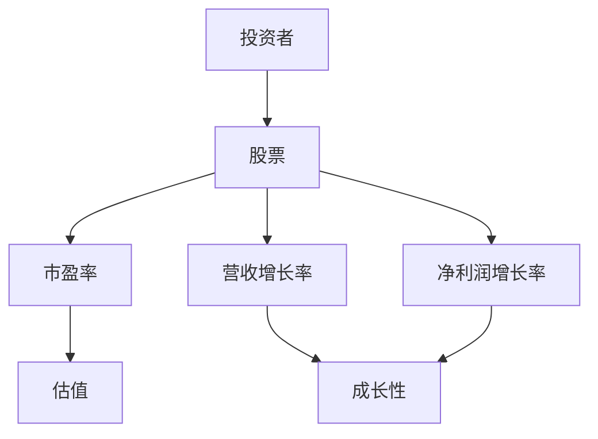
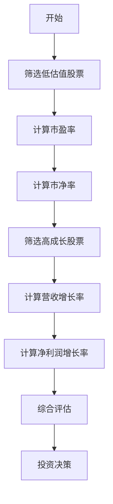
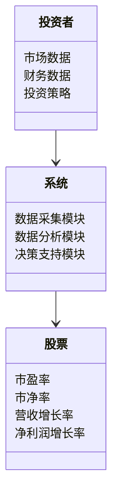
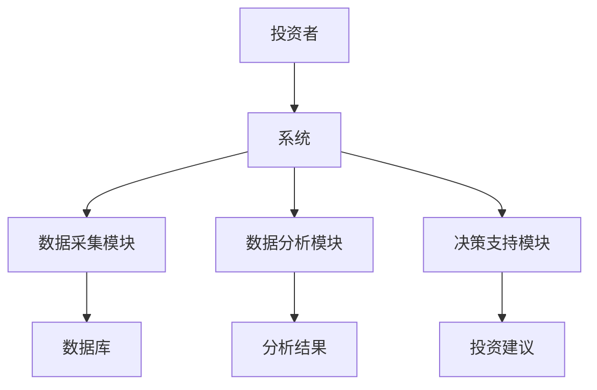
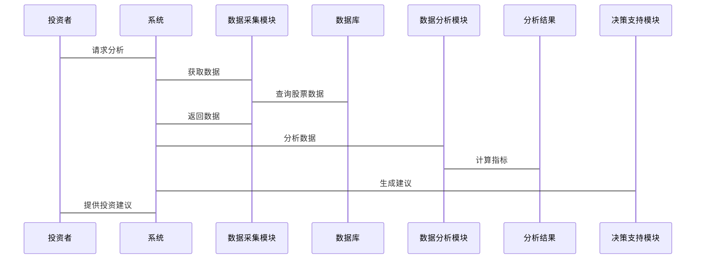

                 


# 低估值高成长：彼得林奇的选股标准

## 关键词：彼得·林奇, 选股标准, 低估值, 高成长, 投资策略, 股票分析, 财务指标

## 摘要：本文深入探讨了彼得·林奇的低估值高成长选股标准，结合技术分析与投资策略，详细阐述了其核心概念、数学模型、系统架构和实战案例，为投资者提供清晰的指导。

---

## 第一部分：低估值高成长投资理念概述

### 第1章：彼得·林奇和他的投资理念

#### 1.1 彼得·林奇及其投资风格

- **1.1.1 彼得·林奇的生平简介**  
  彼得·林奇（Peter Lynch）是美国著名投资专家，曾任富达投资集团麦哲伦基金经理，以卓越的投资业绩闻名。他强调长期投资和深入研究，提倡在低估值和高成长性中寻找投资机会。

- **1.1.2 林奇的投资哲学与核心思想**  
  林奇认为，市场波动为投资者提供了低成本买入的机会。他主张通过分析财务数据和行业趋势，寻找那些估值低但成长性好的企业。

- **1.1.3 林奇投资理念的演变与影响**  
  林奇的投资策略影响了无数投资者，其选股标准成为价值投资的重要参考。

#### 1.2 低估值与高成长的定义与特征

- **1.2.1 低估值的定义与衡量标准**  
  低估值指股票价格低于其内在价值，常用市盈率（P/E）、市净率（P/B）等指标衡量。

- **1.2.2 高成长的定义与衡量标准**  
  高成长指公司收入和利润持续增长，常用营收增长率、净利润增长率、净资产收益率（ROE）等指标衡量。

- **1.2.3 低估值与高成长的内在联系**  
  低估值提供了安全边际，高成长保证了长期收益。两者结合，使投资者在风险可控的前提下获得更高收益。

---

### 第2章：彼得·林奇的选股标准

#### 2.1 低估值股票的筛选标准

- **2.1.1 市盈率（P/E）分析**  
  市盈率 = 股价 / 每股收益。低市盈率股票可能被低估，但需结合行业和公司前景分析。

- **2.1.2 市净率（P/B）分析**  
  市净率 = 股价 / 每股净资产。低市净率股票可能被低估，尤其适用于银行、地产等行业。

- **2.1.3 股价与 earnings per share（EPS）的关系**  
  股价与EPS的比值过低，可能表明股票被低估。

#### 2.2 高成长股票的筛选标准

- **2.2.1 营收增长率分析**  
  营收增长率 = （本期营收 - 上期营收） / 上期营收。高营收增长率反映公司扩张能力。

- **2.2.2 净利润增长率分析**  
  净利润增长率 = （本期净利润 - 上期净利润） / 上期净利润。高净利润增长率反映公司盈利能力提升。

- **2.2.3 净资产收益率（ROE）分析**  
  ROE = 净利润 / 净资产。高ROE表明公司使用资金效率高。

#### 2.3 低估值与高成长的平衡策略

- **2.3.1 如何在低估值中寻找高成长**  
  通过分析财务数据，寻找估值低但成长性好的公司。

- **2.3.2 高成长中的低估值机会**  
  高成长公司因未来预期增长，可能当前估值较低。

- **2.3.3 低估值与高成长的动态平衡**  
  根据市场变化和公司发展，动态调整投资组合。

---

### 第3章：彼得·林奇选股标准的核心概念与联系

#### 3.1 核心概念原理

- **低估值与高成长的内在逻辑**  
  低估值提供安全边际，高成长提供长期收益，两者结合降低投资风险。

- **估值与成长性的数学模型**  
  通过市盈率、市净率、营收增长率等指标构建多因素分析模型。

- **投资决策中的多因素分析**  
  结合行业前景、管理层能力和市场环境，综合评估投资价值。

#### 3.2 核心概念对比表格

| 标准 | 定义 | 计算公式 | 重要性 |
|------|------|----------|--------|
| 低估值 | 股票价格低于其内在价值 | 市盈率（P/E）=股价/每股收益 | 关键 |
| 高成长 | 公司收入和利润持续增长 | 营收增长率=（本期营收-上期营收）/上期营收 | 关键 |

#### 3.3 ER实体关系图



---

### 第4章：彼得·林奇选股算法的数学模型与流程图

#### 4.1 算法原理



#### 4.2 数学模型

##### 低估值计算公式

$$市盈率 = \frac{股价}{每股收益}$$

##### 高成长计算公式

$$营收增长率 = \frac{本期营收 - 上期营收}{上期营收}$$

---

## 第二部分：系统分析与架构设计

### 第5章：系统分析与架构设计方案

#### 5.1 项目介绍

- **问题场景介绍**  
  构建一个基于彼得·林奇选股标准的投资系统，帮助投资者筛选低估值高成长股票。

#### 5.2 系统功能设计

##### 领域模型



##### 系统架构设计



#### 5.3 系统接口设计

- **数据接口**  
  从金融数据源获取股票数据。

- **用户接口**  
  提供可视化界面，展示分析结果和投资建议。

#### 5.4 系统交互



---

## 第三部分：项目实战

### 第6章：项目实战

#### 6.1 环境安装

- **Python环境**  
  安装Python和相关库（Pandas、Matplotlib、Pandas等）。

#### 6.2 核心实现

##### 数据清洗代码

```python
import pandas as pd

# 加载数据
df = pd.read_csv('stocks.csv')

# 删除缺失值
df.dropna(inplace=True)

# 处理异常值
df.replace(to_replace=-1, value=0, inplace=True)
```

##### 低估值计算代码

```python
def calculate_pe(stock_data):
    pe_ratio = stock_data['股价'] / stock_data['每股收益']
    return pe_ratio

# 示例
pe = calculate_pe(df)
print(pe.head())
```

##### 高成长计算代码

```python
def calculate_growth(stock_data):
    growth = (stock_data['本期营收'] - stock_data['上期营收']) / stock_data['上期营收']
    return growth

growth = calculate_growth(df)
print(growth.head())
```

#### 6.3 案例分析

##### 案例1：低估值股票分析

```python
# 筛选市盈率小于20的股票
low_pe_stocks = df[df['市盈率'] < 20]
print(low_pe_stocks['公司名称'])
```

##### 案例2：高成长股票分析

```python
# 筛选营收增长率大于10%的股票
high_growth_stocks = df[df['营收增长率'] > 0.1]
print(high_growth_stocks['公司名称'])
```

---

## 第四部分：总结与展望

### 第7章：总结与展望

#### 7.1 最佳实践 tips

- **持续学习**  
  跟踪市场变化，更新选股标准。

- **风险管理**  
  分散投资，控制仓位。

- **长期持有**  
  避免短期波动影响。

#### 7.2 小结

彼得·林奇的低估值高成长选股标准为投资者提供了科学的指导，结合技术分析和财务指标，帮助识别优质投资机会。

#### 7.3 注意事项

- **数据准确性**  
  确保数据来源可靠。

- **市场变化**  
  定期评估投资组合。

- **个人能力**  
  根据自身风险承受能力调整投资策略。

#### 7.4 拓展阅读

- 《彼得·林奇的成功投资》
- 《价值投资实战手册》

---

# 结语

通过系统学习彼得·林奇的选股标准，投资者可以在复杂市场中找到优质投资机会，实现长期稳健收益。

