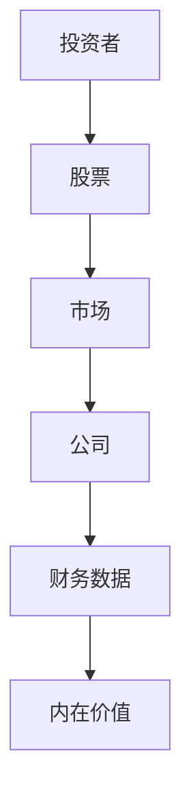
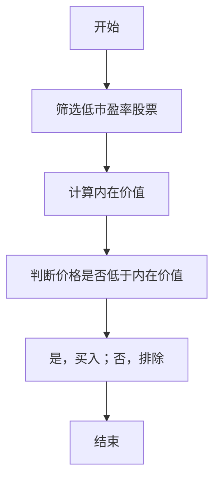
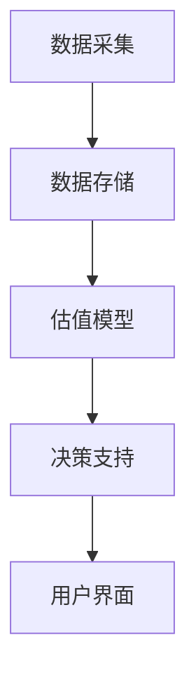

                 


# 何时卖出格雷厄姆特价股票

> 关键词：价值投资，格雷厄姆，特价股票，卖出时机，安全边际，内在价值

> 摘要：本文深入探讨了何时卖出格雷厄姆特价股票的策略，结合价值投资理论，分析了特价股票的核心特征、内在价值计算方法，以及安全边际的应用。通过系统架构设计和项目实战案例，详细讲解了价值投资的数学模型和算法实现，帮助投资者做出明智的决策。

---

# 引言

价值投资是一种长期被验证有效的投资策略，其核心在于购买那些市场价格低于其内在价值的股票。格雷厄姆作为价值投资的鼻祖，提出了许多经典理论，如安全边际和内在价值。本文将从价值投资的基础出发，探讨何时卖出特价股票的策略，帮助投资者在市场中做出更明智的决策。

---

# 第一部分: 价值投资与特价股票基础

## 第1章: 价值投资的起源与核心理念

### 1.1 价值投资的起源

价值投资起源于20世纪，由本杰明·格雷厄姆和戴维德·多德共同提出。其核心理念是购买那些市场价格低于其内在价值的股票，从而在市场波动中获得超额收益。价值投资强调安全边际，即买入价格与内在价值的差距，以降低投资风险。

### 1.2 特价股票的定义与特征

特价股票是指市场价格低于其内在价值的股票。其核心特征包括低市盈率、低市净率和高股息率。特价股票通常属于价值型股票，与成长型股票相比，其特点是低增长、高稳定性。

### 1.3 价值投资的决策框架

格雷厄姆的价值投资框架包括选股标准、安全边际和内在价值计算。选股标准注重财务健康、低估值和高分红；安全边际通过买入价格低于内在价值来降低风险；内在价值是基于财务数据和市场分析计算出的理论价值。

---

## 第2章: 价值投资的核心概念与联系

### 2.1 核心概念对比表

| 概念          | 特价股票       | 高价股票       |
|---------------|----------------|----------------|
| 市盈率        | 低于行业均值    | 高于行业均值    |
| 市净率        | 低于行业均值    | 高于行业均值    |
| 股息率        | 高             | 低             |

### 2.2 实体关系图



---

## 第3章: 价值投资的数学模型与算法原理

### 3.1 格雷厄姆筛选算法

#### 算法流程图



#### Python代码实现

```python
def graham_screen(stocks):
    selected = []
    for stock in stocks:
        pe = stock.pe_ratio
        pb = stock.pb_ratio
        if pe < 15 and pb < 1.5:
            selected.append(stock)
    return selected
```

### 3.2 内在价值计算模型

#### 净现值模型

$$ NPV = \sum_{t=1}^{n} \frac{CF_t}{(1 + r)^t} $$

其中，\( CF_t \) 是第 \( t \) 年的现金流，\( r \) 是贴现率。

#### 股息贴现模型

$$ DDM = \frac{D_1}{k - g} $$

其中，\( D_1 \) 是下一期的股息，\( k \) 是预期回报率，\( g \) 是股息增长率。

---

## 第4章: 系统分析与架构设计

### 4.1 项目背景与目标

项目旨在开发一个基于价值投资策略的股票筛选系统，帮助投资者识别特价股票并制定卖出策略。目标包括数据采集、估值模型开发和决策支持。

### 4.2 系统架构设计



### 4.3 系统接口设计

- 数据接口：从金融数据库获取股票数据。
- 用户接口：展示筛选结果和建议。
- 系统监控接口：实时监控市场波动。

---

## 第5章: 项目实战与案例分析

### 5.1 环境安装与配置

- 安装Python和相关库（如Pandas、NumPy）。
- 配置数据库连接。

### 5.2 核心代码实现

```python
import pandas as pd

def calculate_intrinsic_value(stock_data):
    # 假设stock_data是一个DataFrame，包含市盈率、市净率等信息
    stock_data['intrinsic_value'] = stock_data['eps'] * 15  # 简单计算内在价值
    return stock_data
```

### 5.3 案例分析

假设某股票的市盈率为12，市净率为1.2，符合格雷厄姆筛选标准。计算其内在价值，若买入价格低于内在价值，则考虑买入。随着市场波动，当市盈率回升至15时，考虑卖出。

---

## 第6章: 最佳实践与总结

### 6.1 最佳实践

- 定期复核投资组合，重新评估股票价值。
- 结合市场环境调整卖出策略。
- 保持安全边际，避免过度杠杆。

### 6.2 小结

何时卖出格雷厄姆特价股票，取决于市场波动、内在价值变化和安全边际。通过系统化的分析和决策框架，投资者可以在价值投资中获得稳定收益。

### 6.3 注意事项

- 避免情绪化决策，坚持价值投资原则。
- 定期更新财务数据，确保信息准确。
- 分散投资，降低风险。

### 6.4 拓展阅读

推荐书籍：《The Intelligent Investor》、《Security Analysis》。

---

# 结语

通过本文的分析，读者可以系统地理解何时卖出格雷厄姆特价股票的策略。从理论到实践，从算法到系统设计，价值投资的精髓在于长期稳定和安全边际。希望本文能为投资者提供实用的指导，帮助他们在市场中做出明智的决策。

