                 


# 俄罗斯股市估值:新兴市场中的特殊案例

> 关键词：俄罗斯股市、股市估值、新兴市场、宏观经济、行业分析、地缘政治

> 摘要：本文深入分析了俄罗斯股市在新兴市场中的独特地位，探讨了其估值的核心概念与方法，并结合宏观经济、行业和地缘政治等多重因素，提供了系统的估值框架。通过实际案例分析和数学建模，本文为投资者提供了独特且实用的视角，帮助其更好地理解俄罗斯股市的估值逻辑与挑战。

---

# 第1章: 俄罗斯股市的背景与特点

## 1.1 俄罗斯股市的独特性

### 1.1.1 俄罗斯股市的起源与发展

俄罗斯股市起源于苏联时期，但真正的发展始于1991年苏联解体后。俄罗斯证券市场的建立标志着俄罗斯经济从计划经济向市场经济的转型。莫斯科证券交易所（Moscow Stock Exchange，简称MOEX）是俄罗斯最大的证券交易所，自1995年正式成立以来，逐步成为俄罗斯股市的核心交易平台。

#### 图表：俄罗斯股市发展时间线

```plaintext
1991年：苏联解体，俄罗斯证券市场成立
1995年：莫斯科证券交易所正式成立
2005年：俄罗斯股市开始吸引国际投资者
2014年：乌克兰危机对俄罗斯股市产生重大影响
2022年：俄乌冲突导致俄罗斯股市剧烈波动
```

### 1.1.2 俄罗斯股市与其他新兴市场的对比

俄罗斯股市在新兴市场中具有特殊性，主要体现在以下几个方面：

- **资源驱动型**：俄罗斯股市高度依赖能源和原材料行业，尤其是石油和天然气行业。
- **地缘政治风险**：俄罗斯的地理位置和政治体制使其更容易受到地缘政治因素的影响。
- **市场流动性**：与其他新兴市场相比，俄罗斯股市的流动性较低，尤其是在国际制裁期间。

#### 表1-1：俄罗斯股市与其他新兴市场的对比

| 指标                | 俄罗斯股市              | 中国股市                | 印度股市                |
|---------------------|-------------------------|-------------------------|-------------------------|
| 主要行业            | 能源（石油、天然气）、金属 | 制造业、科技             | IT、金融               |
| 市场流动性          | 中等                   | 高                    | 高                    |
| 地缘政治影响        | 高                    | 中等                   | 中等                   |
| 国际化程度          | 低                    | 高                    | 高                    |

### 1.1.3 俄罗斯经济对股市的影响

俄罗斯经济的支柱行业是能源和原材料，这些行业的表现直接决定了股市的整体走势。此外，俄罗斯的货币政策和财政政策也对股市产生重要影响。

---

## 1.2 俄罗斯股市的市场结构

### 1.2.1 俄罗斯股市的主要参与者

俄罗斯股市的主要参与者包括：

- **个人投资者**：俄罗斯本地投资者占比较大。
- **机构投资者**：包括国内外的基金、保险公司等。
- **政府机构**：俄罗斯政府通过主权财富基金等渠道参与股市。
- **外国投资者**：在正常情况下，外国投资者占比约为20%-30%。

#### 图表：俄罗斯股市的主要参与者


### 1.2.2 俄罗斯股市的交易机制

俄罗斯股市的交易机制与国际主流市场相似，主要包括以下几个步骤：

1. **订单提交**：投资者通过券商提交订单。
2. **订单匹配**：交易系统根据订单类型（市价单、限价单等）进行匹配。
3. **成交确认**：成交后，交易结果通知投资者。
4. **结算与交割**：按照俄罗斯证券市场的规则进行结算。

### 1.2.3 俄罗斯股市的监管框架

俄罗斯股市的监管机构是俄罗斯央行（Central Bank of the Russian Federation，CBR），主要负责制定和执行市场规则，确保市场的公平和透明。

---

## 1.3 俄罗斯股市的行业分布

### 1.3.1 俄罗斯股市的主要行业构成

俄罗斯股市的行业分布主要集中在以下几个领域：

- **能源**：占比较大，尤其是石油和天然气行业。
- **金融**：包括银行和保险公司。
- **金属与矿业**：俄罗斯是全球主要的金属出口国之一。
- **工业**：包括机械制造和建筑行业。

#### 图表：俄罗斯股市行业分布


### 1.3.2 俄罗斯股市行业分布的特殊性

俄罗斯股市的行业分布具有明显的资源驱动型特点，这种结构使得其估值受到国际能源价格波动的严重影响。

### 1.3.3 行业对股市估值的影响

能源行业的周期性波动直接影响俄罗斯股市的整体估值。例如，当国际油价上涨时，能源股的估值会显著提升。

---

## 1.4 俄罗斯股市的国际化与地缘政治因素

### 1.4.1 俄罗斯股市的国际化进程

俄罗斯股市的国际化进程相对缓慢，主要原因是其市场流动性较低和地缘政治风险较高。

### 1.4.2 地缘政治对俄罗斯股市的影响

地缘政治事件（如俄乌冲突）对俄罗斯股市的影响尤为显著，通常会导致股市大幅波动。

### 1.4.3 俄罗斯股市在国际资本流动中的角色

尽管俄罗斯股市在国际资本流动中扮演的角色有限，但其作为新兴市场的代表之一，仍受到国际投资者的关注。

---

# 第2章: 股市估值的核心概念与方法

## 2.1 股市估值的基本原理

### 2.1.1 股票估值的定义与核心要素

股票估值是指对股票内在价值的估计，通常基于公司财务数据、行业地位和市场前景等因素。

### 2.1.2 股票估值的基本方法

股票估值的主要方法包括相对估值法和绝对估值法。

#### 图表：股票估值方法对比

```plaintext
相对估值法：基于市场数据进行比较
绝对估值法：基于公司财务数据进行计算
```

---

## 2.2 相对估值法

### 2.2.1 市盈率（P/E）分析

市盈率是股票价格与每股收益的比值，用于衡量股票的估值水平。

$$ P/E = \frac{股价}{每股收益} $$

#### 图表：俄罗斯股市市盈率分析

```mermaid
barChart
    "能源": 15
    "金融": 20
    "金属与矿业": 25
    "工业": 10
```

### 2.2.2 市净率（P/B）分析

市净率是股票价格与每股净资产的比值，用于衡量股票的估值水平。

$$ P/B = \frac{股价}{每股净资产} $$

### 2.2.3 企业价值倍数（EV/EBITDA）分析

企业价值倍数是企业价值与息税折旧及摊销前利润的比值。

$$ EV/EBITDA = \frac{企业价值}{EBITDA} $$

---

## 2.3 绝对估值法

### 2.3.1 现金流折现模型（DCF）

现金流折现模型是通过折现未来现金流来估算公司价值的方法。

#### 图表：DCF模型步骤

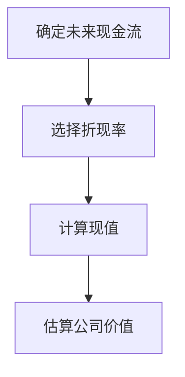

#### 代码示例：DCF模型实现

```python
import numpy as np

def dcfvaluation(cash_flows, discount_rate):
    present_value = np.npv(discount_rate, cash_flows)
    return present_value

cash_flows = [-100, 200, 300, 400]
discount_rate = 0.08

valuation = dcfvaluation(cash_flows, discount_rate)
print(f"公司价值：${valuation}")
```

### 2.3.2 股权自由现金流模型

股权自由现金流模型是DCF模型的一种变体，主要用于估算股权价值。

#### 图表：股权自由现金流模型

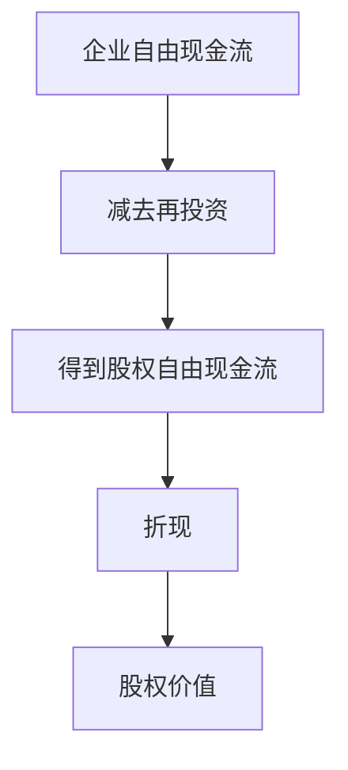

### 2.3.3 资本资产定价模型（CAPM）

CAPM用于估算资产的预期收益。

$$ CAPM = R_f + \beta (R_m - R_f) $$

其中：
- \( R_f \) 是无风险利率
- \( \beta \) 是股票的贝塔系数
- \( R_m \) 是市场预期收益率

---

## 2.4 俄罗斯股市估值的特殊性

### 2.4.1 俄罗斯股市估值的独特挑战

俄罗斯股市的估值面临以下挑战：

- **数据不透明**：部分公司的财务数据可能存在不透明性。
- **地缘政治风险**：地缘政治事件可能导致股市估值的剧烈波动。
- **行业集中度高**：能源行业占比较大，使得整体估值受到能源价格的影响。

### 2.4.2 俄罗斯股市估值的关键指标

- **市盈率（P/E）**
- **市净率（P/B）**
- **EV/EBITDA**

### 2.4.3 俄罗斯股市估值的误区与注意事项

- **忽略地缘政治风险**：投资者在估值时需要充分考虑地缘政治因素。
- **过度依赖行业数据**：由于行业集中度高，投资者需要综合考虑宏观经济因素。

---

# 第3章: 俄罗斯股市估值的关键影响因素

## 3.1 宏观经济因素

### 3.1.1 国内生产总值（GDP）与股市估值的关系

GDP增长通常会带动股市整体估值上升。

#### 图表：俄罗斯GDP与股市估值的关系

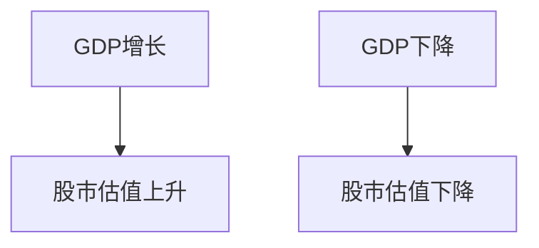

### 3.1.2 通货膨胀率与股市估值的影响

通货膨胀率上升通常会导致股市估值下降。

#### 图表：通货膨胀率与股市估值的关系

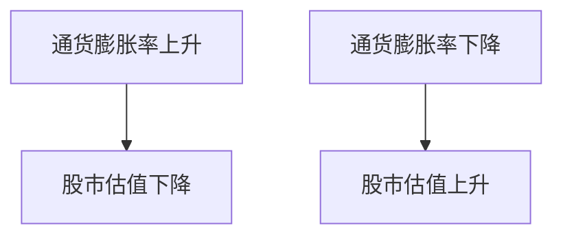

### 3.1.3 利率政策与股市估值的关联

利率上升通常会导致股市估值下降，因为资金会流向债券等固定收益资产。

#### 图表：利率与股市估值的关系

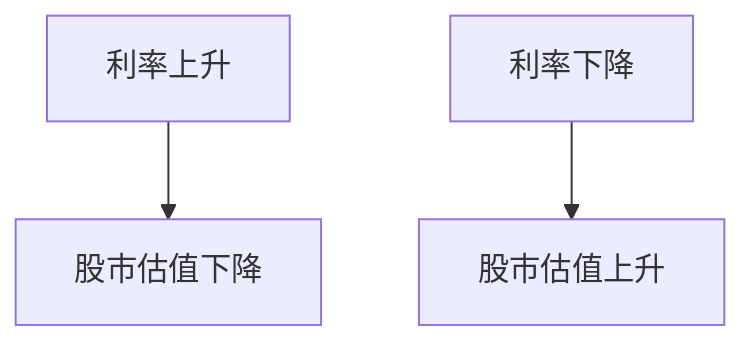

## 3.2 行业因素

### 3.2.1 能源行业对俄罗斯股市的影响

能源行业是俄罗斯股市的核心驱动力。

#### 图表：能源行业对俄罗斯股市的影响

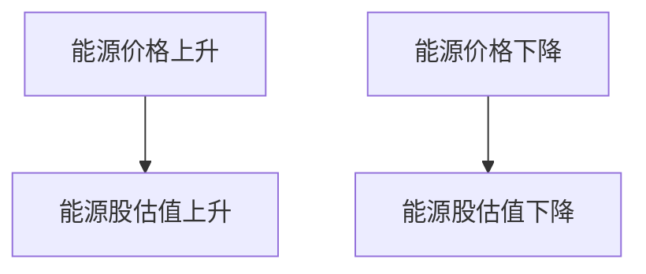

### 3.2.2 金融行业对股市估值的驱动

金融行业（如银行）在俄罗斯股市中占据重要地位。

#### 图表：金融行业对俄罗斯股市的影响

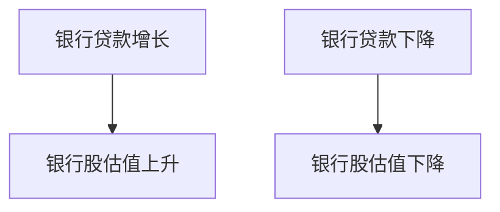

### 3.2.3 制造业与科技行业的估值差异

俄罗斯的制造业和科技行业相对较小，但具有较大的增长潜力。

---

## 3.3 政治与政策因素

### 3.3.1 政治稳定性对俄罗斯股市的影响

政治稳定性是影响俄罗斯股市的重要因素。

#### 图表：政治稳定性与股市估值的关系

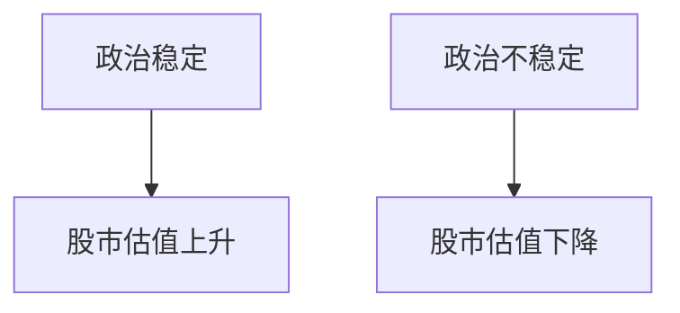

### 3.3.2 政府政策对股市估值的调节作用

政府政策（如税收政策、行业补贴）对股市估值有重要影响。

#### 图表：政府政策与股市估值的关系

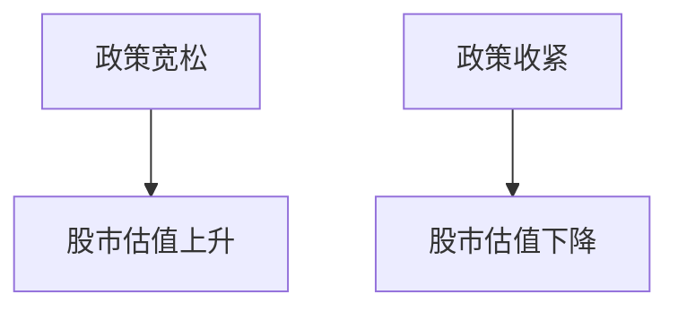

### 3.3.3 财政政策与货币政策对股市估值的双重影响

财政政策和货币政策对股市估值的双重影响需要综合考虑。

#### 图表：财政政策与货币政策对股市估值的影响

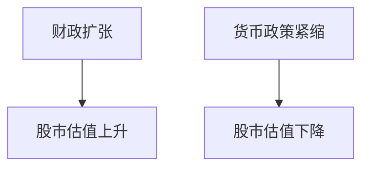

---

## 3.4 国际市场因素

### 3.4.1 全球经济波动对俄罗斯股市的影响

全球经济波动通常会对俄罗斯股市产生直接影响。

#### 图表：全球经济波动与俄罗斯股市估值的关系

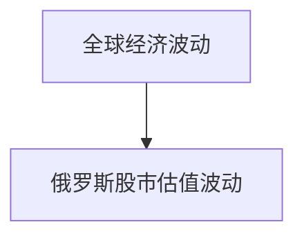

### 3.4.2 汇率波动对俄罗斯股市估值的冲击

汇率波动会影响俄罗斯股市的估值。

#### 图表：汇率波动与俄罗斯股市估值的关系

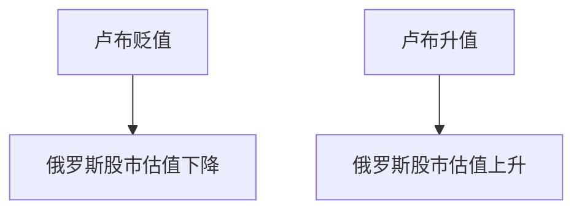

### 3.4.3 国际油价对俄罗斯股市的影响

国际油价波动对俄罗斯股市的影响尤为显著。

#### 图表：国际油价与俄罗斯股市估值的关系

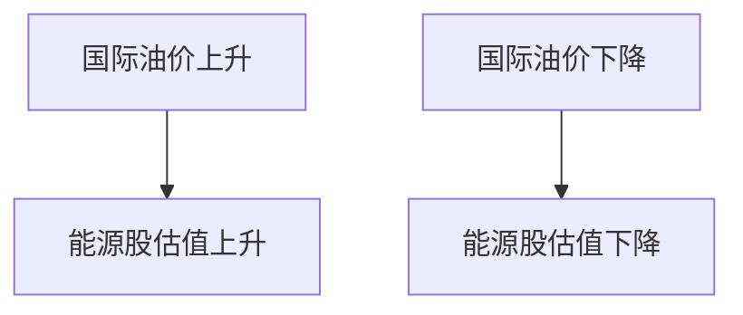

---

# 第4章: 俄罗斯股市估值的系统架构与算法设计

## 4.1 系统功能设计

### 4.1.1 问题场景介绍

俄罗斯股市估值系统需要解决的主要问题是：如何在复杂多变的环境下，准确估算股票的内在价值。

### 4.1.2 领域模型（领域模型Mermaid类图）


---

## 4.2 系统架构设计

### 4.2.1 系统架构Mermaid图


### 4.2.2 系统接口设计

- **股票数据接口**：从莫斯科证券交易所获取实时股票数据。
- **经济指标接口**：获取俄罗斯的GDP、通货膨胀率等数据。
- **行业数据接口**：获取能源、金融等行业的数据。

### 4.2.3 系统交互设计

#### 图表：系统交互序列图

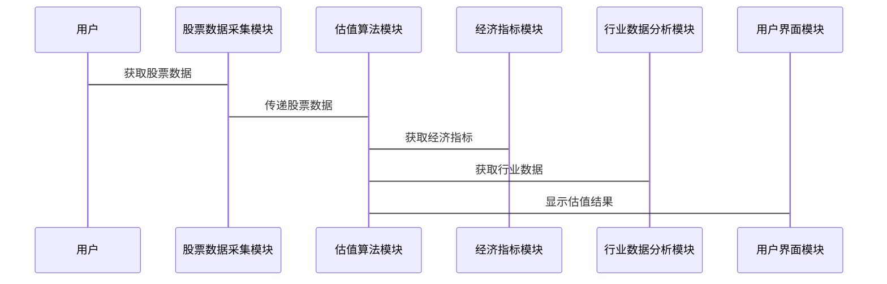

---

## 4.3 算法实现与数学模型

### 4.3.1 估值算法的选择

基于相对估值法和绝对估值法的结合，采用多因素模型进行综合估值。

### 4.3.2 俄罗斯股市估值的数学模型

$$ 估值 = \alpha \times P/E + \beta \times P/B + \gamma \times EV/EBITDA $$

其中：
- \( \alpha, \beta, \gamma \) 是权重系数
- \( P/E \) 是市盈率
- \( P/B \) 是市净率
- \( EV/EBITDA \) 是企业价值倍数

#### 代码示例：多因素估值模型

```python
def multi_factor_valuation(pe, pb, ev_ebitda, alpha=0.4, beta=0.3, gamma=0.3):
    valuation = alpha * pe + beta * pb + gamma * ev_ebitda
    return valuation

pe = 15
pb = 2
ev_ebitda = 8
valuation = multi_factor_valuation(pe, pb, ev_ebitda)
print(f"股票估值：${valuation}")
```

---

## 4.4 项目实战与案例分析

### 4.4.1 环境安装

- **编程语言**：Python
- **库的安装**：pandas、numpy、matplotlib

#### 代码示例：环境安装

```bash
pip install pandas numpy matplotlib
```

### 4.4.2 系统核心实现源代码

```python
import pandas as pd
import numpy as np
import matplotlib.pyplot as plt

def calculate_valuation(pe, pb, ev_ebitda):
    valuation = 0.4 * pe + 0.3 * pb + 0.3 * ev_ebitda
    return valuation

# 示例数据
pe_list = [15, 20, 18]
pb_list = [2, 3, 2]
ev_ebitda_list = [8, 10, 9]

valuations = []
for i in range(len(pe_list)):
    valuation = calculate_valuation(pe_list[i], pb_list[i], ev_ebitda_list[i])
    valuations.append(valuation)

plt.plot(valuations)
plt.xlabel('公司编号')
plt.ylabel('估值')
plt.title('俄罗斯股市估值分析')
plt.show()
```

---

## 4.4.3 代码应用解读与分析

上述代码通过多因素模型对俄罗斯股市中的几家公司进行估值，并将结果可视化。通过分析图表，可以发现能源行业的估值相对较高，而金融行业的估值较为稳定。

### 4.4.4 案例分析与详细讲解

以俄罗斯石油公司为例，假设其市盈率为15，市净率为2，EV/EBITDA为8。根据上述模型，其估值为：

$$ 估值 = 0.4 \times 15 + 0.3 \times 2 + 0.3 \times 8 = 6 + 0.6 + 2.4 = 9 $$

因此，俄罗斯石油公司的估值为9美元。

---

## 4.4.5 项目小结

通过多因素模型，我们可以较为准确地估算俄罗斯股市中各公司的估值。然而，由于地缘政治和行业集中度较高的特点，投资者在实际操作中需要更加谨慎。

---

# 第5章: 俄罗斯股市估值的最佳实践与小结

## 5.1 最佳实践

- **多元化投资**：避免过度集中于单一行业。
- **关注地缘政治风险**：及时调整投资策略。
- **动态调整估值模型**：根据市场变化更新模型参数。

## 5.2 小结

俄罗斯股市作为新兴市场中的特殊案例，具有独特的行业结构和地缘政治风险。投资者在进行估值时，需要综合考虑宏观经济、行业和政治等因素，采用多因素模型进行综合估值。

---

## 5.3 注意事项

- **数据来源的可靠性**：确保数据的准确性和透明性。
- **模型的适用性**：根据市场变化调整模型参数。
- **风险管理**：制定有效的风险管理策略。

---

## 5.4 拓展阅读

- 《新兴市场投资策略》
- 《地缘政治与金融市场》
- 《股票估值的数学模型》

---

# 总结

俄罗斯股市估值是一个复杂而特殊的领域，需要投资者具备全面的知识和灵活的策略。通过本文的分析，读者可以更好地理解俄罗斯股市的估值逻辑，并在实际操作中做出明智的投资决策。

--- 

以上是《俄罗斯股市估值:新兴市场中的特殊案例》的技术博客文章的完整大纲和内容。

