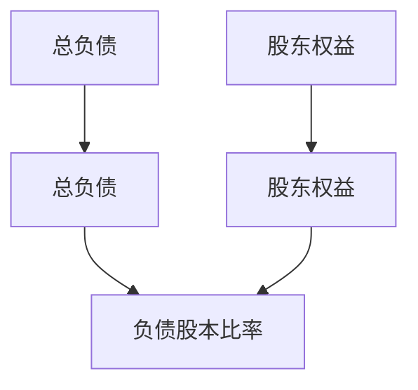
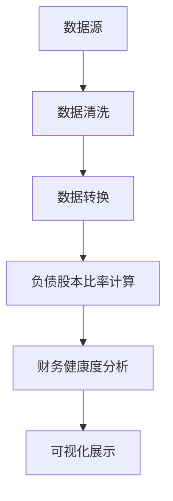
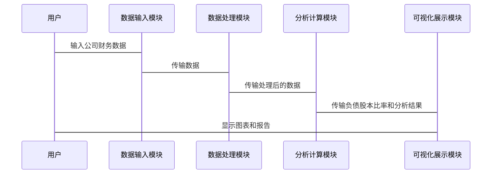

                 


# 债务股本比率：衡量公司健康度的关键

## 关键词
- 负债股本比率
- 财务健康度
- 资本结构
- 企业价值
- 财务风险

## 摘要
债务股本比率是衡量公司财务健康度的重要指标，它反映了公司负债与股本的比例关系，帮助投资者和管理层评估公司的财务稳定性、资本成本和市场风险。本文通过详细分析债务股本比率的定义、计算方法、理论基础和实际应用，探讨其在公司财务管理中的关键作用。文章从背景介绍、核心概念、数学模型、系统架构到项目实战，全面解析债务股本比率的内在逻辑和实际应用，帮助读者深入理解其在现代企业价值评估和风险管理中的重要性。

---

## 第1章: 负债股本比率的背景与意义

### 1.1 负债股本比率的定义与背景
#### 1.1.1 什么是负债股本比率
负债股本比率（Debt-to-Equity Ratio，简称D/E）是衡量公司财务结构中负债与股东权益（股本）的比例关系。它反映了公司通过债务融资的程度，以及公司承担财务风险的能力。

负债股本比率的计算公式为：
$$
D/E = \frac{\text{总负债}}{\text{股东权益}}
$$

负债股本比率是公司财务健康度的重要指标之一，广泛应用于企业估值、投资决策和风险管理。

#### 1.1.2 负债股本比率的财务意义
负债股本比率不仅反映了公司的资本结构，还体现了公司的财务风险和偿债能力。高负债比率意味着公司依赖更多债务融资，虽然可能带来更高的杠杆效应，但也增加了财务风险；低负债比率则意味着公司依赖股本融资，财务风险较低。

#### 1.1.3 负债股本比率与公司价值的关系
负债股本比率与公司价值密切相关。根据Modigliani-Miller定理，资本结构（负债与股本的比例）会影响公司价值。在资本成本最低的情况下，公司价值达到最大。

### 1.2 负债股本比率的计算与应用
#### 1.2.1 负债股本比率的计算公式
负债股本比率的计算公式：
$$
D/E = \frac{\text{总负债}}{\text{股东权益}}
$$

其中，总负债包括流动负债和非流动负债；股东权益包括股本、资本公积、盈余公积和未分配利润等。

#### 1.2.2 负债股本比率的行业差异
不同行业的负债股本比率存在显著差异。例如，重资产行业（如制造业、房地产）通常具有较高的负债股本比率，而轻资产行业（如科技公司、服务行业）负债股本比率较低。

#### 1.2.3 负债股本比率的财务健康度评价
负债股本比率的健康标准因行业和公司具体情况而异。通常，合理的负债股本比率应在1以下，但具体数值需要结合行业特点和公司经营状况分析。

---

## 第2章: 负债股本比率的核心概念与联系

### 2.1 负债与股本的定义与特征
#### 2.1.1 负债的定义与属性
负债是公司对外部债权人承担的债务，包括短期负债和长期负债。负债的特征包括：
- 确定性：负债是公司未来需要偿还的明确债务。
- 时间性：负债具有明确的偿还期限。
- 利息支付：负债通常需要支付利息。

#### 2.1.2 股本的定义与属性
股本是公司股东的投资，包括普通股和优先股。股本的特征包括：
- 永久性：股本是公司长期资本，无固定偿还期限。
- 权益性：股东享有公司收益和剩余资产的分配权。

#### 2.1.3 负债与股本的对比分析
| 特性       | 负债                     | 股本                     |
|------------|--------------------------|--------------------------|
| 性质       | 债务性资本               | 权益性资本               |
| 偿还期限   | 有固定偿还期限           | 无固定偿还期限           |
| 权益关系   | 债权人                   | 股东                     |
| 成本       | 需要支付利息             | 通常不需要支付利息       |

### 2.2 负债股本比率的数学模型与公式
#### 2.2.1 负债股本比率的数学表达式
负债股本比率（D/E）的数学表达式为：
$$
D/E = \frac{\text{总负债}}{\text{股东权益}}
$$

#### 2.2.2 负债股本比率的计算公式
负债股本比率的计算需要以下数据：
- 总负债：包括流动负债和非流动负债。
- 股东权益：包括股本、资本公积、盈余公积和未分配利润。

#### 2.2.3 负债股本比率的经济意义
负债股本比率反映了公司资本结构中负债与股本的比例关系，高比率意味着公司依赖更多债务融资，低比率则意味着公司依赖更多股本融资。

### 2.3 负债股本比率的实体关系图


---

## 第3章: 负债股本比率的理论基础与算法原理

### 3.1 负债股本比率的理论基础
#### 3.1.1 Modigliani-Miller定理
Modigliani-Miller定理指出，资本结构（负债与股本的比例）影响公司价值。在无税情况下，公司价值与资本结构无关；在有税情况下，负债融资可以降低资本成本，从而增加公司价值。

#### 3.1.2 资本结构与企业价值的关系
资本结构通过负债和股本的比例关系影响企业价值。负债融资可以提高杠杆效应，但也会增加财务风险。

#### 3.1.3 负债股本比率的资本成本分析
负债股本比率与资本成本密切相关。高负债比率可能导致更高的债务成本，从而增加整体资本成本。

### 3.2 负债股本比率的算法原理
#### 3.2.1 负债股本比率的计算步骤
1. 收集公司财务数据，包括总负债和股东权益。
2. 使用公式计算负债股本比率：
$$
D/E = \frac{\text{总负债}}{\text{股东权益}}
$$

#### 3.2.2 负债股本比率的数学模型
负债股本比率的数学模型：
$$
D/E = \frac{\text{总负债}}{\text{股东权益}}
$$

#### 3.2.3 负债股本比率的经济意义
负债股本比率反映了公司资本结构中负债与股本的比例关系，高比率意味着公司依赖更多债务融资，低比率则意味着公司依赖更多股本融资。

---

## 第4章: 负债股本比率的系统分析与架构设计

### 4.1 系统分析
#### 4.1.1 系统目标
设计一个基于债务股本比率的财务分析系统，帮助用户评估公司的财务健康度。

#### 4.1.2 系统功能设计
- 数据收集：收集公司财务数据，包括总负债和股东权益。
- 数据处理：清洗和转换数据，确保数据的准确性和一致性。
- 分析计算：计算负债股本比率，分析公司财务健康度。
- 可视化展示：生成图表和报告，直观展示分析结果。

### 4.2 系统架构设计


### 4.3 系统接口设计
- 数据输入接口：用户输入公司财务数据。
- 数据处理接口：数据清洗和转换模块。
- 分析计算接口：负债股本比率计算模块。
- 可视化展示接口：生成图表和报告。

### 4.4 系统交互流程


---

## 第5章: 负债股本比率的项目实战

### 5.1 环境配置
- 安装Python和必要的库（Pandas、Matplotlib、Seaborn）。

### 5.2 核心实现源代码
```python
import pandas as pd
import matplotlib.pyplot as plt

# 示例数据
data = {
    '公司': ['A', 'B', 'C'],
    '总负债': [100, 200, 150],
    '股东权益': [50, 75, 75]
}

df = pd.DataFrame(data)

# 计算负债股本比率
df['负债股本比率'] = df['总负债'] / df['股东权益']

# 可视化展示
plt.figure(figsize=(10, 6))
plt.plot(df['公司'], df['负债股本比率'], 'o-')
plt.title('负债股本比率')
plt.xlabel('公司')
plt.ylabel('负债股本比率')
plt.show()
```

### 5.3 代码应用解读与分析
上述代码展示了如何使用Python计算负债股本比率并进行可视化分析。首先，导入必要的库，然后创建数据框，计算负债股本比率，最后绘制图表。

### 5.4 实际案例分析
以苹果和通用汽车为例，分析它们的负债股本比率，并评估其财务健康度。

### 5.5 项目小结
通过项目实战，读者可以掌握如何使用Python计算负债股本比率，并进行可视化分析。

---

## 第6章: 总结与展望

### 6.1 总结
负债股本比率是衡量公司财务健康度的重要指标，反映了公司资本结构中负债与股本的比例关系。合理使用负债股本比率可以帮助投资者和管理层评估公司的财务风险和市场价值。

### 6.2 展望
未来的研究可以进一步探讨负债股本比率与其他财务指标的结合应用，例如结合市盈率、市净率等指标进行综合评估。同时，可以探索使用机器学习模型预测公司财务健康度。

---

## 附录

### 附录A: 术语表
- 负债股本比率（Debt-to-Equity Ratio）：负债与股本的比例关系。
- 资本结构：公司负债与股本的比例关系。
- 财务健康度：公司财务状况的健康程度。

### 附录B: 参考文献
1. Modigliani, F., & Miller, M. H. (1963). On the cost of capital, corporation finance, and the theory of investment. American Economic Review, 52(3), 261-297.
2. Brigham, E. F., & Houston, J. F. (2000). Fundamentals of financial management. Cengage Learning.

---

通过以上章节的详细分析，读者可以全面理解负债股本比率的理论与实际应用，掌握如何利用该比率评估公司的财务健康度。

